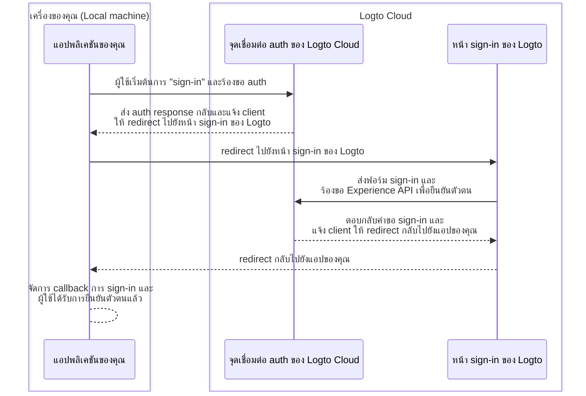
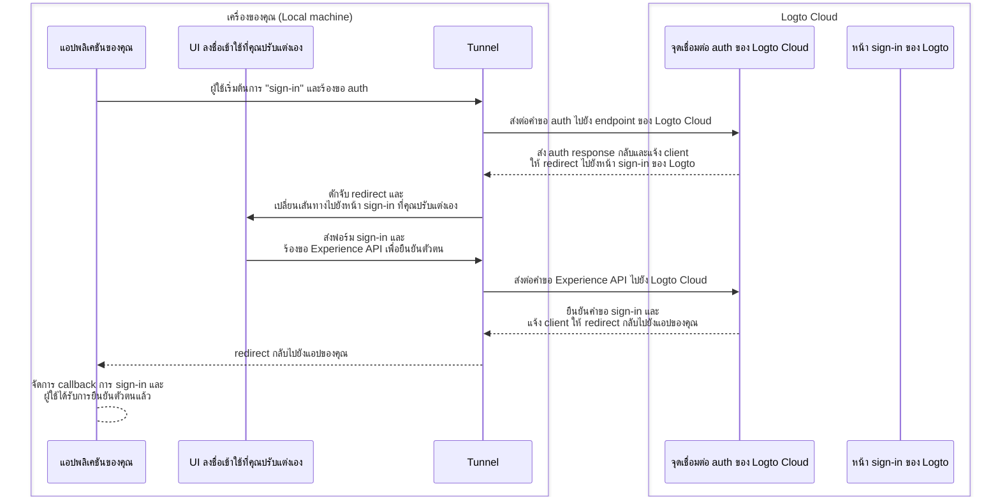

import TabItem from '@theme/TabItem';
import Tabs from '@theme/Tabs';

# ดีบักและทดสอบ UI ที่คุณปรับแต่งเองแบบโลคอล

สำหรับผู้ใช้ Logto Cloud เราได้ทำให้คุณสามารถ "นำ UI ของคุณเองมาใช้" กับ Logto ได้อย่างง่ายดาย ผู้ใช้ Cloud สามารถอัปโหลดไฟล์ zip ที่มี asset ของ UI ที่ปรับแต่งเองได้ที่ <CloudLink to="/sign-in-experience/branding">Console > Sign-in & account > Branding > Bring your UI</CloudLink> (ดูรายละเอียดเพิ่มเติมได้ที่หน้า [Bring your UI](/customization/bring-your-ui))

อย่างไรก็ตาม ในระหว่างการพัฒนา UI หน้าเหล่านี้ ผู้ใช้มักต้องการทดสอบและดีบักโค้ดแบบโลคอลก่อนอัปโหลดขึ้น Logto Cloud คำสั่ง CLI นี้จะช่วยให้คุณตั้งค่า tunnel แบบโลคอลและเชื่อมต่อ 3 องค์ประกอบต่อไปนี้เข้าด้วยกัน:
จุดเชื่อมต่อ auth ของ Logto Cloud, แอปพลิเคชันของคุณ, และ UI ลงชื่อเข้าใช้ที่คุณปรับแต่งเอง

## ทำไมฉันต้องใช้สิ่งนี้? \{#why-do-i-need-this}

โดยปกติ เมื่อคุณคลิกปุ่ม "sign-in" ในแอปพลิเคชันของคุณ คุณจะถูกนำไปยังหน้าลงชื่อเข้าใช้ที่ตั้งค่าไว้ที่ endpoint ของ Logto กระบวนการลงชื่อเข้าใช้ที่สำเร็จจะเป็นดังนี้:


```mermaid
sequenceDiagram
    box เครื่องของคุณ (Local machine)
    participant A as แอปพลิเคชันของคุณ
    end
    box Logto Cloud
    participant B as จุดเชื่อมต่อ auth ของ Logto Cloud
    participant C as หน้า sign-in ของ Logto
    end
    A ->> B: ผู้ใช้เริ่มต้นการ "sign-in" และร้องขอ auth
    B -->> A: ส่ง auth response กลับและแจ้ง client<br/>ให้ redirect ไปยังหน้า sign-in ของ Logto
    A ->> C: redirect ไปยังหน้า sign-in ของ Logto
    C ->> B: ส่งฟอร์ม sign-in และ<br/>ร้องขอ Experience API เพื่อยืนยันตัวตน
    B -->> C: ตอบกลับคำขอ sign-in และ<br/>แจ้ง client ให้ redirect กลับไปยังแอปของคุณ
    C -->> A: redirect กลับไปยังแอปของคุณ
    A --> A: จัดการ callback การ sign-in และ<br/>ผู้ใช้ได้รับการยืนยันตัวตนแล้ว
```

แต่เมื่อคุณกำลังพัฒนา UI ลงชื่อเข้าใช้ที่ปรับแต่งเอง คุณจำเป็นต้องมีวิธีนำทางไปยังหน้า UI ลงชื่อเข้าใช้ที่รันอยู่บนเครื่องของคุณแทน
สิ่งนี้ต้องใช้บริการ tunnel แบบโลคอลเพื่อดักจับคำขอที่ออกจากแอปของคุณและเปลี่ยนเส้นทางไปยังหน้า UI ลงชื่อเข้าใช้ที่คุณปรับแต่งเอง

นอกจากนี้ คุณยังต้องโต้ตอบกับ [Logto's Experience API](https://openapi.logto.io/group/endpoint-experience) เพื่อยืนยันตัวตนผู้ใช้และจัดการเซสชัน
บริการนี้ยังช่วย forward คำขอ Experience API เหล่านี้ไปยัง Logto Cloud เพื่อหลีกเลี่ยงปัญหา CORS

ไดอะแกรม sequence ด้านล่างแสดงให้เห็นว่า flow "sign-in" ที่สำเร็จจะทำงานอย่างไรเมื่อใช้ UI ที่คุณปรับแต่งเองและบริการ tunnel:


```mermaid
sequenceDiagram
    box เครื่องของคุณ (Local machine)
    participant A as แอปพลิเคชันของคุณ
    participant B as UI ลงชื่อเข้าใช้ที่คุณปรับแต่งเอง
    participant C as Tunnel
    end
    box Logto Cloud
    participant D as จุดเชื่อมต่อ auth ของ Logto Cloud
    participant E as หน้า sign-in ของ Logto
    end
    A ->> C: ผู้ใช้เริ่มต้นการ "sign-in" และร้องขอ auth
    C ->> D: ส่งต่อคำขอ auth ไปยัง endpoint ของ Logto Cloud
    D -->> C: ส่ง auth response กลับและแจ้ง client<br/>ให้ redirect ไปยังหน้า sign-in ของ Logto
    C ->> B: ดักจับ redirect และ<br/>เปลี่ยนเส้นทางไปยังหน้า sign-in ที่คุณปรับแต่งเอง
    B ->> C: ส่งฟอร์ม sign-in และ<br/>ร้องขอ Experience API เพื่อยืนยันตัวตน
    C ->> D: ส่งต่อคำขอ Experience API ไปยัง Logto Cloud
    D -->> C: ยืนยันคำขอ sign-in และ<br/>แจ้ง client ให้ redirect กลับไปยังแอปของคุณ
    C -->> A: redirect กลับไปยังแอปของคุณ
    A --> A: จัดการ callback การ sign-in และ<br/>ผู้ใช้ได้รับการยืนยันตัวตนแล้ว
```

เมื่อมีบริการ tunnel นี้ คุณสามารถพัฒนาและทดสอบ UI ลงชื่อเข้าใช้ที่ปรับแต่งเองแบบโลคอลได้ โดยไม่ต้องอัปโหลด asset ไปยัง Logto Cloud ทุกครั้งที่มีการเปลี่ยนแปลง

## คำแนะนำ \{#instructions}

### ขั้นตอนที่ 1: รันคำสั่ง \{#step-1-execute-the-command}

สมมติว่า Cloud tenant ID ของคุณคือ `foobar` และคุณมีหน้า sign-in ที่รันอยู่บน dev server ที่ `http://localhost:4000` คุณสามารถรันคำสั่งนี้ได้ดังนี้:

<Tabs groupId="cmd">

  <TabItem value="cli" label="CLI">

```bash
logto-tunnel -p 9000 --experience-uri http://localhost:4000/ --endpoint https://foobar.logto.app/
```

  </TabItem>
  <TabItem value="npx" label="npx">

```bash
npx @logto/tunnel -p 9000 --experience-uri http://localhost:4000/ --endpoint https://foobar.logto.app/
```

  </TabItem>

</Tabs>

หากคุณตั้งค่า custom domain ใน Logto ก็สามารถใช้ได้เช่นกัน:

<Tabs groupId="cmd">

  <TabItem value="cli" label="CLI">

```bash
logto-tunnel -p 9000 --experience-uri http://localhost:4000/ --endpoint https://your.custom.domain/
```

  </TabItem>
  <TabItem value="npx" label="npx">

```bash
npx @logto/tunnel -p 9000 --experience-uri http://localhost:4000/ --endpoint https://your.custom.domain/
```

  </TabItem>

</Tabs>

หรืออีกทางหนึ่ง คำสั่งนี้ยังรองรับ asset html แบบ static โดยไม่ต้องรัน dev server ก่อน เพียงแค่แน่ใจว่ามี `index.html` อยู่ใน path ที่คุณระบุ

<Tabs groupId="cmd">

  <TabItem value="cli" label="CLI">

```bash
logto-tunnel -p 9000 --experience-path /path/to/your/static/files --endpoint https://foobar.logto.app/
```

  </TabItem>
  <TabItem value="npx" label="npx">

```bash
npx @logto/tunnel -p 9000 --experience-path /path/to/your/static/files --endpoint https://foobar.logto.app/
```

  </TabItem>

</Tabs>

### ขั้นตอนที่ 2: อัปเดต endpoint URI ในแอปของคุณ \{#step-2-update-endpoint-uri-in-your-application}

สุดท้าย รันแอปของคุณและตั้งค่า endpoint ของ Logto ให้เป็นที่อยู่ของ tunnel service คือ `http://localhost:9000/` แทน

ขอยกตัวอย่างแอป React:

```tsx title=App.tsx
import { LogtoProvider, LogtoConfig } from '@logto/react';

// endpoint: 'https://foobar.logto.app/', // endpoint เดิมของ Logto Cloud
const config: LogtoConfig = {
  endpoint: 'http://localhost:9000/', // ที่อยู่ tunnel service
  appId: '<your-application-id>',
};

const App = () => (
  <LogtoProvider config={config}>
    <YourAppContent />
  </LogtoProvider>
);
```

หากคุณใช้ social sign-in คุณต้องอัปเดต redirect URI ในการตั้งค่าผู้ให้บริการ social ให้เป็นที่อยู่ tunnel service ด้วย

```
http://localhost:9000/callback/<connector-id>
```

หากตั้งค่าทุกอย่างถูกต้อง เมื่อคุณคลิกปุ่ม "sign-in" ในแอปของคุณ คุณจะถูกนำไปยังหน้า sign-in ที่คุณปรับแต่งเองแทน UI มาตรฐานของ Logto พร้อมกับ session (cookie) ที่ถูกต้องซึ่งช่วยให้คุณโต้ตอบกับ Logto Experience API ต่อไปได้

ขอให้สนุกกับการเขียนโค้ด!

## แหล่งข้อมูลที่เกี่ยวข้อง \{#related-resources}

<Url href="https://blog.logto.io/automate-custom-sign-in-ui-deployment-with-github-actions">
  ทำการ deploy UI ลงชื่อเข้าใช้ที่คุณปรับแต่งเองโดยอัตโนมัติด้วย GitHub Actions workflow
</Url>
