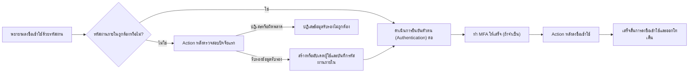

# Actions

Logto Actions ช่วยให้คุณสามารถรัน JavaScript ที่เชื่อถือได้ในจุดที่กำหนดในโฟลว์การยืนยันตัวตน (Authentication) สคริปต์ Action จะทำงานแบบซิงโครนัส: คำขอการยืนยันตัวตนจะรอผลลัพธ์จากสคริปต์ และผลลัพธ์ของสคริปต์สามารถอัปเดตผู้ใช้หรือกำหนดได้ว่าโฟลว์จะดำเนินต่อหรือไม่

Actions มีประโยชน์เมื่อการตัดสินใจต้องเกิดขึ้นภายในโฟลว์การยืนยันตัวตน (Authentication) กรณีการใช้งานที่พบบ่อย เช่น:

- ย้ายผู้ใช้และรหัสผ่านจากระบบข้อมูลระบุตัวตนเดิมเมื่อผู้ใช้ลงชื่อเข้าใช้ครั้งแรก
- รีเฟรชโปรไฟล์ผู้ใช้หรือข้อมูลเฉพาะแอปก่อนที่ Logto จะเสร็จสิ้นการลงชื่อเข้าใช้
- เรียกใช้บริการภายนอกและนำผลลัพธ์มาใช้กับผู้ใช้ Logto

:::note
Actions มีให้ใช้งานใน Logto Cloud แผน Enterprise
:::

:::warning
สคริปต์ Action สามารถมีผลต่อการยืนยันตัวตน (Authentication) และแก้ไขข้อมูลผู้ใช้ได้ เฉพาะผู้ดูแลระบบที่เชื่อถือได้เท่านั้นที่ควรได้รับสิทธิ์ในการดู สร้าง แก้ไข ทดสอบ เปิดใช้งาน หรือ ลบ

ในระบบที่โฮสต์เอง สคริปต์ Action จะรันภายในโพรเซสของเซิร์ฟเวอร์ Logto พร้อมสิทธิ์ของมัน การให้สิทธิ์แก้ไขหรือทดสอบสคริปต์เทียบเท่ากับการให้สิทธิ์รันโค้ดบนโฮสต์ Logto ดังนั้น Admin Console ไม่ควรถูกแชร์กับผู้ใช้ที่ไม่เชื่อถือ ปฏิบัติต่อสคริปต์เสมือนเป็นโค้ดฝั่งเซิร์ฟเวอร์ที่เชื่อถือได้; runtime จะจำกัดเวลาและหน่วยความจำของสคริปต์ แต่ไม่ใช่ขอบเขตความปลอดภัยสำหรับโค้ดที่ไม่เชื่อถือ
:::

## Actions อยู่ตรงไหนในโฟลว์การลงชื่อเข้าใช้ \{#how-actions-fit-into-sign-in}

ปัจจุบัน Logto มี Action สองประเภท:



| ประเภท Action                                                                        | เมื่อไหร่ที่รัน                                                                                                                            | สามารถทำอะไรได้บ้าง                                                                                     |
| ------------------------------------------------------------------------------------ | ------------------------------------------------------------------------------------------------------------------------------------------ | ------------------------------------------------------------------------------------------------------- |
| [Post first-factor verification](/developers/actions/post-first-factor-verification) | ระหว่างการลงชื่อเข้าใช้ด้วยรหัสผ่าน เฉพาะเมื่อการตรวจสอบรหัสผ่านภายในของ Logto ล้มเหลว จะไม่รันเมื่อรหัสผ่านภายในถูกต้อง                   | ตรวจสอบข้อมูลรับรองกับระบบเดิม จากนั้นสร้างผู้ใช้ Logto ใหม่หรืออัปเดตผู้ใช้เดิมและย้ายรหัสผ่านที่ส่งมา |
| [Post sign-in](/developers/actions/post-sign-in)                                     | หลังจากผู้ใช้ผ่านการยืนยันตัวตน (Authentication) ทุกปัจจัย รวมถึง MFA (ถ้าจำเป็น) และก่อนที่ Logto จะเสร็จสิ้นการลงชื่อเข้าใช้และออกโทเค็น | อัปเดตและเติมข้อมูลผู้ใช้ Logto ที่มีอยู่โดยใช้บริบทการลงชื่อเข้าใช้สุดท้าย                             |

Action ทั้งสองประเภทจะรันเฉพาะสำหรับ `SignIn` interactions ใน Experience API เท่านั้น Post first-factor verification ใช้กับการลงชื่อเข้าใช้ด้วยรหัสผ่านเท่านั้น; Post sign-in ไม่ขึ้นกับวิธีการยืนยันตัวตน (Authentication)

## โมเดลของสคริปต์ \{#script-model}

แต่ละประเภท Action จะมีการตั้งค่าหนึ่งชุดและฟังก์ชัน JavaScript ชื่อ `runAction` หนึ่งตัว:

```js
const runAction = async ({ event, environmentVariables = {} }) => {
  // ตรวจสอบ event, ดึงข้อมูลภายนอกถ้าต้องการ และคืนค่าผลลัพธ์ที่รองรับโดย Action ประเภทนี้
};
```

ข้อมูลที่ส่งเข้าไปประกอบด้วย:

- `event`: เหตุการณ์การยืนยันตัวตน (Authentication) จริง รูปร่างของข้อมูลขึ้นอยู่กับประเภท Action
- `environmentVariables`: ค่าข้อความที่ตั้งค่าสำหรับ Action นี้ ค่านี้จะถูกส่งผ่าน payload ของฟังก์ชัน; จะไม่สามารถเข้าถึงผ่าน `process.env`

ตัวแก้ไข (editor) จะให้ข้อมูลชนิด (type) แต่สคริปต์ที่บันทึกจะถูกรันเป็น JavaScript สคริปต์อาจเป็น async และสามารถใช้ Web API มาตรฐานเหล่านี้ได้ทั้งใน Logto Cloud และ Logto ที่โฮสต์เอง:

- `fetch`, `Request`, `Response`, และ `Headers`
- Web Crypto ผ่าน `crypto` และ `crypto.subtle`
- `TextEncoder` และ `TextDecoder`
- `URL` และ `URLSearchParams`

สคริปต์ไม่สามารถ import แพ็กเกจได้ หลีกเลี่ยงการใช้ global หรือ module เฉพาะ Node.js เพราะไม่สามารถใช้งานข้ามระหว่าง Logto ที่โฮสต์เองกับ Logto Cloud และไม่อยู่ในข้อตกลงการรองรับสคริปต์

ผลลัพธ์ที่รองรับจะแตกต่างกันไปตามแต่ละประเภท Action; โปรดดูหน้าข้อมูลอ้างอิงของแต่ละประเภทก่อนเปิดใช้งาน Action

## Actions และ Webhooks \{#actions-and-webhooks}

Actions และ [Webhooks](/developers/webhooks) มีวัตถุประสงค์ต่างกัน:

|                                                                      | Actions                                                | Webhooks                                                  |
| -------------------------------------------------------------------- | ------------------------------------------------------ | --------------------------------------------------------- |
| การทำงาน                                                             | ซิงโครนัสและอยู่ในโฟลว์การยืนยันตัวตน (Authentication) | แอสิงโครนัสและอยู่นอกคำขอการยืนยันตัวตน (Authentication)  |
| สามารถมีผลต่อโฟลว์การยืนยันตัวตน (Authentication) ปัจจุบันได้หรือไม่ | ได้                                                    | ไม่ได้                                                    |
| สามารถแก้ไขผู้ใช้จากผลลัพธ์ได้หรือไม่                                | ได้ โดยใช้ user patch ที่รองรับ                        | ไม่ได้โดยตรง; ผู้รับสามารถเรียก Management API แยกต่างหาก |
| ครอบคลุมเหตุการณ์                                                    | จุดการยืนยันตัวตน (Authentication) ที่เลือกไว้         | เหตุการณ์ interaction และการเปลี่ยนแปลงข้อมูลที่หลากหลาย  |
| การใช้งานทั่วไป                                                      | การย้ายข้อมูลรับรอง, enrich โปรไฟล์ก่อนออกโทเค็น       | การแจ้งเตือน, การซิงค์ downstream, การวิเคราะห์ข้อมูล     |

งานที่เป็นแอสิงโครนัสควรอยู่ใน Webhooks ใช้ Action เฉพาะเมื่อ Logto ต้องการผลลัพธ์ก่อนที่การยืนยันตัวตน (Authentication) จะดำเนินต่อได้

## ขั้นตอนถัดไป \{#next-steps}

- [ตั้งค่าและทดสอบ Actions](/developers/actions/configure-and-test-actions)
- [ย้ายผู้ใช้เมื่อเข้าสู่ระบบด้วยรหัสผ่าน](/developers/actions/post-first-factor-verification)
- [เติมข้อมูลผู้ใช้หลังลงชื่อเข้าใช้](/developers/actions/post-sign-in)
