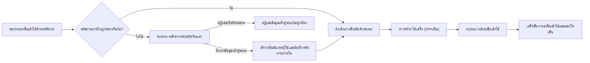

# Actions

Logto Actions ช่วยให้คุณสามารถรัน JavaScript ที่เชื่อถือได้ ณ จุดที่กำหนดในโฟลว์การยืนยันตัวตน (Authentication) สคริปต์ Action จะทำงานแบบ synchronous: คำขอการยืนยันตัวตนจะรอผลลัพธ์จากสคริปต์ และผลลัพธ์นั้นสามารถอัปเดตผู้ใช้หรือกำหนดได้ว่าโฟลว์จะดำเนินต่อหรือไม่

Actions มีประโยชน์เมื่อการตัดสินใจต้องเกิดขึ้นภายในโฟลว์การยืนยันตัวตน กรณีการใช้งานที่พบบ่อย เช่น:

- ย้ายผู้ใช้และรหัสผ่านจากระบบข้อมูลระบุตัวตนเดิมเมื่อผู้ใช้ลงชื่อเข้าใช้ครั้งแรก
- รีเฟรชโปรไฟล์ผู้ใช้หรือข้อมูลเฉพาะแอปก่อนที่ Logto จะเสร็จสิ้นการลงชื่อเข้าใช้
- เรียกใช้บริการภายนอกและนำผลลัพธ์มาใช้กับผู้ใช้ Logto

:::note
Actions มีให้ใช้งานใน Logto Cloud Enterprise plans และใน Logto OSS ที่ติดตั้งเอง (v1.43.0 ขึ้นไป)
:::

:::warning
สคริปต์ Action สามารถมีผลต่อการยืนยันตัวตนและแก้ไขข้อมูลผู้ใช้ได้ เฉพาะผู้ดูแลระบบที่เชื่อถือได้เท่านั้นที่ควรได้รับสิทธิ์ในการดู สร้าง แก้ไข ทดสอบ เปิดใช้งาน หรือ ลบ

ในระบบที่ติดตั้งเอง สคริปต์ Action จะรันภายใน process ของ Logto server พร้อมสิทธิ์ของมัน การให้สิทธิ์แก้ไขหรือทดสอบสคริปต์เทียบเท่ากับการให้สิทธิ์รันโค้ดบนเครื่อง Logto host ดังนั้น Admin Console ไม่ควรแชร์กับผู้ใช้ที่ไม่เชื่อถือ ปฏิบัติต่อสคริปต์เสมือนเป็นโค้ดฝั่งเซิร์ฟเวอร์ที่เชื่อถือได้; runtime จะจำกัดเวลาและหน่วยความจำของสคริปต์ แต่ไม่ใช่ขอบเขตความปลอดภัยสำหรับโค้ดที่ไม่เชื่อถือ
:::

## Actions อยู่ตรงไหนในโฟลว์การลงชื่อเข้าใช้ \{#how-actions-fit-into-sign-in}

ปัจจุบัน Logto มี Action สองประเภท:


```mermaid
flowchart LR
  A["พยายามลงชื่อเข้าใช้ด้วยรหัสผ่าน"] --> B{"รหัสผ่านภายในถูกต้องหรือไม่?"}
  B -->|"ใช่"| E["ดำเนินการยืนยันตัวตนต่อ"]
  B -->|"ไม่ใช่"| C["Action หลังตรวจสอบปัจจัยแรก"]
  C -->|"รับรองข้อมูลเข้าสู่ระบบ"| D["สร้างหรืออัปเดตผู้ใช้และบันทึกรหัสผ่านภายใน"]
  C -->|"ปฏิเสธหรือผิดพลาด"| X["ปฏิเสธข้อมูลเข้าสู่ระบบไม่ถูกต้อง"]
  D --> E
  E --> F["ทำ MFA ให้เสร็จ (ถ้าจำเป็น)"]
  F --> G["Action หลังลงชื่อเข้าใช้"]
  G --> H["เสร็จสิ้นการลงชื่อเข้าใช้และออกโทเค็น"]
```

| ประเภท Action                                                                        | ทำงานเมื่อใด                                                                                                               | สามารถทำอะไรได้บ้าง                                                                                          |
| ------------------------------------------------------------------------------------ | -------------------------------------------------------------------------------------------------------------------------- | ------------------------------------------------------------------------------------------------------------ |
| [Post first-factor verification](/developers/actions/post-first-factor-verification) | ระหว่างการลงชื่อเข้าใช้ด้วยรหัสผ่าน เฉพาะเมื่อการตรวจสอบรหัสผ่านภายในของ Logto ล้มเหลว จะไม่ทำงานเมื่อรหัสผ่านภายในถูกต้อง | ตรวจสอบข้อมูลเข้าสู่ระบบกับระบบเดิม จากนั้นสร้างผู้ใช้ Logto ใหม่หรืออัปเดตผู้ใช้เดิมและย้ายรหัสผ่านที่ส่งมา |
| [Post sign-in](/developers/actions/post-sign-in)                                     | หลังผู้ใช้ผ่านการยืนยันตัวตนทุกปัจจัย รวมถึง MFA (ถ้าจำเป็น) และก่อนที่ Logto จะเสร็จสิ้นการลงชื่อเข้าใช้และออกโทเค็น      | อัปเดตและเติมข้อมูลผู้ใช้ Logto ที่มีอยู่โดยใช้ context การลงชื่อเข้าใช้สุดท้าย                              |

Action ทั้งสองประเภทจะทำงานเฉพาะกับ `SignIn` interactions ใน Experience API เท่านั้น Post first-factor verification ใช้กับการลงชื่อเข้าใช้ด้วยรหัสผ่านเท่านั้น; ส่วน Post sign-in ไม่ขึ้นกับวิธีการยืนยันตัวตน

## โมเดลของสคริปต์ \{#script-model}

แต่ละประเภท Action จะมีการตั้งค่าหนึ่งชุดและฟังก์ชัน JavaScript ชื่อ `runAction` หนึ่งตัว:

```js
const runAction = async ({ event, environmentVariables = {} }) => {
  // ตรวจสอบ event, ดึงข้อมูลภายนอกถ้าต้องการ, และคืนค่าผลลัพธ์ที่รองรับโดย Action ประเภทนี้
};
```

payload ประกอบด้วย:

- `event`: เหตุการณ์การยืนยันตัวตนจริง รูปแบบขึ้นกับประเภท Action
- `environmentVariables`: ค่าข้อความที่ตั้งค่าสำหรับ Action นี้ ค่านี้จะถูกส่งผ่าน payload ของฟังก์ชัน; จะไม่สามารถเข้าถึงผ่าน `process.env`

ตัว editor จะให้ข้อมูล type แต่สคริปต์ที่บันทึกจะถูกรันเป็น JavaScript สคริปต์อาจเป็น async และสามารถใช้ Web API มาตรฐานเหล่านี้ได้ทั้งใน Logto Cloud และ Logto ที่ติดตั้งเอง:

- `fetch`, `Request`, `Response`, และ `Headers`
- Web Crypto ผ่าน `crypto` และ `crypto.subtle`
- `TextEncoder` และ `TextDecoder`
- `URL` และ `URLSearchParams`

สคริปต์ไม่สามารถ import แพ็กเกจได้ หลีกเลี่ยงการใช้ global หรือ module เฉพาะ Node.js เพราะไม่สามารถใช้งานข้ามระหว่าง Logto ที่ติดตั้งเองกับ Logto Cloud และไม่อยู่ในข้อตกลงการรองรับของสคริปต์

ผลลัพธ์ที่รองรับจะแตกต่างกันไปตามแต่ละประเภท Action; โปรดดูหน้าข้อมูลอ้างอิงของแต่ละประเภทก่อนเปิดใช้งาน Action

## Actions และ Webhooks \{#actions-and-webhooks}

Actions และ [Webhooks](/developers/webhooks) มีวัตถุประสงค์ต่างกัน:

|                                           | Actions                                               | Webhooks                                                  |
| ----------------------------------------- | ----------------------------------------------------- | --------------------------------------------------------- |
| การทำงาน                                  | แบบ synchronous และอยู่ในโฟลว์การยืนยันตัวตน          | แบบ asynchronous และอยู่นอกคำขอการยืนยันตัวตน             |
| มีผลต่อโฟลว์การยืนยันตัวตนปัจจุบันหรือไม่ | มี                                                    | ไม่มี                                                     |
| สามารถแก้ไขผู้ใช้จากผลลัพธ์ได้หรือไม่     | ได้ โดยใช้ user patch ที่รองรับ                       | ไม่ได้โดยตรง; ผู้รับสามารถเรียก Management API แยกต่างหาก |
| ครอบคลุมเหตุการณ์                         | จุดการยืนยันตัวตนที่เลือกไว้                          | เหตุการณ์ interaction และเปลี่ยนแปลงข้อมูลที่หลากหลาย     |
| การใช้งานทั่วไป                           | การย้ายข้อมูลเข้าสู่ระบบ, enrich โปรไฟล์ก่อนออกโทเค็น | การแจ้งเตือน, การซิงค์ downstream, การวิเคราะห์ข้อมูล     |

งานที่ต้องใช้เวลานานควรทำใน Webhooks ใช้ Action เฉพาะเมื่อ Logto ต้องการผลลัพธ์ก่อนที่การยืนยันตัวตนจะดำเนินต่อได้

## ขั้นตอนถัดไป \{#next-steps}

- [ตั้งค่าและทดสอบ Actions](/developers/actions/configure-and-test-actions)
- [ย้ายผู้ใช้เมื่อเข้าสู่ระบบด้วยรหัสผ่าน](/developers/actions/post-first-factor-verification)
- [เติมข้อมูลผู้ใช้หลังลงชื่อเข้าใช้](/developers/actions/post-sign-in)
