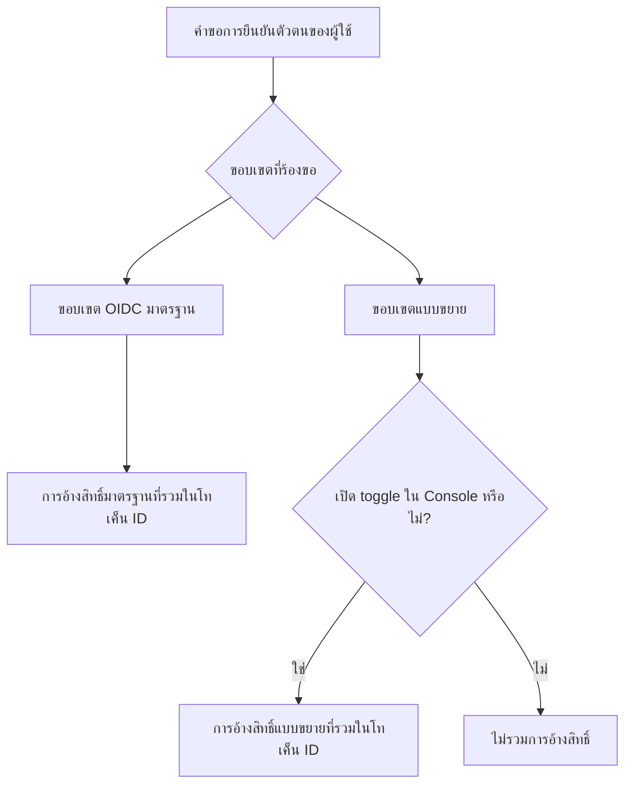

# โทเค็น ID (ID token) แบบกำหนดเอง

## บทนำ \{#introduction}

[โทเค็น ID (ID token)](https://auth.wiki/id-token) คือโทเค็นชนิดพิเศษที่กำหนดโดยโปรโตคอล [OpenID Connect (OIDC)](https://auth.wiki/openid-connect) ทำหน้าที่เป็นการยืนยันตัวตนที่ออกโดยเซิร์ฟเวอร์การอนุญาต (Logto) หลังจากผู้ใช้ยืนยันตัวตนสำเร็จ โดยจะบรรจุการอ้างสิทธิ์ (claims) เกี่ยวกับตัวตนของผู้ใช้ที่ได้รับการยืนยัน

แตกต่างจาก [โทเค็นการเข้าถึง (access tokens)](/developers/custom-token-claims) ซึ่งใช้สำหรับเข้าถึงทรัพยากรที่ได้รับการป้องกัน โทเค็น ID ถูกออกแบบมาโดยเฉพาะเพื่อส่งข้อมูลตัวตนของผู้ใช้ที่ได้รับการยืนยันไปยังแอปพลิเคชันไคลเอนต์ โทเค็นเหล่านี้เป็น [JSON Web Tokens (JWTs)](https://auth.wiki/jwt) ที่บรรจุการอ้างสิทธิ์เกี่ยวกับเหตุการณ์การยืนยันตัวตนและผู้ใช้ที่ได้รับการยืนยัน

## การทำงานของการอ้างสิทธิ์ในโทเค็น ID \{#how-id-token-claims-work}

ใน Logto การอ้างสิทธิ์ในโทเค็น ID แบ่งออกเป็น 2 ประเภท:

1. **การอ้างสิทธิ์ OIDC มาตรฐาน**: กำหนดโดยข้อกำหนด OIDC การอ้างสิทธิ์เหล่านี้ขึ้นอยู่กับขอบเขต (scopes) ที่ร้องขอระหว่างการยืนยันตัวตน
2. **การอ้างสิทธิ์แบบขยาย**: การอ้างสิทธิ์ที่ Logto ขยายเพื่อบรรจุข้อมูลตัวตนเพิ่มเติม โดยควบคุมด้วย **โมเดลเงื่อนไขคู่ (Scope + Toggle)**

## การอ้างสิทธิ์ OIDC มาตรฐาน \{#standard-oidc-claims}

การอ้างสิทธิ์มาตรฐานถูกควบคุมโดยข้อกำหนด OIDC อย่างสมบูรณ์ การรวมการอ้างสิทธิ์เหล่านี้ในโทเค็น ID ขึ้นอยู่กับขอบเขตที่แอปพลิเคชันของคุณร้องขอระหว่างการยืนยันตัวตน Logto ไม่ได้มีตัวเลือกให้ปิดหรือเลือกไม่รวมการอ้างสิทธิ์มาตรฐานแต่ละรายการ

ตารางต่อไปนี้แสดงการแมประหว่างขอบเขตมาตรฐานกับการอ้างสิทธิ์ที่เกี่ยวข้อง:

| ขอบเขต (Scope) | การอ้างสิทธิ์ (Claims)                                                                                                                                                           |
| -------------- | -------------------------------------------------------------------------------------------------------------------------------------------------------------------------------- |
| `openid`       | `sub`                                                                                                                                                                            |
| `profile`      | `name`, `family_name`, `given_name`, `middle_name`, `nickname`, `preferred_username`, `profile`, `picture`, `website`, `gender`, `birthdate`, `zoneinfo`, `locale`, `updated_at` |
| `email`        | `email`, `email_verified`                                                                                                                                                        |
| `phone`        | `phone_number`, `phone_number_verified`                                                                                                                                          |
| `address`      | `address`                                                                                                                                                                        |

ตัวอย่างเช่น หากแอปพลิเคชันของคุณร้องขอขอบเขต `openid profile email` โทเค็น ID จะรวมการอ้างสิทธิ์ทั้งหมดจากขอบเขต `openid`, `profile` และ `email`

## การอ้างสิทธิ์แบบขยาย \{#extended-claims}

นอกเหนือจากการอ้างสิทธิ์ OIDC มาตรฐาน Logto ยังขยายการอ้างสิทธิ์เพิ่มเติมที่บรรจุข้อมูลตัวตนเฉพาะในระบบนิเวศของ Logto การอ้างสิทธิ์แบบขยายเหล่านี้จะถูกเพิ่มในโทเค็น ID ตาม **โมเดลเงื่อนไขคู่** ดังนี้:

1. **เงื่อนไขขอบเขต**: แอปพลิเคชันต้องร้องขอขอบเขตที่เกี่ยวข้องระหว่างการยืนยันตัวตน
2. **Toggle ใน Console**: ผู้ดูแลระบบต้องเปิดการรวมการอ้างสิทธิ์ในโทเค็น ID ผ่าน Logto Console

ทั้งสองเงื่อนไขต้องเป็นจริงพร้อมกัน ขอบเขตเป็นการประกาศการเข้าถึงในระดับโปรโตคอล ส่วน toggle เป็นการควบคุมการเปิดเผยในระดับผลิตภัณฑ์ — หน้าที่ของแต่ละส่วนชัดเจนและไม่สามารถแทนที่กันได้

### ขอบเขตและการอ้างสิทธิ์แบบขยายที่มีให้ใช้งาน \{#available-extended-scopes-and-claims}

| ขอบเขต (Scope)                       | การอ้างสิทธิ์ (Claims)         | คำอธิบาย                                   | รวมโดยค่าเริ่มต้น |
| ------------------------------------ | ------------------------------ | ------------------------------------------ | ----------------- |
| `custom_data`                        | `custom_data`                  | ข้อมูลกำหนดเองที่เก็บในอ็อบเจกต์ผู้ใช้     |                   |
| `identities`                         | `identities`, `sso_identities` | ข้อมูลตัวเชื่อมต่อโซเชียลและ SSO ของผู้ใช้ |                   |
| `roles`                              | `roles`                        | บทบาท (Role) ที่กำหนดให้กับผู้ใช้          | ✅                |
| `urn:logto:scope:organizations`      | `organizations`                | รหัสองค์กร (Organization) ของผู้ใช้        | ✅                |
| `urn:logto:scope:organizations`      | `organization_data`            | ข้อมูลองค์กรของผู้ใช้                      |                   |
| `urn:logto:scope:organization_roles` | `organization_roles`           | การกำหนดบทบาทองค์กรของผู้ใช้               | ✅                |

### ตั้งค่าใน Logto Console \{#configure-in-logto-console}

เพื่อเปิดใช้งานการอ้างสิทธิ์แบบขยายในโทเค็น ID:

1. ไปที่ <CloudLink to="/customize-jwt">Console > Custom JWT</CloudLink>
2. เปิด toggle สำหรับการอ้างสิทธิ์ที่คุณต้องการรวมในโทเค็น ID
3. ตรวจสอบให้แน่ใจว่าแอปพลิเคชันของคุณร้องขอขอบเขตที่เกี่ยวข้องระหว่างการยืนยันตัวตน

## แหล่งข้อมูลที่เกี่ยวข้อง \{#related-resources}

<Url href="/developers/custom-token-claims">โทเค็นการเข้าถึง (Custom access token)</Url>

<Url href="https://openid.net/specs/openid-connect-core-1_0.html#IDToken">
  OpenID Connect Core - ID Token
</Url>
