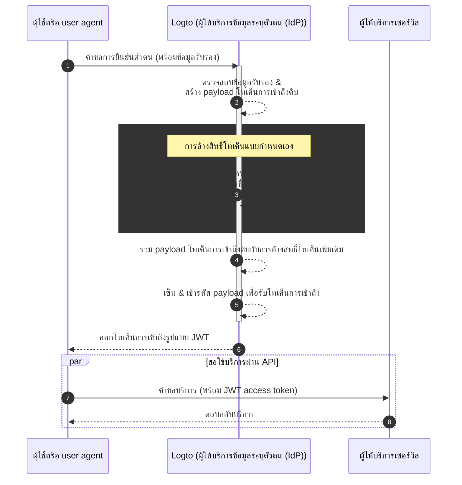

# การอ้างสิทธิ์โทเค็นแบบกำหนดเอง (Custom token claims)

Logto มอบความยืดหยุ่นในการเพิ่มการอ้างสิทธิ์แบบกำหนดเองภายในโทเค็นการเข้าถึง (โทเค็นการเข้าถึง (Access token); JWT / โทเค็นทึบ (Opaque token)). ด้วยฟีเจอร์นี้ คุณสามารถใส่ข้อมูลเพิ่มเติมสำหรับตรรกะทางธุรกิจของคุณ ซึ่งจะถูกส่งอย่างปลอดภัยในโทเค็นและสามารถดึงกลับมาได้ผ่าน introspection ในกรณีของโทเค็นทึบ

## บทนำ \{#introduction}

[โทเค็นการเข้าถึง (Access tokens)](https://auth.wiki/access-token) มีบทบาทสำคัญในกระบวนการการยืนยันตัวตน (Authentication) และการอนุญาต (Authorization) โดยจะบรรจุข้อมูลอัตลักษณ์และสิทธิ์ของผู้ถูกอ้างถึง (Subject) และถูกส่งต่อระหว่าง [เซิร์ฟเวอร์ Logto](/concepts/core-service) (ทำหน้าที่เป็น auth server หรือผู้ให้บริการข้อมูลระบุตัวตน (IdP)), เซิร์ฟเวอร์เว็บเซอร์วิสของคุณ (ผู้ให้บริการทรัพยากร), และแอปพลิเคชันฝั่งไคลเอนต์ (clients)

[การอ้างสิทธิ์โทเค็น (Token claims)](https://auth.wiki/claim) คือคู่คีย์-ค่า ที่ให้ข้อมูลเกี่ยวกับเอนทิตีหรือโทเค็นเอง การอ้างสิทธิ์อาจรวมถึงข้อมูลผู้ใช้, เวลาหมดอายุของโทเค็น, สิทธิ์ (Permissions), และเมตาดาต้าอื่น ๆ ที่เกี่ยวข้องกับกระบวนการการยืนยันตัวตน (Authentication) และการอนุญาต (Authorization)

ใน Logto มีโทเค็นการเข้าถึงอยู่ 2 ประเภท:

- **JSON Web Token:** [JSON Web Token (JWT)](https://auth.wiki/jwt) เป็นฟอร์แมตยอดนิยมที่เข้ารหัสการอ้างสิทธิ์ในรูปแบบที่ปลอดภัยและอ่านได้โดยไคลเอนต์ การอ้างสิทธิ์มาตรฐาน เช่น `sub`, `iss`, `aud` ฯลฯ ถูกใช้ตามโปรโตคอล OAuth 2.0 (ดู [ลิงก์นี้](https://datatracker.ietf.org/doc/html/rfc7519#section-4) สำหรับรายละเอียดเพิ่มเติม) JWT อนุญาตให้ผู้บริโภคเข้าถึงการอ้างสิทธิ์ได้โดยตรงโดยไม่ต้องตรวจสอบเพิ่มเติม ใน Logto โทเค็นการเข้าถึงจะออกในรูปแบบ JWT โดยค่าเริ่มต้นเมื่อไคลเอนต์เริ่มคำขอการอนุญาตสำหรับทรัพยากรหรือองค์กรที่ระบุ
- **โทเค็นทึบ (Opaque token):** [โทเค็นทึบ (Opaque token)](http://localhost:3000/concepts/opaque-token) ไม่ได้บรรจุข้อมูลในตัวเองและต้องตรวจสอบเพิ่มเติมผ่าน [token introspection](https://auth.wiki/token-introspection) เสมอ แม้จะมีรูปแบบที่ไม่โปร่งใส แต่โทเค็นทึบสามารถใช้เพื่อรับการอ้างสิทธิ์และส่งต่ออย่างปลอดภัยระหว่างแต่ละฝ่าย การอ้างสิทธิ์โทเค็นจะถูกเก็บไว้อย่างปลอดภัยในเซิร์ฟเวอร์ Logto และเข้าถึงได้โดยแอปไคลเอนต์ผ่าน endpoint introspection โทเค็นการเข้าถึงจะออกในรูปแบบทึบเมื่อไม่มีการระบุทรัพยากรหรือองค์กรในคำขอการอนุญาต โทเค็นเหล่านี้ใช้หลัก ๆ สำหรับเข้าถึง OIDC `userinfo` endpoint และวัตถุประสงค์ทั่วไปอื่น ๆ

ในหลายกรณี การอ้างสิทธิ์มาตรฐานอาจไม่เพียงพอต่อความต้องการเฉพาะของแอปพลิเคชันของคุณ ไม่ว่าคุณจะใช้ JWT หรือโทเค็นทึบ เพื่อแก้ไขปัญหานี้ Logto จึงมอบความยืดหยุ่นในการเพิ่มการอ้างสิทธิ์แบบกำหนดเองภายในโทเค็นการเข้าถึง ด้วยฟีเจอร์นี้ คุณสามารถใส่ข้อมูลเพิ่มเติมสำหรับตรรกะทางธุรกิจของคุณ ซึ่งจะถูกส่งอย่างปลอดภัยในโทเค็นและสามารถดึงกลับมาได้ผ่าน introspection ในกรณีของโทเค็นทึบ

## การอ้างสิทธิ์โทเค็นแบบกำหนดเองทำงานอย่างไร? \{#how-do-custom-token-claims-work}

Logto อนุญาตให้คุณแทรกการอ้างสิทธิ์แบบกำหนดเองลงใน `access token` ผ่าน callback function `getCustomJwtClaims` คุณสามารถกำหนดฟังก์ชัน `getCustomJwtClaims` ของคุณเองเพื่อคืนค่าเป็นอ็อบเจกต์ของการอ้างสิทธิ์แบบกำหนดเอง ค่าที่คืนมาจะถูกรวมกับ payload ดั้งเดิมของโทเค็นและเซ็นเพื่อลงนามเป็นโทเค็นการเข้าถึงสุดท้าย

:::warning
การอ้างสิทธิ์โทเค็นที่มีอยู่ใน Logto ไม่สามารถถูกเขียนทับหรือแก้ไขได้ การอ้างสิทธิ์แบบกำหนดเองจะถูกเพิ่มเข้าไปในโทเค็นเป็นการอ้างสิทธิ์เพิ่มเติม หากมีการอ้างสิทธิ์แบบกำหนดเองที่ขัดแย้งกับการอ้างสิทธิ์ที่มีอยู่ในระบบ การอ้างสิทธิ์แบบกำหนดเองนั้นจะถูกละเว้น
:::

## แหล่งข้อมูลที่เกี่ยวข้อง \{#related-resources}

<Url href="https://blog.logto.io/glance-on-custom-jwt-access-token-claims">
  เพิ่มการอ้างสิทธิ์แบบกำหนดเองสำหรับโทเค็นการเข้าถึง JWT ด้วย Logto
  เพื่อเสริมประสิทธิภาพการอนุญาตของคุณ
</Url>
