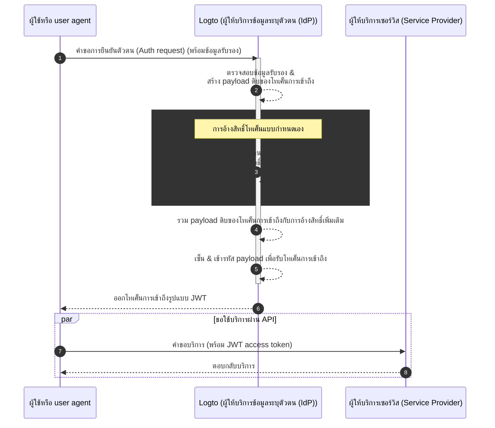

# โทเค็นการเข้าถึงแบบกำหนดเอง (Custom access token)

Logto มอบความยืดหยุ่นในการเพิ่มการอ้างสิทธิ์ (claims) แบบกำหนดเองภายในโทเค็นการเข้าถึง (โทเค็นการเข้าถึง (Access token); JWT / โทเค็นทึบ (Opaque token)) ด้วยฟีเจอร์นี้ คุณสามารถใส่ข้อมูลเพิ่มเติมสำหรับตรรกะทางธุรกิจของคุณ ซึ่งจะถูกส่งอย่างปลอดภัยในโทเค็นและสามารถดึงข้อมูลได้ผ่าน introspection ในกรณีของโทเค็นทึบ

## บทนำ \{#introduction}

[โทเค็นการเข้าถึง (Access tokens)](https://auth.wiki/access-token) มีบทบาทสำคัญในกระบวนการการยืนยันตัวตน (Authentication) และการอนุญาต (Authorization) โดยจะบรรจุข้อมูลตัวตนของผู้ถูกอ้างถึง (Subject) และสิทธิ์ต่าง ๆ และถูกส่งผ่านระหว่าง [เซิร์ฟเวอร์ Logto](/concepts/core-service) (ทำหน้าที่เป็น auth server หรือผู้ให้บริการข้อมูลระบุตัวตน (IdP)), เซิร์ฟเวอร์เว็บเซอร์วิสของคุณ (resource provider), และแอปพลิเคชันฝั่งไคลเอนต์ (clients)

[การอ้างสิทธิ์ของโทเค็น (Token claims)](https://auth.wiki/claim) คือคู่คีย์-ค่า (key-value pairs) ที่ให้ข้อมูลเกี่ยวกับเอนทิตีหรือโทเค็นเอง การอ้างสิทธิ์อาจรวมถึงข้อมูลผู้ใช้ เวลาหมดอายุของโทเค็น สิทธิ์ และเมตาดาต้าอื่น ๆ ที่เกี่ยวข้องกับกระบวนการการยืนยันตัวตน (Authentication) และการอนุญาต (Authorization)

ใน Logto มีโทเค็นการเข้าถึงอยู่ 2 ประเภท:

- **JSON Web Token:** [JSON Web Token (JWT)](https://auth.wiki/jwt) เป็นรูปแบบยอดนิยมที่เข้ารหัสการอ้างสิทธิ์ในลักษณะที่ปลอดภัยและอ่านได้โดยไคลเอนต์ การอ้างสิทธิ์ทั่วไป เช่น `sub`, `iss`, `aud` ฯลฯ ถูกใช้ตามโปรโตคอล OAuth 2.0 (ดู [ลิงก์นี้](https://datatracker.ietf.org/doc/html/rfc7519#section-4) สำหรับรายละเอียดเพิ่มเติม) JWT ช่วยให้ผู้ใช้สามารถเข้าถึงการอ้างสิทธิ์ได้โดยตรงโดยไม่ต้องตรวจสอบเพิ่มเติม ใน Logto โทเค็นการเข้าถึงจะถูกออกในรูปแบบ JWT โดยค่าเริ่มต้นเมื่อไคลเอนต์เริ่มคำขอการอนุญาต (Authorization request) สำหรับทรัพยากรหรือองค์กรที่ระบุ
- **โทเค็นทึบ (Opaque token):** [โทเค็นทึบ (Opaque token)](http://localhost:3000/concepts/opaque-token) ไม่ได้บรรจุข้อมูลในตัวเองและต้องมีขั้นตอนตรวจสอบเพิ่มเติมผ่าน [token introspection](https://auth.wiki/token-introspection) เสมอ แม้จะมีรูปแบบที่ไม่โปร่งใส โทเค็นทึบก็สามารถใช้รับการอ้างสิทธิ์และส่งต่ออย่างปลอดภัยระหว่างแต่ละฝ่าย การอ้างสิทธิ์ของโทเค็นจะถูกเก็บไว้อย่างปลอดภัยในเซิร์ฟเวอร์ Logto และเข้าถึงได้โดยแอปพลิเคชันไคลเอนต์ผ่าน token introspection endpoint โทเค็นการเข้าถึงจะถูกออกในรูปแบบทึบเมื่อไม่มีการระบุทรัพยากรหรือองค์กรในคำขอการอนุญาต โทเค็นเหล่านี้ใช้สำหรับเข้าถึง OIDC `userinfo` endpoint และวัตถุประสงค์ทั่วไปอื่น ๆ

ในหลายกรณี การอ้างสิทธิ์มาตรฐานอาจไม่เพียงพอต่อความต้องการเฉพาะของแอปพลิเคชันของคุณ ไม่ว่าคุณจะใช้ JWT หรือโทเค็นทึบก็ตาม เพื่อแก้ไขปัญหานี้ Logto จึงมอบความยืดหยุ่นในการเพิ่มการอ้างสิทธิ์แบบกำหนดเองในโทเค็นการเข้าถึง ด้วยฟีเจอร์นี้ คุณสามารถใส่ข้อมูลเพิ่มเติมสำหรับตรรกะทางธุรกิจของคุณ ซึ่งจะถูกส่งอย่างปลอดภัยในโทเค็นและสามารถดึงข้อมูลได้ผ่าน introspection ในกรณีของโทเค็นทึบ

## การทำงานของการอ้างสิทธิ์โทเค็นแบบกำหนดเอง \{#how-do-custom-token-claims-work}

Logto อนุญาตให้คุณแทรกการอ้างสิทธิ์แบบกำหนดเองลงใน `access token` ผ่านฟังก์ชัน callback `getCustomJwtClaims` คุณสามารถกำหนดการทำงานของ `getCustomJwtClaims` เพื่อคืนอ็อบเจกต์ของการอ้างสิทธิ์แบบกำหนดเอง ค่าที่คืนมาจะถูกรวมกับ payload ดั้งเดิมของโทเค็นและเซ็นเพื่อลงนามเป็นโทเค็นการเข้าถึงสุดท้าย

```mermaid
sequenceDiagram
  participant U as ผู้ใช้หรือ user agent
  participant IdP as Logto (ผู้ให้บริการข้อมูลระบุตัวตน (IdP))
  participant SP as ผู้ให้บริการเซอร์วิส (Service Provider)

  autonumber
  U ->> IdP: คำขอการยืนยันตัวตน (Auth request) (พร้อมข้อมูลรับรอง)
  activate IdP
  IdP-->>IdP: ตรวจสอบข้อมูลรับรอง &<br/>สร้าง payload ดิบของโทเค็นการเข้าถึง
  rect var(--mermaid-rect-fill)
  note over IdP: การอ้างสิทธิ์โทเค็นแบบกำหนดเอง
  IdP->>IdP: รันสคริปต์การอ้างสิทธิ์โทเค็นแบบกำหนดเอง (`getCustomJwtClaims`) &<br/>รับการอ้างสิทธิ์โทเค็นเพิ่มเติม
  end
  IdP-->>IdP: รวม payload ดิบของโทเค็นการเข้าถึงกับการอ้างสิทธิ์เพิ่มเติม
  IdP-->>IdP: เซ็น & เข้ารหัส payload เพื่อรับโทเค็นการเข้าถึง
  deactivate IdP
  IdP-->>U: ออกโทเค็นการเข้าถึงรูปแบบ JWT
  par ขอใช้บริการผ่าน API
  U->>SP: คำขอบริการ (พร้อม JWT access token)
  SP-->>U: ตอบกลับบริการ
  end
```

:::info
การอ้างสิทธิ์โทเค็นที่มีอยู่ใน Logto ไม่สามารถถูกเขียนทับหรือแก้ไขได้ การอ้างสิทธิ์แบบกำหนดเองจะถูกเพิ่มเข้าไปในโทเค็นเป็นการอ้างสิทธิ์เพิ่มเติม หากมีการอ้างสิทธิ์แบบกำหนดเองที่ขัดแย้งกับการอ้างสิทธิ์ที่มีอยู่ การอ้างสิทธิ์แบบกำหนดเองเหล่านั้นจะถูกละเว้น
:::

:::warning
หมายเหตุด้านความปลอดภัย: ในการติดตั้งแบบ self-hosted สคริปต์ JWT แบบกำหนดเองจะถูกรันด้วยสิทธิ์เดียวกับกระบวนการเซิร์ฟเวอร์ Logto ดังนั้นการให้สิทธิ์แก้ไขหรือทดสอบสคริปต์จึงเทียบเท่ากับการให้สิทธิ์รันโค้ดบนโฮสต์ Logto ฟีเจอร์นี้ออกแบบมาสำหรับผู้ดูแลระบบที่เชื่อถือได้เท่านั้น: ห้ามให้ผู้ใช้ที่ไม่เชื่อถือหรือมีสิทธิ์ต่ำกว่าสร้าง แก้ไข หรือทดสอบสคริปต์เหล่านี้ และห้ามแชร์ Admin Console กับบุคคลเหล่านั้น
:::

## แหล่งข้อมูลที่เกี่ยวข้อง \{#related-resources}

<Url href="https://blog.logto.io/glance-on-custom-jwt-access-token-claims">
  เพิ่มการอ้างสิทธิ์แบบกำหนดเองสำหรับ JWT access token ด้วย Logto เพื่อยกระดับการอนุญาต
  (Authorization) ของคุณ
</Url>
