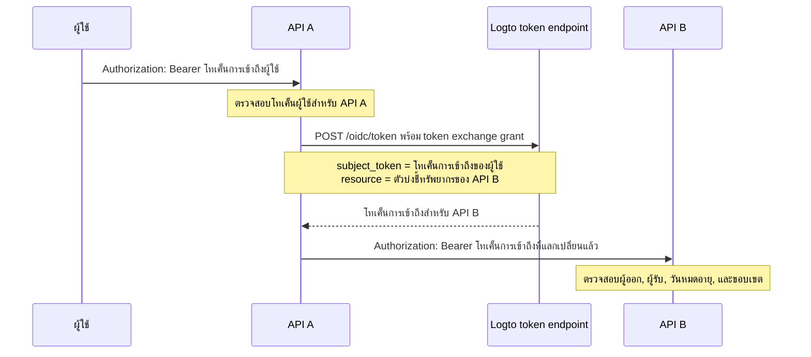

import TokenExchangePrerequisites from './fragments/_token-exchange-prerequisites.mdx';

# การมอบหมายสิทธิ์ระหว่างบริการ (Service-to-service delegation)

ในสถาปัตยกรรม API บางแบบ บริการ backend จะได้รับคำขอจากผู้ใช้ที่ลงชื่อเข้าใช้แล้ว และจำเป็นต้องเรียกบริการ backend อื่น โดยยังคงรักษาเอกลักษณ์ของผู้ใช้เดิมไว้

ตัวอย่างเช่น:

```text
User -> API A -> API B
```

API B จำเป็นต้องรู้สองสิ่ง:

1. ผู้เรียกเป็นบริการที่เชื่อถือได้ เช่น API A
2. การดำเนินการนี้ถูกกระทำในนามของผู้ใช้เดิม

ใช้ grant การแลกเปลี่ยนโทเค็นของ Logto เพื่อแลกเปลี่ยนโทเค็นการเข้าถึงของผู้ใช้เป็นโทเค็นการเข้าถึงใหม่ที่มีผู้รับ (audience) เป็นทรัพยากร API ปลายทาง วิธีนี้เป็นไปตามรูปแบบการแลกเปลี่ยนโทเค็นของ OAuth 2.0 และหลีกเลี่ยงการส่งต่อโทเค็นผู้ใช้เดิมไปยังบริการปลายทาง

## เมื่อใดควรใช้ flow นี้ \{#when-to-use-this-flow}

ใช้การมอบหมายสิทธิ์ระหว่างบริการเมื่อ:

- API A เป็นบริการ backend ที่สามารถยืนยันตัวตนกับ token endpoint ของ Logto ได้อย่างปลอดภัย
- API A ได้รับโทเค็นการเข้าถึงผู้ใช้ที่ออกโดย Logto
- API A จำเป็นต้องเรียก API B ในนามของผู้ใช้เดียวกัน
- API B ควรตรวจสอบโทเค็นการเข้าถึงหนึ่งรายการ โดยมีทรัพยากร API ของตนเองเป็นผู้รับ

อย่าใช้ flow นี้สำหรับการเข้าถึงแบบเครื่องต่อเครื่อง (machine-to-machine) ที่ไม่มีผู้ใช้ ในกรณีนั้นให้ใช้ [client credentials flow](/quick-starts/m2m) สำหรับกรณีสนับสนุน, แอดมิน หรือเอเจนต์ที่ผู้ใช้หนึ่งสวมรอยเป็นผู้ใช้อีกคน ให้ใช้ [การสวมรอยผู้ใช้ (User impersonation)](/developers/user-impersonation)

## วิธีการทำงาน \{#how-it-works}



โทเค็นการเข้าถึงที่แลกเปลี่ยนแล้วจะแทนผู้ใช้เดิม (`sub`) และผูกกับทรัพยากร API ปลายทาง (`aud`) API ปลายทางยังสามารถตรวจสอบการอ้างสิทธิ์ `client_id` เพื่อระบุแอปพลิเคชันที่เริ่มต้นการแลกเปลี่ยนได้

## ข้อกำหนดเบื้องต้น \{#prerequisites}

1. สร้างทรัพยากร API สำหรับบริการที่เกี่ยวข้อง ดู [ปกป้องทรัพยากร API ระดับโกลบอล](/authorization/global-api-resources)
2. กำหนดสิทธิ์ของ API B และมอบหมายให้ผู้ใช้ผ่านบทบาทหรือบทบาทขององค์กร
3. ใช้แอปพลิเคชันฝั่งเซิร์ฟเวอร์สำหรับ API A เช่นแอป machine-to-machine หรือเว็บแอปแบบดั้งเดิม เพื่อให้สามารถยืนยันตัวตนด้วย app secret ได้อย่างปลอดภัย
4. เปิดใช้งาน token exchange สำหรับแอปพลิเคชันของ API A

<TokenExchangePrerequisites />

## ขอรับโทเค็นการเข้าถึงสำหรับ API ปลายทาง \{#request-an-access-token-for-the-downstream-api}

เมื่อ API A ต้องเรียก API B ให้ส่งคำขอแลกเปลี่ยนโทเค็นไปยัง [token endpoint](/integrate-logto/application-data-structure#token-endpoint) ของ Logto

สำหรับเว็บแอปแบบดั้งเดิมหรือแอป machine-to-machine ที่มี app secret ให้ใส่ข้อมูลรับรองใน header `Authorization`:

```bash
POST /oidc/token HTTP/1.1
Host: tenant.logto.app
Content-Type: application/x-www-form-urlencoded
# highlight-next-line
Authorization: Basic <base64(api-a-app-id:api-a-app-secret)>

grant_type=urn:ietf:params:oauth:grant-type:token-exchange
&subject_token=<user_access_token_received_by_api_a>
&subject_token_type=urn:ietf:params:oauth:token-type:access_token
&resource=https://api-b.example.com
&scope=read:orders
```

พารามิเตอร์:

1. `grant_type`: ใช้ `urn:ietf:params:oauth:grant-type:token-exchange`
2. `subject_token`: โทเค็นการเข้าถึงผู้ใช้ที่ออกโดย Logto ซึ่ง API A ได้รับมา
3. `subject_token_type`: ใช้ `urn:ietf:params:oauth:token-type:access_token`
4. `resource`: ตัวบ่งชี้ทรัพยากร API ของ API B
5. `scope`: ขอบเขต downstream ที่ API A ขอสำหรับการเรียกแบบมอบหมายนี้ Logto จะออกเฉพาะขอบเขตที่ผู้ใช้เดิมมีสิทธิ์สำหรับทรัพยากรนี้ตามการตั้งค่า RBAC

Logto จะส่งคืนโทเค็นการเข้าถึงสำหรับ API B:

```json
{
  "access_token": "eyJhbGci...<truncated>",
  "token_type": "Bearer",
  "expires_in": 3600,
  "scope": "read:orders"
}
```

เมื่อถอดรหัสแล้ว โทเค็นการเข้าถึงจะมีการอ้างสิทธิ์คล้ายกับ:

```json
{
  "sub": "user_id",
  "client_id": "api_a_app_id",
  "iss": "https://tenant.logto.app/oidc",
  "aud": "https://api-b.example.com",
  "scope": "read:orders",
  "exp": 1760000000
}
```

จากนั้น API A จะเรียก API B พร้อมโทเค็นที่แลกเปลี่ยนแล้ว:

```bash
GET /orders HTTP/1.1
Host: api-b.example.com
Authorization: Bearer <exchanged_access_token>
```

## ตรวจสอบโทเค็นใน API B \{#validate-the-token-in-api-b}

API B ควรตรวจสอบโทเค็นที่แลกเปลี่ยนแล้วเช่นเดียวกับโทเค็นการเข้าถึงทรัพยากร API ที่ออกโดย Logto:

1. ตรวจสอบลายเซ็นด้วย JWKs ของ Logto
2. ตรวจสอบผู้ออก (`iss`)
3. ตรวจสอบว่าผู้รับ (`aud`) ตรงกับตัวบ่งชี้ทรัพยากรของ API B
4. ตรวจสอบวันหมดอายุ (`exp`)
5. ตรวจสอบขอบเขตที่ต้องการ
6. ใช้ `sub` เป็น user ID เดิม
7. ตรวจสอบ `client_id` เพิ่มเติมหากอนุญาตเฉพาะ upstream service บางตัวให้เรียกแบบมอบหมาย

ดู [ตรวจสอบโทเค็นการเข้าถึงใน API](/authorization/validate-access-tokens) สำหรับแนวทางการใช้งาน

## แหล่งข้อมูลที่เกี่ยวข้อง \{#related-resources}

<Url href="/authorization/global-api-resources">ปกป้องทรัพยากร API ระดับโกลบอล</Url>

<Url href="/authorization/validate-access-tokens">ตรวจสอบโทเค็นการเข้าถึงใน API</Url>

<Url href="/developers/user-impersonation">การสวมรอยผู้ใช้ (User impersonation)</Url>
