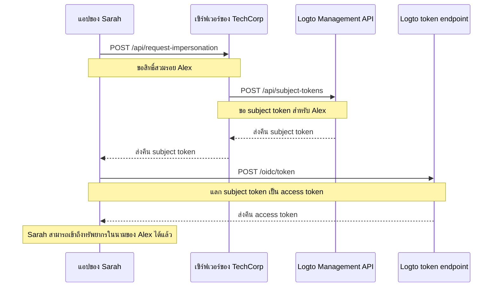

# การสวมรอยผู้ใช้ (User impersonation)

ลองจินตนาการว่า Sarah วิศวกรฝ่ายสนับสนุนของ TechCorp ได้รับทิกเก็ตเร่งด่วนจาก Alex ลูกค้าที่ไม่สามารถเข้าถึงทรัพยากรสำคัญได้ เพื่อวินิจฉัยและแก้ไขปัญหาอย่างมีประสิทธิภาพ Sarah จำเป็นต้องเห็นสิ่งที่ Alex เห็นในระบบ ฟีเจอร์การสวมรอยผู้ใช้ของ Logto จึงมีประโยชน์อย่างยิ่งในกรณีนี้

การสวมรอยผู้ใช้ช่วยให้ผู้ใช้ที่ได้รับอนุญาต เช่น Sarah สามารถดำเนินการในระบบแทนผู้ใช้อื่น เช่น Alex ได้ชั่วคราว ฟีเจอร์นี้มีประโยชน์มากสำหรับการแก้ไขปัญหา การให้บริการลูกค้า และการดำเนินงานในเชิงบริหาร

## ทำงานอย่างไร? \{#how-it-works}



กระบวนการสวมรอยประกอบด้วย 3 ขั้นตอนหลัก:

1. Sarah ขอสิทธิ์สวมรอยผ่าน backend server ของ TechCorp
2. เซิร์ฟเวอร์ของ TechCorp ขอ subject token จาก Logto Management API
3. แอปของ Sarah แลก subject token นี้เป็น access token

มาดูตัวอย่างการใช้งานฟีเจอร์นี้ของ Sarah เพื่อช่วยเหลือ Alex

### ขั้นตอนที่ 1: ขอสิทธิ์สวมรอย \{#step-1-requesting-impersonation}

ก่อนอื่น แอปสนับสนุนของ Sarah ต้องขอสิทธิ์สวมรอยจาก backend server ของ TechCorp

**Request (แอปของ Sarah ไปยังเซิร์ฟเวอร์ของ TechCorp)**

```bash
POST /api/request-impersonation HTTP/1.1
Host: api.techcorp.com
Authorization: Bearer <Sarah's_access_token>
Content-Type: application/json

{
  "userId": "alex123",
  "reason": "Investigating resource access issue",
  "ticketId": "TECH-1234"
}
```

ใน API นี้ backend ควรตรวจสอบสิทธิ์ (authorization) อย่างเหมาะสม เพื่อให้แน่ใจว่า Sarah มีสิทธิ์สวมรอย Alex

### ขั้นตอนที่ 2: ขอ subject token \{#step-2-obtaining-a-subject-token}

เมื่อเซิร์ฟเวอร์ของ TechCorp ตรวจสอบคำขอของ Sarah แล้ว จะเรียก [Management API](/integrate-logto/interact-with-management-api) ของ Logto เพื่อขอ subject token

**Request (เซิร์ฟเวอร์ของ TechCorp ไปยัง Logto Management API)**

```bash
POST /api/subject-tokens HTTP/1.1
Host: techcorp.logto.app
Authorization: Bearer <TechCorp_m2m_access_token>
Content-Type: application/json

{
  "userId": "alex123",
  "context": {
    "ticketId": "TECH-1234",
    "reason": "Resource access issue",
    "supportEngineerId": "sarah789"
  }
}
```

**Response (Logto ไปยังเซิร์ฟเวอร์ของ TechCorp)**

```json
{
  "subjectToken": "sub_7h32jf8sK3j2",
  "expiresIn": 600
}
```

เซิร์ฟเวอร์ของ TechCorp ควรส่ง subject token นี้กลับไปยังแอปของ Sarah

**Response (เซิร์ฟเวอร์ของ TechCorp ไปยังแอปของ Sarah)**

```json
{
  "subjectToken": "sub_7h32jf8sK3j2",
  "expiresIn": 600
}
```

### ขั้นตอนที่ 3: แลก subject token เป็น access token \{#step-3-exchanging-the-subject-token-for-an-access-token}

ตอนนี้แอปของ Sarah จะนำ subject token นี้ไปแลกเป็น access token ที่แทนตัว Alex โดยระบุ resource ที่จะใช้ token นี้

**Request (แอปของ Sarah ไปยัง Logto token endpoint)**

```bash
POST /oidc/token HTTP/1.1
Host: techcorp.logto.app
Content-Type: application/x-www-form-urlencoded

grant_type=urn:ietf:params:oauth:grant-type:token-exchange
&client_id=techcorp_support_app
&scope=resource:read
&subject_token=alx_7h32jf8sK3j2
&subject_token_type=urn:ietf:params:oauth:token-type:access_token
&resource=https://api.techcorp.com/customer-data
```

**Response (Logto ไปยังแอปของ Sarah)**

```json
{
  "access_token": "eyJhbG...<truncated>",
  "issued_token_type": "urn:ietf:params:oauth:token-type:access_token",
  "token_type": "Bearer",
  "expires_in": 3600,
  "scope": "resource:read"
}
```

`access_token` ที่ได้รับจะถูกผูกกับ resource ที่ระบุไว้ ทำให้สามารถใช้ได้เฉพาะกับ API ข้อมูลลูกค้าของ TechCorp เท่านั้น

**หมายเหตุ**: สำหรับเว็บแอปแบบดั้งเดิม ให้ใส่ `client_id` และ `client_secret` ใน header ของคำขอ token เพื่อป้องกันข้อผิดพลาด 401 invalid_client

ตัวอย่าง Node.js:

```json
Authorization: `Basic ${Buffer.from(`${client_id}:${client_secret}`, 'utf8').toString('base64')}`
```

## ตัวอย่างการใช้งาน \{#example-usage}

ตัวอย่างการใช้งานในแอปสนับสนุน Node.js ของ Sarah:

```jsx
interface ImpersonationResponse {
  subjectToken: string;
  expiresIn: number;
}

interface TokenExchangeResponse {
  access_token: string;
  issued_token_type: string;
  token_type: string;
  expires_in: number;
  scope: string;
}

async function impersonateUser(
  userId: string,
  clientId: string,
  ticketId: string,
  resource: string
): Promise<string> {
  try {
    // ขั้นตอนที่ 1 & 2: ขอสิทธิ์สวมรอยและรับ subject token
    const impersonationResponse = await fetch(
      'https://api.techcorp.com/api/request-impersonation',
      {
        method: 'POST',
        headers: {
          Authorization: "Bearer <Sarah's_access_token>",
          'Content-Type': 'application/json',
        },
        body: JSON.stringify({
          userId,
          reason: 'Investigating resource access issue',
          ticketId,
        }),
      }
    );

    if (!impersonationResponse.ok) {
      throw new Error(`เกิดข้อผิดพลาด HTTP. สถานะ: ${impersonationResponse.status}`);
    }

    const { subjectToken } = (await impersonationResponse.json()) as ImpersonationResponse;

    // ขั้นตอนที่ 3: แลก subject token เป็น access token
    const tokenExchangeBody = new URLSearchParams({
      grant_type: 'urn:ietf:params:oauth:grant-type:token-exchange',
      client_id: clientId,
      scope: 'openid profile resource.read',
      subject_token: subjectToken,
      subject_token_type: 'urn:ietf:params:oauth:token-type:access_token',
      resource: resource,
    });

    const tokenExchangeResponse = await fetch('https://techcorp.logto.app/oidc/token', {
      method: 'POST',
      headers: { 'Content-Type': 'application/x-www-form-urlencoded' },
      body: tokenExchangeBody,
    });

    if (!tokenExchangeResponse.ok) {
      throw new Error(`เกิดข้อผิดพลาด HTTP! สถานะ: ${tokenExchangeResponse.status}`);
    }

    const tokenData = (await tokenExchangeResponse.json()) as TokenExchangeResponse;
    return tokenData.access_token;
  } catch (error) {
    console.error('การสวมรอยล้มเหลว:', error);
    throw error;
  }
}

// Sarah ใช้ฟังก์ชันนี้เพื่อสวมรอย Alex
async function performImpersonation(): Promise<void> {
  try {
    const accessToken = await impersonateUser(
      'alex123',
      'techcorp_support_app',
      'TECH-1234',
      'https://api.techcorp.com/customer-data'
    );
    console.log('Access token สำหรับสวมรอย Alex:', accessToken);
  } catch (error) {
    console.error('สวมรอยไม่สำเร็จ:', error);
  }
}

// เรียกใช้งานการสวมรอย
void performImpersonation()
```

:::note

1. subject token มีอายุสั้นและใช้ได้เพียงครั้งเดียว
2. access token สำหรับการสวมรอยจะไม่มี [refresh token](https://auth.wiki/refresh-token) หาก token หมดอายุก่อนที่ Sarah จะช่วยแก้ปัญหาให้ Alex ได้สำเร็จ Sarah ต้องทำกระบวนการนี้ใหม่อีกครั้ง
3. backend server ของ TechCorp ต้องตรวจสอบสิทธิ์อย่างเหมาะสม เพื่อให้แน่ใจว่าเฉพาะเจ้าหน้าที่สนับสนุนที่ได้รับอนุญาต เช่น Sarah เท่านั้นที่สามารถขอสวมรอยได้

:::

## `act` claim \{#act-claim}

เมื่อใช้ token exchange flow สำหรับการสวมรอย access token ที่ออกให้สามารถมี `act` (actor) claim เพิ่มเติมได้ claim นี้แสดงตัวตนของ “ผู้ดำเนินการ” — ในตัวอย่างนี้คือ Sarah ผู้ที่กำลังสวมรอย

เพื่อให้มี `act` claim แอปของ Sarah ต้องส่ง `actor_token` ในคำขอ token exchange โดย token นี้ควรเป็น access token ที่ถูกต้องของ Sarah พร้อมขอบเขต `openid` ตัวอย่างการใส่ในคำขอ:

```bash
POST /oidc/token HTTP/1.1
Host: techcorp.logto.app
Content-Type: application/x-www-form-urlencoded

grant_type=urn:ietf:params:oauth:grant-type:token-exchange
&client_id=techcorp_support_app
&scope=resource:read
&subject_token=alx_7h32jf8sK3j2
&subject_token_type=urn:ietf:params:oauth:token-type:access_token
&actor_token=sarah_access_token
&actor_token_type=urn:ietf:params:oauth:token-type:access_token
&resource=https://api.techcorp.com/customer-data
```

หากมีการส่ง `actor_token` access token ที่ได้จะมี `act` claim ดังนี้:

```json
{
  "aud": "https://api.techcorp.com",
  "iss": "https://techcorp.logto.app",
  "exp": 1443904177,
  "sub": "alex123",
  "act": {
    "sub": "sarah789"
  }
}
```

`act` claim นี้แสดงอย่างชัดเจนว่า Sarah (sarah789) กำลังดำเนินการแทน Alex (alex123) ซึ่งมีประโยชน์สำหรับการตรวจสอบย้อนหลังและติดตามการสวมรอย

## การปรับแต่ง token claims \{#customizing-token-claims}

Logto อนุญาตให้คุณ [ปรับแต่ง token claims](/developers/custom-token-claims) สำหรับ token ที่ใช้ในการสวมรอย ซึ่งมีประโยชน์สำหรับการเพิ่มข้อมูลบริบทหรือเมตาดาต้า เช่น เหตุผลในการสวมรอย หรือหมายเลขทิกเก็ตสนับสนุน

เมื่อเซิร์ฟเวอร์ของ TechCorp ขอ subject token จาก Logto Management API สามารถส่ง `context` object ได้ดังนี้:

```json
{
  "userId": "alex123",
  "context": {
    "ticketId": "TECH-1234",
    "reason": "Resource access issue",
    "supportEngineerId": "sarah789"
  }
}
```

[context](/developers/custom-token-claims/create-script#context-only-available-for-user-access-token) นี้สามารถนำไปใช้ในฟังก์ชัน `getCustomJwtClaims()` เพื่อเพิ่ม claim เฉพาะลงใน access token สุดท้าย ตัวอย่างเช่น:

```tsx
const getCustomJwtClaims = async ({ token, context, environmentVariables }) => {
  if (context.grant?.type === 'urn:ietf:params:oauth:grant-type:token-exchange') {
    const { ticketId, reason, supportEngineerId } = context.grant.subjectTokenContext;
    return {
      impersonation_context: {
        ticket_id: ticketId,
        reason: reason,
        support_engineer: supportEngineerId,
      },
    };
  }
  return {};
};
```

access token ที่ Sarah ได้รับอาจมีลักษณะดังนี้:

```json
{
  "sub": "alex123",
  "aud": "https://api.techcorp.com/customer-data",
  "impersonation_context": {
    "ticket_id": "TECH-1234",
    "reason": "Resource access issue",
    "support_engineer": "sarah789"
  }
  // ... claim มาตรฐานอื่น ๆ
}
```

การปรับแต่ง access token claims แบบนี้ช่วยให้ TechCorp ใส่ข้อมูลสำคัญเกี่ยวกับบริบทการสวมรอย ทำให้ตรวจสอบและเข้าใจการสวมรอยในระบบได้ง่ายขึ้น

:::note
โปรดระวังเมื่อเพิ่ม custom claim ลงใน token ของคุณ หลีกเลี่ยงการใส่ข้อมูลสำคัญที่อาจก่อให้เกิดความเสี่ยงด้านความปลอดภัยหาก token ถูกดักจับหรือรั่วไหล JWT จะถูกลงลายเซ็นแต่ไม่ถูกเข้ารหัส ดังนั้น claim จะมองเห็นได้สำหรับผู้ที่เข้าถึง token ได้
:::

## แหล่งข้อมูลที่เกี่ยวข้อง \{#related-resources}

<Url href="https://blog.logto.io/impersonation">
  การสวมรอยในโลกไซเบอร์และการจัดการข้อมูลระบุตัวตนคืออะไร? เอเจนต์ AI ใช้ประโยชน์จากมันได้อย่างไร?
</Url>
