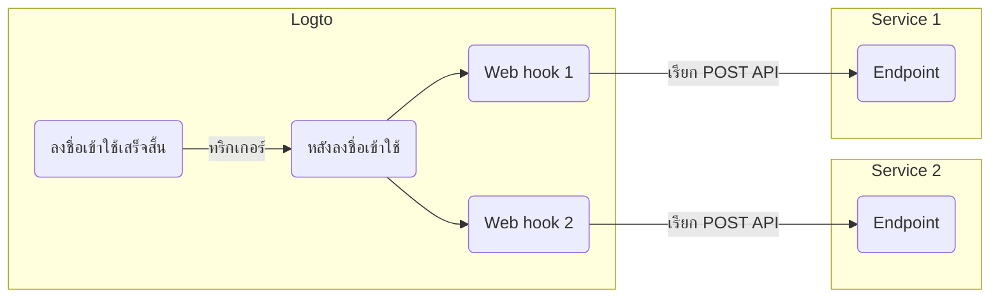

# Webhook

Logto [Webhook](https://auth.wiki/webhook) ให้การแจ้งเตือนแบบเรียลไทม์สำหรับเหตุการณ์ต่าง ๆ รวมถึงการเปลี่ยนแปลงบัญชีผู้ใช้, บทบาท (Role), สิทธิ์ (Permission), องค์กร (Organization), บทบาทขององค์กร, สิทธิ์ขององค์กร และ [การโต้ตอบของผู้ใช้](/end-user-flows)

เมื่อเกิดเหตุการณ์ Logto จะส่งคำขอ HTTP ไปยัง Endpoint URL ที่คุณกำหนด โดยมีข้อมูลรายละเอียดของเหตุการณ์ เช่น user ID, username, email และรายละเอียดอื่น ๆ ที่เกี่ยวข้อง (ดูข้อมูลเพิ่มเติมเกี่ยวกับข้อมูลใน payload และ header ได้ที่ [Webhook request](/developers/webhooks/webhooks-request)) แอปพลิเคชันของคุณสามารถประมวลผลคำขอนี้และดำเนินการที่กำหนดเอง เช่น ส่งอีเมล หรืออัปเดตข้อมูลในฐานข้อมูล

เรายังคงเพิ่มเหตุการณ์ใหม่ ๆ ตามความต้องการของผู้ใช้ หากคุณมีความต้องการเฉพาะสำหรับธุรกิจของคุณ โปรดแจ้งให้เราทราบ

## ทำไมต้องใช้ Webhook? \{#why-use-webhook}

Webhook มอบการสื่อสารแบบเรียลไทม์ระหว่างแอปพลิเคชัน ช่วยลดความจำเป็นในการ polling และทำให้ข้อมูลอัปเดตทันที ช่วยให้การผสานระบบและการทำงานอัตโนมัติของแอปพลิเคชันง่ายขึ้นโดยไม่ต้องใช้โค้ดที่ซับซ้อนหรือ API เฉพาะทาง

ตัวอย่างการใช้งาน Webhook ที่พบบ่อยสำหรับ CIAM ได้แก่:

- **ส่งอีเมล:** ตั้งค่า Webhook เพื่อส่งอีเมลต้อนรับผู้ใช้ใหม่เมื่อสมัครสมาชิก หรือแจ้งเตือนผู้ดูแลระบบเมื่อผู้ใช้ลงชื่อเข้าใช้จากอุปกรณ์หรือสถานที่ใหม่
- **ส่งการแจ้งเตือน:** ตั้งค่า Webhook เพื่อเรียกผู้ช่วยเสมือนกับระบบ CRM ของคุณเพื่อให้การสนับสนุนลูกค้าแบบเรียลไทม์เมื่อผู้ใช้สมัครสมาชิก
- **เรียก API เพิ่มเติม:** ตั้งค่า Webhook เพื่อตรวจสอบการเข้าถึงของผู้ใช้โดยเช็ค domain อีเมลหรือ IP address จากนั้นใช้ Logto Management API เพื่อกำหนดบทบาท (Role) และสิทธิ์ (Permission) ที่เหมาะสมกับทรัพยากร
- **ซิงค์ข้อมูล:** ตั้งค่า Webhook เพื่อให้แอปพลิเคชันอัปเดตเกี่ยวกับการเปลี่ยนแปลง เช่น การระงับหรือการลบบัญชีผู้ใช้
- **สร้างรายงาน:** ตั้งค่า Webhook เพื่อรับข้อมูลกิจกรรมการเข้าสู่ระบบของผู้ใช้และนำไปสร้างรายงานเกี่ยวกับการมีส่วนร่วม หรือรูปแบบการใช้งานของผู้ใช้

## คำศัพท์ \{#terms}

| Item                                                                                                                                                                              | Description                                                                                                                                           |
| --------------------------------------------------------------------------------------------------------------------------------------------------------------------------------- | ----------------------------------------------------------------------------------------------------------------------------------------------------- |
| Event                                                                                                                                                                             | เมื่อมีการดำเนินการเฉพาะ จะเกิด hook event ประเภทหนึ่งขึ้น เช่น Logto จะส่ง hook event ประเภท PostRegister เมื่อผู้ใช้ลงทะเบียนเสร็จและสร้างบัญชีใหม่ |
| Hook                                                                                                                                                                              | การกระทำหนึ่งหรือชุดของการกระทำที่ผูกกับเหตุการณ์เฉพาะ การกระทำอาจเป็นการเรียก API, รันโค้ด ฯลฯ                                                       |
| Webhook                                                                                                                                                                           | ประเภทหนึ่งของ hook ที่หมายถึงการเรียก API พร้อม payload ของเหตุการณ์                                                                                 |
| สมมติว่านักพัฒนาต้องการส่งการแจ้งเตือนเมื่อผู้ใช้ลงชื่อเข้าใช้ผ่านอุปกรณ์ใหม่ นักพัฒนาสามารถเพิ่ม webhook ที่เรียก API ของบริการรักษาความปลอดภัยของเขากับเหตุการณ์ PostSignIn ได้ |

ตัวอย่างการเปิดใช้งาน webhook สองตัวสำหรับเหตุการณ์ `PostSignIn` ใน Logto:

## คำถามที่พบบ่อย \{#faqs}

### Logto รองรับ webhook แบบซิงค์หรือไม่? \{#does-logto-support-synced-webhooks}

แม้ว่า webhook แบบซิงค์จะทำให้ flow การลงชื่อเข้าใช้ของผู้ใช้ราบรื่นขึ้น แต่ขณะนี้เรายังไม่รองรับ (แต่จะรองรับในอนาคต) ดังนั้นกรณีที่ต้องพึ่งพา webhook แบบซิงค์ในปัจจุบันจึงต้องใช้วิธีแก้ไขอื่น หากคุณมีคำถามเพิ่มเติม โปรดติดต่อเรา

### จะจัดการกับการเปลี่ยนแปลงสิทธิ์ของผู้ใช้อย่างไร? \{#how-to-deal-with-user-permission-change}

ดูคู่มือ [จัดการการเปลี่ยนแปลงสิทธิ์ของผู้ใช้](/authorization/global-api-resources/#optional-handle-user-permission-change)

### จะแก้ไขปัญหา webhook timeout ได้อย่างไร? \{#how-to-debug-webhook-timeout}

สำหรับ endpoint ที่รับ Webhook ควรตอบกลับด้วยรหัส 2xx ให้เร็วที่สุดเพื่อแจ้ง Logto ว่าได้รับ Webhook แล้ว เนื่องจากแต่ละผู้ใช้อาจมีตรรกะการประมวลผล Webhook ที่แตกต่างกัน งานที่ซับซ้อนมากอาจใช้เวลาหลายวินาที ทำให้ Webhook ของ Logto timeout แนวทางที่ดีที่สุดคือให้คุณมี event queue ของตัวเอง เมื่อได้รับ Webhook จาก Logto ให้นำเหตุการณ์ใส่ queue แล้วตอบกลับ 2xx กลับไป จากนั้นให้ worker ของคุณประมวลผลงานใน queue ทีละขั้นตอน หาก worker พบข้อผิดพลาด ให้จัดการที่เซิร์ฟเวอร์ของคุณเอง

### สามารถรับ IP address ของ client จาก webhook `PostSignIn` ได้หรือไม่? \{#can-i-get-the-client-ip-address-from-postsignin-webhooks}

ได้ คุณสามารถรับ IP address, user agent ฯลฯ ใน payload ของ Webhook หากคุณต้องการข้อมูลที่ยังไม่รองรับในปัจจุบัน สามารถสร้าง feature request ใน GitHub issues หรือ ติดต่อเรา

## แหล่งข้อมูลที่เกี่ยวข้อง \{#related-resources}

<Url href="https://blog.logto.io/webhooks-vs-polling">Webhooks vs. polling</Url>
