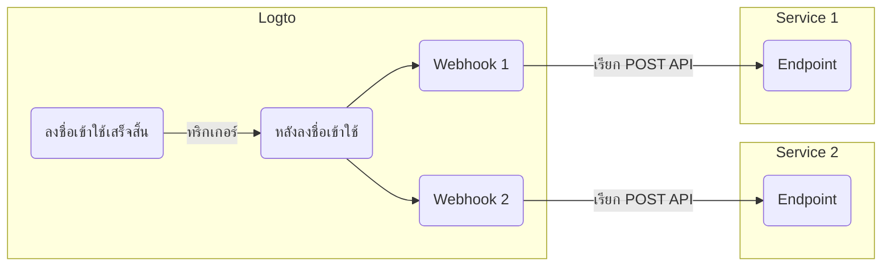

# Webhooks

Logto [Webhooks](https://auth.wiki/webhook) ให้การแจ้งเตือนแบบเรียลไทม์สำหรับเหตุการณ์ต่าง ๆ รวมถึงการเปลี่ยนแปลงบัญชีผู้ใช้, บทบาท (Role), สิทธิ์ (Permission), องค์กร (Organization), บทบาทขององค์กร, สิทธิ์ขององค์กร และ [การโต้ตอบของผู้ใช้](/end-user-flows)

เมื่อเกิดเหตุการณ์ Logto จะส่ง HTTP request ไปยัง endpoint URL ที่คุณกำหนดแบบอะซิงโครนัส คำขอจะมีรายละเอียดเกี่ยวกับเหตุการณ์ เช่น ผู้ใช้, แอปพลิเคชัน, และบริบทของคำขอ ดู [Webhook request](/developers/webhooks/webhooks-request) สำหรับ payload และ header อ้างอิง

การส่ง Webhook จะเกิดขึ้นนอกเหนือจาก authentication request และไม่สามารถเปลี่ยนผลลัพธ์ของ flow ปัจจุบันได้ หากต้องการโค้ดแบบซิงโครนัสที่ต้องเสร็จก่อนการลงชื่อเข้าใช้จะดำเนินต่อ ให้ใช้ [Actions](/developers/actions)

เรายังคงเพิ่มเหตุการณ์ใหม่ ๆ ตามความต้องการของผู้ใช้ หากคุณมีความต้องการเฉพาะสำหรับธุรกิจของคุณ โปรดแจ้งให้เราทราบ

## ทำไมต้องใช้ Webhook? \{#why-use-webhook}

Webhook มอบการสื่อสารแบบเรียลไทม์ระหว่างแอปพลิเคชัน ช่วยลดความจำเป็นในการ polling และทำให้ข้อมูลอัปเดตทันที ช่วยให้การผสานแอปพลิเคชันและการทำงานอัตโนมัติของ workflow ง่ายขึ้นโดยไม่ต้องใช้โค้ดซับซ้อนหรือ API เฉพาะทาง

ตัวอย่างการใช้งาน Webhook ที่พบบ่อยสำหรับ CIAM:

- **ส่งอีเมล:** ตั้งค่า Webhook เพื่อส่งอีเมลต้อนรับผู้ใช้ใหม่เมื่อสมัคร หรือแจ้งเตือนผู้ดูแลเมื่อผู้ใช้ลงชื่อเข้าใช้จากอุปกรณ์หรือสถานที่ใหม่
- **ส่งการแจ้งเตือน:** ตั้งค่า Webhook เพื่อเรียกผู้ช่วยเสมือนกับระบบ CRM ของคุณเพื่อให้บริการลูกค้าแบบเรียลไทม์เมื่อผู้ใช้สมัคร
- **เรียก API เพิ่มเติม:** ตั้งค่า Webhook เพื่อตรวจสอบการเข้าถึงของผู้ใช้โดยเช็ค domain อีเมลหรือ IP address จากนั้นใช้ Logto Management API เพื่อกำหนดบทบาท (Role) และสิทธิ์ (Permission) ที่เหมาะสม
- **ซิงโครไนซ์ข้อมูล:** ตั้งค่า Webhook เพื่อให้แอปพลิเคชันอัปเดตเกี่ยวกับการเปลี่ยนแปลง เช่น การระงับหรือการลบบัญชีผู้ใช้
- **สร้างรายงาน:** ตั้งค่า Webhook เพื่อรับข้อมูลกิจกรรมการเข้าสู่ระบบของผู้ใช้และนำไปสร้างรายงานการมีส่วนร่วมหรือรูปแบบการใช้งาน

## คำศัพท์ \{#terms}

| รายการ        | คำอธิบาย                                                                             |
| ------------- | ------------------------------------------------------------------------------------ |
| Webhook event | ประเภทเหตุการณ์ที่ Logto รองรับและสามารถส่งได้ เช่น `PostSignIn` หรือ `User.Created` |
| Webhook       | การตั้งค่าที่สมัครรับเหตุการณ์หนึ่งหรือมากกว่าและส่ง payload ไปยัง HTTP endpoint     |

ตัวอย่างเช่น หากต้องการแจ้งบริการรักษาความปลอดภัยหลังผู้ใช้ลงชื่อเข้าใช้ ให้สร้าง Webhook ที่สมัครรับเหตุการณ์ `PostSignIn`

ตัวอย่างการเปิดใช้งาน Webhook สองตัวสำหรับเหตุการณ์ `PostSignIn` ใน Logto:

```mermaid
graph LR
  subgraph Logto
    SF(ลงชื่อเข้าใช้เสร็จสิ้น)
    PS(หลังลงชื่อเข้าใช้)
    WH2(Webhook 2)
    WH1(Webhook 1)
  end

  subgraph Service 2
    E2(Endpoint)
  end

  subgraph Service 1
    E1(Endpoint)
  end

  SF -->|ทริกเกอร์| PS
  PS --> WH1
  PS --> WH2
  WH1 --->|เรียก POST API| E1
  WH2 --->|เรียก POST API| E2

```

## คำถามที่พบบ่อย \{#faqs}

### Webhook สามารถตัดสินใจการยืนยันตัวตนแบบซิงโครนัสได้หรือไม่? \{#does-logto-support-synced-webhooks}

ไม่ได้ Webhook เป็นการแจ้งเตือนแบบอะซิงโครนัส ดังนั้น response ของมันไม่สามารถอนุญาต, บล็อก หรือเปลี่ยนแปลง flow การยืนยันตัวตนปัจจุบันได้

ใช้ [Actions](/developers/actions) เมื่อ Logto ต้องรันโค้ดเอง, เรียก API ภายนอก หรืออัปเดตผู้ใช้ก่อนการลงชื่อเข้าใช้จะดำเนินต่อไป เนื่องจาก Actions เป็นแบบซิงโครนัส ควรรักษา dependency ภายนอกให้เร็วและเชื่อถือได้

### จะจัดการกับการเปลี่ยนแปลงสิทธิ์ของผู้ใช้อย่างไร? \{#how-to-deal-with-user-permission-change}

ดูคู่มือ [จัดการการเปลี่ยนแปลงสิทธิ์ของผู้ใช้](/authorization/global-api-resources/#optional-handle-user-permission-change)

### จะแก้ไขปัญหา webhook timeout ได้อย่างไร? \{#how-to-debug-webhook-timeout}

สำหรับ endpoint ที่รับ Webhook ควรตอบกลับด้วย 2xx response ให้เร็วที่สุดเพื่อแจ้ง Logto ว่าได้รับ Webhook แล้ว เนื่องจากแต่ละผู้ใช้อาจมีตรรกะการประมวลผล Webhook ต่างกัน งานที่ซับซ้อนเกินไปอาจใช้เวลาหลายวินาที ทำให้ Webhook ของ Logto timeout แนวทางที่ดีที่สุดคือสร้าง event queue ของคุณเอง เมื่อได้รับ Webhook จาก Logto ให้นำ event ใส่ queue แล้วตอบกลับ 2xx response จากนั้นให้ worker ของคุณประมวลผลงานใน queue ทีละขั้น หาก worker พบข้อผิดพลาด ให้จัดการที่เซิร์ฟเวอร์ของคุณเอง

### สามารถรับ client IP address จาก webhook `PostSignIn` ได้หรือไม่? \{#can-i-get-the-client-ip-address-from-postsignin-webhooks}

ได้ คุณสามารถรับ IP address, user agent ฯลฯ ใน payload ของ Webhook หากต้องการข้อมูลที่ยังไม่รองรับในปัจจุบัน สามารถสร้าง feature request ใน GitHub issues หรือ ติดต่อเรา

## แหล่งข้อมูลที่เกี่ยวข้อง \{#related-resources}

<Url href="https://blog.logto.io/webhooks-vs-polling">Webhooks vs. polling</Url>
