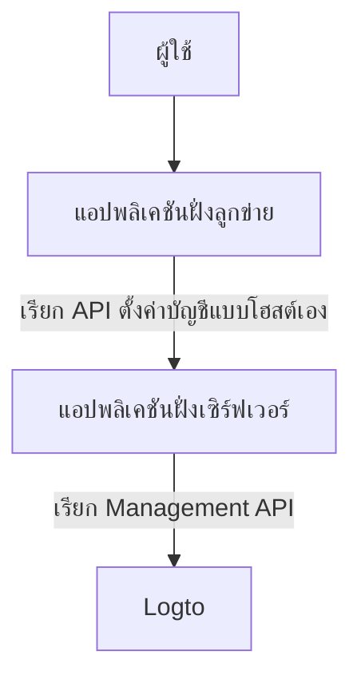
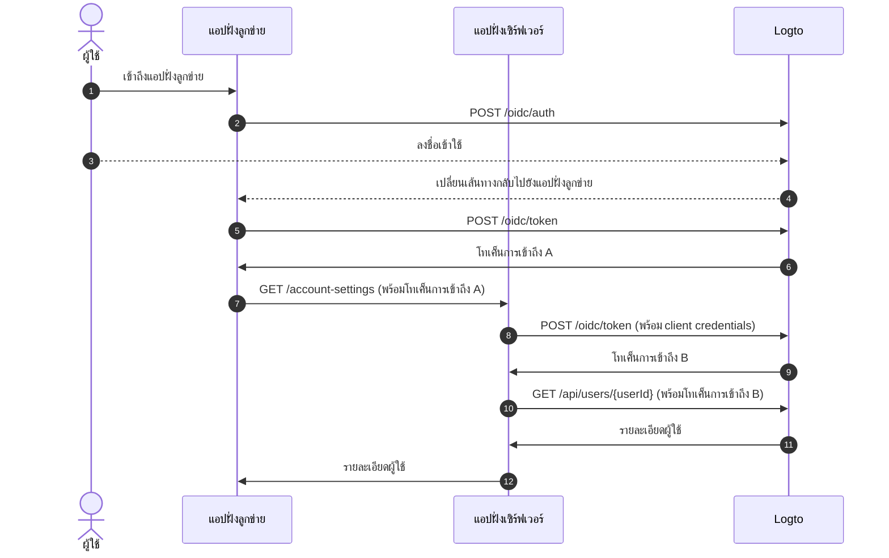
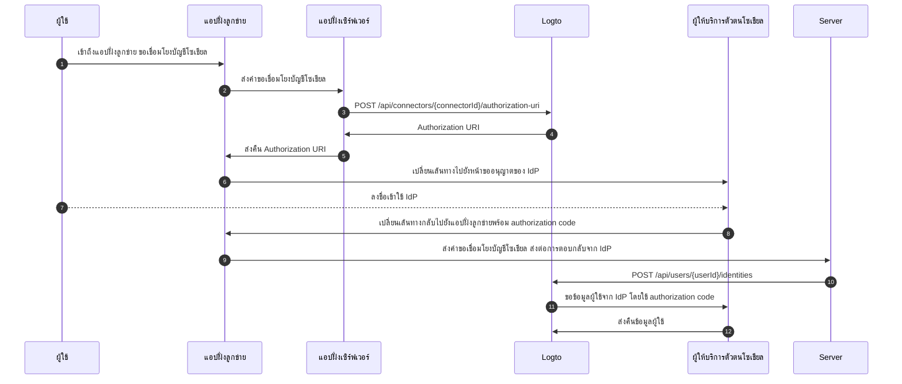

# การตั้งค่าบัญชีผู้ใช้ด้วย Management API

## การเชื่อมต่อระบบ (Integrations) \{#integrations}

Logto มี Management API หลากหลายสำหรับจัดการบัญชีผู้ใช้ คุณสามารถใช้ API เหล่านี้เพื่อสร้างหน้าตั้งค่าบัญชีแบบบริการตนเองสำหรับผู้ใช้ปลายทาง

### สถาปัตยกรรม (Architecture) \{#architecture}

1. **ผู้ใช้**: ผู้ใช้ที่ได้รับการยืนยันตัวตนซึ่งต้องการเข้าถึงและจัดการการตั้งค่าบัญชีของตน
2. **แอปพลิเคชันฝั่งลูกข่าย**: แอปพลิเคชันของคุณที่ให้บริการหน้าตั้งค่าบัญชีแก่ผู้ใช้
3. **แอปพลิเคชันฝั่งเซิร์ฟเวอร์**: แอปพลิเคชันฝั่งเซิร์ฟเวอร์ที่ให้บริการ API ตั้งค่าบัญชีแก่ฝั่งลูกข่าย และติดต่อกับ Logto Management API
4. **Logto**: Logto ในฐานะบริการการยืนยันตัวตน (Authentication) และการอนุญาต (Authorization) ให้บริการ Management API สำหรับจัดการบัญชีผู้ใช้

### ลำดับขั้นตอน (Sequence diagram) \{#sequence-diagram}

1. ผู้ใช้เข้าถึงแอปพลิเคชันฝั่งลูกข่าย
2. แอปฝั่งลูกข่ายส่งคำขอการยืนยันตัวตน (Authentication request) ไปยัง Logto และเปลี่ยนเส้นทางผู้ใช้ไปยังหน้าลงชื่อเข้าใช้ของ Logto
3. ผู้ใช้ลงชื่อเข้าใช้ Logto
4. ผู้ใช้ที่ได้รับการยืนยันตัวตนจะถูกเปลี่ยนเส้นทางกลับไปยังแอปฝั่งลูกข่ายพร้อมรหัสการอนุญาต (authorization code)
5. แอปฝั่งลูกข่ายขอโทเค็นการเข้าถึง (Access token) จาก Logto สำหรับเข้าถึง API ตั้งค่าบัญชีแบบโฮสต์เอง
6. Logto ออกโทเค็นการเข้าถึงให้แอปฝั่งลูกข่าย
7. แอปฝั่งลูกข่ายส่งคำขอตั้งค่าบัญชีไปยังแอปฝั่งเซิร์ฟเวอร์พร้อมโทเค็นการเข้าถึงของผู้ใช้
8. แอปฝั่งเซิร์ฟเวอร์ตรวจสอบตัวตนและสิทธิ์ของผู้ร้องขอจากโทเค็นการเข้าถึงของผู้ใช้ จากนั้นขอโทเค็นการเข้าถึง Management API จาก Logto
9. Logto ออกโทเค็นการเข้าถึง Management API ให้แอปฝั่งเซิร์ฟเวอร์
10. แอปฝั่งเซิร์ฟเวอร์ขอข้อมูลผู้ใช้จาก Logto โดยใช้โทเค็นการเข้าถึง Management API
11. Logto ตรวจสอบตัวตนของเซิร์ฟเวอร์และสิทธิ์ Management API แล้วส่งข้อมูลผู้ใช้กลับมา
12. แอปฝั่งเซิร์ฟเวอร์ประมวลผลข้อมูลผู้ใช้ตามสิทธิ์ของผู้ร้องขอและส่งรายละเอียดบัญชีผู้ใช้กลับไปยังแอปฝั่งลูกข่าย

### การเชื่อมต่อ Management API กับแอปฝั่งเซิร์ฟเวอร์ \{#integrate-management-api-to-server-side-application}

ดูหัวข้อ [Management API](/integrate-logto/interact-with-management-api/) เพื่อเรียนรู้วิธีเชื่อมต่อ Management API กับแอปพลิเคชันฝั่งเซิร์ฟเวอร์

## User Management APIs \{#user-management-apis}

### สคีมาข้อมูลผู้ใช้ (User data schema) \{#user-data-schema}

ดูหัวข้อ [ข้อมูลผู้ใช้และข้อมูลกำหนดเอง](/user-management/user-data/) เพื่อเรียนรู้เพิ่มเติมเกี่ยวกับสคีมาผู้ใช้ใน Logto

### การจัดการโปรไฟล์และตัวระบุผู้ใช้ (User profile and identifiers Management APIs) \{#user-profile-and-identifiers-management-apis}

โปรไฟล์และตัวระบุของผู้ใช้เป็นสิ่งสำคัญสำหรับการจัดการผู้ใช้ คุณสามารถใช้ API ต่อไปนี้เพื่อจัดการโปรไฟล์และตัวระบุผู้ใช้

| method | path                                                                                                     | description                              |
| ------ | -------------------------------------------------------------------------------------------------------- | ---------------------------------------- |
| GET    | [/api/users/\{userId\}](https://openapi.logto.io/operation/operation-getuser)                            | รับรายละเอียดผู้ใช้ตาม user ID           |
| PATCH  | [/api/users/\{userId\}](https://openapi.logto.io/operation/operation-updateuser)                         | อัปเดตรายละเอียดผู้ใช้                   |
| PATCH  | [/api/users/\{userId\}/profile](https://openapi.logto.io/operation/operation-updateuserprofile)          | อัปเดตฟิลด์โปรไฟล์ผู้ใช้ตาม user ID      |
| GET    | [/api/users/\{userId\}/custom-data](https://openapi.logto.io/operation/operation-listusercustomdata)     | รับข้อมูลกำหนดเองของผู้ใช้ตาม user ID    |
| PATCH  | [/api/users/\{userId\}/custom-data](https://openapi.logto.io/operation/operation-updateusercustomdata)   | อัปเดตข้อมูลกำหนดเองของผู้ใช้ตาม user ID |
| PATCH  | [/api/users/\{userId\}/is-suspended](https://openapi.logto.io/operation/operation-updateuserissuspended) | อัปเดตสถานะระงับบัญชีผู้ใช้ตาม user ID   |

### การยืนยันอีเมลและหมายเลขโทรศัพท์ (Email and phone number verification) \{#email-and-phone-number-verification}

ในระบบ Logto ทั้งอีเมลและหมายเลขโทรศัพท์สามารถใช้เป็นตัวระบุผู้ใช้ได้ ดังนั้นการยืนยันจึงมีความสำคัญ เพื่อรองรับสิ่งนี้ เรามี API สำหรับรหัสยืนยันเพื่อช่วยยืนยันอีเมลหรือหมายเลขโทรศัพท์ที่ระบุ

:::note
โปรดตรวจสอบให้แน่ใจว่ายืนยันอีเมลหรือหมายเลขโทรศัพท์ก่อนอัปเดตโปรไฟล์ผู้ใช้ด้วยอีเมลหรือหมายเลขโทรศัพท์ใหม่
:::

| method | path                                                                                                                             | description                                  |
| ------ | -------------------------------------------------------------------------------------------------------------------------------- | -------------------------------------------- |
| POST   | [/api/verifications/verification-code](https://openapi.logto.io/operation/operation-createverificationbyverificationcode)        | ส่งรหัสยืนยันอีเมลหรือหมายเลขโทรศัพท์        |
| POST   | [/api/verifications/verification-code/verify](https://openapi.logto.io/operation/operation-verifyverificationbyverificationcode) | ยืนยันอีเมลหรือหมายเลขโทรศัพท์ด้วยรหัสยืนยัน |

### การจัดการรหัสผ่านผู้ใช้ (User password management) \{#user-password-management}

| method | path                                                                                                     | description                                  |
| ------ | -------------------------------------------------------------------------------------------------------- | -------------------------------------------- |
| POST   | [/api/users/\{userId\}/password/verify](https://openapi.logto.io/operation/operation-verifyuserpassword) | ตรวจสอบรหัสผ่านปัจจุบันของผู้ใช้ตาม user ID  |
| PATCH  | [/api/users/\{userId\}/password](https://openapi.logto.io/operation/operation-updateuserpassword)        | อัปเดตรหัสผ่านผู้ใช้ตาม user ID              |
| GET    | [/api/users/\{userId\}/has-password](https://openapi.logto.io/operation/operation-getuserhaspassword)    | ตรวจสอบว่าผู้ใช้มีรหัสผ่านหรือไม่ตาม user ID |

:::note
โปรดตรวจสอบรหัสผ่านปัจจุบันของผู้ใช้ก่อนอัปเดตรหัสผ่านใหม่
:::

### การจัดการตัวตนโซเชียลของผู้ใช้ (User social identities management) \{#user-social-identities-management}

| method | path                                                                                                                              | description                                                                                            |
| ------ | --------------------------------------------------------------------------------------------------------------------------------- | ------------------------------------------------------------------------------------------------------ |
| GET    | [/api/users/\{userId\}](https://openapi.logto.io/operation/operation-getuser)                                                     | รับรายละเอียดผู้ใช้ตาม user ID ตัวตนโซเชียลจะอยู่ในฟิลด์ `identities`                                  |
| POST   | [/api/users/\{userId\}/identities](https://openapi.logto.io/operation/operation-createuseridentity)                               | เชื่อมโยงตัวตนโซเชียลที่ได้รับการยืนยันกับผู้ใช้ตาม user ID                                            |
| DELETE | [/api/users/\{userId\}/identities](https://openapi.logto.io/operation/operation-deleteuseridentity)                               | ยกเลิกการเชื่อมโยงตัวตนโซเชียลออกจากผู้ใช้ตาม user ID                                                  |
| PUT    | [/api/users/\{userId\}/identities](https://openapi.logto.io/operation/operation-replaceuseridentity)                              | อัปเดตตัวตนโซเชียลที่เชื่อมโยงกับผู้ใช้โดยตรงตาม user ID                                               |
| POST   | [/api/connectors/\{connectorId\}/authorization-uri](https://openapi.logto.io/operation/operation-createconnectorauthorizationuri) | รับ authorization URI สำหรับผู้ให้บริการตัวตนโซเชียล ใช้ URI นี้เพื่อเริ่มการเชื่อมต่อบัญชีโซเชียลใหม่ |

1. ผู้ใช้เข้าถึงแอปฝั่งลูกข่ายและขอเชื่อมโยงบัญชีโซเชียล
2. แอปฝั่งลูกข่ายส่งคำขอไปยังเซิร์ฟเวอร์เพื่อเชื่อมโยงบัญชีโซเชียล
3. เซิร์ฟเวอร์ส่งคำขอไปยัง Logto เพื่อขอ authorization URI สำหรับผู้ให้บริการตัวตนโซเชียล คุณต้องระบุ `state` และ `redirect_uri` ของคุณเองในคำขอ และต้องลงทะเบียน `redirect_uri` กับผู้ให้บริการตัวตนโซเชียลไว้ล่วงหน้า
4. Logto ส่งคืน authorization URI ให้เซิร์ฟเวอร์
5. เซิร์ฟเวอร์ส่ง authorization URI ให้แอปฝั่งลูกข่าย
6. แอปฝั่งลูกข่ายเปลี่ยนเส้นทางผู้ใช้ไปยัง authorization URI ของ IdP
7. ผู้ใช้ลงชื่อเข้าใช้ IdP
8. IdP เปลี่ยนเส้นทางผู้ใช้กลับไปยังแอปฝั่งลูกข่ายโดยใช้ `redirect_uri` พร้อม authorization code
9. แอปฝั่งลูกข่ายตรวจสอบ `state` และส่งต่อการตอบกลับจาก IdP ไปยังเซิร์ฟเวอร์
10. เซิร์ฟเวอร์ส่งคำขอไปยัง Logto เพื่อเชื่อมโยงบัญชีโซเชียลกับผู้ใช้
11. Logto ขอข้อมูลผู้ใช้จาก IdP โดยใช้ authorization code
12. IdP ส่งคืนข้อมูลผู้ใช้ให้ Logto และ Logto เชื่อมโยงบัญชีโซเชียลกับผู้ใช้

:::note
มีข้อจำกัดบางประการที่ควรพิจารณาเมื่อเชื่อมโยงบัญชีโซเชียลใหม่กับผู้ใช้:

- Management API ไม่มี session context ใด ๆ ตัวเชื่อมต่อโซเชียลที่ต้องการ session ที่ใช้งานอยู่เพื่อรักษาสถานะการยืนยันตัวตนโซเชียลอย่างปลอดภัยจะไม่สามารถเชื่อมโยงผ่าน Management API ได้ ตัวเชื่อมต่อที่ไม่รองรับ เช่น apple, OIDC มาตรฐาน และ OAuth 2.0 มาตรฐาน
- ด้วยเหตุผลเดียวกัน Logto ไม่สามารถตรวจสอบ `state` ในการตอบกลับ authorization ได้ โปรดจัดเก็บ `state` ในแอปฝั่งลูกข่ายของคุณและตรวจสอบเมื่อได้รับการตอบกลับ authorization
- คุณต้องลงทะเบียน `redirect_uri` กับผู้ให้บริการตัวตนโซเชียลล่วงหน้า มิฉะนั้น IdP โซเชียลจะไม่เปลี่ยนเส้นทางผู้ใช้กลับไปยังแอปของคุณ IdP โซเชียลของคุณต้องรองรับ callback `redirect_uri` มากกว่าหนึ่งรายการ ได้แก่ สำหรับการลงชื่อเข้าใช้ผู้ใช้ และสำหรับหน้าผูกบัญชีโปรไฟล์ของคุณเอง

:::

### การจัดการตัวตนองค์กรของผู้ใช้ (User enterprise identities management) \{#user-enterprise-identities-management}

| method | path                                                                                                    | description                                                                                                                                         |
| ------ | ------------------------------------------------------------------------------------------------------- | --------------------------------------------------------------------------------------------------------------------------------------------------- |
| GET    | [/api/users/\{userId\}?includeSsoIdentities=true](https://openapi.logto.io/operation/operation-getuser) | รับรายละเอียดผู้ใช้ตาม user ID ตัวตนองค์กรจะอยู่ในฟิลด์ `ssoIdentities` เพิ่ม query parameter `includeSsoIdentities=true` ใน API เพื่อแสดงข้อมูลนี้ |

ปัจจุบัน Management API ยังไม่รองรับการเชื่อมโยงหรือยกเลิกการเชื่อมโยงตัวตนองค์กรกับผู้ใช้ คุณสามารถแสดงเฉพาะตัวตนองค์กรที่เชื่อมโยงกับผู้ใช้ได้เท่านั้น

### โทเค็นการเข้าถึงส่วนบุคคล (Personal access token) \{#personal-access-token}

| method | path                                                                                                                                 | description                                  |
| ------ | ------------------------------------------------------------------------------------------------------------------------------------ | -------------------------------------------- |
| GET    | [/api/users/\{userId\}/personal-access-tokens](https://openapi.logto.io/operation/operation-listuserpersonalaccesstokens)            | รับโทเค็นการเข้าถึงส่วนบุคคลทั้งหมดของผู้ใช้ |
| POST   | [/api/users/\{userId\}/personal-access-tokens](https://openapi.logto.io/operation/operation-createuserpersonalaccesstoken)           | เพิ่มโทเค็นการเข้าถึงส่วนบุคคลใหม่ให้ผู้ใช้  |
| DELETE | [/api/users/\{userId\}/personal-access-tokens/\{name\}](https://openapi.logto.io/operation/operation-deleteuserpersonalaccesstoken)  | ลบโทเค็นของผู้ใช้ตามชื่อ                     |
| PATCH  | [/api/users/\{userId\s}/personal-access-tokens/\{name\}](https://openapi.logto.io/operation/operation-updateuserpersonalaccesstoken) | อัปเดตโทเค็นของผู้ใช้ตามชื่อ                 |

โทเค็นการเข้าถึงส่วนบุคคลเป็นวิธีที่ปลอดภัยสำหรับผู้ใช้ในการให้ [โทเค็นการเข้าถึง (Access token)](https://auth.wiki/access-token) โดยไม่ต้องใช้ข้อมูลรับรองหรือการลงชื่อเข้าใช้แบบโต้ตอบ ดูเพิ่มเติมเกี่ยวกับ [การใช้โทเค็นการเข้าถึงส่วนบุคคล](/user-management/personal-access-token)

### การจัดการการตั้งค่า MFA ของผู้ใช้ (User MFA settings management) \{#user-mfa-settings-management}

| method | path                                                                                                                                 | description                                                |
| ------ | ------------------------------------------------------------------------------------------------------------------------------------ | ---------------------------------------------------------- |
| GET    | [/api/users/\{userId\}/mfa-verifications](https://openapi.logto.io/operation/operation-listusermfaverifications)                     | รับการตั้งค่า MFA ของผู้ใช้ตาม user ID                     |
| POST   | [/api/users/\{userId\}/mfa-verifications](https://openapi.logto.io/operation/operation-createusermfaverification)                    | ตั้งค่าการยืนยันตัวตนหลายปัจจัย (MFA) ให้ผู้ใช้ตาม user ID |
| DELETE | [/api/users/\{userId\}/mfa-verifications/\{verificationId\}](https://openapi.logto.io/operation/operation-deleteusermfaverification) | ลบการยืนยัน MFA ของผู้ใช้ตาม ID                            |

### การลบบัญชีผู้ใช้ (User account deletion) \{#user-account-deletion}

| method | path                                                                             | description              |
| ------ | -------------------------------------------------------------------------------- | ------------------------ |
| DELETE | [/api/users/\{userId\}](https://openapi.logto.io/operation/operation-deleteuser) | ลบบัญชีผู้ใช้ตาม user ID |
