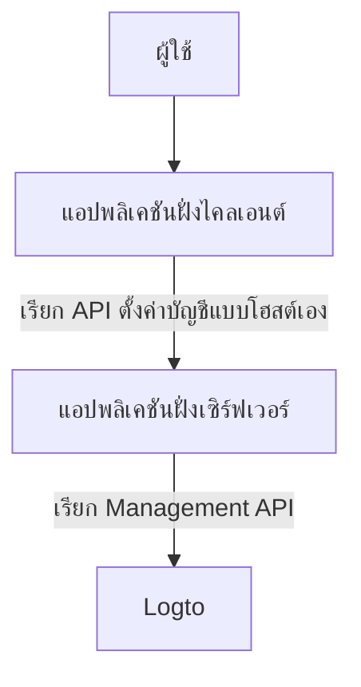
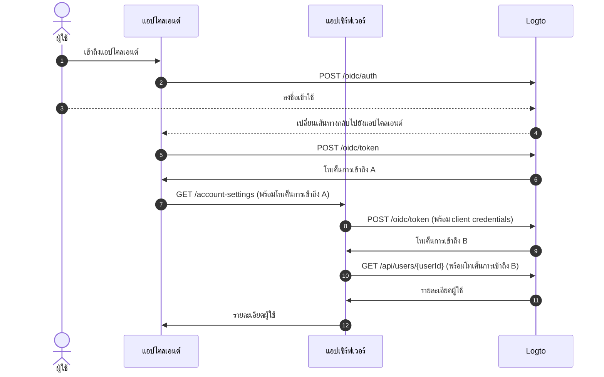
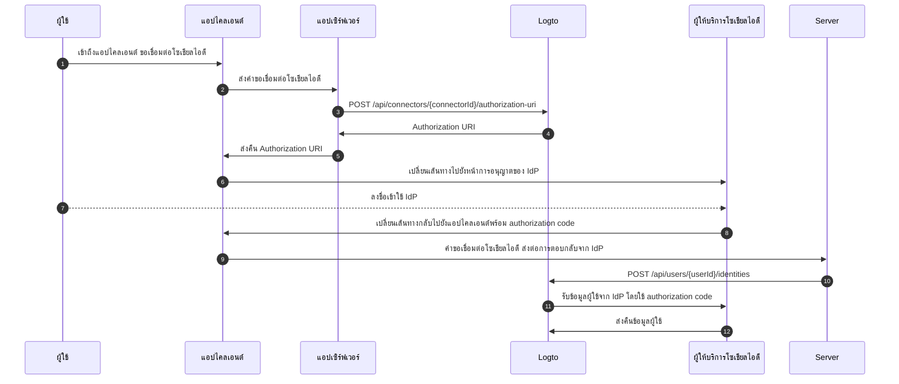

# การตั้งค่าบัญชีผู้ใช้ผ่าน Management API

## การเชื่อมต่อระบบ \{#integrations}

Logto มี Management API หลายรายการสำหรับจัดการบัญชีผู้ใช้ คุณสามารถใช้ API เหล่านี้เพื่อสร้างหน้าตั้งค่าบัญชีแบบบริการตนเองสำหรับผู้ใช้ปลายทาง

### สถาปัตยกรรม \{#architecture}

```mermaid
  graph TB
    A[ผู้ใช้] --> B[แอปพลิเคชันฝั่งไคลเอนต์]
    B -->|เรียก API ตั้งค่าบัญชีแบบโฮสต์เอง|C[แอปพลิเคชันฝั่งเซิร์ฟเวอร์]
    C -->|เรียก Management API| D[Logto]
```

1. **ผู้ใช้**: ผู้ใช้ปลายทางที่ได้รับการยืนยันตัวตนแล้วซึ่งต้องการเข้าถึงและจัดการการตั้งค่าบัญชีของตน
2. **แอปพลิเคชันฝั่งไคลเอนต์**: แอปพลิเคชันฝั่งไคลเอนต์ของคุณที่ให้บริการหน้าตั้งค่าบัญชีแก่ผู้ใช้
3. **แอปพลิเคชันฝั่งเซิร์ฟเวอร์**: แอปพลิเคชันฝั่งเซิร์ฟเวอร์ที่ให้บริการ API ตั้งค่าบัญชีแก่ไคลเอนต์ และเชื่อมต่อกับ Logto Management API
4. **Logto**: Logto ในฐานะบริการการยืนยันตัวตน (Authentication) และการอนุญาต (Authorization) ให้บริการ Management API สำหรับจัดการบัญชีผู้ใช้

### ลำดับขั้นตอน \{#sequence-diagram}

```mermaid
  sequenceDiagram
    autonumber
    actor User as ผู้ใช้
    participant Client as แอปไคลเอนต์
    participant Server as แอปเซิร์ฟเวอร์
    participant Logto as Logto

    User ->> Client: เข้าถึงแอปไคลเอนต์
    Client ->> Logto: POST /oidc/auth
    User -->> Logto: ลงชื่อเข้าใช้
    Logto -->> Client: เปลี่ยนเส้นทางกลับไปยังแอปไคลเอนต์
    Client ->> Logto: POST /oidc/token
    Logto ->> Client: โทเค็นการเข้าถึง A
    Client ->> Server: GET /account-settings (พร้อมโทเค็นการเข้าถึง A)
    Server ->> Logto: POST /oidc/token (พร้อม client credentials)
    Logto ->> Server: โทเค็นการเข้าถึง B
    Server ->> Logto: GET /api/users/{userId} (พร้อมโทเค็นการเข้าถึง B)
    Logto ->> Server: รายละเอียดผู้ใช้
    Server ->> Client: รายละเอียดผู้ใช้
```

1. ผู้ใช้เข้าถึงแอปพลิเคชันฝั่งไคลเอนต์
2. แอปไคลเอนต์ส่งคำขอการยืนยันตัวตน (Authentication request) ไปยัง Logto และเปลี่ยนเส้นทางผู้ใช้ไปยังหน้าลงชื่อเข้าใช้ของ Logto
3. ผู้ใช้ลงชื่อเข้าใช้ Logto
4. ผู้ใช้ที่ได้รับการยืนยันตัวตนแล้วจะถูกเปลี่ยนเส้นทางกลับไปยังแอปไคลเอนต์พร้อมโค้ดการอนุญาต (authorization code)
5. แอปไคลเอนต์ขอโทเค็นการเข้าถึง (Access token) จาก Logto สำหรับเข้าถึง API ตั้งค่าบัญชีแบบโฮสต์เอง
6. Logto ออกโทเค็นการเข้าถึงให้แอปไคลเอนต์
7. แอปไคลเอนต์ส่งคำขอตั้งค่าบัญชีไปยังแอปเซิร์ฟเวอร์พร้อมโทเค็นการเข้าถึงของผู้ใช้
8. แอปเซิร์ฟเวอร์ตรวจสอบตัวตนและสิทธิ์ของผู้ร้องขอจากโทเค็นการเข้าถึงของผู้ใช้ จากนั้นขอโทเค็นการเข้าถึง Management API จาก Logto
9. Logto ออกโทเค็นการเข้าถึง Management API ให้แอปเซิร์ฟเวอร์
10. แอปเซิร์ฟเวอร์ขอข้อมูลผู้ใช้จาก Logto โดยใช้โทเค็นการเข้าถึง Management API
11. Logto ตรวจสอบตัวตนของเซิร์ฟเวอร์และสิทธิ์ Management API แล้วส่งข้อมูลผู้ใช้กลับ
12. แอปเซิร์ฟเวอร์ประมวลผลข้อมูลผู้ใช้ตามสิทธิ์ของผู้ร้องขอและส่งรายละเอียดบัญชีผู้ใช้กลับไปยังแอปไคลเอนต์

### การเชื่อมต่อ Management API กับแอปฝั่งเซิร์ฟเวอร์ \{#integrate-management-api-to-server-side-application}

ดูหัวข้อ [Management API](/integrate-logto/interact-with-management-api/) เพื่อเรียนรู้วิธีเชื่อมต่อ Management API กับแอปพลิเคชันฝั่งเซิร์ฟเวอร์

## User Management APIs \{#user-management-apis}

### โครงสร้างข้อมูลผู้ใช้ \{#user-data-schema}

ดูหัวข้อ [ข้อมูลผู้ใช้และข้อมูลกำหนดเอง](/user-management/user-data/) เพื่อเรียนรู้เพิ่มเติมเกี่ยวกับโครงสร้างข้อมูลผู้ใช้ใน Logto

### Management API สำหรับโปรไฟล์และตัวระบุผู้ใช้ \{#user-profile-and-identifiers-management-apis}

โปรไฟล์และตัวระบุของผู้ใช้เป็นสิ่งสำคัญสำหรับการจัดการผู้ใช้ คุณสามารถใช้ API ต่อไปนี้เพื่อจัดการโปรไฟล์และตัวระบุของผู้ใช้

| method | path                                                                                                     | description                              |
| ------ | -------------------------------------------------------------------------------------------------------- | ---------------------------------------- |
| GET    | [/api/users/\{userId\}](https://openapi.logto.io/operation/operation-getuser)                            | รับรายละเอียดผู้ใช้ตาม user ID           |
| PATCH  | [/api/users/\{userId\}](https://openapi.logto.io/operation/operation-updateuser)                         | อัปเดตรายละเอียดผู้ใช้                   |
| PATCH  | [/api/users/\{userId\}/profile](https://openapi.logto.io/operation/operation-updateuserprofile)          | อัปเดตฟิลด์โปรไฟล์ผู้ใช้ตาม user ID      |
| GET    | [/api/users/\{userId\}/custom-data](https://openapi.logto.io/operation/operation-listusercustomdata)     | รับข้อมูลกำหนดเองของผู้ใช้ตาม user ID    |
| PATCH  | [/api/users/\{userId\}/custom-data](https://openapi.logto.io/operation/operation-updateusercustomdata)   | อัปเดตข้อมูลกำหนดเองของผู้ใช้ตาม user ID |
| PATCH  | [/api/users/\{userId\}/is-suspended](https://openapi.logto.io/operation/operation-updateuserissuspended) | อัปเดตสถานะระงับบัญชีผู้ใช้ตาม user ID   |

### การยืนยันอีเมลและหมายเลขโทรศัพท์ \{#email-and-phone-number-verification}

ในระบบ Logto ทั้งอีเมลและหมายเลขโทรศัพท์สามารถใช้เป็นตัวระบุผู้ใช้ได้ ดังนั้นการยืนยันจึงเป็นสิ่งสำคัญ เพื่อรองรับสิ่งนี้ เรามี API สำหรับรหัสยืนยันเพื่อช่วยยืนยันอีเมลหรือหมายเลขโทรศัพท์ที่ให้มา

:::note
โปรดตรวจสอบให้แน่ใจว่ายืนยันอีเมลหรือหมายเลขโทรศัพท์ก่อนอัปเดตโปรไฟล์ผู้ใช้ด้วยอีเมลหรือหมายเลขโทรศัพท์ใหม่
:::

| method | path                                                                                                                             | description                                  |
| ------ | -------------------------------------------------------------------------------------------------------------------------------- | -------------------------------------------- |
| POST   | [/api/verifications/verification-code](https://openapi.logto.io/operation/operation-createverificationbyverificationcode)        | ส่งรหัสยืนยันอีเมลหรือหมายเลขโทรศัพท์        |
| POST   | [/api/verifications/verification-code/verify](https://openapi.logto.io/operation/operation-verifyverificationbyverificationcode) | ยืนยันอีเมลหรือหมายเลขโทรศัพท์ด้วยรหัสยืนยัน |

### การจัดการรหัสผ่านผู้ใช้ \{#user-password-management}

| method | path                                                                                                     | description                                  |
| ------ | -------------------------------------------------------------------------------------------------------- | -------------------------------------------- |
| POST   | [/api/users/\{userId\}/password/verify](https://openapi.logto.io/operation/operation-verifyuserpassword) | ตรวจสอบรหัสผ่านปัจจุบันของผู้ใช้ตาม user ID  |
| PATCH  | [/api/users/\{userId\}/password](https://openapi.logto.io/operation/operation-updateuserpassword)        | อัปเดตรหัสผ่านผู้ใช้ตาม user ID              |
| GET    | [/api/users/\{userId\}/has-password](https://openapi.logto.io/operation/operation-getuserhaspassword)    | ตรวจสอบว่าผู้ใช้มีรหัสผ่านหรือไม่ตาม user ID |

:::note
โปรดตรวจสอบรหัสผ่านปัจจุบันของผู้ใช้ก่อนอัปเดตรหัสผ่านใหม่
:::

### การจัดการโซเชียลไอดีของผู้ใช้ \{#user-social-identities-management}

| method | path                                                                                                                              | description                                                                                          |
| ------ | --------------------------------------------------------------------------------------------------------------------------------- | ---------------------------------------------------------------------------------------------------- |
| GET    | [/api/users/\{userId\}](https://openapi.logto.io/operation/operation-getuser)                                                     | รับรายละเอียดผู้ใช้ตาม user ID โซเชียลไอดีจะอยู่ในฟิลด์ `identities`                                 |
| POST   | [/api/users/\{userId\}/identities](https://openapi.logto.io/operation/operation-createuseridentity)                               | เชื่อมต่อโซเชียลไอดีที่ได้รับการยืนยันกับผู้ใช้ตาม user ID                                           |
| DELETE | [/api/users/\{userId\}/identities](https://openapi.logto.io/operation/operation-deleteuseridentity)                               | ยกเลิกการเชื่อมต่อโซเชียลไอดีออกจากผู้ใช้ตาม user ID                                                 |
| PUT    | [/api/users/\{userId\}/identities](https://openapi.logto.io/operation/operation-replaceuseridentity)                              | อัปเดตโซเชียลไอดีที่เชื่อมต่อกับผู้ใช้โดยตรงตาม user ID                                              |
| POST   | [/api/connectors/\{connectorId\}/authorization-uri](https://openapi.logto.io/operation/operation-createconnectorauthorizationuri) | รับ authorization URI สำหรับผู้ให้บริการโซเชียลไอดี ใช้ URI นี้เพื่อเริ่มการเชื่อมต่อโซเชียลไอดีใหม่ |

```mermaid
sequenceDiagram
    autoNumber
    participant User as ผู้ใช้
    participant Client as แอปไคลเอนต์
    participant App as แอปเซิร์ฟเวอร์
    participant Logto as Logto
    participant IdP as ผู้ให้บริการโซเชียลไอดี

    User ->> Client: เข้าถึงแอปไคลเอนต์ ขอเชื่อมต่อโซเชียลไอดี
    Client ->> App: ส่งคำขอเชื่อมต่อโซเชียลไอดี
    App ->> Logto: POST /api/connectors/{connectorId}/authorization-uri
    Logto ->> App: Authorization URI
    App ->> Client: ส่งคืน Authorization URI
    Client ->> IdP: เปลี่ยนเส้นทางไปยังหน้าการอนุญาตของ IdP
    User -->> IdP: ลงชื่อเข้าใช้ IdP
    IdP ->> Client: เปลี่ยนเส้นทางกลับไปยังแอปไคลเอนต์พร้อม authorization code
    Client ->> Server: คำขอเชื่อมต่อโซเชียลไอดี ส่งต่อการตอบกลับจาก IdP
    Server ->> Logto: POST /api/users/{userId}/identities
    Logto ->> IdP: รับข้อมูลผู้ใช้จาก IdP โดยใช้ authorization code
    IdP ->> Logto: ส่งคืนข้อมูลผู้ใช้
```

1. ผู้ใช้เข้าถึงแอปไคลเอนต์และขอเชื่อมต่อโซเชียลไอดี
2. แอปไคลเอนต์ส่งคำขอไปยังเซิร์ฟเวอร์เพื่อเชื่อมต่อโซเชียลไอดี
3. เซิร์ฟเวอร์ส่งคำขอไปยัง Logto เพื่อขอ authorization URI สำหรับผู้ให้บริการโซเชียลไอดี คุณต้องระบุ `state` parameter และ `redirect_uri` ของคุณเองในคำขอ และต้องลงทะเบียน `redirect_uri` กับผู้ให้บริการโซเชียลไอดีล่วงหน้า
4. Logto ส่งคืน authorization URI ให้เซิร์ฟเวอร์
5. เซิร์ฟเวอร์ส่ง authorization URI กลับไปยังแอปไคลเอนต์
6. แอปไคลเอนต์เปลี่ยนเส้นทางผู้ใช้ไปยัง authorization URI ของ IdP
7. ผู้ใช้ลงชื่อเข้าใช้ IdP
8. IdP เปลี่ยนเส้นทางผู้ใช้กลับไปยังแอปไคลเอนต์โดยใช้ `redirect_uri` พร้อม authorization code
9. แอปไคลเอนต์ตรวจสอบ `state` และส่งต่อการตอบกลับจาก IdP ไปยังเซิร์ฟเวอร์
10. เซิร์ฟเวอร์ส่งคำขอไปยัง Logto เพื่อเชื่อมต่อโซเชียลไอดีกับผู้ใช้
11. Logto รับข้อมูลผู้ใช้จาก IdP โดยใช้ authorization code
12. IdP ส่งข้อมูลผู้ใช้กลับไปยัง Logto และ Logto เชื่อมต่อโซเชียลไอดีกับผู้ใช้

:::note
มีข้อจำกัดบางประการที่ควรพิจารณาเมื่อเชื่อมต่อโซเชียลไอดีใหม่กับผู้ใช้:

- Management API ไม่มี session context ใด ๆ ตัวเชื่อมต่อโซเชียลที่ต้องการ session ที่ใช้งานอยู่เพื่อรักษาสถานะการยืนยันตัวตนโซเชียลอย่างปลอดภัยจะไม่สามารถเชื่อมต่อผ่าน Management API ได้ ตัวเชื่อมต่อที่ไม่รองรับได้แก่ apple, OIDC มาตรฐาน และ OAuth 2.0 มาตรฐาน
- ด้วยเหตุผลเดียวกัน Logto ไม่สามารถตรวจสอบ `state` parameter ในการตอบกลับการอนุญาตได้ โปรดเก็บ `state` parameter ในแอปไคลเอนต์ของคุณและตรวจสอบเมื่อได้รับการตอบกลับการอนุญาต
- คุณต้องลงทะเบียน `redirect_uri` กับผู้ให้บริการโซเชียลไอดีล่วงหน้า มิฉะนั้น IdP จะไม่เปลี่ยนเส้นทางผู้ใช้กลับไปยังแอปไคลเอนต์ของคุณ IdP ของคุณต้องรองรับ callback `redirect_uri` มากกว่าหนึ่งรายการ ได้แก่ สำหรับการลงชื่อเข้าใช้ และสำหรับหน้าผูกโปรไฟล์ของคุณเอง

:::

### การจัดการไอดีองค์กรของผู้ใช้ \{#user-enterprise-identities-management}

| method | path                                                                                                    | description                                                                                                                                                        |
| ------ | ------------------------------------------------------------------------------------------------------- | ------------------------------------------------------------------------------------------------------------------------------------------------------------------ |
| GET    | [/api/users/\{userId\}?includeSsoIdentities=true](https://openapi.logto.io/operation/operation-getuser) | รับรายละเอียดผู้ใช้ตาม user ID ไอดีองค์กรจะอยู่ในฟิลด์ `ssoIdentities` เพิ่ม query parameter `includeSsoIdentities=true` ใน API รายละเอียดผู้ใช้เพื่อแสดงข้อมูลนี้ |

ขณะนี้ Management API ยังไม่รองรับการเชื่อมหรือยกเลิกการเชื่อมไอดีองค์กรกับผู้ใช้ คุณสามารถแสดงเฉพาะไอดีองค์กรที่เชื่อมกับผู้ใช้เท่านั้น

### Personal access token \{#personal-access-token}

| method | path                                                                                                                                 | description                                |
| ------ | ------------------------------------------------------------------------------------------------------------------------------------ | ------------------------------------------ |
| GET    | [/api/users/\{userId\}/personal-access-tokens](https://openapi.logto.io/operation/operation-listuserpersonalaccesstokens)            | รับ personal access token ทั้งหมดของผู้ใช้ |
| POST   | [/api/users/\{userId\}/personal-access-tokens](https://openapi.logto.io/operation/operation-createuserpersonalaccesstoken)           | เพิ่ม personal access token ใหม่ให้ผู้ใช้  |
| DELETE | [/api/users/\{userId\}/personal-access-tokens/\{name\}](https://openapi.logto.io/operation/operation-deleteuserpersonalaccesstoken)  | ลบโทเค็นของผู้ใช้ตามชื่อ                   |
| PATCH  | [/api/users/\{userId\s}/personal-access-tokens/\{name\}](https://openapi.logto.io/operation/operation-updateuserpersonalaccesstoken) | อัปเดตโทเค็นของผู้ใช้ตามชื่อ               |

Personal access token เป็นวิธีที่ปลอดภัยสำหรับผู้ใช้ในการให้ [โทเค็นการเข้าถึง (Access token)](https://auth.wiki/access-token) โดยไม่ต้องใช้ข้อมูลรับรองหรือการลงชื่อเข้าใช้แบบโต้ตอบ ดูเพิ่มเติมเกี่ยวกับ [การใช้ personal access token](/user-management/personal-access-token)

### การจัดการการตั้งค่า MFA ของผู้ใช้ \{#user-mfa-settings-management}

| method | path                                                                                                                                 | description                            |
| ------ | ------------------------------------------------------------------------------------------------------------------------------------ | -------------------------------------- |
| GET    | [/api/users/\{userId\}/mfa-verifications](https://openapi.logto.io/operation/operation-listusermfaverifications)                     | รับการตั้งค่า MFA ของผู้ใช้ตาม user ID |
| POST   | [/api/users/\{userId\}/mfa-verifications](https://openapi.logto.io/operation/operation-createusermfaverification)                    | ตั้งค่า MFA ให้ผู้ใช้ตาม user ID       |
| DELETE | [/api/users/\{userId\}/mfa-verifications/\{verificationId\}](https://openapi.logto.io/operation/operation-deleteusermfaverification) | ลบการยืนยัน MFA ของผู้ใช้ตาม ID        |

### การลบบัญชีผู้ใช้ \{#user-account-deletion}

| method | path                                                                             | description              |
| ------ | -------------------------------------------------------------------------------- | ------------------------ |
| DELETE | [/api/users/\{userId\}](https://openapi.logto.io/operation/operation-deleteuser) | ลบบัญชีผู้ใช้ตาม user ID |

### การจัดการเซสชันของผู้ใช้ \{#user-session-management}

| method | path                                                                                                           | description                      |
| ------ | -------------------------------------------------------------------------------------------------------------- | -------------------------------- |
| GET    | [/api/users/\{userId\}/sessions](https://openapi.logto.io/operation/operation-listusersessions)                | รับเซสชันของผู้ใช้ตาม user ID    |
| GET    | [/api/users/\{userId\}/sessions/\{sessionId\}](https://openapi.logto.io/operation/operation-getusersession)    | รับเซสชันของผู้ใช้ตาม session ID |
| DELETE | [/api/users/\{userId\}/sessions/\{sessionId\}](https://openapi.logto.io/operation/operation-deleteusersession) | ลบเซสชันของผู้ใช้ตาม session ID  |
