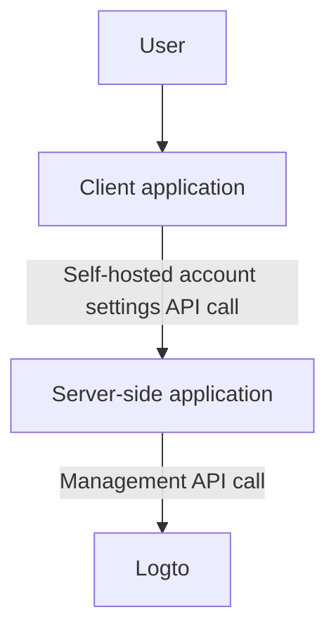
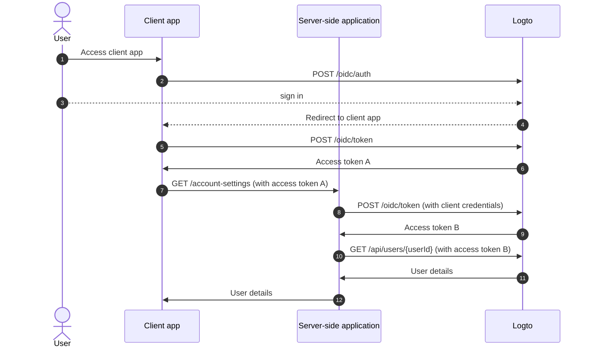
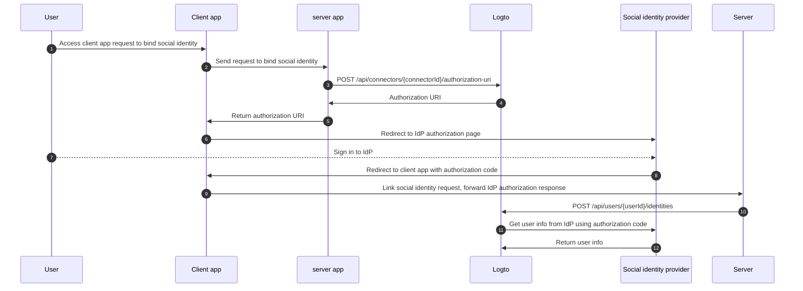

# การตั้งค่าบัญชีโดย Management API

## การผสานรวม \{#integrations}

Logto มี Management API หลายตัวเพื่อจัดการบัญชีผู้ใช้ คุณสามารถใช้ API เหล่านี้เพื่อสร้างหน้าการตั้งค่าบัญชีที่ผู้ใช้สามารถจัดการได้ด้วยตนเอง

### สถาปัตยกรรม \{#architecture}

```mermaid
  graph TB
    A[User] --> B[Client application]
    B -->|Self-hosted account settings API call|C[Server-side application]
    C -->|Management API call| D[Logto]
```

1. **User**: ผู้ใช้ที่ได้รับการยืนยันตัวตนซึ่งต้องการเข้าถึงและจัดการการตั้งค่าบัญชีของตน
2. **Client application**: แอปพลิเคชันของคุณที่ให้บริการหน้าการตั้งค่าบัญชีแก่ผู้ใช้
3. **Server-side application**: แอปพลิเคชันฝั่งเซิร์ฟเวอร์ที่ให้บริการ API การตั้งค่าบัญชีแก่ไคลเอนต์ ทำงานร่วมกับ Logto Management API
4. **Logto**: Logto ในฐานะบริการการยืนยันตัวตนและการอนุญาต ให้บริการ Management API เพื่อจัดการบัญชีผู้ใช้

### แผนภาพลำดับ \{#sequence-diagram}

```mermaid
  sequenceDiagram
    autonumber
    actor User as User
    participant Client as Client app
    participant Server as Server-side application
    participant Logto as Logto

    User ->> Client: Access client app
    Client ->> Logto: POST /oidc/auth
    User -->> Logto: sign in
    Logto -->> Client: Redirect to client app
    Client ->> Logto: POST /oidc/token
    Logto ->> Client: Access token A
    Client ->> Server: GET /account-settings (with access token A)
    Server ->> Logto: POST /oidc/token (with client credentials)
    Logto ->> Server: Access token B
    Server ->> Logto: GET /api/users/{userId} (with access token B)
    Logto ->> Server: User details
    Server ->> Client: User details
```

1. ผู้ใช้เข้าถึงแอปพลิเคชันไคลเอนต์
2. แอปพลิเคชันไคลเอนต์ส่งคำขอการยืนยันตัวตนไปยัง Logto และเปลี่ยนเส้นทางผู้ใช้ไปยังหน้าลงชื่อเข้าใช้ของ Logto
3. ผู้ใช้ลงชื่อเข้าใช้ Logto
4. ผู้ใช้ที่ได้รับการยืนยันตัวตนจะถูกเปลี่ยนเส้นทางกลับไปยังแอปพลิเคชันไคลเอนต์พร้อมรหัสการอนุญาต
5. แอปพลิเคชันไคลเอนต์ขอโทเค็นการเข้าถึงจาก Logto สำหรับการเข้าถึง API การตั้งค่าบัญชีที่โฮสต์เอง
6. Logto ให้โทเค็นการเข้าถึงแก่แอปพลิเคชันไคลเอนต์
7. แอปพลิเคชันไคลเอนต์ส่งคำขอการตั้งค่าบัญชีไปยังแอปพลิเคชันฝั่งเซิร์ฟเวอร์พร้อมโทเค็นการเข้าถึงของผู้ใช้
8. แอปพลิเคชันฝั่งเซิร์ฟเวอร์ตรวจสอบตัวตนและสิทธิ์ของผู้ร้องขอจากโทเค็นการเข้าถึงของผู้ใช้ จากนั้นขอโทเค็นการเข้าถึง Management API จาก Logto
9. Logto ให้โทเค็นการเข้าถึง Management API แก่แอปพลิเคชันฝั่งเซิร์ฟเวอร์
10. แอปพลิเคชันฝั่งเซิร์ฟเวอร์ขอข้อมูลผู้ใช้จาก Logto โดยใช้โทเค็นการเข้าถึง Management API
11. Logto ตรวจสอบตัวตนของเซิร์ฟเวอร์และสิทธิ์ Management API และส่งคืนข้อมูลผู้ใช้
12. แอปพลิเคชันฝั่งเซิร์ฟเวอร์ประมวลผลข้อมูลผู้ใช้ตามสิทธิ์ของผู้ร้องขอและส่งคืนรายละเอียดบัญชีผู้ใช้ไปยังแอปพลิเคชันไคลเอนต์

### การผสานรวม Management API กับแอปพลิเคชันฝั่งเซิร์ฟเวอร์ \{#integrate-management-api-to-server-side-application}

ตรวจสอบส่วน [Management API](/integrate-logto/interact-with-management-api/) เพื่อเรียนรู้วิธีผสานรวม Management API กับแอปพลิเคชันฝั่งเซิร์ฟเวอร์

## User Management APIs \{#user-management-apis}

### โครงสร้างข้อมูลผู้ใช้ \{#user-data-schema}

ตรวจสอบส่วน [ข้อมูลผู้ใช้และข้อมูลที่กำหนดเอง](/user-management/user-data/) เพื่อเรียนรู้เพิ่มเติมเกี่ยวกับโครงสร้างข้อมูลผู้ใช้ใน Logto

### User profile และ Identifiers Management APIs \{#user-profile-and-identifiers-management-apis}

โปรไฟล์และตัวระบุของผู้ใช้มีความสำคัญสำหรับการจัดการผู้ใช้ คุณสามารถใช้ API ต่อไปนี้เพื่อจัดการโปรไฟล์และตัวระบุของผู้ใช้

| method | path                                                                                                     | description                                 |
| ------ | -------------------------------------------------------------------------------------------------------- | ------------------------------------------- |
| GET    | [/api/users/\{userId\}](https://openapi.logto.io/operation/operation-getuser)                            | รับรายละเอียดผู้ใช้โดย user ID              |
| PATCH  | [/api/users/\{userId\}](https://openapi.logto.io/operation/operation-updateuser)                         | อัปเดตรายละเอียดผู้ใช้                      |
| PATCH  | [/api/users/\{userId\}/profile](https://openapi.logto.io/operation/operation-updateuserprofile)          | อัปเดตฟิลด์โปรไฟล์ผู้ใช้โดย user ID         |
| GET    | [/api/users/\{userId\}/custom-data](https://openapi.logto.io/operation/operation-listusercustomdata)     | รับข้อมูลที่กำหนดเองของผู้ใช้โดย user ID    |
| PATCH  | [/api/users/\{userId\}/custom-data](https://openapi.logto.io/operation/operation-updateusercustomdata)   | อัปเดตข้อมูลที่กำหนดเองของผู้ใช้โดย user ID |
| PATCH  | [/api/users/\{userId\}/is-suspended](https://openapi.logto.io/operation/operation-updateuserissuspended) | อัปเดตสถานะการระงับของผู้ใช้โดย user ID     |

### การยืนยันอีเมลและหมายเลขโทรศัพท์ \{#email-and-phone-number-verification}

ในระบบ Logto ทั้งที่อยู่อีเมลและหมายเลขโทรศัพท์สามารถทำหน้าที่เป็นตัวระบุผู้ใช้ได้ การยืนยันจึงเป็นสิ่งสำคัญ เพื่อสนับสนุนสิ่งนี้ เรามีชุด API รหัสยืนยันเพื่อช่วยยืนยันอีเมลหรือหมายเลขโทรศัพท์ที่ให้มา

:::note
ตรวจสอบให้แน่ใจว่าได้ยืนยันอีเมลหรือหมายเลขโทรศัพท์ก่อนที่จะอัปเดตโปรไฟล์ผู้ใช้ด้วยอีเมลหรือหมายเลขโทรศัพท์ใหม่
:::

| method | path                                                                                                                             | description                                 |
| ------ | -------------------------------------------------------------------------------------------------------------------------------- | ------------------------------------------- |
| POST   | [/api/verifications/verification-code](https://openapi.logto.io/operation/operation-createverificationbyverificationcode)        | ส่งรหัสยืนยันอีเมลหรือหมายเลขโทรศัพท์       |
| POST   | [/api/verifications/verification-code/verify](https://openapi.logto.io/operation/operation-verifyverificationbyverificationcode) | ยืนยันอีเมลหรือหมายเลขโทรศัพท์โดยรหัสยืนยัน |

### การจัดการรหัสผ่านผู้ใช้ \{#user-password-management}

| method | path                                                                                                     | description                                   |
| ------ | -------------------------------------------------------------------------------------------------------- | --------------------------------------------- |
| POST   | [/api/users/\{userId\}/password/verify](https://openapi.logto.io/operation/operation-verifyuserpassword) | ยืนยันรหัสผ่านปัจจุบันของผู้ใช้โดย user ID    |
| PATCH  | [/api/users/\{userId\}/password](https://openapi.logto.io/operation/operation-updateuserpassword)        | อัปเดตรหัสผ่านผู้ใช้โดย user ID               |
| GET    | [/api/users/\{userId\}/has-password](https://openapi.logto.io/operation/operation-getuserhaspassword)    | ตรวจสอบว่าผู้ใช้มีรหัสผ่านโดย user ID หรือไม่ |

:::note
ตรวจสอบให้แน่ใจว่าได้ยืนยันรหัสผ่านปัจจุบันของผู้ใช้ก่อนที่จะอัปเดตรหัสผ่านของผู้ใช้
:::

### การจัดการอัตลักษณ์โซเชียลของผู้ใช้ \{#user-social-identities-management}

| method | path                                                                                                                              | description                                                                                               |
| ------ | --------------------------------------------------------------------------------------------------------------------------------- | --------------------------------------------------------------------------------------------------------- |
| GET    | [/api/users/\{userId\}](https://openapi.logto.io/operation/operation-getuser)                                                     | รับรายละเอียดผู้ใช้โดย user ID อัตลักษณ์โซเชียลสามารถพบได้ในฟิลด์ `identities`                            |
| POST   | [/api/users/\{userId\}/identities](https://openapi.logto.io/operation/operation-createuseridentity)                               | เชื่อมโยงอัตลักษณ์โซเชียลที่ได้รับการยืนยันกับผู้ใช้โดย user ID                                           |
| DELETE | [/api/users/\{userId\}/identities](https://openapi.logto.io/operation/operation-deleteuseridentity)                               | ยกเลิกการเชื่อมโยงอัตลักษณ์โซเชียลจากผู้ใช้โดย user ID                                                    |
| PUT    | [/api/users/\{userId\}/identities](https://openapi.logto.io/operation/operation-replaceuseridentity)                              | อัปเดตอัตลักษณ์โซเชียลที่เชื่อมโยงกับผู้ใช้โดย user ID โดยตรง                                             |
| POST   | [/api/connectors/\{connectorId\}/authorization-uri](https://openapi.logto.io/operation/operation-createconnectorauthorizationuri) | รับ URI การอนุญาตสำหรับผู้ให้บริการอัตลักษณ์โซเชียล ใช้ URI นี้เพื่อเริ่มการเชื่อมต่ออัตลักษณ์โซเชียลใหม่ |

```mermaid
sequenceDiagram
    autoNumber
    participant User as User
    participant Client as Client app
    participant App as server app
    participant Logto as Logto
    participant IdP as Social identity provider

    User ->> Client: Access client app request to bind social identity
    Client ->> App: Send request to bind social identity
    App ->> Logto: POST /api/connectors/{connectorId}/authorization-uri
    Logto ->> App: Authorization URI
    App ->> Client: Return authorization URI
    Client ->> IdP: Redirect to IdP authorization page
    User -->> IdP: Sign in to IdP
    IdP ->> Client: Redirect to client app with authorization code
    Client ->> Server: Link social identity request, forward IdP authorization response
    Server ->> Logto: POST /api/users/{userId}/identities
    Logto ->> IdP: Get user info from IdP using authorization code
    IdP ->> Logto: Return user info
```

1. ผู้ใช้เข้าถึงแอปพลิเคชันไคลเอนต์และขอเชื่อมโยงอัตลักษณ์โซเชียล
2. แอปพลิเคชันไคลเอนต์ส่งคำขอไปยังเซิร์ฟเวอร์เพื่อเชื่อมโยงอัตลักษณ์โซเชียล
3. เซิร์ฟเวอร์ส่งคำขอไปยัง Logto เพื่อรับ URI การอนุญาตสำหรับผู้ให้บริการอัตลักษณ์โซเชียล คุณต้องระบุพารามิเตอร์ `state` และ `redirect_uri` ของคุณเองในคำขอ ตรวจสอบให้แน่ใจว่าได้ลงทะเบียน `redirect_uri` ในผู้ให้บริการอัตลักษณ์โซเชียล
4. Logto ส่งคืน URI การอนุญาตไปยังเซิร์ฟเวอร์
5. เซิร์ฟเวอร์ส่งคืน URI การอนุญาตไปยังแอปพลิเคชันไคลเอนต์
6. แอปพลิเคชันไคลเอนต์เปลี่ยนเส้นทางผู้ใช้ไปยัง URI การอนุญาตของ IdP
7. ผู้ใช้ลงชื่อเข้าใช้ IdP
8. IdP เปลี่ยนเส้นทางผู้ใช้กลับไปยังแอปพลิเคชันไคลเอนต์โดยใช้ `redirect_uri` พร้อมรหัสการอนุญาต
9. แอปพลิเคชันไคลเอนต์ตรวจสอบ `state` และส่งต่อการตอบสนองการอนุญาตของ IdP ไปยังเซิร์ฟเวอร์
10. เซิร์ฟเวอร์ส่งคำขอไปยัง Logto เพื่อเชื่อมโยงอัตลักษณ์โซเชียลกับผู้ใช้
11. Logto รับข้อมูลผู้ใช้จาก IdP โดยใช้รหัสการอนุญาต
12. IdP ส่งคืนข้อมูลผู้ใช้ไปยัง Logto และ Logto เชื่อมโยงอัตลักษณ์โซเชียลกับผู้ใช้

:::note
มีข้อจำกัดบางประการที่ต้องพิจารณาเมื่อเชื่อมโยงอัตลักษณ์โซเชียลใหม่กับผู้ใช้:

- Management API ไม่มีบริบทเซสชันใด ๆ ตัวเชื่อมต่อโซเชียลใด ๆ ที่ต้องการเซสชันที่ใช้งานอยู่เพื่อรักษาสถานะการยืนยันตัวตนโซเชียลอย่างปลอดภัยไม่สามารถเชื่อมโยงผ่าน Management API ได้ ตัวเชื่อมต่อที่ไม่รองรับรวมถึง apple, OIDC มาตรฐาน และตัวเชื่อมต่อ OAuth 2.0 มาตรฐาน
- ด้วยเหตุผลเดียวกัน Logto ไม่สามารถตรวจสอบพารามิเตอร์ `state` ในการตอบสนองการอนุญาตได้ ตรวจสอบให้แน่ใจว่าได้จัดเก็บพารามิเตอร์ `state` ในแอปไคลเอนต์ของคุณและตรวจสอบเมื่อได้รับการตอบสนองการอนุญาต
- คุณต้องลงทะเบียน `redirect_uri` กับผู้ให้บริการอัตลักษณ์โซเชียลล่วงหน้า มิฉะนั้น IdP โซเชียลจะไม่เปลี่ยนเส้นทางผู้ใช้กลับไปยังแอปไคลเอนต์ของคุณ IdP โซเชียลของคุณต้องยอมรับ `redirect_uri` การเรียกกลับมากกว่าหนึ่งรายการ หนึ่งสำหรับการลงชื่อเข้าใช้ผู้ใช้ หนึ่งสำหรับหน้าการเชื่อมโยงโปรไฟล์ของคุณเอง

:::

### การจัดการอัตลักษณ์องค์กรของผู้ใช้ \{#user-enterprise-identities-management}

| method | path                                                                                                    | description                                                                                                                                                                          |
| ------ | ------------------------------------------------------------------------------------------------------- | ------------------------------------------------------------------------------------------------------------------------------------------------------------------------------------ |
| GET    | [/api/users/\{userId\}?includeSsoIdentities=true](https://openapi.logto.io/operation/operation-getuser) | รับรายละเอียดผู้ใช้โดย user ID อัตลักษณ์องค์กรสามารถพบได้ในฟิลด์ `ssoIdentities` เพิ่มพารามิเตอร์การค้นหา `includeSsoIdentities=true` ใน API รายละเอียดผู้ใช้เพื่อรวมอัตลักษณ์องค์กร |

ปัจจุบัน Management API ไม่รองรับการเชื่อมโยงหรือยกเลิกการเชื่อมโยงอัตลักษณ์องค์กรกับผู้ใช้ คุณสามารถแสดงอัตลักษณ์องค์กรที่เชื่อมโยงกับผู้ใช้ได้เท่านั้น

### โทเค็นการเข้าถึงส่วนบุคคล \{#personal-access-token}

| method | path                                                                                                                                 | description                                     |
| ------ | ------------------------------------------------------------------------------------------------------------------------------------ | ----------------------------------------------- |
| GET    | [/api/users/\{userId\}/personal-access-tokens](https://openapi.logto.io/operation/operation-listuserpersonalaccesstokens)            | รับโทเค็นการเข้าถึงส่วนบุคคลทั้งหมดสำหรับผู้ใช้ |
| POST   | [/api/users/\{userId\}/personal-access-tokens](https://openapi.logto.io/operation/operation-createuserpersonalaccesstoken)           | เพิ่มโทเค็นการเข้าถึงส่วนบุคคลใหม่สำหรับผู้ใช้  |
| DELETE | [/api/users/\{userId\}/personal-access-tokens/\{name\}](https://openapi.logto.io/operation/operation-deleteuserpersonalaccesstoken)  | ลบโทเค็นสำหรับผู้ใช้โดยชื่อ                     |
| PATCH  | [/api/users/\{userId\s}/personal-access-tokens/\{name\}](https://openapi.logto.io/operation/operation-updateuserpersonalaccesstoken) | อัปเดตโทเค็นสำหรับผู้ใช้โดยชื่อ                 |

โทเค็นการเข้าถึงส่วนบุคคลให้วิธีที่ปลอดภัยสำหรับผู้ใช้ในการให้ [โทเค็นการเข้าถึง (Access token)](https://auth.wiki/access-token) โดยไม่ต้องใช้ข้อมูลประจำตัวและการลงชื่อเข้าใช้แบบโต้ตอบ เรียนรู้เพิ่มเติมเกี่ยวกับ [การใช้โทเค็นการเข้าถึงส่วนบุคคล](/user-management/personal-access-token)

### การจัดการการตั้งค่า MFA ของผู้ใช้ \{#user-mfa-settings-management}

| method | path                                                                                                                                 | description                                    |
| ------ | ------------------------------------------------------------------------------------------------------------------------------------ | ---------------------------------------------- |
| GET    | [/api/users/\{userId\}/mfa-verifications](https://openapi.logto.io/operation/operation-listusermfaverifications)                     | รับการตั้งค่า MFA ของผู้ใช้โดย user ID         |
| POST   | [/api/users/\{userId\}/mfa-verifications](https://openapi.logto.io/operation/operation-createusermfaverification)                    | ตั้งค่าการยืนยันตัวตน MFA ของผู้ใช้โดย user ID |
| DELETE | [/api/users/\{userId\}/mfa-verifications/\{verificationId\}](https://openapi.logto.io/operation/operation-deleteusermfaverification) | ลบการยืนยันตัวตน MFA ของผู้ใช้โดย ID           |

### การลบบัญชีผู้ใช้ \{#user-account-deletion}

| method | path                                                                             | description         |
| ------ | -------------------------------------------------------------------------------- | ------------------- |
| DELETE | [/api/users/\{userId\}](https://openapi.logto.io/operation/operation-deleteuser) | ลบผู้ใช้โดย user ID |

### การจัดการเซสชันผู้ใช้ \{#user-session-management}

| method | path                                                                                                           | description                   |
| ------ | -------------------------------------------------------------------------------------------------------------- | ----------------------------- |
| GET    | [/api/users/\{userId\}/sessions](https://openapi.logto.io/operation/operation-listusersessions)                | รับเซสชันผู้ใช้โดย user ID    |
| GET    | [/api/users/\{userId\}/sessions/\{sessionId\}](https://openapi.logto.io/operation/operation-getusersession)    | รับเซสชันผู้ใช้โดย session ID |
| DELETE | [/api/users/\{userId\}/sessions/\{sessionId\}](https://openapi.logto.io/operation/operation-deleteusersession) | ลบเซสชันผู้ใช้โดย session ID  |

### การจัดการแอปที่ได้รับอนุญาตของผู้ใช้ (grants) \{#manage-user-authorized-apps-grants}

| method | path                                                                                                     | description                                     |
| ------ | -------------------------------------------------------------------------------------------------------- | ----------------------------------------------- |
| GET    | [/api/users/\{userId\}/grants](https://openapi.logto.io/operation/operation-listusergrants)              | แสดงรายการการอนุญาตแอปที่ใช้งานอยู่สำหรับผู้ใช้ |
| DELETE | [/api/users/\{userId\}/grants/\{grantId\}](https://openapi.logto.io/operation/operation-deleteusergrant) | ยกเลิกการอนุญาตแอปเฉพาะโดย ID                   |

พารามิเตอร์การค้นหาเพิ่มเติมสำหรับการแสดงรายการการอนุญาต:

- `appType=firstParty`: แสดงเฉพาะการอนุญาตแอป first-party
- `appType=thirdParty`: แสดงเฉพาะการอนุญาตแอป third-party
- ละเว้น `appType`: แสดงการอนุญาตที่ใช้งานอยู่ทั้งหมด

เมื่อการอนุญาตถูกยกเลิก โทเค็นการเข้าถึงทึบและโทเค็นรีเฟรชที่ออกก่อนหน้านี้สำหรับการอนุญาตนั้นจะถูกทำให้เป็นโมฆะ
