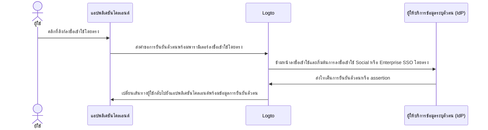

# การลงชื่อเข้าใช้โดยตรง

การลงชื่อเข้าใช้โดยตรงเป็น [พารามิเตอร์การยืนยันตัวตน](/end-user-flows/authentication-parameters) เฉพาะของ Logto ที่ช่วยให้คุณเริ่มต้นการลงชื่อเข้าใช้โซเชียลหรือ Enterprise SSO ได้โดยตรง โดยข้ามหน้าลงชื่อเข้าใช้ Logto แบบปกติ

ฟีเจอร์นี้มีประโยชน์อย่างยิ่งหากคุณมีหน้าลงชื่อเข้าใช้แบบกำหนดเองหรือจุดเริ่มต้นเข้าสู่ระบบ IdP ฝังอยู่ในเว็บไซต์ของคุณ (ดูกรณีการใช้งาน) ด้วยการใช้การลงชื่อเข้าใช้โดยตรง คุณสามารถเปลี่ยนเส้นทางผู้ใช้ไปยังหน้าลงชื่อเข้าใช้ของ IdP ได้โดยตรง



## การลงชื่อเข้าใช้โซเชียล \{#social-sign-in}

ส่งพารามิเตอร์ `direct_sign_in` พร้อมค่า `social:<idp-name>` เพื่อเริ่มต้นกระบวนการลงชื่อเข้าใช้โซเชียลโดยตรง

### วิธีค้นหาชื่อ IdP ของตัวเชื่อมต่อ \{#where-to-find-the-connector-idp-name}

1. ไปที่ <CloudLink to="/connectors/social">Console > Connectors > Social connectors</CloudLink>
2. คลิกที่ [ตัวเชื่อมต่อโซเชียล](/connectors/social-connectors) ที่คุณต้องการใช้
3. ค้นหาชื่อผู้ให้บริการข้อมูลระบุตัวตน (IdP) ที่ด้านบนของหน้าการตั้งค่าตัวเชื่อมต่อ


### ตัวอย่าง \{#example}

สร้าง URL คำขอการยืนยันตัวตนของคุณเองโดยใช้พารามิเตอร์ `direct_sign_in`:

```sh
curl --location \
  --request GET 'https://[tenant-id].logto.app/oidc/auth?client_id=1234567890&...&direct_sign_in=social:google'
```

ใน Logto SDK ที่รองรับ คุณสามารถตั้งค่าพารามิเตอร์ `directSignIn` เมื่อเรียกใช้เมธอด `signIn` ได้ดังนี้:

```javascript
const authResult = await logto.signIn({
  redirectUri: 'https://your-app.com/callback',
  directSignIn: 'social:google',
});
```

## Enterprise SSO \{#enterprise-sso}

ส่งพารามิเตอร์ `direct_sign_in` พร้อมค่า `sso:<connector-id>` เพื่อเริ่มต้นกระบวนการลงชื่อเข้าใช้ Enterprise SSO โดยตรง

### วิธีค้นหา Connector ID ของ Enterprise SSO \{#where-to-find-the-enterprise-sso-connector-id}

1. ไปที่ <CloudLink to="/enterprise-sso">Console > Enterprise SSO</CloudLink>
2. คลิกที่ [ตัวเชื่อมต่อองค์กร](/connectors/enterprise-connectors) ที่คุณต้องการใช้
3. ค้นหา Connector ID ที่ด้านบนของหน้าการตั้งค่าตัวเชื่อมต่อ


### ตัวอย่าง \{#example-1}

สร้าง URL คำขอการยืนยันตัวตนของคุณเองโดยใช้พารามิเตอร์ `direct_sign_in`:

```sh
curl --location \
  --request GET 'https://[tenant-id].logto.app/oidc/auth?client_id=1234567890&...&direct_sign_in=sso:1234567890'
```

ใน Logto SDK ที่รองรับ คุณสามารถตั้งค่าพารามิเตอร์ `directSignIn` เมื่อเรียกใช้เมธอด `signIn` ได้ดังนี้:

```javascript
logtoClient.signIn({
  redirectUri: 'https://your-app.com/callback',
  directSignIn: 'sso:1234567890',
});
```

## กลับไปยังหน้าลงชื่อเข้าใช้ปกติ \{#fallback-to-the-sign-in-page}

หากกระบวนการลงชื่อเข้าใช้โดยตรงล้มเหลว เช่น ไม่พบตัวเชื่อมต่อหรือไม่ได้เปิดใช้งาน ผู้ใช้จะถูกเปลี่ยนเส้นทางไปยังหน้าลงชื่อเข้าใช้มาตรฐาน

:::note
เรากำลังทยอยเพิ่มการรองรับพารามิเตอร์ direct_sign_in ให้กับ Logto SDK ทุกตัว หากคุณไม่พบใน SDK ของคุณ กรุณาแจ้งปัญหาหรือ ติดต่อเรา
:::

## คำถามที่พบบ่อย \{#faqs}

<details>
  <summary>

### การลงชื่อเข้าใช้โดยตรงเหมือนกับการยืนยันตัวตนผ่าน API หรือไม่ \{#is-direct-sign-in-the-same-as-api-authentication}

</summary>

ไม่ใช่ การลงชื่อเข้าใช้โดยตรงเป็นพารามิเตอร์ของ user flow ที่ช่วยให้คุณข้ามหน้าลงชื่อเข้าใช้ Logto แบบปกติและเปลี่ยนเส้นทางผู้ใช้ไปยังหน้าลงชื่อเข้าใช้ของผู้ให้บริการโซเชียลหรือ Enterprise SSO ได้โดยตรง แตกต่างจากการยืนยันตัวตนผ่าน API ผู้ใช้ยังคงต้องถูกเปลี่ยนเส้นทางไปยัง endpoint การยืนยันตัวตนของ Logto ก่อนเพื่อเริ่มกระบวนการลงชื่อเข้าใช้

</details>
