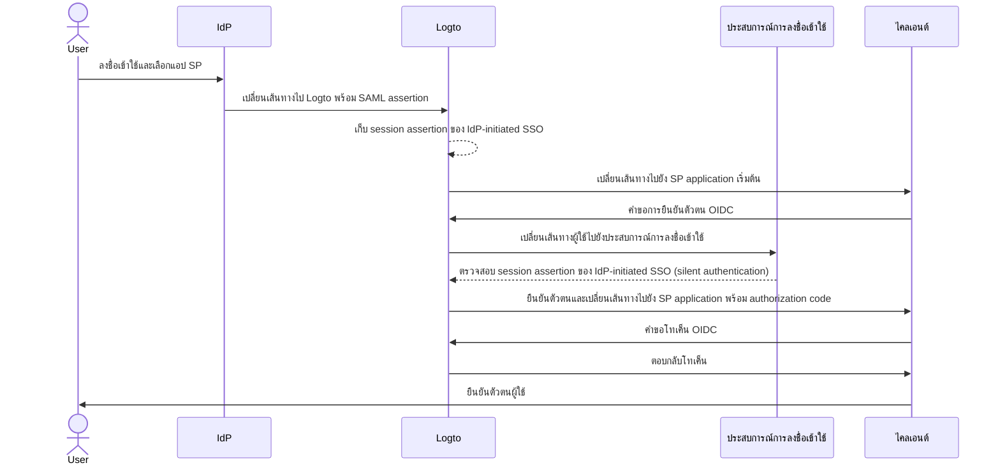
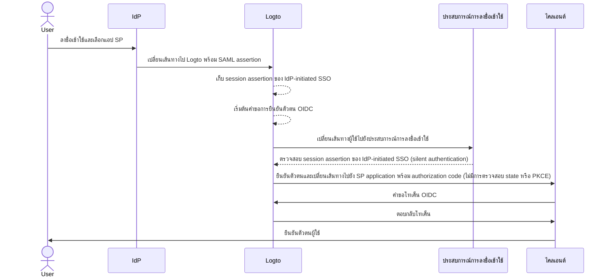

import Availability from '@components/Availability';

<Availability cloud="comingSoon" oss={false} />

# IdP-initiated SSO (SAML เท่านั้น)

IdP-initiated SSO คือกระบวนการ Single Sign-On ที่ผู้ให้บริการข้อมูลระบุตัวตน (Identity provider; IdP) เป็นผู้ควบคุมขั้นตอนการยืนยันตัวตนหลัก กระบวนการนี้เริ่มต้นเมื่อผู้ใช้ลงชื่อเข้าใช้แพลตฟอร์มของ IdP เช่น พอร์ทัลของบริษัท หรือแดชบอร์ดศูนย์กลางข้อมูลระบุตัวตน เมื่อยืนยันตัวตนสำเร็จ IdP จะสร้าง SAML assertion และนำผู้ใช้ไปยังผู้ให้บริการบริการ (Service Provider; SP) เพื่อเข้าถึงแอปพลิเคชันหรือบริการ


## ความเสี่ยงและข้อควรพิจารณา \{#risks-and-considerations}

IdP-initiated SSO อาจก่อให้เกิดช่องโหว่ด้านความปลอดภัยหลายประการที่องค์กรควรตระหนัก เนื่องจากกระบวนการยืนยันตัวตนถูกเริ่มต้นโดย IdP โดยไม่มีคำขอโดยตรงจากผู้ใช้ จึงอาจตกเป็นเป้าของการโจมตีหลายรูปแบบ เช่น [Cross-Site Request Forgery](https://blog.logto.io/csrf) (CSRF)

การขาดการยืนยันตัวตนที่เริ่มต้นโดยผู้ใช้อาจนำไปสู่การเข้าถึงโดยไม่ได้รับอนุญาต หากไม่มีมาตรการป้องกันที่เหมาะสม นอกจากนี้ การพึ่งพาจุดยืนยันตัวตนเพียงจุดเดียวเพิ่มความเสี่ยงต่อการถูกเจาะระบบ เพราะหาก IdP ถูกเจาะ แอปพลิเคชันที่เชื่อมต่อทั้งหมดอาจถูกเปิดเผย

ดังนั้นจึงแนะนำอย่างยิ่งให้ใช้ SP-initiated SSO ซึ่งให้กระบวนการยืนยันตัวตนที่ปลอดภัยและควบคุมได้มากกว่า โดยให้ผู้ใช้ร้องขอเข้าถึงบริการอย่างชัดเจน

## เชื่อมต่อ IdP-initiated SSO กับแอปพลิเคชัน Logto OIDC \{#connect-idp-initiated-sso-with-logto-oidc-applications}

Logto ในฐานะผู้ให้บริการ OpenID Connect (OIDC) ไม่รองรับ IdP-initiated SSO โดยตรง อย่างไรก็ตาม คุณสามารถตั้งค่า Logto เป็น SP เพื่อรองรับ IdP-initiated SSO กับ IdP ขององค์กรคุณผ่าน SAML การตั้งค่านี้ช่วยให้คุณใช้ความสามารถด้านการยืนยันตัวตนของ Logto ได้ ในขณะที่ยังคงให้ IdP ควบคุมกระบวนการยืนยันตัวตน

:::note
โดยค่าเริ่มต้น ฟีเจอร์นี้จะไม่เปิดใช้งานใน Logto หากคุณต้องการเปิดใช้ IdP-initiated SSO สำหรับ tenant ของคุณ กรุณาติดต่อ [ทีมสนับสนุน](https://logto.io/contact?src=docs.sso) ของเรา
:::

### ข้อกำหนดเบื้องต้น \{#prerequisites}

ก่อนตั้งค่า IdP-initiated SSO คุณต้องสร้างตัวเชื่อมต่อ SAML ก่อน โดยไปที่ <CloudLink to="/enterprise-sso">Console > Enterprise SSO</CloudLink> และทำตามคำแนะนำทีละขั้นตอนเพื่อสร้าง [SAML](/integrations/saml-sso/) connector กับ IdP ของคุณ

เมื่อสร้างตัวเชื่อมต่อ SAML แล้ว คุณสามารถเปิดใช้งานวิธีลงชื่อเข้าใช้ SSO ได้ในส่วน <CloudLink to="/sign-in-experience">Sign-in experience</CloudLink> และทดสอบขั้นตอน SP-initiated SSO เพื่อให้แน่ใจว่าการตั้งค่าถูกต้อง ตรวจสอบให้แน่ใจว่า SP-initiated SSO ทำงานได้ตามที่คาดหวังก่อนดำเนินการกับ IdP-initiated SSO

### เปิดใช้งาน IdP-initiated SSO \{#enable-idp-initiated-sso}

เมื่อเปิดใช้ฟีเจอร์ IdP-initiated SSO สำหรับ tenant ของคุณแล้ว คุณจะเห็นแท็บเพิ่มเติมในหน้าตั้งค่าตัวเชื่อมต่อ SAML ชื่อว่า **IdP-initiated SSO** ให้เปิดสวิตช์ **IdP-initiated SSO** เพื่อเปิดใช้งานฟีเจอร์นี้สำหรับตัวเชื่อมต่อ

### เลือกแอปพลิเคชัน SP \{#select-the-sp-application}

ต่างจาก SP-initiated SSO ที่กระบวนการยืนยันตัวตนเริ่มจาก SP, IdP-initiated SSO ต้องการแอปพลิเคชัน SP ฝั่ง client เพื่อเปลี่ยนเส้นทางผู้ใช้หลังจากกระบวนการยืนยันตัวตน คุณสามารถเลือกแอปพลิเคชัน SP จากรายชื่อแอปพลิเคชันที่ลงทะเบียนไว้ใน dropdown **Default application**

รองรับเฉพาะแอปพลิเคชัน **Traditional Web App** และ **Single Page App** สำหรับ IdP-initiated SSO เท่านั้น โปรดเลือกประเภทแอปพลิเคชันให้เหมาะสมกับกรณีการใช้งานของคุณ

:::note
ในฝั่ง IdP ของคุณ ให้เว้นค่า `RelayState` เป็น **ว่างเปล่า (EMPTY)** เพื่อให้ IdP-initiated SSO ทำงานได้อย่างถูกต้อง Logto จะจัดการการเปลี่ยนเส้นทางตาม SP application ที่เลือกไว้โดยอัตโนมัติ
:::

## ตั้งค่ากระบวนการยืนยันตัวตนแบบ IdP-initiated \{#configure-idp-initiated-authentication-flow}

เพื่อเชื่อมต่อ IdP-initiated SAML SSO กับ OIDC, Logto มีตัวเลือกการตั้งค่าสองแบบสำหรับจัดการคำขอการยืนยันตัวตน

### ตัวเลือก A: เปลี่ยนเส้นทางไปยัง SP application เริ่มต้น (แนะนำ) \{#option-a-redirect-to-the-default-sp-application-recommended}

เมื่อ IdP เริ่มต้น SSO flow และส่ง SAML assertion มายัง Logto จะมีการสร้าง session assertion สำหรับ IdP-initiated SSO ขึ้น Logto จะเปลี่ยนเส้นทางผู้ใช้ไปยัง SP application เริ่มต้นเพื่อเริ่มต้นคำขอการยืนยันตัวตน OIDC มาตรฐานที่ฝั่ง client



ในการตั้งค่าตัวเลือกนี้ ให้เลือกการ์ด **Redirect to client for SP-initiated authentication** ในแท็บ **IdP-initiated SSO** ของหน้าตั้งค่าตัวเชื่อมต่อ SAML


1. กำหนด **Client redirect URL** เพื่อเปลี่ยนเส้นทางผู้ใช้ไปยัง SP application เริ่มต้นหลังจาก IdP-initiated SSO flow เสร็จสิ้น Logto จะเปลี่ยนเส้นทางผู้ใช้ไปยัง URL นี้พร้อมกับ query parameter `?ssoConnectorId={connectorId}` ที่ต่อท้าย URL แอป client ควรจัดการการเปลี่ยนเส้นทางนี้และเริ่มต้นคำขอการยืนยันตัวตน OIDC (แนะนำให้ใช้ route หรือหน้าพิเศษในแอป client สำหรับจัดการคำขอ IdP-initiated SSO)

2. จัดการคำขอการยืนยันตัวตน OIDC ที่ฝั่ง client โดยใช้ query parameter `ssoConnectorId` เพื่อระบุตัวเชื่อมต่อ SAML ที่เริ่มต้น IdP-initiated SSO authentication flow

3. ส่งพารามิเตอร์ [direct sign-in](/end-user-flows/authentication-parameters/direct-sign-in/) ในคำขอลงชื่อเข้าใช้ไปยัง Logto เพื่อให้กระบวนการ SSO authentication สมบูรณ์

```typescript
// React example
import { Prompt, useLogto } from '@logto/react';
import { useEffect } from 'react';
import { useNavigate, useSearchParams } from 'react-router-dom';

// ตัวอย่างการจัดการ IdP-initiated SSO
const SsoDirectSignIn = () => {
  const { signIn } = useLogto();
  const [searchParams] = useSearchParams();

  useEffect(() => {
    const ssoConnectorId = searchParams.get('ssoConnectorId');
    if (ssoConnectorId) {
      void signIn({
        redirectUri,
        prompt: Prompt.Login,
        directSignIn: {
          method: 'sso',
          target: ssoConnectorId,
        },
      });
    }
  }, [searchParams, signIn]);
};
```

- `redirectUri`: `redirect_uri` ที่จะเปลี่ยนเส้นทางผู้ใช้หลังจากจบ OIDC authentication flow
- `prompt=login`: บังคับให้ผู้ใช้ลงชื่อเข้าใช้ด้วยตัวตน IdP-initiated SSO
- `directSignIn=sso:{connectorId}`: ระบุวิธี direct sign-in เป็น `sso` และ target SAML connector ID พารามิเตอร์นี้จะเรียก SSO authentication flow โดยตรงโดยไม่แสดงหน้า login ผู้ใช้จะถูกยืนยันตัวตนโดยอัตโนมัติด้วย session assertion ของ IdP-initiated SSO หาก connector ID ตรงกันและ session ยัง valid

วิธีนี้ช่วยให้กระบวนการยืนยันตัวตนปลอดภัยและเป็นไปตามมาตรฐาน OIDC protocol ในขณะที่ยังคงให้ IdP ควบคุมกระบวนการยืนยันตัวตน แอป client สามารถใช้ session assertion ของ IdP-initiated SSO เพื่อยืนยันตัวตนผู้ใช้โดยไม่ต้องมีขั้นตอน login เพิ่มเติม ในขณะที่ยังคงความปลอดภัยและการควบคุม flow แอป client ยังสามารถตรวจสอบพารามิเตอร์ `state` และ `PKCE` เพื่อความปลอดภัยของคำขอการยืนยันตัวตน

:::note
วิธีนี้ใช้ได้กับทั้งแอป **Traditional Web App** และ **Single Page App** และแนะนำสำหรับทุกกรณีการใช้งาน
:::

### ตัวเลือก B: ยืนยันตัวตนผู้ใช้โดยตรงด้วย IdP-initiated SSO \{#option-b-directly-authenticate-the-user-with-idp-initiated-sso}

ในบางกรณี SP อาจไม่สามารถจัดการ callback ของ IdP-initiated SSO และเริ่มต้นคำขอการยืนยันตัวตน OIDC ได้ ในกรณีนี้ Logto มีตัวเลือกทางเลือกในการยืนยันตัวตนผู้ใช้โดยตรงด้วย session assertion ของ IdP-initiated SSO

ตัวเลือกนี้ถือว่ามีความปลอดภัยน้อยกว่าและไม่แนะนำ เพราะ flow จะข้ามมาตรฐาน OIDC protocol เนื่องจากคำขอการยืนยันตัวตนถูกเริ่มต้นโดย IdP แอป client อาจไม่สามารถตรวจสอบความถูกต้องของคำขอได้ เช่น ไม่สามารถตรวจสอบพารามิเตอร์ `state` และ `PKCE` เพื่อความปลอดภัยของคำขอ

:::warning
วิธีนี้ไม่รองรับแอป **Single Page App** เพราะต้องให้แอป client จัดการคำขอการยืนยันตัวตนอย่างปลอดภัยด้วยพารามิเตอร์ `PKCE` หากต้องการใช้ IdP-initiated SSO กับ SPA กรุณาใช้ตัวเลือกข้างต้นแทน
:::



ในการตั้งค่าตัวเลือกนี้ ให้เลือก **Directly sign-in using IdP-initiated SSO** ในแท็บ **IdP-initiated SSO** ของหน้าตั้งค่าตัวเชื่อมต่อ SAML


1. เลือก **Post sign-in redirect URI** เพื่อเปลี่ยนเส้นทางผู้ใช้กลับไปยังแอป client หลังจากยืนยันตัวตนสำเร็จ URL นี้จะถูกใช้เป็น `redirect_uri` ในคำขอการยืนยันตัวตน OIDC โดย URI ต้องเป็นหนึ่งใน redirect URIs ที่อนุญาตและลงทะเบียนไว้ในแอป client

   :::note
   แนะนำอย่างยิ่งให้ใช้ **redirect URI** เฉพาะสำหรับ IdP-initiated SSO เนื่องจากคำขอการยืนยันตัวตนนี้ไม่ได้ร้องขอโดยตรงจากผู้ใช้ แอป client ควรจัดการ response นี้แยกจาก flow การยืนยันตัวตนแบบ SP-initiated มาตรฐาน
   :::

2. ปรับแต่งพารามิเตอร์คำขอการอนุญาตเพิ่มเติมหากต้องการ โดยใช้ json editor **Additional authentication parameters** (ตาม type `Map<string,string>`)

   ตัวอย่าง โดยปกติ Logto จะขอเพียง `openid` และ `profile` scopes คุณสามารถเพิ่ม scopes หรือพารามิเตอร์เพิ่มเติมในคำขอได้

   ```json
   {
     "scope": "email offline_access"
   }
   ```

   - เพิ่ม scope `email` เพื่อขออีเมลของผู้ใช้
   - เพิ่ม scope `offline_access` เพื่อขอโทเค็นรีเฟรช

   แนะนำให้คุณกำหนดพารามิเตอร์ `state` แบบกำหนดเองเพื่อใช้ตรวจสอบ response ของการยืนยันตัวตนอย่างปลอดภัย

   ```json
   {
     "state": "custom-state-value"
   }
   ```

   แอป client ควรตรวจสอบพารามิเตอร์ `state` ใน response ของ authorization code เพื่อให้แน่ใจว่าคำขอการยืนยันตัวตนถูกต้อง
