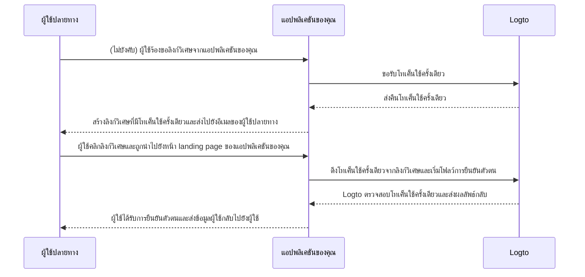

# ลิงก์วิเศษ (Magic link) (โทเค็นใช้ครั้งเดียว)

คล้ายกับรหัสผ่านใช้ครั้งเดียว (OTP) โทเค็นใช้ครั้งเดียวเป็นอีกหนึ่งวิธีการยืนยันตัวตนแบบไม่ใช้รหัสผ่านที่สามารถใช้ตรวจสอบตัวตนของผู้ใช้ได้
โทเค็นนี้จะมีอายุการใช้งานจำกัด และเชื่อมโยงกับที่อยู่อีเมลของผู้ใช้ปลายทาง

บางครั้งคุณอาจต้องการเชิญผู้ใช้ใหม่เข้าสู่แอปพลิเคชัน / องค์กรของคุณโดยไม่ต้องให้พวกเขาสร้างบัญชีก่อน
หรือคุณอาจลืมรหัสผ่านและต้องการลงชื่อเข้าใช้ / รีเซ็ตรหัสผ่านโดยยืนยันตัวตนอย่างรวดเร็วผ่านอีเมล
ในกรณีเหล่านี้ แอปพลิเคชันสามารถส่ง “ลิงก์วิเศษ” ไปยังอีเมลของคุณ และคุณจะได้รับการยืนยันตัวตนทันทีเมื่อคลิกลิงก์นั้น

นักพัฒนาแอปพลิเคชันสามารถใช้โทเค็นใช้ครั้งเดียวเพื่อสร้างลิงก์วิเศษ และส่งไปยังอีเมลของผู้ใช้ปลายทาง

## กรณีการใช้งาน \{#use-cases}

Logto รองรับสถานการณ์ต่อไปนี้ด้วยลิงก์วิเศษ:

- **การลงทะเบียนแบบเชิญเท่านั้น**: สำหรับเครื่องมือภายในหรือผลิตภัณฑ์ AI ที่อยู่ในช่วงทดสอบ คุณสามารถปิดการลงทะเบียนสาธารณะและเชิญผู้ใช้เฉพาะผ่านลิงก์วิเศษ
- **เชิญสมาชิกองค์กร**: สำหรับผลิตภัณฑ์ SaaS ใช้ลิงก์วิเศษเพื่อเชิญสมาชิกใหม่เข้าร่วมองค์กร ช่วยให้กระบวนการเริ่มต้นใช้งานราบรื่นขึ้น
- **ลงชื่อเข้าใช้ / ลงทะเบียน**: ส่งลิงก์วิเศษสำหรับการลงชื่อเข้าใช้หรือสมัครสมาชิกแบบไม่ใช้รหัสผ่านผ่านอีเมล

ตัวอย่างเช่น เมื่อคุณปิดการลงทะเบียนสาธารณะ คุณสามารถส่งลิงก์วิเศษพร้อมโทเค็นใช้ครั้งเดียว (เช่น `https://yourapp.com/landing-page?token=YHwbXSXxQfL02IoxFqr1hGvkB13uTqcd&email=user@example.com`) ไปยังอีเมลของผู้ใช้เพื่อเชิญให้พวกเขาสร้างบัญชีให้เสร็จสมบูรณ์ คุณสามารถปรับแต่งเทมเพลตอีเมลในบริการส่งอีเมลของคุณเอง เช่น:


ปัจจุบันยังไม่รองรับ:

- การรีเซ็ตรหัสผ่านด้วยลิงก์วิเศษ
- การใช้หมายเลขโทรศัพท์หรือชื่อผู้ใช้เป็นตัวระบุ

## โฟลว์โทเค็นใช้ครั้งเดียว \{#one-time-token-flow}

นี่คือไดอะแกรมลำดับของโฟลว์การยืนยันตัวตนด้วยโทเค็นใช้ครั้งเดียว:



## คู่มือการใช้งาน \{#implementation-guide}

Logto มีชุด Management API และ Experience API เพื่อช่วยให้คุณใช้งานลิงก์วิเศษได้ง่ายขึ้น

ก่อนเริ่มต้น โปรดตรวจสอบให้แน่ใจว่าคุณมีอินสแตนซ์ Logto พร้อมใช้งาน และได้ตั้งค่าการเชื่อมต่อ Machine-to-Machine ระหว่างเซิร์ฟเวอร์แอปพลิเคชันของคุณกับ Logto endpoint (จำเป็นสำหรับ Management API) ดูเพิ่มเติมเกี่ยวกับ [Logto Management API](/integrate-logto/interact-with-management-api)

### ขั้นตอนที่ 1: ขอรับโทเค็นใช้ครั้งเดียว \{#step-1-request-one-time-token}

ใช้ Logto Management API เพื่อสร้างโทเค็นใช้ครั้งเดียว

```bash
POST /api/one-time-tokens
```

ตัวอย่าง payload ของ request body:

```json
{
  "email": "user@example.com",
  // ไม่บังคับ ค่าเริ่มต้นคือ 600 (10 นาที)
  "expiresIn": 3600,
  // ไม่บังคับ ผู้ใช้จะถูกจัดเตรียมเข้าสู่องค์กรที่ระบุเมื่อยืนยันตัวตนสำเร็จ
  "context": {
    "jitOrganizationIds": ["abcdefgh1234"]
  }
}
```

### ขั้นตอนที่ 2: สร้างลิงก์วิเศษของคุณ \{#step-2-compose-your-magic-link}

หลังจากได้รับโทเค็นใช้ครั้งเดียวแล้ว คุณสามารถสร้างลิงก์วิเศษและส่งไปยังอีเมลของผู้ใช้ปลายทาง
ลิงก์วิเศษควรมีอย่างน้อยโทเค็นและอีเมลของผู้ใช้เป็นพารามิเตอร์ และควรนำไปยังหน้า landing page ในแอปพลิเคชันของคุณเอง
เช่น `https://yourapp.com/landing-page`

ตัวอย่างลิงก์วิเศษที่อาจมีหน้าตาดังนี้:

```
https://yourapp.com/landing-page?token=YHwbXSXxQfL02IoxFqr1hGvkB13uTqcd&email=user@example.com
```

:::note

ชื่อพารามิเตอร์ในลิงก์วิเศษสามารถปรับแต่งได้อย่างเต็มที่
คุณสามารถเพิ่มข้อมูลเพิ่มเติมลงในลิงก์วิเศษตามความต้องการของแอปพลิเคชันของคุณ
รวมถึงการเข้ารหัสพารามิเตอร์ URL ทั้งหมด

:::

### ขั้นตอนที่ 3: เริ่มโฟลว์การยืนยันตัวตนผ่าน Logto SDK \{#step-3-trigger-the-authentication-flow-via-logto-sdk}

หลังจากผู้ใช้ปลายทางคลิกลิงก์วิเศษและเข้าสู่แอปพลิเคชันของคุณแล้ว คุณสามารถดึงพารามิเตอร์ `token` และ `email` จาก URL และเรียกใช้ฟังก์ชัน `signIn()` จาก Logto SDK เพื่อเริ่มโฟลว์การยืนยันตัวตน

```typescript title="TokenLandingPage.tsx"
// ตัวอย่าง React
import { useLogto } from '@logto/react';
import { useEffect } from 'react';
import { useSearchParams } from 'react-router-dom';

const TokenLandingPage = () => {
  const { signIn } = useLogto();
  const [searchParams] = useSearchParams();

  useEffect(() => {
    // ดึง token และ email จากลิงก์วิเศษ
    const oneTimeToken = searchParams.get('token');
    const email = searchParams.get('email');

    // สมมติว่านี่คือ redirect URI สำหรับ sign-in ของคุณ
    const redirectUri = 'https://yourapp.com/callback';

    if (oneTimeToken && email) {
      signIn({
        redirectUri,
        clearTokens: false, // ไม่บังคับ ดูคำเตือนด้านล่าง
        extraParams: {
          'one_time_token': oneTimeToken,
          'login_hint': email,
        },
      });
    }
  }, [searchParams, signIn]);

  return <>กรุณารอสักครู่...</>;
};
```

:::warning

หากผู้ใช้ลงชื่อเข้าใช้แล้ว การเรียกใช้ฟังก์ชัน `signIn()` จาก SDK จะล้างโทเค็นที่แคชไว้ทั้งหมด (โทเค็น ID, โทเค็นการเข้าถึง, และโทเค็นรีเฟรช) จาก storage ของ client
ซึ่งจะทำให้สถานะการยืนยันตัวตนของผู้ใช้ปัจจุบันหายไป

ดังนั้น คุณควรระบุพารามิเตอร์ sign-in เพิ่มเติม `clearTokens: false` เพื่อหลีกเลี่ยงการล้างโทเค็นที่มีอยู่
หากระบุค่านี้ คุณจะต้องล้างโทเค็นด้วยตนเองในหน้าคอลแบ็กของ sign-in

ข้ามข้อนี้หากลิงก์วิเศษของคุณไม่ได้ออกแบบมาสำหรับผู้ใช้ที่ลงชื่อเข้าใช้แล้ว

:::

### ขั้นตอนที่ 4: (ไม่บังคับ) ล้างโทเค็นที่แคชไว้ในหน้าคอลแบ็กของ sign-in \{#step-4-clear-cached-tokens-in-sign-in-callback-page}

หากคุณระบุ `clearTokens: false` ในฟังก์ชัน sign-in คุณต้องล้างโทเค็นด้วยตนเองในหน้าคอลแบ็กของ sign-in

```typescript title="Callback.tsx"
// ตัวอย่าง React
import { useHandleSignInCallback, useLogto } from '@logto/react';
import { useEffect } from 'react';

const Callback = () => {
  const { clearAllTokens } = useLogto();

  useEffect(() => {
    void clearAllTokens();
  }, [clearAllTokens]);

  useHandleSignInCallback(() => {
    // นำทางไปยังหน้าแรกของคุณ
  });

  return <>กรุณารอสักครู่...</>;
};
```

## คำถามที่พบบ่อย \{#faqs}

<details>

<summary>

### ฉันสามารถใช้ลิงก์วิเศษเพื่อเชิญผู้ใช้ใหม่เข้าสู่องค์กรของฉันได้หรือไม่? \{#can-i-use-the-magic-link-to-invite-new-users-to-my-organizations}

</summary>

ได้ คุณสามารถใช้ลิงก์วิเศษเพื่อเชิญผู้ใช้ใหม่เข้าสู่แอปพลิเคชันของคุณ รวมถึงองค์กร
หากคุณต้องการเชิญผู้ใช้ใหม่เข้าสู่องค์กรของคุณ เพียงระบุ `jitOrganizationIds` ใน request body

ผู้ใช้จะเข้าร่วมองค์กรโดยอัตโนมัติเมื่อยืนยันตัวตนสำเร็จ และจะได้รับบทบาทเริ่มต้นขององค์กร
ดูหัวข้อ "Just-in-time provisioning" ในหน้ารายละเอียดขององค์กรของคุณ และกำหนดบทบาทเริ่มต้นสำหรับองค์กรของคุณ

</details>

<details>

<summary>

### ฉันสามารถกำหนดบทบาทให้ผู้ใช้เฉพาะผ่านลิงก์วิเศษได้หรือไม่? \{#can-i-assign-users-to-specific-roles-using-the-magic-link}

</summary>

โฟลว์การยืนยันตัวตนด้วยลิงก์วิเศษไม่รองรับการกำหนดบทบาทให้ผู้ใช้โดยตรง แต่คุณสามารถใช้ [Webhooks](/developers/webhooks) และ [Management API](/user-management/manage-users#manage-roles-of-users) เพื่ออัปเดตบทบาทของผู้ใช้หลังจากลงทะเบียนได้เสมอ

</details>

<details>

<summary>

### โทเค็นใช้ครั้งเดียวหมดอายุหรือไม่? \{#does-the-one-time-token-expire}

</summary>

ใช่ โทเค็นใช้ครั้งเดียวจะหมดอายุหลังจากเวลาที่ระบุใน `expiresIn` (หน่วยวินาที) โดยค่าเริ่มต้นคือ 10 นาที

</details>

<details>

<summary>

### หากฉันปิดการลงทะเบียนผู้ใช้ใน "ประสบการณ์การลงชื่อเข้าใช้" ยังสามารถใช้ลิงก์วิเศษเชิญผู้ใช้ได้หรือไม่? \{#if-i-disable-user-registration-in-sign-in-experience-can-i-still-use-magic-link-to-invite-users}

</summary>

ได้ คุณยังสามารถใช้ลิงก์วิเศษเชิญผู้ใช้ได้ แม้ว่าจะปิดการลงทะเบียนผู้ใช้ใน "ประสบการณ์การลงชื่อเข้าใช้" แล้วก็ตาม

</details>

<details>

<summary>

### จะเกิดอะไรขึ้นหากผู้ใช้ลงชื่อเข้าใช้แล้ว แล้วคลิกลิงก์วิเศษอีกอัน? \{#what-will-happen-if-a-user-already-signed-in-and-then-click-another-magic-link}

</summary>

มีหลายสถานการณ์ที่เป็นไปได้:

1. ผู้ใช้ลงชื่อเข้าใช้แล้ว แล้วคลิกลิงก์วิเศษที่เชื่อมโยงกับบัญชีผู้ใช้ปัจจุบัน ในกรณีนี้ Logto จะยังคงตรวจสอบโทเค็นใช้ครั้งเดียว และจัดเตรียมผู้ใช้เข้าสู่องค์กรที่ระบุหากจำเป็น
2. ผู้ใช้ลงชื่อเข้าใช้แล้ว แล้วคลิกลิงก์วิเศษที่เชื่อมโยงกับบัญชีอื่น ในกรณีนี้ Logto จะถามผู้ใช้ว่าจะดำเนินการต่อในฐานะบัญชีใหม่ หรือกลับไปที่แอปพลิเคชันด้วยบัญชีปัจจุบัน
   1. หากผู้ใช้เลือกดำเนินการต่อในฐานะบัญชีใหม่ Logto จะสลับไปยังบัญชีใหม่หลังจากตรวจสอบโทเค็นสำเร็จ
   2. หากผู้ใช้เลือกใช้บัญชีปัจจุบัน Logto จะไม่ตรวจสอบโทเค็นและกลับไปที่แอปพลิเคชันด้วยบัญชีปัจจุบัน
3. หาก prompt ของ sign-in ของคุณตั้งค่าเป็น "login" หรือมี "login" อยู่ Logto จะลงชื่อเข้าใช้บัญชีที่เชื่อมโยงกับโทเค็นใช้ครั้งเดียวโดยอัตโนมัติโดยไม่ถามเปลี่ยนบัญชี เพราะ prompt "login" หมายถึงความตั้งใจชัดเจนในการยืนยันตัวตน ซึ่งมีความสำคัญเหนือเซสชันปัจจุบัน

</details>
