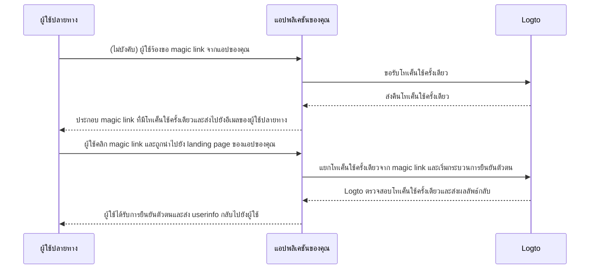

# Magic link (โทเค็นใช้ครั้งเดียว)

import Availability from '@components/Availability';

<Availability cloud oss={{ major: 1, minor: 27 }} />

คล้ายกับรหัสผ่านใช้ครั้งเดียว (OTP) โทเค็นใช้ครั้งเดียวเป็นอีกหนึ่งวิธีการยืนยันตัวตนแบบไม่ใช้รหัสผ่านที่สามารถใช้ตรวจสอบตัวตนของผู้ใช้ได้
โทเค็นนี้จะมีอายุการใช้งานจำกัด และเชื่อมโยงกับที่อยู่อีเมลของผู้ใช้ปลายทาง

บางครั้งคุณอาจต้องการเชิญผู้ใช้ใหม่เข้าสู่แอปพลิเคชัน / องค์กรของคุณโดยไม่ต้องให้พวกเขาสร้างบัญชีก่อน
หรือคุณอาจลืมรหัสผ่านและต้องการลงชื่อเข้าใช้ / รีเซ็ตรหัสผ่านโดยยืนยันตัวตนอย่างรวดเร็วผ่านอีเมล
ในกรณีเหล่านี้ แอปพลิเคชันสามารถส่ง "magic link" ไปยังอีเมลของคุณ และคุณจะได้รับการยืนยันตัวตนทันทีเมื่อคลิกลิงก์นั้น

นักพัฒนาแอปพลิเคชันสามารถใช้โทเค็นใช้ครั้งเดียวเพื่อประกอบเป็น magic link และส่งไปยังอีเมลของผู้ใช้ปลายทาง

## ขั้นตอนการใช้โทเค็นใช้ครั้งเดียว \{#one-time-token-flow}

นี่คือไดอะแกรมลำดับของกระบวนการยืนยันตัวตนด้วยโทเค็นใช้ครั้งเดียว:



## คู่มือการใช้งาน \{#implementation-guide}

Logto มีทั้ง Management API และ Experience API เพื่อช่วยให้คุณใช้งาน magic link ได้ง่ายขึ้น

ก่อนเริ่มต้น ให้แน่ใจว่าคุณมี Logto instance พร้อมใช้งาน และได้ตั้งค่าการเชื่อมต่อ Machine-to-Machine ระหว่างเซิร์ฟเวอร์แอปของคุณ
กับ Logto endpoint (จำเป็นสำหรับ Management API) ดูเพิ่มเติมเกี่ยวกับ [Logto Management API](/integrate-logto/interact-with-management-api)

### ขั้นตอนที่ 1: ขอรับโทเค็นใช้ครั้งเดียว \{#step-1-request-one-time-token}

ใช้ Logto Management API เพื่อสร้างโทเค็นใช้ครั้งเดียว

```bash
POST /api/one-time-tokens
```

ตัวอย่าง payload ของ request body:

```json
{
  "email": "user@example.com",
  // ไม่บังคับ ค่าเริ่มต้นคือ 600 (10 นาที)
  "expiresIn": 3600,
  // ไม่บังคับ ผู้ใช้จะถูกจัดเตรียมเข้าสู่องค์กรที่ระบุเมื่อยืนยันตัวตนสำเร็จ
  "context": {
    "jitOrganizationIds": ["abcdefgh1234"]
  }
}
```

### ขั้นตอนที่ 2: ประกอบ magic link ของคุณ \{#step-2-compose-your-magic-link}

หลังจากได้รับโทเค็นใช้ครั้งเดียวแล้ว คุณสามารถประกอบ magic link และส่งไปยังอีเมลของผู้ใช้ปลายทาง
magic link ควรมีอย่างน้อย token และอีเมลของผู้ใช้เป็นพารามิเตอร์ และควรนำไปยัง landing page ในแอปของคุณเอง
เช่น `https://yourapp.com/landing-page`

ตัวอย่าง magic link ที่อาจมีหน้าตาดังนี้:

```
https://yourapp.com/landing-page?token=YHwbXSXxQfL02IoxFqr1hGvkB13uTqcd&email=user@example.com
```

:::note

ชื่อพารามิเตอร์ใน magic link สามารถปรับแต่งได้อย่างอิสระ
คุณสามารถเพิ่มข้อมูลเพิ่มเติมลงใน magic link ตามความต้องการของแอปพลิเคชันของคุณ
รวมถึงการเข้ารหัสพารามิเตอร์ URL ทั้งหมด

:::

### ขั้นตอนที่ 3: เริ่มกระบวนการยืนยันตัวตนผ่าน Logto SDK \{#step-3-trigger-the-authentication-flow-via-logto-sdk}

หลังจากผู้ใช้ปลายทางคลิก magic link และเข้าสู่แอปของคุณแล้ว คุณสามารถแยก `token` และ `email` จาก URL และเรียกใช้ฟังก์ชัน `signIn()` จาก Logto SDK เพื่อเริ่มกระบวนการยืนยันตัวตน

```typescript title="TokenLandingPage.tsx"
// ตัวอย่าง React
import { useLogto } from '@logto/react';
import { useEffect } from 'react';
import { useSearchParams } from 'react-router-dom';

const TokenLandingPage = () => {
  const { signIn } = useLogto();
  const [searchParams] = useSearchParams();

  useEffect(() => {
    // แยก token และ email จาก magic link
    const oneTimeToken = searchParams.get('token');
    const email = searchParams.get('email');

    // สมมติว่านี่คือ redirect URI สำหรับ sign-in ของคุณ
    const redirectUri = 'https://yourapp.com/callback';

    if (oneTimeToken && email) {
      signIn({
        redirectUri,
        clearTokens: false, // ไม่บังคับ ดูคำเตือนด้านล่าง
        extraParams: {
          'one_time_token': oneTimeToken,
          'login_hint': email,
        },
      });
    }
  }, [searchParams, signIn]);

  return <>กรุณารอสักครู่...</>;
};
```

:::warning

หากผู้ใช้ลงชื่อเข้าใช้แล้ว การเรียกใช้ฟังก์ชัน `signIn()` จาก SDK จะล้างโทเค็นที่แคชไว้ทั้งหมด (ID token, access token, และ refresh token) จาก storage ของ client
ซึ่งจะทำให้สถานะการยืนยันตัวตนของผู้ใช้ปัจจุบันหายไป

ดังนั้น คุณควรกำหนดพารามิเตอร์ `clearTokens: false` เพิ่มเติมเพื่อป้องกันการลบโทเค็นที่มีอยู่
หากระบุค่านี้ คุณจะต้องลบโทเค็นด้วยตนเองในหน้ากลับจาก sign-in

ข้ามข้อนี้ได้หาก magic link ของคุณไม่ได้ออกแบบมาสำหรับผู้ใช้ที่ลงชื่อเข้าใช้แล้ว

:::

### ขั้นตอนที่ 4: (ไม่บังคับ) ลบโทเค็นที่แคชไว้ในหน้ากลับจาก sign-in \{#step-4-clear-cached-tokens-in-sign-in-callback-page}

หากคุณระบุ `clearTokens: false` ในฟังก์ชัน sign-in คุณต้องลบโทเค็นด้วยตนเองในหน้ากลับจาก sign-in

```typescript title="Callback.tsx"
// ตัวอย่าง React
import { useHandleSignInCallback, useLogto } from '@logto/react';
import { useEffect } from 'react';

const Callback = () => {
  const { clearAllTokens } = useLogto();

  useEffect(() => {
    void clearAllTokens();
  }, [clearAllTokens]);

  useHandleSignInCallback(() => {
    // นำทางไปยังหน้าแรกของคุณ
  });

  return <>กรุณารอสักครู่...</>;
};
```

## คำถามที่พบบ่อย \{#faqs}

<details>

<summary>

### ฉันสามารถใช้ magic link เพื่อเชิญผู้ใช้ใหม่เข้าสู่องค์กรของฉันได้หรือไม่? \{#can-i-use-the-magic-link-to-invite-new-users-to-my-organizations}

</summary>

ได้ คุณสามารถใช้ magic link เพื่อเชิญผู้ใช้ใหม่เข้าสู่แอปพลิเคชันและองค์กรของคุณ
หากต้องการเชิญผู้ใช้ใหม่เข้าสู่องค์กร เพียงระบุ `jitOrganizationIds` ใน request body

ผู้ใช้จะเข้าร่วมองค์กรโดยอัตโนมัติเมื่อยืนยันตัวตนสำเร็จ และจะได้รับบทบาทเริ่มต้นขององค์กร
ดูหัวข้อ "Just-in-time provisioning" ในหน้ารายละเอียดขององค์กร และกำหนดบทบาทเริ่มต้นสำหรับองค์กรของคุณ

</details>

<details>

<summary>

### ฉันสามารถกำหนดบทบาทให้ผู้ใช้ผ่าน magic link ได้หรือไม่? \{#can-i-assign-users-to-specific-roles-using-the-magic-link}

</summary>

กระบวนการยืนยันตัวตนด้วย magic link ไม่รองรับการกำหนดบทบาทให้ผู้ใช้โดยตรง แต่คุณสามารถใช้ [Webhooks](/developers/webhooks) และ [Management API](/user-management/manage-users#manage-roles-of-users) เพื่ออัปเดตบทบาทของผู้ใช้หลังจากลงทะเบียนได้เสมอ

</details>

<details>

<summary>

### โทเค็นใช้ครั้งเดียวหมดอายุหรือไม่? \{#does-the-one-time-token-expire}

</summary>

ใช่ โทเค็นใช้ครั้งเดียวจะหมดอายุตามเวลาที่ระบุใน `expiresIn` (หน่วยวินาที) โดยค่าเริ่มต้นคือ 10 นาที

</details>

<details>

<summary>

### หากปิดการลงทะเบียนผู้ใช้ใน "ประสบการณ์การลงชื่อเข้าใช้" ยังสามารถใช้ magic link เชิญผู้ใช้ได้หรือไม่? \{#if-i-disable-user-registration-in-sign-in-experience-can-i-still-use-magic-link-to-invite-users}

</summary>

ได้ คุณยังสามารถใช้ magic link เพื่อเชิญผู้ใช้ได้ แม้จะปิดการลงทะเบียนผู้ใช้ใน "ประสบการณ์การลงชื่อเข้าใช้"

</details>

<details>

<summary>

### จะเกิดอะไรขึ้นหากผู้ใช้ลงชื่อเข้าใช้แล้ว แล้วคลิก magic link อันอื่นอีก? \{#what-will-happen-if-a-user-already-signed-in-and-then-click-another-magic-link}

</summary>

มีหลายสถานการณ์ที่เป็นไปได้:

1. ผู้ใช้ลงชื่อเข้าใช้แล้ว และคลิก magic link ที่เชื่อมโยงกับบัญชีผู้ใช้ปัจจุบัน ในกรณีนี้ Logto จะตรวจสอบโทเค็นใช้ครั้งเดียว และจัดเตรียมผู้ใช้เข้าสู่องค์กรที่ระบุหากจำเป็น
2. ผู้ใช้ลงชื่อเข้าใช้แล้ว และคลิก magic link ที่เชื่อมโยงกับบัญชีอื่น ในกรณีนี้ Logto จะถามผู้ใช้ว่าจะดำเนินการต่อในฐานะบัญชีใหม่ หรือกลับไปยังแอปด้วยบัญชีปัจจุบัน
   1. หากผู้ใช้เลือกดำเนินการต่อในฐานะบัญชีใหม่ Logto จะสลับไปยังบัญชีใหม่หลังจากตรวจสอบโทเค็นสำเร็จ
   2. หากผู้ใช้เลือกใช้บัญชีปัจจุบัน Logto จะไม่ตรวจสอบโทเค็นและกลับไปยังแอปด้วยบัญชีปัจจุบัน
3. หาก prompt การลงชื่อเข้าใช้ของคุณตั้งค่าเป็น "login" หรือมี "login" อยู่ Logto จะลงชื่อเข้าใช้บัญชีที่เชื่อมโยงกับโทเค็นใช้ครั้งเดียวโดยอัตโนมัติโดยไม่ถามสลับบัญชี

</details>
