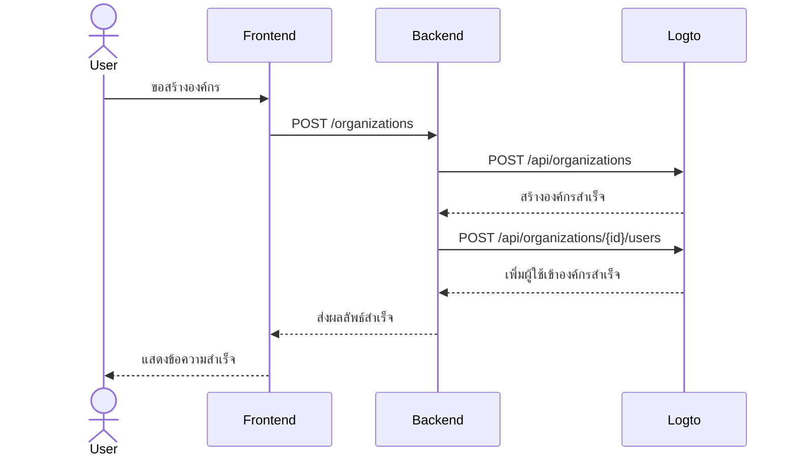

import GearIcon from '@site/src/assets/gear.svg';
import OrganizationIcon from '@site/src/assets/organization.svg';

# ประสบการณ์องค์กร (Organization experience)

ประสบการณ์ [องค์กร](/organizations) คือชุดของ UI และโฟลว์ที่ลูกค้าธุรกิจและพนักงานของพวกเขาใช้—โดยเฉพาะใน [แอปพลิเคชันแบบหลายผู้เช่า (multi-tenant applications)](https://auth.wiki/multi-tenancy) คู่มือนี้จะแสดงวิธีผสานรวมเข้ากับแอปของคุณโดยใช้ Logto Management API

ส่วนนี้จะช่วยคุณออกแบบ **ประสบการณ์องค์กร (organization experience)** สำหรับผู้ใช้ปลายทางของคุณ ตัวอย่างเช่น:

1. แอดมินสามารถสร้างองค์กรของตนเองได้
2. แอดมินสามารถจัดการสมาชิกในองค์กรได้
3. แอดมินสามารถเชิญสมาชิกเข้าร่วมองค์กรของตนได้
4. และอื่น ๆ

  

## ทำความเข้าใจโฟลว์การยืนยันตัวตน (authentication flow) \{#understand-the-authentication-flow}

เพื่อผสานรวมกับ Logto Management API ก่อนอื่นควรเข้าใจโฟลว์การยืนยันตัวตนพื้นฐาน ซึ่งมีข้อกำหนดสำคัญ 2 ข้อ:

### ปกป้อง backend API ของคุณ \{#protect-your-backend-api}

- การเรียก backend API จาก frontend ต้องมีการยืนยันตัวตน
- ปกป้อง endpoint ของ API โดยตรวจสอบ Logto โทเค็นการเข้าถึง (access token) ของผู้ใช้
- ตรวจสอบให้แน่ใจว่ามีเพียงผู้ใช้ที่ผ่านการยืนยันตัวตนเท่านั้นที่เข้าถึงบริการของคุณได้

### เข้าถึง Logto Management API \{#access-the-logto-management-api}

- Backend service ของคุณจะเรียก Logto Management API อย่างปลอดภัย
- ทำตามคู่มือ [โต้ตอบกับ Management API](/integrate-logto/interact-with-management-api) เพื่อการตั้งค่า
- ใช้การยืนยันตัวตนแบบเครื่องต่อเครื่อง (machine-to-machine) เพื่อขอรับข้อมูลรับรองการเข้าถึง

บทถัดไปจะอธิบายวิธีตั้งค่า Logto Management API และตัวอย่างกรณีใช้งานทั่วไปสำหรับการสร้างประสบการณ์องค์กรของคุณ

## ฟีเจอร์สำหรับประสบการณ์องค์กร \{#features-for-organization-experience}

<DocCardList
  items={[
    {
      type: 'link',
      label: 'กำหนดฟีเจอร์การจัดการองค์กร',
      href: '/end-user-flows/organization-experience/organization-management',
      description: 'ออกแบบแอป multi-tenant ของคุณเองด้วยบทบาทและสิทธิ์ขององค์กร',
      customProps: {
        icon: <OrganizationIcon />,
      },
    },
    {
      type: 'link',
      label: 'ตั้งค่าบริการแอปของคุณกับ Logto Management API',
      href: '/end-user-flows/organization-experience/setup-app-service-with-management-api',
      description:
        'เชื่อมต่อ backend ของคุณกับ Logto Management API อย่างปลอดภัยด้วยการยืนยันตัวตนแบบเครื่องต่อเครื่อง',
      customProps: {
        icon: <GearIcon />,
      },
    },
    {
      type: 'link',
      label: 'สร้างองค์กร',
      href: '/end-user-flows/organization-experience/create-organization',
      description: 'ใช้ Logto Management API เพื่อให้ผู้ใช้ปลายทางสร้างองค์กรในผลิตภัณฑ์ด้วยตนเอง',
      customProps: {
        icon: <OrganizationIcon />,
      },
    },
    {
      type: 'link',
      label: 'ดึงข้อมูลผู้ใช้ภายในองค์กร',
      href: '/end-user-flows/organization-experience/get-user-info',
      description: 'ดึงข้อมูลผู้ใช้ภายในองค์กร',
      customProps: {
        icon: <OrganizationIcon />,
      },
    },
    {
      type: 'link',
      label: 'สวิตช์องค์กร',
      href: '/end-user-flows/organization-experience/organization-switcher',
      description: 'สร้างฟีเจอร์สลับองค์กรในแอปของคุณ',
      customProps: {
        icon: <GearIcon />,
      },
    },
    {
      type: 'link',
      label: 'เชิญสมาชิกองค์กร',
      href: '/end-user-flows/organization-experience/invite-organization-members',
      description: 'ใช้ Logto Management API เพื่อสร้างระบบเชิญสมาชิกองค์กร',
      customProps: {
        icon: <GearIcon />,
      },
    },
    {
      type: 'link',
      label: 'เข้าร่วมองค์กร',
      href: '/end-user-flows/organization-experience/join-the-organization',
      description: 'สร้างโฟลว์การเข้าร่วมองค์กรในแอปของคุณ',
      customProps: {
        icon: <GearIcon />,
      },
    },
    {
      type: 'link',
      label: 'การจัดการสิทธิ์และทรัพยากร',
      href: '/end-user-flows/organization-experience/permission-and-resource-management',
      description: 'จัดการสิทธิ์และทรัพยากรภายในองค์กร',
      customProps: {
        icon: <GearIcon />,
      },
    },
  ]}
/>

สำหรับคำอธิบายโดยละเอียดเกี่ยวกับคำนิยามองค์กร แนวคิดสมาชิก และเทมเพลตองค์กร ดูที่ [เข้าใจการทำงานขององค์กร](/organizations/understand-how-organizations-work)

## แหล่งข้อมูลที่เกี่ยวข้อง \{#related-resources}

<Url href="https://blog.logto.io/build-multi-tenant-saas-application">
  สร้างแอป SaaS แบบหลายผู้เช่า: คู่มือฉบับสมบูรณ์ตั้งแต่การออกแบบจนถึงการใช้งานจริง
</Url>
