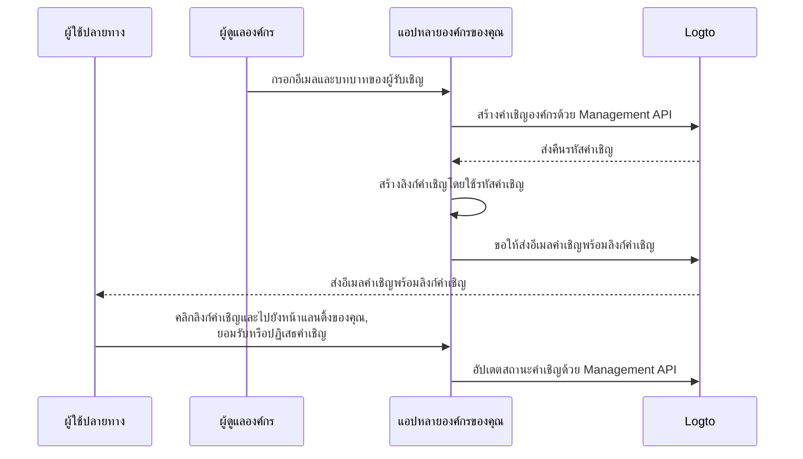

# เชิญสมาชิกองค์กร

ในแอปพลิเคชันที่รองรับหลายองค์กร ความต้องการทั่วไปคือการเชิญสมาชิกเข้าสู่องค์กร คู่มือนี้จะแนะนำขั้นตอนและรายละเอียดทางเทคนิคในการนำฟีเจอร์นี้ไปใช้

## ภาพรวมของขั้นตอน \{#flow-overview}

กระบวนการโดยรวมแสดงในไดอะแกรมด้านล่าง:



## สร้างบทบาทองค์กร \{#create-organization-roles}

ก่อนเชิญสมาชิก ให้สร้างบทบาทองค์กร ดู [เทมเพลตองค์กร](/authorization/organization-template) เพื่อเรียนรู้เพิ่มเติมเกี่ยวกับบทบาทและสิทธิ์

ในคู่มือนี้ เราจะสร้างบทบาทองค์กรทั่วไป 2 แบบ: `admin` และ `member`

บทบาท `admin` มีสิทธิ์เข้าถึงทรัพยากรทั้งหมดในองค์กร ส่วนบทบาท `member` จะมีสิทธิ์จำกัด ตัวอย่างเช่น:

- บทบาท `admin`:
  - `read:data` - อ่านข้อมูลทรัพยากรทั้งหมดขององค์กร
  - `write:data` - เขียนข้อมูลทรัพยากรทั้งหมดขององค์กร
  - `delete:data` - ลบข้อมูลทรัพยากรทั้งหมดขององค์กร
  - `invite:member` - เชิญสมาชิกเข้าสู่องค์กร
  - `manage:member` - จัดการสมาชิกในองค์กร
  - `delete:member` - ลบสมาชิกออกจากองค์กร
- บทบาท `member`:
  - `read:data` - อ่านข้อมูลทรัพยากรทั้งหมดขององค์กร
  - `write:data` - เขียนข้อมูลทรัพยากรทั้งหมดขององค์กร
  - `invite:member` - เชิญสมาชิกเข้าสู่องค์กร

สามารถดำเนินการนี้ได้ง่าย ๆ ใน [Logto Console](https://cloud.logto.io/) หรือใช้ [Logto Management API](https://openapi.logto.io/operation/operation-createorganizationrole) เพื่อสร้างบทบาทองค์กรแบบโปรแกรม

## ตั้งค่าตัวเชื่อมต่ออีเมลของคุณ \{#configure-your-email-connector}

เนื่องจากการเชิญสมาชิกจะถูกส่งผ่านอีเมล กรุณาตรวจสอบให้แน่ใจว่า [ตัวเชื่อมต่ออีเมล](/connectors/email-connectors) ของคุณถูกตั้งค่าอย่างถูกต้อง ในการส่งคำเชิญ ให้ตั้งค่า [เทมเพลตอีเมล](/connectors/email-connectors/email-templates#email-template-types) โดยใช้ประเภทการใช้งาน `OrganizationInvitation` คุณสามารถใส่ตัวแปรขององค์กร (เช่น ชื่อ, โลโก้) และผู้เชิญ (เช่น อีเมล, ชื่อ) [ตัวแปร](/connectors/email-connectors/email-templates#email-template-variables) ลงในเนื้อหา และปรับแต่ง [เทมเพลตภาษาท้องถิ่น](/connectors/email-connectors/email-templates#email-template-localization) ได้ตามต้องการ

ตัวอย่างเทมเพลตอีเมลสำหรับประเภทการใช้งาน `OrganizationInvitation` แสดงด้านล่าง:

```json
{
  "subject": "ยินดีต้อนรับสู่องค์กรของฉัน",
  "content": "<p>เข้าร่วม {{organization.name}} ได้โดยคลิก <a href=\"{{link}}\" target=\"_blank\">ลิงก์นี้</a>.</p>",
  "usageType": "OrganizationInvitation",
  "type": "text/html"
}
```

ตัวแปร `{{link}}` ในเนื้อหาอีเมลจะถูกแทนที่ด้วยลิงก์คำเชิญจริงเมื่อส่งอีเมล

:::note

บริการ “Logto email service” ที่มากับ Logto Cloud ยังไม่รองรับประเภทการใช้งาน `OrganizationInvitation` กรุณาตั้งค่าตัวเชื่อมต่ออีเมลของคุณเอง (เช่น SendGrid) และตั้งค่าเทมเพลต `OrganizationInvitation` แทน

:::

## จัดการคำเชิญด้วย Logto Management API \{#handle-invitations-with-logto-management-api}

:::note

หากคุณยังไม่ได้ตั้งค่า Logto Management API โปรดดู [โต้ตอบกับ Management API](/integrate-logto/interact-with-management-api) สำหรับรายละเอียด

:::

### สร้างคำเชิญองค์กรด้วย Logto Management API \{#create-an-organization-invitation-with-logto-management-api}

มีชุด Management API ที่เกี่ยวข้องกับคำเชิญในฟีเจอร์องค์กร โดย API เหล่านี้ คุณสามารถ:

- `POST /api/organization-invitations`: สร้างคำเชิญองค์กรพร้อมกำหนดบทบาทองค์กร
- `POST /api/one-time-tokens`: สร้างโทเค็นใช้ครั้งเดียวสำหรับผู้รับเชิญเพื่อยืนยันตัวตนเมื่อยอมรับคำเชิญ [เรียนรู้เพิ่มเติม](/end-user-flows/one-time-token)
- `POST /api/organization-invitations/{id}/message`: ส่งคำเชิญองค์กรไปยังผู้รับเชิญทางอีเมล
  หมายเหตุ: payload รองรับ property `link` เพื่อให้คุณสามารถสร้างลิงก์คำเชิญเองโดยอิงจากรหัสคำเชิญ ตัวอย่างเช่น:

  ```json
  {
    "link": "https://your-app.com/invitation/join?id=your-invitation-id&token=your-one-time-token&email=invitee-email"
  }
  ```
