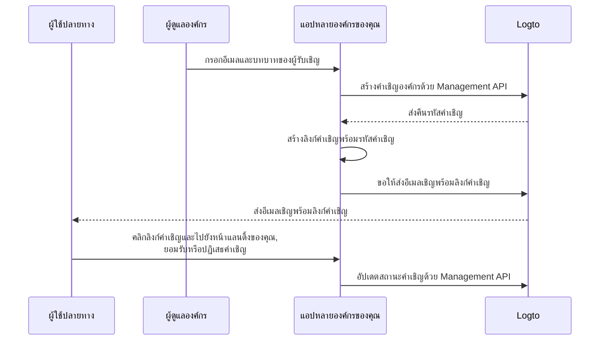

# เชิญสมาชิกองค์กร

สำหรับแอปพลิเคชันที่รองรับหลายองค์กร ความต้องการที่พบบ่อยคือการเชิญสมาชิกเข้าสู่องค์กรของคุณ ในคู่มือนี้ เราจะพาคุณไปทีละขั้นตอนพร้อมรายละเอียดทางเทคนิคในการนำฟีเจอร์นี้ไปใช้ในแอปของคุณ

## ภาพรวมของขั้นตอน \{#flow-overview}

กระบวนการโดยรวมแสดงในไดอะแกรมด้านล่าง:



## สร้างบทบาทองค์กร \{#create-organization-roles}

ก่อนเชิญสมาชิกเข้าสู่องค์กรของคุณ คุณต้องสร้างบทบาทองค์กรก่อน ดู [Organization template](/authorization/organization-template) เพื่อเรียนรู้เพิ่มเติมเกี่ยวกับบทบาทและสิทธิ์ขององค์กร

ในคู่มือนี้ เราจะสร้างบทบาทองค์กรทั่วไป 2 บทบาท: `admin` และ `member`

บทบาท `admin` มีสิทธิ์เข้าถึงทุกทรัพยากรในองค์กร ส่วน `member` มีสิทธิ์จำกัด ตัวอย่างเช่น แต่ละบทบาทอาจมีสิทธิ์ดังนี้:

- บทบาท `admin`:
  - `read:data` - อ่านข้อมูลทรัพยากรทั้งหมดขององค์กร
  - `write:data` - เขียนข้อมูลทรัพยากรทั้งหมดขององค์กร
  - `delete:data` - ลบข้อมูลทรัพยากรทั้งหมดขององค์กร
  - `invite:member` - เชิญสมาชิกเข้าสู่องค์กร
  - `manage:member` - จัดการสมาชิกในองค์กร
  - `delete:member` - ลบสมาชิกออกจากองค์กร
- บทบาท `member`:
  - `read:data` - อ่านข้อมูลทรัพยากรทั้งหมดขององค์กร
  - `write:data` - เขียนข้อมูลทรัพยากรทั้งหมดขององค์กร
  - `invite:member` - เชิญสมาชิกเข้าสู่องค์กร

คุณสามารถตั้งค่านี้ได้ง่าย ๆ ใน [Logto Console](https://cloud.logto.io/) หรือใช้ [Logto Management API](https://openapi.logto.io/operation/operation-createorganizationrole) เพื่อสร้างบทบาทองค์กรแบบโปรแกรม

## ตั้งค่าตัวเชื่อมต่ออีเมลของคุณ \{#configure-your-email-connector}

เนื่องจากการเชิญส่งผ่านอีเมล โปรดตรวจสอบให้แน่ใจว่าคุณได้ตั้งค่า [ตัวเชื่อมต่ออีเมล](/connectors/email-connectors) อย่างถูกต้องแล้ว ในการส่งคำเชิญ คุณต้องตั้งค่าการใช้งาน [email template](/connectors/email-connectors/email-templates#email-template-types) ประเภท `OrganizationInvitation` คุณยังสามารถใส่ตัวแปรองค์กร (เช่น ชื่อองค์กร โลโก้) และผู้เชิญ (เช่น อีเมลผู้เชิญ ชื่อ) [ตัวแปร](/connectors/email-connectors/email-templates#email-template-variables) ลงในเนื้อหา หรือปรับแต่ง [เทมเพลตหลายภาษา](/connectors/email-connectors/email-templates#email-template-localization) ได้ตามต้องการ

ตัวอย่างเทมเพลตอีเมลสำหรับประเภท `OrganizationInvitation`:

```json
{
  "subject": "ยินดีต้อนรับสู่ องค์กรของฉัน",
  "content": "<p>เข้าร่วม {{organization.name}} ได้ที่ <a href=\"{{link}}\" target=\"_blank\">ลิงก์นี้</a>.</p>",
  "usageType": "OrganizationInvitation",
  "type": "text/html"
}
```

ตัวแปร `{{link}}` ในเนื้อหาอีเมลจะถูกแทนที่ด้วยลิงก์คำเชิญจริงขณะส่งอีเมล ในคู่มือนี้ สมมติว่าเป็น `https://your-app.com/invitation/accept/{your-invitation-id}`

:::note

บริการ "Logto email service" ที่มากับ Logto Cloud ยังไม่รองรับประเภท `OrganizationInvitation` ในขณะนี้ คุณต้องตั้งค่าตัวเชื่อมต่ออีเมลของคุณเอง (เช่น Sendgrid) และสร้างเทมเพลต `OrganizationInvitation`

:::

## จัดการคำเชิญด้วย Logto Management API \{#handle-invitations-with-logto-management-api}

:::note

หากคุณยังไม่ได้ตั้งค่า Logto Management API โปรดดู [Interact with Management API](/integrate-logto/interact-with-management-api) สำหรับรายละเอียด

:::

### สำหรับผู้ใช้ Cloud และ OSS v1.27.0+ \{#for-cloud-and-oss-v1-27-0-users}

ขณะนี้คุณสามารถใช้ฟีเจอร์ [Magic link (โทเค็นใช้ครั้งเดียว)](/end-user-flows/one-time-token) เพื่อจัดการขั้นตอนการเชิญได้

เพียงเรียก Management API เพื่อสร้างโทเค็นใช้ครั้งเดียว และสร้างลิงก์ magic link สำหรับคำเชิญโดยใส่โทเค็นและอีเมลผู้รับเชิญ
แทรกลิงก์นี้ลงในตัวแปร `{{link}}` ของเทมเพลตอีเมลข้างต้น แล้วส่งอีเมลถึงผู้รับเชิญ
คุณสามารถสร้างลิงก์เช่น `https://your-app.com/landing-page?token={your-one-time-token}&email={invitee-email}` แทนลิงก์ที่มี invitation ID

นี่เป็นวิธีที่แนะนำ เพราะจะลงทะเบียนผู้รับเชิญโดยอัตโนมัติด้วย magic link หากยังไม่มีบัญชี

ดูรายละเอียดเพิ่มเติมได้ที่หน้า [Magic link (โทเค็นใช้ครั้งเดียว)](/end-user-flows/one-time-token)

### สำหรับผู้ใช้ OSS v1.26.0- \{#for-oss-v1-26-0--users}

เราได้เตรียมชุด Management API ที่เกี่ยวข้องกับคำเชิญในฟีเจอร์องค์กรไว้ให้แล้ว โดยคุณสามารถ:

- `POST /api/organization-invitations` สร้างคำเชิญองค์กรพร้อมกำหนดบทบาทองค์กร
- `POST /api/organization-invitations/{id}/message` ส่งคำเชิญองค์กรไปยังผู้รับทางอีเมล
  หมายเหตุ: payload ของ API นี้รองรับ property `link` คุณสามารถสร้างลิงก์คำเชิญโดยอิงจาก invitation ID ตัวอย่างเช่น:

  ```json
  {
    "link": "https://your-app.com/invitation/accept/{your-invitation-id}"
  }
  ```

  ดังนั้น คุณต้องสร้างหน้า landing page เมื่อผู้รับเชิญคลิกลิงก์คำเชิญมายังแอปของคุณ

- `GET /api/organization-invitations` & `GET /api/organization-invitations/{id}` ดึงคำเชิญทั้งหมดหรือเฉพาะรายการตาม ID
  ในหน้า landing page ของคุณ ใช้ API เหล่านี้เพื่อแสดงรายการคำเชิญหรือรายละเอียดคำเชิญที่ผู้ใช้ได้รับ
- `PUT /api/organization-invitations/{id}/status` ยอมรับหรือปฏิเสธคำเชิญโดยอัปเดตสถานะคำเชิญ
  ใช้ API นี้เพื่อจัดการการตอบรับของผู้ใช้ต่อคำเชิญ

## ใช้การควบคุมการเข้าถึงตามบทบาทองค์กร (RBAC) เพื่อจัดการสิทธิ์ผู้ใช้ \{#use-organization-role-based-access-control-rbac-to-manage-user-permissions}

ด้วยการตั้งค่าข้างต้น คุณสามารถส่งคำเชิญผ่านอีเมล และผู้รับเชิญสามารถเข้าร่วมองค์กรด้วยบทบาทที่กำหนด

ผู้ใช้ที่มีบทบาทองค์กรต่างกันจะมีขอบเขต (สิทธิ์) ต่างกันในโทเค็นองค์กรของตน ดังนั้นทั้งแอปฝั่ง client และบริการ backend ของคุณควรตรวจสอบขอบเขตเหล่านี้เพื่อกำหนดฟีเจอร์ที่แสดงและการกระทำที่อนุญาต

## จัดการการอัปเดตขอบเขตในโทเค็นองค์กร \{#handle-scope-updates-in-organization-tokens}

:::note
หัวข้อนี้เกี่ยวข้องกับการจัดการ organization template และสถานการณ์การอนุญาตขั้นสูง หากคุณยังไม่คุ้นเคยกับแนวคิดเหล่านี้ โปรดอ่าน [การอนุญาต (Authorization)](/authorization) และ [Organization template](/authorization/organization-template) ก่อน
:::

การจัดการการอัปเดตขอบเขตในโทเค็นองค์กรประกอบด้วย:

### การเพิกถอนขอบเขตที่มีอยู่ \{#revoking-existing-scopes}

เช่น การลดระดับ admin เป็นสมาชิกทั่วไปควรลบขอบเขตออกจากผู้ใช้ ในกรณีนี้ คุณสามารถล้างโทเค็นองค์กรที่แคชไว้และดึงโทเค็นใหม่ด้วยโทเค็นรีเฟรช ขอบเขตที่ลดลงจะสะท้อนในโทเค็นองค์กรใหม่ทันที

### การให้ขอบเขตใหม่ \{#granting-new-scopes}

สามารถแบ่งออกเป็น 2 กรณี:

#### ให้ขอบเขตใหม่ที่มีอยู่แล้วในระบบ auth ของคุณ \{#grant-new-scopes-that-already-defined-in-your-auth-system}

คล้ายกับการเพิกถอนขอบเขต หากขอบเขตที่ให้ใหม่ถูกลงทะเบียนไว้กับ auth server แล้ว คุณสามารถออกโทเค็นองค์กรใหม่ได้เลย ขอบเขตใหม่จะสะท้อนทันที

#### ให้ขอบเขตใหม่ที่เพิ่งเพิ่มในระบบ auth ของคุณ \{#grant-new-scopes-that-are-newly-introduced-your-auth-system}

ในกรณีนี้ คุณต้องเรียกกระบวนการเข้าสู่ระบบใหม่หรือขอความยินยอมใหม่เพื่ออัปเดตโทเค็นองค์กรของผู้ใช้ เช่น เรียกเมธอด `signIn` ใน Logto SDK

### ตรวจสอบสิทธิ์แบบเรียลไทม์และอัปเดตโทเค็นองค์กร \{#implement-real-time-permission-check-and-update-organization-token}

Logto มี Management API สำหรับดึงสิทธิ์ผู้ใช้แบบเรียลไทม์ในองค์กร

- `GET /api/organizations/{id}/users/{userId}/scopes` ([API references](https://openapi.logto.io/operation/operation-listorganizationuserscopes))

คุณสามารถเปรียบเทียบขอบเขตในโทเค็นองค์กรของผู้ใช้กับสิทธิ์แบบเรียลไทม์เพื่อดูว่าผู้ใช้ถูกเลื่อนขั้นหรือลดขั้นหรือไม่

- หากถูกลดขั้น คุณสามารถล้างโทเค็นองค์กรที่แคชไว้ได้เลย SDK จะออกโทเค็นใหม่พร้อมขอบเขตที่อัปเดตโดยอัตโนมัติ

  ```ts
  const { clearAccessToken } = useLogto();

  ...
  // หากขอบเขตที่ดึงแบบเรียลไทม์มีน้อยกว่าขอบเขตในโทเค็นองค์กร
  await clearAccessToken();
  ```

  ไม่จำเป็นต้องเข้าสู่ระบบใหม่หรือขอความยินยอมใหม่ โทเค็นองค์กรใหม่จะถูกออกโดยอัตโนมัติผ่าน Logto SDK

- หากมีขอบเขตใหม่เพิ่มในระบบ auth ของคุณ ให้เรียกกระบวนการเข้าสู่ระบบใหม่หรือขอความยินยอมใหม่เพื่ออัปเดตโทเค็นองค์กรของผู้ใช้ ตัวอย่างเช่นใน React SDK:

  ```ts
  const { clearAllTokens, signIn } = useLogto();

  ...
  // หากขอบเขตที่ดึงแบบเรียลไทม์มีขอบเขตใหม่มากกว่าขอบเขตในโทเค็นองค์กร
  await clearAllTokens();
  signIn({
    redirectUri: '<your-sign-in-redirect-uri>',
    prompt: 'consent',
  });
  ```

  โค้ดข้างต้นจะนำทางไปยังหน้าขอความยินยอมและเปลี่ยนเส้นทางกลับมายังแอปของคุณโดยอัตโนมัติ พร้อมขอบเขตที่อัปเดตในโทเค็นองค์กรของผู้ใช้

## แหล่งข้อมูลที่เกี่ยวข้อง \{#related-resources}

<Url href="https://blog.logto.io/implement-user-collaboration-in-your-app">
  วิธีที่เราใช้สร้างการทำงานร่วมกันของผู้ใช้ในแอปหลายผู้เช่า
</Url>
