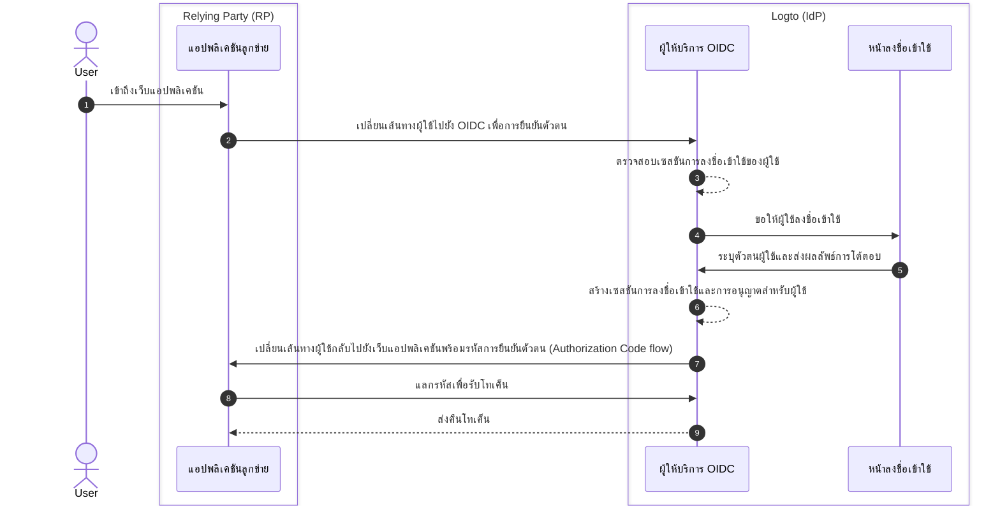

# การออกจากระบบ (Sign-out)

กระบวนการออกจากระบบใน Logto (ในฐานะผู้ให้บริการข้อมูลระบุตัวตนตาม OIDC) เป็นแนวคิดที่มีหลายมิติ เนื่องจากเกี่ยวข้องทั้งเซสชันการลงชื่อเข้าใช้แบบศูนย์กลางที่จัดการโดย Logto และสถานะการยืนยันตัวตนแบบกระจายที่จัดการโดยแอปพลิเคชันลูกข่าย

## เซสชันการลงชื่อเข้าใช้ (Sign-in session) \{#sign-in-session}

เพื่อให้เข้าใจกระบวนการออกจากระบบได้ดีขึ้น สิ่งสำคัญคือต้องเข้าใจก่อนว่าเซสชันการลงชื่อเข้าใช้ของผู้ใช้และสถานะการยืนยันตัวตนถูกจัดการอย่างไรใน Logto



1. ผู้ใช้เข้าถึงเว็บแอปพลิเคชัน (RP)
2. แอปพลิเคชันลูกข่ายเปลี่ยนเส้นทางผู้ใช้ไปยัง Logto (IdP) เพื่อ [การยืนยันตัวตน (Authentication)](https://auth.wiki/authentication)
3. ผู้ให้บริการ OIDC ตรวจสอบสถานะเซสชันการลงชื่อเข้าใช้ของผู้ใช้ หากไม่มีเซสชันหรือเซสชันหมดอายุ ผู้ใช้จะถูกขอให้ลงชื่อเข้าใช้
4. ผู้ใช้โต้ตอบกับหน้าลงชื่อเข้าเพื่อรับการยืนยันตัวตน
5. หลังจากลงชื่อเข้าใช้สำเร็จ Logto จะสร้างเซสชันใหม่ให้ผู้ใช้และเปลี่ยนเส้นทางกลับไปยังแอปพลิเคชันลูกข่ายพร้อมรหัสการอนุญาต
6. ผู้ให้บริการ OIDC สร้างเซสชันการลงชื่อเข้าใช้และการอนุญาตใหม่ให้ผู้ใช้
7. ผู้ให้บริการ OIDC เปลี่ยนเส้นทางผู้ใช้กลับไปยังลูกข่ายพร้อมรหัสการยืนยันตัวตน ([Authorization Code flow](https://auth.wiki/authorization-code-flow))
8. ลูกข่ายได้รับรหัสการยืนยันตัวตนและแลกเปลี่ยนเป็นโทเค็นเพื่อเข้าถึงข้อมูลผู้ใช้
9. มอบโทเค็นให้แอปพลิเคชันลูกข่าย

## องค์ประกอบ (Components) \{#components}

### เซสชันการลงชื่อเข้าใช้แบบศูนย์กลางที่จัดการโดย Logto \{#centralized-sign-in-session-managed-by-logto}

ในโฟลว์ข้างต้น เซสชันการลงชื่อเข้าใช้แบบศูนย์กลางถูกจัดการโดย Logto เซสชันจะถูกสร้างขึ้นเมื่อผู้ใช้ลงชื่อเข้าใช้สำเร็จ และจะถูกทำลายเมื่อผู้ใช้ออกจากระบบ หรือเมื่อเซสชันหมดอายุ

เซสชันการลงชื่อเข้าใช้ของ Logto ถูกจัดการด้วยคุกกี้เซสชัน โดยคุกกี้เซสชันจะถูกตั้งค่าเมื่อผู้ใช้ลงชื่อเข้าใช้ คำขอการยืนยันตัวตนทั้งหมดจะถูกตรวจสอบกับคุกกี้เซสชัน หากคุกกี้เซสชันมีอยู่และถูกต้อง ผู้ใช้จะได้รับการยืนยันตัวตนโดยอัตโนมัติและถูกเปลี่ยนเส้นทางกลับไปยังแอปพลิเคชันลูกข่ายพร้อมรหัสการอนุญาต หากไม่เช่นนั้น ผู้ใช้จะถูกขอให้ลงชื่อเข้าใช้

1. คุกกี้เซสชัน Logto ที่ใช้ร่วมกัน
   สำหรับผู้ใช้ที่ลงชื่อเข้าใช้หลายแอปพลิเคชันลูกข่ายจาก user agent เดียวกัน (เช่น เบราว์เซอร์) ผู้ใช้จะมีคุกกี้เซสชันร่วมกันภายใต้โดเมน Logto ซึ่งหมายความว่าผู้ใช้ต้องลงชื่อเข้าใช้เพียงครั้งเดียวและจะได้รับการยืนยันตัวตนโดยอัตโนมัติสำหรับแอปพลิเคชันลูกข่ายอื่น ๆ

   ```mermaid
    flowchart TD
    subgraph User [User agent A]
      U[ผู้ใช้]

      subgraph Layer1 [Client domain A]
        A[แอปพลิเคชันลูกข่าย A]
      end

      subgraph Layer1 [Client domain B]
        B[แอปพลิเคชันลูกข่าย B]
      end

      subgraph Layer2 [Logto domain]
          C{{เซสชันการลงชื่อเข้าใช้ Logto?}}
          D[หน้าลงชื่อเข้าใช้]
      end
    end

    U --> |ลงชื่อเข้าใช้| A
    A --> |เปลี่ยนเส้นทางไป Logto| C
    U --> |ลงชื่อเข้าใช้| B
    B --> |เปลี่ยนเส้นทางไป Logto| C
    C --> |ไม่| D
    D --> |สร้างเซสชัน| C
   ```

2. คุกกี้เซสชัน Logto แบบแยก
   สำหรับผู้ใช้ที่ลงชื่อเข้าใช้แอปพลิเคชันลูกข่ายต่าง ๆ จากอุปกรณ์หรือเบราว์เซอร์ต่างกัน ผู้ใช้จะมีคุกกี้เซสชันแยกกันภายใต้โดเมน Logto ซึ่งหมายความว่าผู้ใช้ต้องลงชื่อเข้าใช้แต่ละแอปพลิเคชันลูกข่ายแยกกัน

   ```mermaid
    flowchart TD
    U[ผู้ใช้]

    subgraph DeviceA [User agent A]
      subgraph Layer1 [Client domain A]
        A[แอปพลิเคชันลูกข่าย A]
      end

      subgraph Layer2 [Logto domain]
          C{{เซสชันการลงชื่อเข้าใช้ Logto?}}
          D[หน้าลงชื่อเข้าใช้]
      end
    end

    subgraph DeviceB [User agent B]
      subgraph Layer3 [Client domain B]
        B[แอปพลิเคชันลูกข่าย B]
      end

      subgraph Layer4 [Logto domain]
          E{{เซสชันการลงชื่อเข้าใช้ Logto?}}
          F[หน้าลงชื่อเข้าใช้]
      end
    end

    U --> |ลงชื่อเข้าใช้| A
    A --> |เปลี่ยนเส้นทางไป Logto| C
    U --> |ลงชื่อเข้าใช้| B
    B --> |เปลี่ยนเส้นทางไป Logto| E
    C --> |ไม่| D
    E --> |ไม่| F
    D --> |สร้างเซสชัน| C
    F --> |สร้างเซสชัน| E
   ```

## สถานะการยืนยันตัวตนแบบกระจายที่จัดการโดยแอปพลิเคชันลูกข่าย \{#distributed-authentication-status-managed-by-the-client-applications}

แต่ละแอปพลิเคชันลูกข่ายจะจัดการสถานะการยืนยันตัวตนของตนเอง ไม่ว่าจะเป็น Native, SPA หรือ Web application ต่างก็มีวิธีจัดการสถานะการยืนยันตัวตนของผู้ใช้ในแบบของตน

เมื่อผู้ใช้ลงชื่อเข้าใช้สำเร็จ แอปพลิเคชันลูกข่ายอาจได้รับ [โทเค็น ID (ID token)](https://auth.wiki/id-token) และ [โทเค็นการเข้าถึง (access token)](https://auth.wiki/access-token) แอปพลิเคชันลูกข่ายสามารถใช้โทเค็น ID เพื่อระบุตัวตนของผู้ใช้ และใช้โทเค็นการเข้าถึงเพื่อเข้าถึงทรัพยากรของผู้ใช้ สถานะการยืนยันตัวตนของผู้ใช้จะถูกกำหนดโดยเวลาหมดอายุของโทเค็นการเข้าถึง

- แอป Native และ SPA:
  แอปพลิเคชันลูกข่ายต้องจัดเก็บและจัดการโทเค็นเหล่านี้อย่างปลอดภัยเพื่อรักษาสถานะการยืนยันตัวตนของผู้ใช้ เช่น เก็บโทเค็นใน local storage หรือ session storage และลบโทเค็นเมื่อผู้ใช้ออกจากระบบ
- แอป Web:
  เว็บแอป เช่น ที่สร้างด้วยเฟรมเวิร์กอย่าง Next.js มักจะจัดการเซสชันของผู้ใช้ที่ลงชื่อเข้าใช้ควบคู่กับโทเค็นที่ออกโดย Logto เมื่อผู้ใช้ลงชื่อเข้าใช้และเว็บแอปได้รับโทเค็นจาก Logto สามารถเก็บโทเค็นฝั่ง client เช่นเดียวกับ SPA หรือเก็บโทเค็นฝั่ง server และจัดการเซสชันด้วยคุกกี้หรือกลไกอื่น

## กลไกการออกจากระบบ (Sign-out mechanisms) \{#sign-out-mechanisms}

### ลบโทเค็นและเซสชันภายในเครื่องที่ฝั่งลูกข่าย \{#clear-tokens-and-local-session-at-the-client-side}

ที่ฝั่งลูกข่าย การออกจากระบบแบบง่ายคือการลบเซสชันภายในเครื่องและลบโทเค็น (ID token, access token, refresh token) ออกจาก local storage หรือ session storage ผลลัพธ์คือการออกจากระบบเฉพาะฝั่ง client โดยเซสชันศูนย์กลางยังคงอยู่ ผู้ใช้ที่ออกจากระบบด้วยวิธีนี้อาจยังสามารถเข้าถึงแอปพลิเคชันอื่น ๆ ที่อยู่ภายใต้เซสชัน authorization server เดียวกันได้จนกว่าเซสชันศูนย์กลางจะหมดอายุหรือถูกทำลายโดยตรง

### ลบเซสชันการลงชื่อเข้าใช้ที่ Logto \{#clear-sign-in-session-at-logto}

หากต้องการออกจากระบบอย่างชัดเจนและลบเซสชันที่ Logto แอปพลิเคชันลูกข่ายต้องเปลี่ยนเส้นทางผู้ใช้ไปยัง **end session endpoint** ของ Logto

เช่น `https://{your-logto-domain}/oidc/session/end`

**end session endpoint** เป็น endpoint มาตรฐานของ OIDC ที่อนุญาตให้แอปพลิเคชันลูกข่ายแจ้ง authorization server ว่าผู้ใช้ได้ออกจากระบบแล้ว Endpoint นี้จะลบเซสชันการลงชื่อเข้าใช้แบบศูนย์กลางที่ Logto

เมื่อเซสชันถูกลบแล้ว คำขอ authorization ใด ๆ ถัดไปจะต้องให้ผู้ใช้ลงชื่อเข้าใช้อีกครั้ง

หากมีการระบุ **post-logout redirect URI** ผู้ใช้จะถูกเปลี่ยนเส้นทางไปยัง URI ที่ระบุหลังจากเซสชันถูกลบ มิฉะนั้นผู้ใช้จะถูกเปลี่ยนเส้นทางไปยังหน้าหลังออกจากระบบเริ่มต้นที่โฮสต์โดย Logto

## Federated sign-out: Back-channel logout \{#federated-sign-out-back-channel-logout}

เพื่อการจัดการออกจากระบบที่สอดคล้องกันมากขึ้น Logto รองรับ [back-channel logout](https://openid.net/specs/openid-connect-backchannel-1_0-final.html) ซึ่งเป็นกลไกที่ Logto สามารถแจ้งแอปพลิเคชันลูกข่ายทั้งหมดที่อยู่ภายใต้เซสชันการลงชื่อเข้าใช้เดียวกันเมื่อผู้ใช้ออกจากระบบ

สิ่งนี้มีประโยชน์อย่างยิ่งในกรณีที่ผู้ใช้ออกจากระบบจากแอปพลิเคชันลูกข่ายหนึ่งและคาดว่าจะออกจากระบบจากแอปพลิเคชันลูกข่ายอื่น ๆ ทั้งหมดที่อยู่ภายใต้เซสชันการลงชื่อเข้าใช้ Logto เดียวกัน

หากต้องการเปิดใช้งาน back-channel logout สำหรับแอปพลิเคชันลูกข่ายของคุณ ให้ไปที่หน้ารายละเอียดแอปพลิเคชันใน Logto dashboard และลงทะเบียน back-channel logout URI Logto จะส่ง logout token ไปยัง URI ที่ลงทะเบียนทั้งหมดเมื่อผู้ใช้เริ่มคำขอออกจากระบบจากแอปพลิเคชันลูกข่ายใด ๆ

หากแอปพลิเคชันลูกข่ายของคุณต้องการให้เซสชันการลงชื่อเข้าใช้ถูกรวมอยู่ใน logout token ให้เปิดการตั้งค่า `Is session required` ในการตั้งค่า back-channel logout จะมี `sid` claim รวมอยู่ใน logout token เพื่อระบุเซสชันการลงชื่อเข้าใช้ของผู้ใช้ที่ Logto

1. ผู้ใช้เริ่มคำขอออกจากระบบจากแอปพลิเคชันลูกข่ายหนึ่ง
2. Logto รับคำขอ end session สร้าง logout token และส่ง logout token ไปยัง URI back-channel logout ที่ลงทะเบียนทั้งหมด
3. แต่ละแอปพลิเคชันลูกข่ายได้รับ logout token และดำเนินการออกจากระบบ

การดำเนินการออกจากระบบสำหรับแต่ละแอปพลิเคชันลูกข่ายเมื่อได้รับ logout token:

- ตรวจสอบความถูกต้องของ logout token
- ลบเซสชันภายในเครื่องและลบโทเค็นออกจาก local storage หรือ session storage

## วิธีการออกจากระบบใน Logto SDKs \{#sign-out-methods-in-logto-sdks}

หากคุณผสาน Logto กับแอปพลิเคชันลูกข่ายของคุณโดยใช้ SDK ของ Logto:

- สำหรับ SPA และเว็บแอปพลิเคชัน เมธอด `client.signOut()` จะลบโทเค็นที่เก็บไว้ในเครื่องและเปลี่ยนเส้นทางผู้ใช้ไปยัง end session endpoint ของ Logto คุณสามารถระบุ **post-logout redirect URI** เพื่อเปลี่ยนเส้นทางผู้ใช้หลังจากเซสชันถูกลบ
- สำหรับแอปพลิเคชัน native (รวมถึง hybrid เช่น **React Native** และ **Flutter**) จะลบเฉพาะโทเค็นที่เก็บไว้ในเครื่องเท่านั้น เนื่องจากในแอป native จะใช้ sessionless webview ในการจัดการกระบวนการลงชื่อเข้าใช้ ไม่มีคุกกี้เซสชันถูกเก็บไว้ในเบราว์เซอร์ native จึงไม่จำเป็นต้องลบเซสชันการลงชื่อเข้าใช้ที่ Logto คำขอการยืนยันตัวตนแต่ละครั้งเป็นคำขอแบบเดี่ยวที่ไม่มีคุกกี้เซสชัน

:::note
สำหรับแอป native ที่ไม่รองรับ sessionless webview หรือไม่รู้จักการตั้งค่า `emphasized` (แอป Android ที่ใช้ **React Native** หรือ **Flutter** SDK) คุณสามารถบังคับให้ผู้ใช้ต้องลงชื่อเข้าใช้อีกครั้งโดยส่งพารามิเตอร์ `prompt=login` ในคำขอการอนุญาต
:::

## บังคับให้ยืนยันตัวตนใหม่ทุกครั้งที่เข้าถึง \{#enforce-re-authentication-on-every-access}

ในกรณีที่ต้องการความปลอดภัยสูง เช่น การตรวจสอบตัวตนผู้ใช้ก่อนดำเนินการที่สำคัญ คุณอาจต้องการให้ผู้ใช้ยืนยันตัวตนใหม่ทุกครั้งที่เข้าถึง เพื่อบังคับพฤติกรรมนี้ ให้เพิ่ม `prompt=login` ในคำขอการยืนยันตัวตนของคุณ

การตั้งค่า `prompt=login` จะบังคับให้ Logto แสดงหน้าลงชื่อเข้าใช้เสมอ ไม่ว่าผู้ใช้จะมีเซสชันที่ใช้งานอยู่หรือเพิ่งลงชื่อเข้าใช้ก็ตาม วิธีนี้จะข้ามพฤติกรรม Single Sign-On (SSO) และทำให้แน่ใจว่าผู้ใช้ต้องกรอกข้อมูลรับรองทุกครั้ง

หากแอปของคุณร้องขอขอบเขต offline_access (เพื่อรับโทเค็นรีเฟรช) ข้อกำหนดของ OpenID Connect ระบุว่าคุณต้องรวม `prompt=consent` ด้วย
ในกรณีส่วนใหญ่ หากต้องการทั้งบังคับยืนยันตัวตนใหม่และรับโทเค็นรีเฟรช ให้ตั้งค่า:

```
prompt=login consent
```

สิ่งนี้รับประกันว่าผู้ใช้จะได้รับการยืนยันตัวตนใหม่และให้ความยินยอมสำหรับ offline access อย่างชัดเจน

## คำถามที่พบบ่อย (FAQs) \{#faqs}

<details>
  <summary>

### ฉันไม่ได้รับการแจ้งเตือน back-channel logout \{#im-not-receiving-the-back-channel-logout-notifications}

</summary>

- ตรวจสอบว่าได้ลงทะเบียน back-channel logout URI อย่างถูกต้องใน Logto dashboard แล้ว
- ตรวจสอบว่าแอปพลิเคชันลูกข่ายของคุณมีเซสชันการลงชื่อเข้าใช้ที่ถูกต้องและเป็นเซสชันเดียวกับที่เริ่มคำขอออกจากระบบ

</details>

## แหล่งข้อมูลที่เกี่ยวข้อง \{#related-resources}

<Url href="https://blog.logto.io/oidc-back-channel-logout/">
  ทำความเข้าใจ OIDC back-channel logout
</Url>
