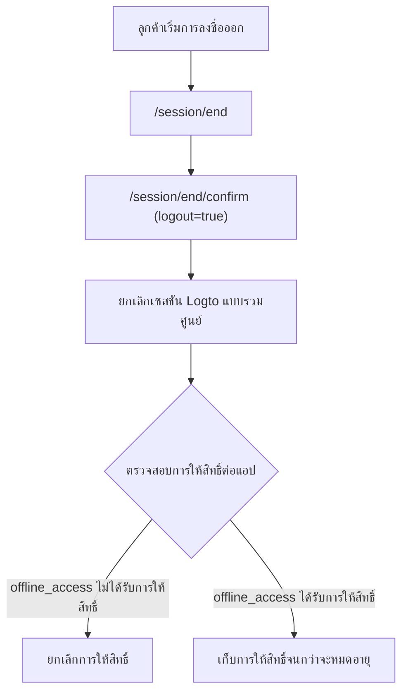

# การลงชื่อออก

การลงชื่อออกใน Logto ประกอบด้วยสองชั้น:

- **การลงชื่อออกจากเซสชัน Logto**: สิ้นสุดเซสชันการลงชื่อเข้าใช้แบบรวมศูนย์ภายใต้โดเมน Logto
- **การลงชื่อออกจากแอป**: ล้างสถานะเซสชันและโทเค็นในแอปพลิเคชันลูกค้าของคุณ

เพื่อให้เข้าใจวิธีการทำงานของเซสชันใน Logto ได้ดีขึ้น ดูที่ [Sessions](/sessions)

## กลไกการลงชื่อออก \{#sign-out-mechanisms}

### 1) การลงชื่อออกเฉพาะฝั่งลูกค้า \{#1-client-side-only-sign-out}

แอปพลิเคชันลูกค้าล้างเซสชันและโทเค็น (โทเค็น ID / โทเค็นการเข้าถึง / โทเค็นรีเฟรช) ของตัวเอง ซึ่งจะลงชื่อผู้ใช้ออกจากสถานะภายในแอปนั้นเท่านั้น

- เซสชัน Logto อาจยังคงใช้งานอยู่
- แอปอื่น ๆ ภายใต้เซสชัน Logto เดียวกันอาจยังคง SSO ได้

### 2) สิ้นสุดเซสชันที่ Logto (การลงชื่อออกแบบรวมศูนย์ใน Logto ปัจจุบัน) \{#2-end-session-at-logto-global-sign-out-in-current-logto-implementation}

เพื่อเคลียร์เซสชัน Logto แบบรวมศูนย์ แอปจะเปลี่ยนเส้นทางผู้ใช้ไปยังจุดสิ้นสุดเซสชัน เช่น:

`https://{your-logto-domain}/oidc/session/end`

ในพฤติกรรม SDK ของ Logto ปัจจุบัน:

1. `signOut()` เปลี่ยนเส้นทางไปที่ `/session/end`
2. จากนั้นไปที่ `/session/end/confirm`
3. ฟอร์มยืนยันเริ่มต้นจะโพสต์ `logout=true` โดยอัตโนมัติ

ผลลัพธ์คือการลงชื่อออกใน SDK ปัจจุบันถือเป็น **การลงชื่อออกแบบรวมศูนย์**

:::note

- **การลงชื่อออกแบบรวมศูนย์**: ยกเลิกเซสชัน Logto แบบรวมศูนย์

:::

### เกิดอะไรขึ้นระหว่างการลงชื่อออกแบบรวมศูนย์ \{#what-happens-during-global-sign-out}


```mermaid
flowchart TD
  A["ลูกค้าเริ่มการลงชื่อออก"] --> B["/session/end"]
  B --> C["/session/end/confirm (logout=true)"]
  C --> D["ยกเลิกเซสชัน Logto แบบรวมศูนย์"]
  D --> E{"ตรวจสอบการให้สิทธิ์ต่อแอป"}
  E -->|"offline_access ไม่ได้รับการให้สิทธิ์"| F["ยกเลิกการให้สิทธิ์"]
  E -->|"offline_access ได้รับการให้สิทธิ์"| G["เก็บการให้สิทธิ์จนกว่าจะหมดอายุ"]
```

ระหว่างการลงชื่อออกแบบรวมศูนย์:

- เซสชัน Logto แบบรวมศูนย์ถูกยกเลิก
- การให้สิทธิ์แอปที่เกี่ยวข้องจะถูกจัดการตามสถานะการอนุญาตของแอป:
  - หาก `offline_access` **ไม่ได้** รับการให้สิทธิ์ การให้สิทธิ์ที่เกี่ยวข้องจะถูกยกเลิก
  - หาก `offline_access` **ได้รับ** การให้สิทธิ์ การให้สิทธิ์จะไม่ถูกยกเลิกโดยการสิ้นสุดเซสชัน
- สำหรับกรณี `offline_access` โทเค็นรีเฟรชและการให้สิทธิ์ยังคงใช้ได้จนกว่าจะหมดอายุ

## อายุการให้สิทธิ์และผลกระทบของ `offline_access` \{#grant-lifetime-and-offline-access-impact}

- ค่าเริ่มต้นของอายุการให้สิทธิ์ Logto คือ **180 วัน**
- หาก `offline_access` ได้รับการให้สิทธิ์ การสิ้นสุดเซสชันจะไม่ยกเลิกการให้สิทธิ์แอปนั้นโดยค่าเริ่มต้น
- โซ่โทเค็นรีเฟรชที่เกี่ยวข้องกับการให้สิทธิ์นั้นสามารถดำเนินต่อไปได้จนกว่าการให้สิทธิ์จะหมดอายุ (หรือถูกยกเลิกโดยเฉพาะ)

## การลงชื่อออกแบบรวมศูนย์: การออกจากระบบผ่านช่องทางหลัง \{#federated-sign-out-back-channel-logout}

เพื่อความสอดคล้องระหว่างแอป Logto รองรับ [การออกจากระบบผ่านช่องทางหลัง](https://openid.net/specs/openid-connect-backchannel-1_0-final.html)

เมื่อผู้ใช้ลงชื่อออกจากแอปหนึ่ง Logto สามารถแจ้งเตือนแอปทั้งหมดที่เข้าร่วมในเซสชันเดียวกันโดยส่งโทเค็นออกจากระบบไปยัง URI การออกจากระบบผ่านช่องทางหลังที่ลงทะเบียนไว้ของแต่ละแอป

หาก `Is session required` เปิดใช้งานในการตั้งค่าช่องทางหลังของแอป โทเค็นออกจากระบบจะรวม `sid` เพื่อระบุเซสชัน Logto

กระบวนการทั่วไป:

1. ผู้ใช้เริ่มการลงชื่อออกจากแอปหนึ่ง
2. Logto ประมวลผลการสิ้นสุดเซสชันและส่งโทเค็นออกจากระบบไปยัง URI การออกจากระบบผ่านช่องทางหลังที่ลงทะเบียนไว้
3. แต่ละแอปตรวจสอบโทเค็นออกจากระบบและล้างเซสชัน / โทเค็นภายในของตัวเอง

## วิธีการลงชื่อออกใน Logto SDKs \{#sign-out-methods-in-logto-sdks}

- **SPA และเว็บ**: `client.signOut()` ล้างการเก็บโทเค็นภายในและเปลี่ยนเส้นทางไปยังจุดสิ้นสุดเซสชัน Logto คุณสามารถระบุ URI เปลี่ยนเส้นทางหลังการออกจากระบบได้
- **เนทีฟ (รวมถึง React Native / Flutter)**: มักจะล้างการเก็บโทเค็นภายในเท่านั้น เว็บวิวที่ไม่มีเซสชันหมายถึงไม่มีคุกกี้เบราว์เซอร์ Logto ที่คงอยู่ให้ล้าง

:::note
สำหรับแอปพลิเคชันเนทีฟที่ไม่รองรับเว็บวิวที่ไม่มีเซสชันหรือไม่รู้จักการตั้งค่าที่ `emphasized` (แอป Android ที่ใช้ **React Native** หรือ **Flutter** SDK) คุณสามารถบังคับให้ผู้ใช้ลงชื่อเข้าใช้อีกครั้งโดยส่งพารามิเตอร์ `prompt=login` ในคำขอการอนุญาต
:::

## บังคับการยืนยันตัวตนใหม่ทุกครั้งที่เข้าถึง \{#enforce-re-authentication-on-every-access}

สำหรับการดำเนินการที่มีความปลอดภัยสูง ให้รวม `prompt=login` ในคำขอการยืนยันตัวตนเพื่อข้าม SSO และบังคับให้ป้อนข้อมูลรับรองทุกครั้ง

หากขอ `offline_access` (เพื่อรับโทเค็นรีเฟรช) ให้รวม `consent`, `prompt=login consent`

การตั้งค่ารวมทั่วไป:

```txt
prompt=login consent
```

## คำถามที่พบบ่อย \{#faqs}

<details>
  <summary>

### ฉันไม่ได้รับการแจ้งเตือนการออกจากระบบผ่านช่องทางหลัง \{#im-not-receiving-the-back-channel-logout-notifications}

</summary>

- ตรวจสอบให้แน่ใจว่า URI การออกจากระบบผ่านช่องทางหลังลงทะเบียนถูกต้องในแดชบอร์ด Logto
- ตรวจสอบให้แน่ใจว่าแอปของคุณมีสถานะการลงชื่อเข้าใช้ที่ใช้งานอยู่สำหรับบริบทผู้ใช้ / เซสชันเดียวกัน

</details>

## แหล่งข้อมูลที่เกี่ยวข้อง \{#related-resources}

<Url href="https://blog.logto.io/oidc-back-channel-logout/">
  ทำความเข้าใจการออกจากระบบผ่านช่องทางหลังของ OIDC
</Url>
