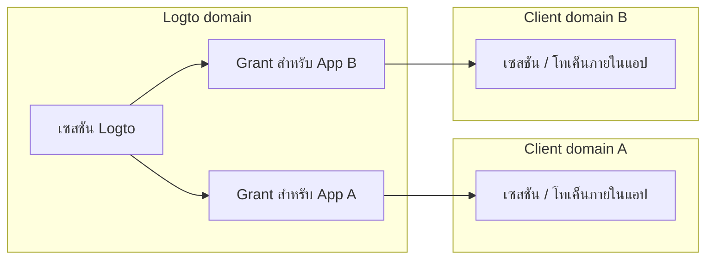
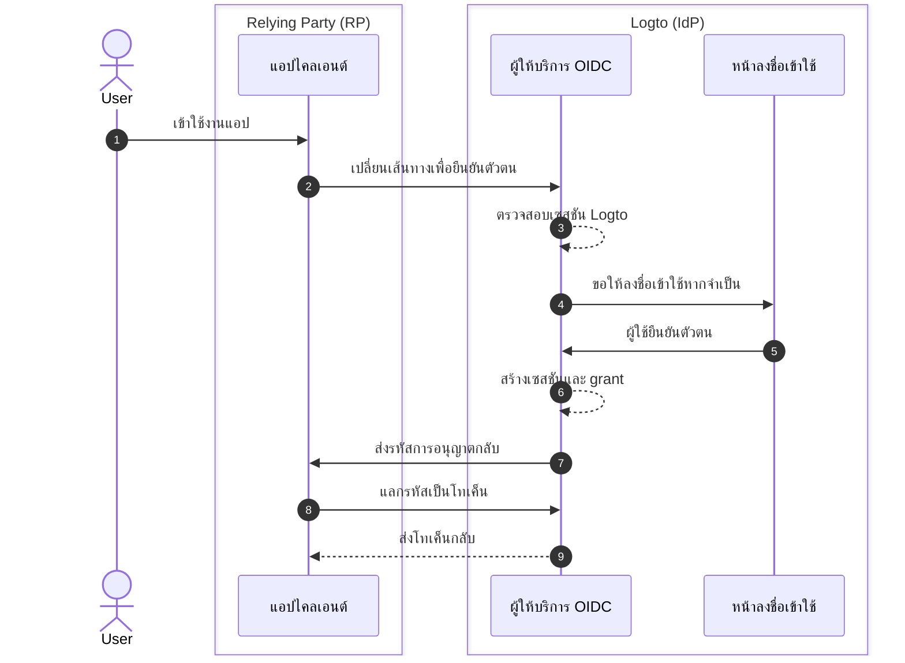
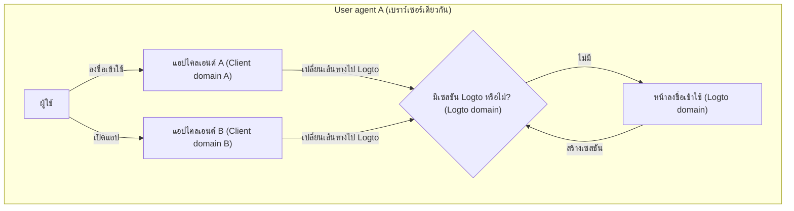
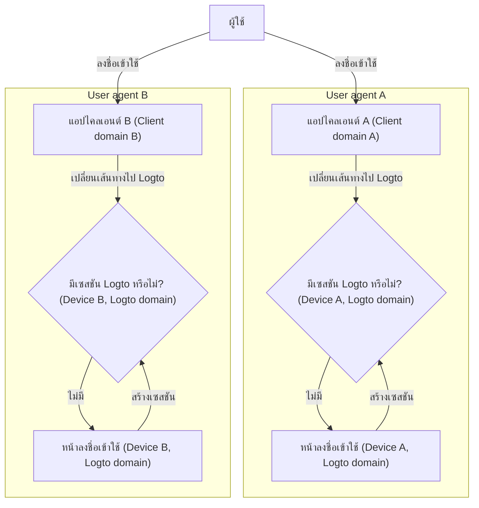
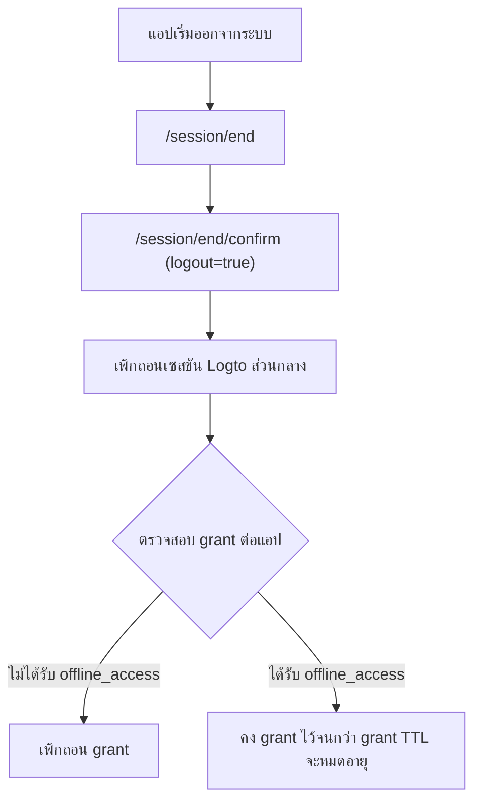

# การออกจากระบบ (Sign-out)

การออกจากระบบใน Logto (ในฐานะผู้ให้บริการข้อมูลระบุตัวตน OIDC) เกี่ยวข้องกับทั้ง:

- **เซสชัน Logto ส่วนกลาง** (คุกกี้เบราว์เซอร์ภายใต้โดเมน Logto)
- **สถานะการยืนยันตัวตนฝั่งไคลเอนต์แบบกระจาย** (โทเค็นและเซสชันแอปในแต่ละแอป)

เพื่อให้เข้าใจพฤติกรรมการออกจากระบบ ควรแยกสองชั้นนี้ออกจากกัน แล้วดูว่า **grant** เชื่อมโยงกันอย่างไร

## แนวคิดหลัก \{#core-concepts}

### เซสชัน Logto คืออะไร? \{#what-is-a-logto-session}

เซสชัน Logto คือสถานะการลงชื่อเข้าใช้ส่วนกลางที่จัดการโดย Logto สร้างขึ้นหลังจากการยืนยันตัวตนสำเร็จ และแสดงด้วยคุกกี้ภายใต้โดเมน Logto

หากคุกกี้เซสชันยังใช้ได้ ผู้ใช้สามารถยืนยันตัวตนแบบเงียบ (SSO) ข้ามหลายแอปที่เชื่อถือ Logto tenant เดียวกันได้

หากไม่มีเซสชันที่ถูกต้อง Logto จะแสดงหน้าลงชื่อเข้าใช้

### Grant คืออะไร? \{#what-are-grants}

**Grant** แทนสถานะการอนุญาตสำหรับผู้ใช้ + แอปไคลเอนต์แต่ละคู่

- เซสชัน Logto หนึ่งอันสามารถมี grant สำหรับหลายแอปไคลเอนต์
- Grant คือสิ่งที่โทเค็นที่ออกให้ผูกอยู่ด้วย
- ในชุดเอกสารนี้ ใช้ **grant** เป็นหน่วยการอนุญาตข้ามแอป

### ความสัมพันธ์ระหว่างเซสชัน, grant, และสถานะการยืนยันตัวตนของไคลเอนต์ \{#how-session-grants-and-client-auth-status-relate}


```mermaid
flowchart LR
  subgraph Logto [Logto domain]
    S[เซสชัน Logto]
    G1[Grant สำหรับ App A]
    G2[Grant สำหรับ App B]
  end

  subgraph AppA [Client domain A]
    A[เซสชัน / โทเค็นภายในแอป]
  end

  subgraph AppB [Client domain B]
    B[เซสชัน / โทเค็นภายในแอป]
  end

  S --> G1
  S --> G2
  G1 --> A
  G2 --> B
```

- **เซสชัน Logto** ควบคุมประสบการณ์ SSO ส่วนกลาง
- **เซสชัน / โทเค็นภายในแอป** ควบคุมว่าผู้ใช้ยังถือว่า “ลงชื่อเข้าใช้” ในแต่ละแอปหรือไม่
- **Grant** เชื่อมสองโลกนี้ด้วยการแทนสถานะการอนุญาตเฉพาะแอป

## ทบทวนการลงชื่อเข้าใช้ (เหตุใดการออกจากระบบจึงมีหลายชั้น) \{#sign-in-recap-why-sign-out-is-multi-layered}


```mermaid
sequenceDiagram
  autonumber
  actor User

  box Relying Party (RP)
    participant Client as แอปไคลเอนต์
  end

  box Logto (IdP)
    participant OIDC as ผู้ให้บริการ OIDC
    participant SignIn as หน้าลงชื่อเข้าใช้
  end

  User ->> Client: เข้าใช้งานแอป
  Client ->> OIDC: เปลี่ยนเส้นทางเพื่อยืนยันตัวตน
  OIDC -->> OIDC: ตรวจสอบเซสชัน Logto
  OIDC ->> SignIn: ขอให้ลงชื่อเข้าใช้หากจำเป็น
  SignIn ->> OIDC: ผู้ใช้ยืนยันตัวตน
  OIDC -->> OIDC: สร้างเซสชันและ grant
  OIDC ->> Client: ส่งรหัสการอนุญาตกลับ
  Client ->> OIDC: แลกรหัสเป็นโทเค็น
  OIDC -->> Client: ส่งโทเค็นกลับ
```

## โทโพโลยีเซสชันข้ามแอป / อุปกรณ์ \{#session-topology-across-apps-devices}

### คุกกี้เซสชันร่วม (เบราว์เซอร์ / user agent เดียวกัน) \{#shared-session-cookie-same-browser-user-agent}

หากผู้ใช้ลงชื่อเข้าใช้หลายแอปจากเบราว์เซอร์เดียวกัน แอปเหล่านั้นสามารถใช้คุกกี้เซสชัน Logto เดียวกันและใช้ SSO ได้


```mermaid
flowchart TD
  U[ผู้ใช้]
  A["แอปไคลเอนต์ A (Client domain A)"]
  B["แอปไคลเอนต์ B (Client domain B)"]
  C{"มีเซสชัน Logto หรือไม่? (Logto domain)"}
  D["หน้าลงชื่อเข้าใช้ (Logto domain)"]

  subgraph UA["User agent A (เบราว์เซอร์เดียวกัน)"]
    U
    A
    B
    C
    D
  end

  U -->|ลงชื่อเข้าใช้| A
  A -->|เปลี่ยนเส้นทางไป Logto| C
  U -->|เปิดแอป| B
  B -->|เปลี่ยนเส้นทางไป Logto| C
  C -->|ไม่มี| D
  D -->|สร้างเซสชัน| C
```

### คุกกี้เซสชันแยก (อุปกรณ์ / เบราว์เซอร์ต่างกัน) \{#isolated-session-cookies-different-devices-browsers}

เบราว์เซอร์ / อุปกรณ์ต่างกันจะถือคุกกี้ Logto คนละชุด ทำให้สถานะเซสชันแยกจากกัน


```mermaid
flowchart TD
  U[ผู้ใช้]
  A["แอปไคลเอนต์ A (Client domain A)"]
  C{"มีเซสชัน Logto หรือไม่? (Device A, Logto domain)"}
  D["หน้าลงชื่อเข้าใช้ (Device A, Logto domain)"]

  subgraph DeviceA["User agent A"]
    A
    C
    D
  end

  B["แอปไคลเอนต์ B (Client domain B)"]
  E{"มีเซสชัน Logto หรือไม่? (Device B, Logto domain)"}
  F["หน้าลงชื่อเข้าใช้ (Device B, Logto domain)"]

  subgraph DeviceB["User agent B"]
    B
    E
    F
  end

  U -->|ลงชื่อเข้าใช้| A
  A -->|เปลี่ยนเส้นทางไป Logto| C
  U -->|ลงชื่อเข้าใช้| B
  B -->|เปลี่ยนเส้นทางไป Logto| E
  C -->|ไม่มี| D
  E -->|ไม่มี| F
  D -->|สร้างเซสชัน| C
  F -->|สร้างเซสชัน| E
```

## กลไกการออกจากระบบ \{#sign-out-mechanisms}

### 1) ออกจากระบบเฉพาะฝั่งไคลเอนต์ \{#1-client-side-only-sign-out}

แอปไคลเอนต์ล้างเซสชันและโทเค็นภายในแอปของตนเอง (โทเค็น ID / การเข้าถึง / รีเฟรช) ผู้ใช้จะออกจากสถานะในแอปนั้นเท่านั้น

- เซสชัน Logto อาจยังคงอยู่
- แอปอื่นที่อยู่ภายใต้เซสชัน Logto เดียวกันยังคงใช้ SSO ได้

### 2) End-session ที่ Logto (ออกจากระบบทั่วทั้งระบบใน Logto เวอร์ชันปัจจุบัน) \{#2-end-session-at-logto-global-sign-out-in-current-logto-implementation}

เพื่อล้างเซสชัน Logto ส่วนกลาง แอปจะเปลี่ยนเส้นทางผู้ใช้ไปยัง endpoint end session เช่น

`https://{your-logto-domain}/oidc/session/end`

ในพฤติกรรม SDK Logto ปัจจุบัน:

1. `signOut()` เปลี่ยนเส้นทางไป `/session/end`
2. จากนั้นไปที่ `/session/end/confirm`
3. ฟอร์มยืนยันเริ่มต้นจะส่ง `logout=true` อัตโนมัติ

ดังนั้น การออกจากระบบผ่าน SDK ปัจจุบันจะถือเป็น **การออกจากระบบทั่วทั้งระบบ**

### เกิดอะไรขึ้นระหว่างการออกจากระบบทั่วทั้งระบบ \{#what-happens-during-global-sign-out}


```mermaid
flowchart TD
  A["แอปเริ่มออกจากระบบ"] --> B["/session/end"]
  B --> C["/session/end/confirm (logout=true)"]
  C --> D["เพิกถอนเซสชัน Logto ส่วนกลาง"]
  D --> E{"ตรวจสอบ grant ต่อแอป"}
  E -->|"ไม่ได้รับ offline_access"| F["เพิกถอน grant"]
  E -->|"ได้รับ offline_access"| G["คง grant ไว้จนกว่า grant TTL จะหมดอายุ"]
```

ระหว่างการออกจากระบบทั่วทั้งระบบ:

- เซสชัน Logto ส่วนกลางจะถูกเพิกถอน
- grant ที่เกี่ยวข้องจะถูกจัดการตามสถานะการอนุญาตของแต่ละแอป:
  - หาก **ไม่ได้** รับ `offline_access` grant ที่เกี่ยวข้องจะถูกเพิกถอน
  - หาก **ได้รับ** `offline_access` grant จะไม่ถูกเพิกถอนโดย end-session
- ในกรณี `offline_access` โทเค็นรีเฟรชและ grant จะยังคงใช้ได้จนกว่า grant จะหมดอายุ

## อายุของ grant และผลกระทบของ `offline_access` \{#grant-lifetime-and-offline-access-impact}

- ค่าเริ่มต้น TTL ของ grant ใน Logto คือ **180 วัน**
- หากได้รับ `offline_access` end-session จะไม่เพิกถอน grant ของแอปนั้นโดยปริยาย
- สายโทเค็นรีเฟรชที่ผูกกับ grant นั้นจะใช้ได้จนกว่า grant จะหมดอายุ (หรือถูกเพิกถอนโดยตรง)

## การออกจากระบบแบบ federated: back-channel logout \{#federated-sign-out-back-channel-logout}

เพื่อความสอดคล้องข้ามแอป Logto รองรับ [back-channel logout](https://openid.net/specs/openid-connect-backchannel-1_0-final.html)

เมื่อผู้ใช้ออกจากระบบจากแอปหนึ่ง Logto สามารถแจ้งทุกแอปที่อยู่ในเซสชันเดียวกันโดยส่ง logout token ไปยัง back-channel logout URI ที่ลงทะเบียนไว้ของแต่ละแอป

หากเปิดใช้งาน `Is session required` ในการตั้งค่า back-channel ของแอป logout token จะมี `sid` เพื่อระบุเซสชัน Logto

ลำดับทั่วไป:

1. ผู้ใช้เริ่มออกจากระบบจากแอปหนึ่ง
2. Logto ประมวลผล end-session และส่ง logout token ไปยัง back-channel logout URI ที่ลงทะเบียนไว้
3. แต่ละแอปตรวจสอบ logout token และล้างเซสชัน / โทเค็นภายในแอปของตนเอง

## วิธีการออกจากระบบใน Logto SDKs \{#sign-out-methods-in-logto-sdks}

- **SPA และเว็บ**: `client.signOut()` ล้างโทเค็นใน local storage และเปลี่ยนเส้นทางไปยัง Logto end-session endpoint คุณสามารถระบุ post-logout redirect URI ได้
- **Native (รวม React Native / Flutter)**: โดยปกติจะล้างโทเค็นใน local storage เท่านั้น webview แบบไม่มีเซสชันหมายถึงไม่มีคุกกี้ Logto ในเบราว์เซอร์ให้ล้าง

:::note
สำหรับแอป native ที่ไม่รองรับ webview แบบไม่มีเซสชัน หรือไม่รู้จักการตั้งค่า `emphasized` (แอป Android ที่ใช้ **React Native** หรือ **Flutter** SDK) คุณสามารถบังคับให้ผู้ใช้ต้องลงชื่อเข้าใช้อีกครั้งโดยส่งพารามิเตอร์ `prompt=login` ในคำขอการยืนยันตัวตน
:::

## บังคับให้ยืนยันตัวตนใหม่ทุกครั้งที่เข้าใช้งาน \{#enforce-re-authentication-on-every-access}

สำหรับการดำเนินการที่ต้องการความปลอดภัยสูง ให้ใส่ `prompt=login` ในคำขอการยืนยันตัวตนเพื่อข้าม SSO และบังคับให้กรอกข้อมูลรับรองทุกครั้ง

หากขอ `offline_access` (เพื่อรับโทเค็นรีเฟรช) ให้ใส่ `consent` ด้วย เช่น `prompt=login consent`

การตั้งค่ารวมที่พบบ่อย:

```txt
prompt=login consent
```

## คำถามที่พบบ่อย \{#faqs}

<details>
  <summary>

### ฉันไม่ได้รับการแจ้งเตือน back-channel logout \{#im-not-receiving-the-back-channel-logout-notifications}

</summary>

- ตรวจสอบว่าได้ลงทะเบียน back-channel logout URI ใน Logto dashboard อย่างถูกต้อง
- ตรวจสอบว่าแอปของคุณมีสถานะลงชื่อเข้าใช้ที่ใช้งานอยู่สำหรับผู้ใช้ / เซสชันเดียวกัน

</details>

## แหล่งข้อมูลที่เกี่ยวข้อง \{#related-resources}

<Url href="https://blog.logto.io/oidc-back-channel-logout/">
  ทำความเข้าใจ OIDC back-channel logout
</Url>
