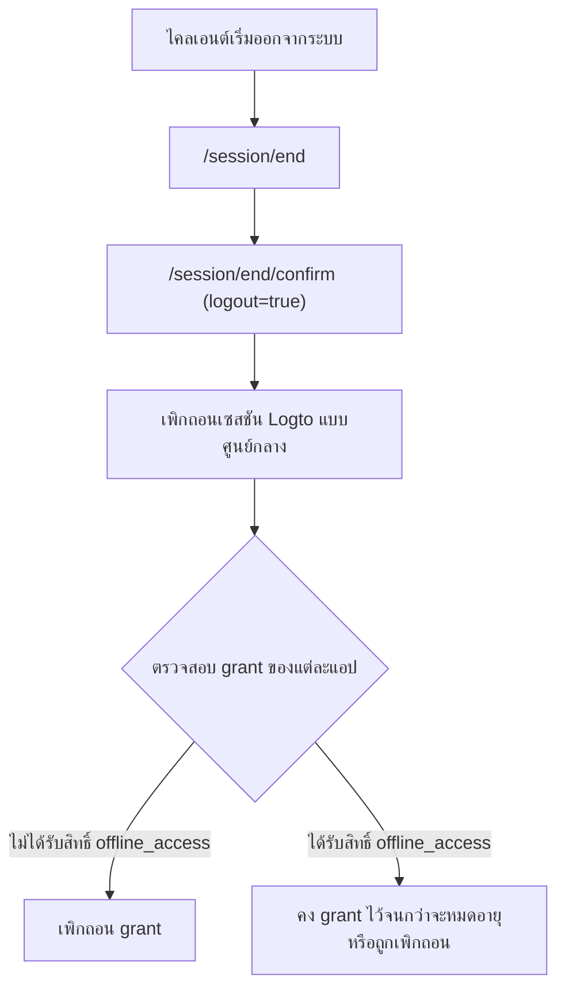

# การออกจากระบบ

การออกจากระบบใน Logto มี 2 ชั้น:

- **การออกจากระบบเซสชัน Logto**: ยุติเซสชันการลงชื่อเข้าใช้แบบศูนย์กลางภายใต้โดเมน Logto
- **การออกจากระบบแอป**: ล้างสถานะเซสชันและโทเค็นในแอปพลิเคชันฝั่งไคลเอนต์ของคุณ

เพื่อเข้าใจการทำงานของเซสชันใน Logto มากขึ้น ดูที่ [เซสชัน](/sessions)

## กลไกการออกจากระบบ \{#sign-out-mechanisms}

### 1) ออกจากระบบเฉพาะฝั่งไคลเอนต์ \{#1-client-side-only-sign-out}

แอปไคลเอนต์จะล้างเซสชันและโทเค็น (โทเค็น ID / การเข้าถึง / รีเฟรช) ของตัวเอง นี่จะเป็นการออกจากระบบเฉพาะสถานะภายในแอปนั้น

- เซสชัน Logto อาจยังคงใช้งานอยู่
- แอปอื่น ๆ ที่อยู่ภายใต้เซสชัน Logto เดียวกันอาจยังคง SSO ได้

### 2) ยุติเซสชันที่ Logto (ออกจากระบบทั่วทั้งระบบใน Logto เวอร์ชันปัจจุบัน) \{#2-end-session-at-logto-global-sign-out-in-current-logto-implementation}

เพื่อเคลียร์เซสชัน Logto แบบศูนย์กลาง แอปจะเปลี่ยนเส้นทางผู้ใช้ไปยัง endpoint สำหรับยุติเซสชัน เช่น

`https://{your-logto-domain}/oidc/session/end`

ในพฤติกรรมของ Logto SDK ปัจจุบัน:

1. `signOut()` จะเปลี่ยนเส้นทางไปที่ `/session/end`
2. จากนั้นจะไปที่ `/session/end/confirm`
3. ฟอร์มยืนยันเริ่มต้นจะส่ง `logout=true` อัตโนมัติ

ผลลัพธ์คือ การออกจากระบบของ SDK ปัจจุบันจะถือเป็น **การออกจากระบบทั่วทั้งระบบ**

:::note

- **การออกจากระบบทั่วทั้งระบบ**: เพิกถอนเซสชัน Logto แบบศูนย์กลาง

:::

### เกิดอะไรขึ้นระหว่างการออกจากระบบทั่วทั้งระบบ \{#what-happens-during-global-sign-out}


```mermaid
flowchart TD
  A["ไคลเอนต์เริ่มออกจากระบบ"] --> B["/session/end"]
  B --> C["/session/end/confirm (logout=true)"]
  C --> D["เพิกถอนเซสชัน Logto แบบศูนย์กลาง"]
  D --> E{"ตรวจสอบ grant ของแต่ละแอป"}
  E -->|"ไม่ได้รับสิทธิ์ offline_access"| F["เพิกถอน grant"]
  E -->|"ได้รับสิทธิ์ offline_access"| G["คง grant ไว้จนกว่าจะหมดอายุหรือถูกเพิกถอน"]
```

ระหว่างการออกจากระบบทั่วทั้งระบบ:

- เซสชัน Logto แบบศูนย์กลางจะถูกเพิกถอน
- grant ที่เกี่ยวข้องกับแอปจะถูกจัดการตามสถานะการอนุญาตของแต่ละแอป:
  - ถ้า **ไม่ได้** รับสิทธิ์ `offline_access` grant ที่เกี่ยวข้องจะถูกเพิกถอน
  - ถ้า **ได้รับ** สิทธิ์ `offline_access` grant จะไม่ถูกเพิกถอนโดย end-session
- ในกรณี `offline_access` โทเค็นรีเฟรชและ grant จะยังคงใช้ได้จนกว่าจะหมดอายุ grant, หมดอายุโทเค็นรีเฟรช หรือถูกเพิกถอนโดยตรง

## อายุของ grant และผลกระทบของ `offline_access` \{#grant-lifetime-and-offline-access-impact}

- ค่าเริ่มต้น TTL ของ grant ใน Logto คือ **180 วัน**
- ถ้าได้รับ `offline_access` การยุติเซสชันจะไม่เพิกถอน grant ของแอปนั้นโดยอัตโนมัติ
- สายโซ่โทเค็นรีเฟรชที่เกี่ยวข้องกับ grant นั้นจะดำเนินต่อไปได้จนกว่า grant จะหมดอายุ โทเค็นรีเฟรชจะหมดอายุ หรือ grant ถูกเพิกถอนโดยตรง
- สำหรับแอป SPA การหมุนเวียนโทเค็นรีเฟรชจะไม่ขยาย TTL ของโทเค็นรีเฟรช ดังนั้นโทเค็นรีเฟรชอาจหมดอายุก่อน grant

## การออกจากระบบแบบ federated: back-channel logout \{#federated-sign-out-back-channel-logout}

เพื่อความสอดคล้องข้ามแอป Logto รองรับ [back-channel logout](https://openid.net/specs/openid-connect-backchannel-1_0-final.html)

เมื่อผู้ใช้ออกจากระบบจากแอปหนึ่ง Logto สามารถแจ้งทุกแอปที่อยู่ในเซสชันเดียวกันโดยส่ง logout token ไปยัง back-channel logout URI ที่ลงทะเบียนไว้ของแต่ละแอป

ถ้าเปิดใช้งาน `Is session required` ในการตั้งค่า back-channel ของแอป logout token จะมี `sid` เพื่อระบุเซสชัน Logto

ลำดับปกติ:

1. ผู้ใช้เริ่มออกจากระบบจากแอปหนึ่ง
2. Logto ประมวลผล end-session และส่ง logout token ไปยัง back-channel logout URI ที่ลงทะเบียนไว้
3. แต่ละแอปตรวจสอบ logout token และล้างเซสชัน / โทเค็นของตัวเอง

## วิธีการออกจากระบบใน Logto SDKs \{#sign-out-methods-in-logto-sdks}

- **SPA และเว็บ**: `client.signOut()` จะล้าง token storage ในเครื่องและเปลี่ยนเส้นทางไปยัง endpoint end-session ของ Logto คุณสามารถระบุ post-logout redirect URI ได้
- **Native (รวมถึง React Native / Flutter)**: โดยปกติจะล้าง token storage ในเครื่องเท่านั้น webview แบบไม่มีเซสชันหมายถึงไม่มี cookie ของ Logto ในเบราว์เซอร์ให้ลบ

:::note
สำหรับแอป native ที่ไม่รองรับ webview แบบไม่มีเซสชัน หรือไม่รู้จักการตั้งค่า `emphasized` (แอป Android ที่ใช้ **React Native** หรือ **Flutter** SDK) คุณสามารถบังคับให้ผู้ใช้ต้องลงชื่อเข้าใช้อีกครั้งโดยใส่พารามิเตอร์ `prompt=login` ในคำขอการอนุญาต
:::

## บังคับยืนยันตัวตนใหม่ทุกครั้งที่เข้าใช้งาน \{#enforce-re-authentication-on-every-access}

สำหรับการดำเนินการที่ต้องการความปลอดภัยสูง ให้ใส่ `prompt=login` ในคำขอ auth เพื่อข้าม SSO และบังคับให้กรอกข้อมูลรับรองทุกครั้ง

หากขอ `offline_access` (เพื่อรับโทเค็นรีเฟรช) ให้ใส่ `consent` ด้วย เช่น `prompt=login consent`

ตัวอย่างการตั้งค่ารวม:

```txt
prompt=login consent
```

## คำถามที่พบบ่อย \{#faqs}

<details>
  <summary>

### ฉันไม่ได้รับการแจ้งเตือน back-channel logout \{#im-not-receiving-the-back-channel-logout-notifications}

</summary>

- ตรวจสอบว่า back-channel logout URI ได้ลงทะเบียนอย่างถูกต้องใน Logto dashboard
- ตรวจสอบว่าแอปของคุณมีสถานะลงชื่อเข้าใช้สำหรับผู้ใช้ / เซสชันเดียวกัน

</details>

## แหล่งข้อมูลที่เกี่ยวข้อง \{#related-resources}

<Url href="https://blog.logto.io/oidc-back-channel-logout/">
  ทำความเข้าใจ OIDC back-channel logout
</Url>
