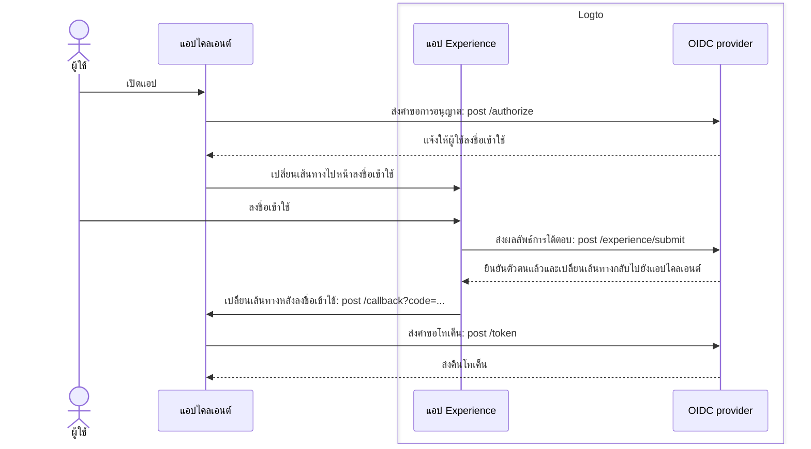
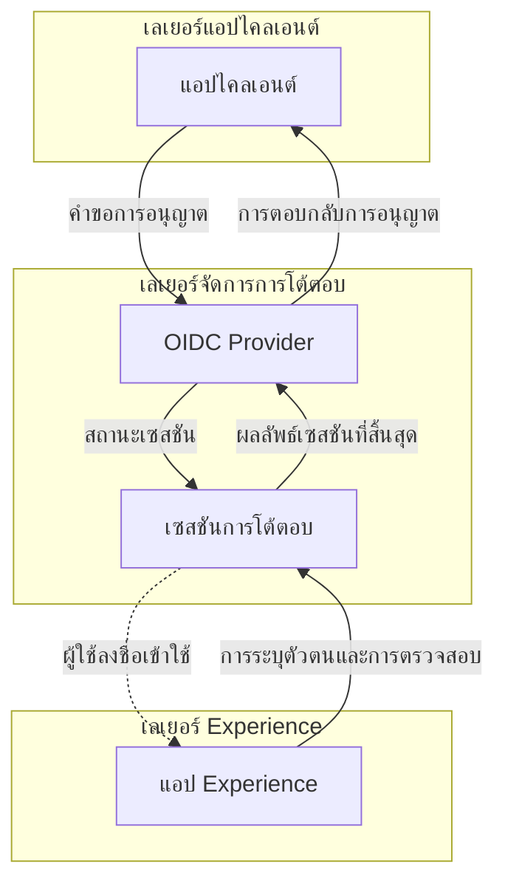

# การสมัครสมาชิกและการลงชื่อเข้าใช้

การสมัครสมาชิกและการลงชื่อเข้าใช้คือกระบวนการโต้ตอบหลักสำหรับผู้ใช้ปลายทางในการยืนยันตัวตน (Authentication) และอนุญาต (Authorization) การเข้าถึงแอปพลิเคชันไคลเอนต์ ในฐานะแพลตฟอร์ม [CIAM](https://auth.wiki/iam) แบบศูนย์กลางที่ใช้ OIDC Logto มอบประสบการณ์การลงชื่อเข้าใช้แบบสากลให้กับผู้ใช้ข้ามหลายแอปพลิเคชันและแพลตฟอร์ม

## โฟลว์ของผู้ใช้ \{#user-flow}

ในโฟลว์การยืนยันตัวตน (Authentication) แบบ [OIDC](https://auth.wiki/openid-connect) ทั่วไป ผู้ใช้จะเริ่มต้นด้วยการเปิดแอปไคลเอนต์ แอปไคลเอนต์จะส่ง [คำขอการอนุญาต (authorization request)](https://auth.wiki/authorization-request) ไปยัง Logto OIDC provider หากผู้ใช้ยังไม่มีเซสชันที่ใช้งานอยู่ Logto จะนำผู้ใช้ไปยังหน้าประสบการณ์ลงชื่อเข้าใช้ที่โฮสต์โดย Logto ผู้ใช้โต้ตอบกับหน้าประสบการณ์ Logto และได้รับการยืนยันตัวตนโดยการกรอกข้อมูลรับรองที่จำเป็น เมื่อผู้ใช้ได้รับการยืนยันตัวตนสำเร็จ Logto จะเปลี่ยนเส้นทางผู้ใช้กลับไปยังแอปไคลเอนต์พร้อม [authorization code](https://auth.wiki/authorization-code-flow#how-does-authorization-code-flow-work) จากนั้นแอปไคลเอนต์จะส่ง [คำขอโทเค็น (token request)](https://auth.wiki/token-request) ไปยัง Logto OIDC provider พร้อม authorization code เพื่อรับโทเค็น

## การโต้ตอบของผู้ใช้ \{#user-interaction}

**เซสชันการโต้ตอบ (interaction session)** จะถูกสร้างขึ้นสำหรับแต่ละการโต้ตอบของผู้ใช้เมื่อแอปไคลเอนต์เริ่มต้นคำขอการอนุญาต เซสชันนี้จะรวมสถานะการโต้ตอบของผู้ใช้ข้ามหลายแอปไคลเอนต์ ทำให้ Logto สามารถมอบประสบการณ์การลงชื่อเข้าใช้ที่ต่อเนื่อง เมื่อผู้ใช้สลับระหว่างแอปไคลเอนต์ เซสชันการโต้ตอบจะยังคงเหมือนเดิม รักษาสถานะการยืนยันตัวตนของผู้ใช้และลดความจำเป็นในการลงชื่อเข้าใช้ซ้ำข้ามแพลตฟอร์ม เมื่อ **เซสชันการโต้ตอบ** ถูกสร้างขึ้นแล้ว ผู้ใช้จะถูกขอให้ลงชื่อเข้าใช้ Logto

**แอป Experience** ใน Logto คือแอปพลิเคชันที่โฮสต์โดยเฉพาะเพื่ออำนวยความสะดวกประสบการณ์การลงชื่อเข้าใช้ เมื่อผู้ใช้ต้องการยืนยันตัวตน พวกเขาจะถูกนำไปยัง **แอป Experience** ซึ่งจะดำเนินการลงชื่อเข้าใช้และโต้ตอบกับ Logto **แอป Experience** ใช้เซสชันการโต้ตอบที่กำลังใช้งานเพื่อติดตามและสนับสนุนความคืบหน้าการโต้ตอบของผู้ใช้

เพื่อสนับสนุนและควบคุมเส้นทางของผู้ใช้นี้ Logto มีชุด **Experience API** ที่อิงตามเซสชัน API เหล่านี้ช่วยให้ **แอป Experience** จัดการวิธีการระบุตัวตนและการตรวจสอบผู้ใช้ได้หลากหลาย โดยอัปเดตและเข้าถึงสถานะเซสชันการโต้ตอบแบบเรียลไทม์

เมื่อผู้ใช้ผ่านข้อกำหนดการตรวจสอบและยืนยันทั้งหมดแล้ว เซสชันการโต้ตอบจะสิ้นสุดด้วยการส่งผลลัพธ์ไปยัง OIDC provider ซึ่งผู้ใช้จะได้รับการยืนยันตัวตนอย่างสมบูรณ์และให้ความยินยอม เสร็จสิ้นกระบวนการลงชื่อเข้าใช้ที่ปลอดภัย

## การปรับแต่งประสบการณ์ลงชื่อเข้าใช้ \{#sign-in-experience-customization}

Logto มอบประสบการณ์ผู้ใช้ที่ยืดหยุ่นและปรับแต่งได้เพื่อตอบโจทย์ความต้องการทางธุรกิจที่หลากหลาย รวมถึงการปรับแต่งแบรนด์ อินเทอร์เฟซผู้ใช้ และโฟลว์การโต้ตอบของผู้ใช้ **แอป Experience** สามารถปรับแต่งให้ตรงกับแบรนด์และข้อกำหนดด้านความปลอดภัยของแอปไคลเอนต์ได้

ศึกษาต่อเกี่ยวกับ [การตั้งค่าประสบการณ์ลงชื่อเข้าใช้](/end-user-flows/sign-up-and-sign-in/sign-up) และ [การปรับแต่ง](/customization) ใน Logto

## คำถามที่พบบ่อย \{#faqs}

  

### วิธีหรือแบรนด์ประสบการณ์ลงชื่อเข้าใช้แยกตามแอป \{#per-app-sign-in-experience-method-or-branding}

สำหรับแอปพลิเคชันหรือองค์กรที่ต้องการ **UI ลงชื่อเข้าใช้** ที่แตกต่างกัน Logto รองรับ [การตั้งค่าแบรนด์เฉพาะแอป](/customization/match-your-brand#app-specific-branding) และ [การตั้งค่าแบรนด์เฉพาะองค์กร](/customization/match-your-brand#organization-specific-branding)

หากคุณต้องการนำเสนอ **วิธีลงชื่อเข้าใช้** ที่แตกต่างกันตามประเภทผู้ใช้หรือไซต์ ให้ใช้ [authentication parameters](/end-user-flows/authentication-parameters) (เช่น `first_screen` และ `direct_sign_in`) เพื่อเปลี่ยนเส้นทางผู้ใช้ไปยังหน้าสำหรับผู้ใช้ปลายทางที่มีตัวเลือกการลงชื่อเข้าใช้ที่ปรับแต่ง

  

### จำกัดโดเมนอีเมล / ที่อยู่ IP / ภูมิภาค \{#limit-email-domain--ip-address--region}

สำหรับการควบคุมการเข้าถึงตามแอตทริบิวต์ เช่น การจำกัดการลงชื่อเข้าใช้ตามโดเมนอีเมล ที่อยู่ IP หรือภูมิภาค คุณสามารถใช้ฟีเจอร์ [Custom token claims](/developers/custom-token-claims/) ใน Logto เพื่อปฏิเสธหรืออนุญาตคำขอการอนุญาตตามแอตทริบิวต์ของผู้ใช้

  

### Headless API สำหรับการลงชื่อเข้าใช้และสมัครสมาชิก \{#headless-api-for-sign-in-and-sign-up}

ปัจจุบัน Logto ยังไม่มี Headless API สำหรับการลงชื่อเข้าใช้และสมัครสมาชิก อย่างไรก็ตาม คุณสามารถนำ UI ลงชื่อเข้าใช้ของคุณเองมาใช้ผ่าน [Bring your own UI](/customization/bring-your-ui/) เพื่อปรับแต่งประสบการณ์การลงชื่อเข้าใช้และสมัครสมาชิก

## แหล่งข้อมูลที่เกี่ยวข้อง \{#related-resources}

<Url href="https://blog.logto.io/deprecated-ropc-grant-type">
  เหตุผลที่คุณควรเลิกใช้ Resource Owner Password Credentials (ROPC) grant type
</Url>

<Url href="https://blog.logto.io/implicit-flow-is-dead">
  ทำไมคุณควรใช้ authorization code flow แทน implicit flow?
</Url>

<Url href="https://blog.logto.io/token-based-authentication-vs-session-based-authentication">
  เปรียบเทียบการยืนยันตัวตนแบบใช้โทเค็นกับแบบใช้เซสชัน
</Url>
