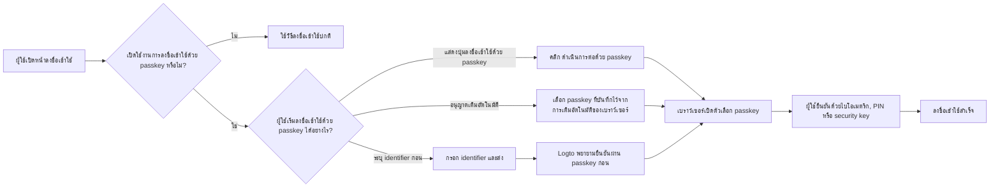
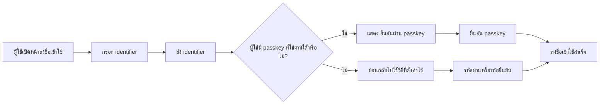
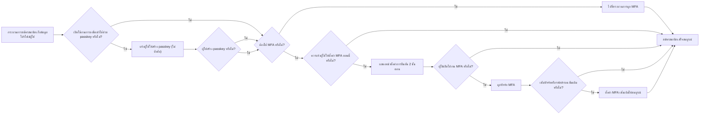

# การลงชื่อเข้าใช้ด้วย Passkey

การลงชื่อเข้าใช้ด้วย passkey ช่วยให้ผู้ใช้สามารถยืนยันตัวตน (การยืนยันตัวตน) ด้วย WebAuthn credential ได้โดยตรงระหว่างการลงชื่อเข้าใช้ โดยไม่ต้องกรอกรหัสผ่านหรือรหัสยืนยันก่อน ใน Logto credential ที่ใช้สำหรับการลงชื่อเข้าใช้ด้วย passkey คือโมเดล WebAuthn credential เดียวกับที่ใช้ใน MFA ดังนั้นประสบการณ์การลงชื่อเข้าใช้และ MFA จึงเชื่อมโยงกันอย่างใกล้ชิด

เอกสารนี้อธิบายวิธีการทำงานของการลงชื่อเข้าใช้ด้วย passkey ในประสบการณ์การลงชื่อเข้าใช้ที่มีในตัวของ Logto, เส้นทางการเข้าใช้งานที่แตกต่างกันสำหรับผู้ใช้ปลายทาง และการทำงานร่วมกับ MFA

## วิธีการทำงานของการลงชื่อเข้าใช้ด้วย passkey \{#how-passkey-sign-in-works}

ในการใช้การลงชื่อเข้าใช้ด้วย passkey คุณต้องเปิดใช้งานใน <CloudLink to="/sign-in-experience/sign-up-and-sign-in">การตั้งค่าประสบการณ์การลงชื่อเข้าใช้</CloudLink> ก่อน หลังจากเปิดใช้งานแล้ว Logto สามารถนำเสนอการลงชื่อเข้าใช้ด้วย passkey ได้สูงสุดสามวิธีในหน้าลงชื่อเข้าใช้:

- ปุ่ม `ดำเนินการต่อด้วย passkey` โดยเฉพาะบนหน้าลงชื่อเข้าใช้หน้าจอแรก
- กระบวนการแบบระบุ identifier ก่อน (identifier-first) ที่จะพยายาม `ยืนยันผ่าน passkey` หลังจากผู้ใช้กรอกอีเมล หมายเลขโทรศัพท์ หรือชื่อผู้ใช้
- การเติมอัตโนมัติของเบราว์เซอร์บนช่องกรอก identifier เพื่อให้เบราว์เซอร์แนะนำ passkey ที่มีอยู่จากอุปกรณ์ปัจจุบันโดยตรง

ในภาพรวม ประสบการณ์จะเป็นดังนี้:

## สามเส้นทางการลงชื่อเข้าใช้ด้วย passkey \{#three-passkey-sign-in-paths}

### 1. เปิดใช้งานปุ่ม "ดำเนินการต่อด้วย passkey" \{#1-show-continue-with-passkey-button-enabled}

เมื่อเปิดใช้งานตัวเลือก `แสดงปุ่ม "ดำเนินการต่อด้วย passkey"` หน้าลงชื่อเข้าใช้จะแสดงปุ่ม `ดำเนินการต่อด้วย passkey` ที่ด้านล่างของหน้าจอแรก

ขั้นตอนของผู้ใช้คือ:

1. เปิดหน้าลงชื่อเข้าใช้
2. คลิก `ดำเนินการต่อด้วย passkey`
3. เลือก passkey จากเบราว์เซอร์หรือระบบปฏิบัติการ
4. ทำการยืนยันด้วยไบโอเมตริก, PIN หรือ hardware key
5. ลงชื่อเข้าใช้สำเร็จ

นี่เป็นเส้นทางที่ตรงที่สุด เหมาะสำหรับผู้ใช้ที่ทราบอยู่แล้วว่าตนมี passkey ที่บันทึกไว้และต้องการประสบการณ์การเข้าสู่ระบบแบบขั้นตอนเดียว

### 2. ปิดใช้งานปุ่ม "ดำเนินการต่อด้วย passkey" \{#2-show-continue-with-passkey-button-disabled}

เมื่อปิดใช้งานตัวเลือก `แสดงปุ่ม "ดำเนินการต่อด้วย passkey"` Logto จะเปลี่ยนไปใช้ประสบการณ์แบบระบุ identifier ก่อนในหน้าจอแรก โดยหน้าจะขอเพียง identifier ของผู้ใช้ก่อน

หลังจากผู้ใช้ส่ง identifier:

1. Logto ตรวจสอบว่ามีการเปิดใช้งานการลงชื่อเข้าใช้ด้วย passkey และผู้ใช้ที่ระบุมี passkey ที่ใช้งานได้หรือไม่
2. หากมี passkey Logto จะเริ่มกระบวนการ "ยืนยันผ่าน passkey" ก่อน
3. ผู้ใช้สามารถยืนยัน passkey และลงชื่อเข้าใช้ได้ทันที
4. หากไม่มี passkey หรือผู้ใช้ต้องการวิธีอื่น Logto จะย้อนกลับไปใช้วิธีการยืนยันอื่นที่ตั้งค่าไว้

วิธีการสำรองที่มีขึ้นอยู่กับการตั้งค่าประสบการณ์การลงชื่อเข้าใช้ของ tenant ปัจจุบัน เช่น ผู้ใช้อาจเปลี่ยนไปใช้รหัสผ่าน, รหัสยืนยันทางอีเมล หรือรหัสยืนยันทางโทรศัพท์ ขึ้นอยู่กับว่ามีการเปิดใช้งานปัจจัยใดสำหรับ identifier นั้น

### 3. อนุญาตการแจ้งเตือนและเติมอัตโนมัติ \{#3-allow-prompting-and-autofill}

เมื่อเปิดใช้งานตัวเลือก `อนุญาตการแจ้งเตือนและเติมอัตโนมัติ` เบราว์เซอร์ที่รองรับสามารถแสดง passkey ที่บันทึกไว้โดยตรงจากช่องกรอก identifier

ขั้นตอนของผู้ใช้คือ:

1. โฟกัสช่องกรอก identifier บนหน้าลงชื่อเข้าใช้
2. เบราว์เซอร์แนะนำ passkey ที่บันทึกไว้สำหรับ origin ปัจจุบัน
3. ผู้ใช้เลือก passkey จากรายการเติมอัตโนมัติ
4. เบราว์เซอร์ขอให้ผู้ใช้ยืนยันด้วยไบโอเมตริก, PIN หรือ hardware key
5. ลงชื่อเข้าใช้สำเร็จ

เส้นทางนี้เหมาะอย่างยิ่งบนอุปกรณ์ที่ passkey ถูกซิงค์ไว้กับแพลตฟอร์มอยู่แล้ว เพราะผู้ใช้สามารถลงชื่อเข้าใช้ได้โดยไม่ต้องเปลี่ยนหน้า หรือกดปุ่ม passkey โดยเฉพาะ

## กระบวนการสมัครสมาชิกและการผูก passkey \{#sign-up-and-passkey-binding-flow}

การลงชื่อเข้าใช้ด้วย passkey ไม่ใช่แค่จุดเริ่มต้นของการลงชื่อเข้าใช้เท่านั้น แต่ยังมีผลต่อสิ่งที่เกิดขึ้นหลังจากการสมัครสมาชิกด้วย เพราะ WebAuthn credential เดียวกันนี้สามารถนำกลับมาใช้ใหม่ได้ทั้งสำหรับการลงชื่อเข้าใช้และ MFA

หลังจากผู้ใช้ทำขั้นตอนสมัครสมาชิกปกติครบถ้วน Logto สามารถแจ้งให้ผู้ใช้สร้าง passkey ได้ คำขอนี้เป็นตัวเลือกสำหรับผู้ใช้ แต่เมื่อสร้าง passkey แล้ว ขั้นตอนถัดไปขึ้นอยู่กับนโยบาย MFA ของ tenant และสถานะ MFA ของผู้ใช้เอง

ตรรกะหลักคือ:

## ความสัมพันธ์ระหว่างการลงชื่อเข้าใช้ด้วย passkey และ MFA \{#relationship-between-passkey-sign-in-and-mfa}

### การลงชื่อเข้าใช้ด้วย passkey จะข้ามการยืนยัน MFA โดยอัตโนมัติ \{#passkey-sign-in-automatically-skips-mfa-verification}

passkey ที่ใช้สำหรับการลงชื่อเข้าใช้ด้วย passkey รองรับโดย WebAuthn credential และ credential นั้นก็ถือเป็น WebAuthn MFA factor ด้วย ดังนั้นการลงชื่อเข้าใช้ด้วย passkey และ WebAuthn MFA จึงเทียบเท่ากันในมุม credential

ซึ่งนำไปสู่พฤติกรรมสำคัญสองข้อ:

- หากผู้ใช้ลงชื่อเข้าใช้ด้วย passkey, Logto จะข้ามขั้นตอนการยืนยัน MFA แยกต่างหาก
- หากผู้ใช้เคยผูก WebAuthn เป็น MFA factor ไว้ก่อนเปิดใช้งาน passkey sign-in credential เดิมนั้นสามารถนำมาใช้เป็น credential สำหรับ passkey sign-in ได้โดยไม่ต้องผูกใหม่

กล่าวอีกนัยหนึ่ง การลงชื่อเข้าใช้ด้วย passkey ที่สำเร็จแล้วถือว่าได้ผ่านการยืนยันตัวตนตาม WebAuthn ที่ปกติจะต้องใช้ใน MFA

### การผูก passkey ไม่ได้บังคับเปิด MFA อัตโนมัติสำหรับ tenant ที่ผู้ใช้ควบคุมเอง \{#binding-a-passkey-does-not-automatically-force-mfa-for-user-controlled-tenants}

สำหรับผู้ใช้ใน tenant ที่ไม่ได้บังคับใช้ MFA การผูก passkey ระหว่างสมัครสมาชิกหรือระหว่างตั้งค่าบัญชีจะไม่เปิด MFA ให้บัญชีโดยอัตโนมัติ

หลังจากสร้าง passkey แล้ว Logto จะแสดงหน้ายืนยันชื่อ "เปิดใช้งานการยืนยัน 2 ขั้นตอน"

ในหน้านั้นผู้ใช้สามารถ:

- คลิกปุ่ม "เปิดใช้งานการยืนยัน 2 ขั้นตอน" เพื่อเปิด MFA อย่างชัดเจนและดำเนินการผูกปัจจัยถัดไป
- ข้ามคำแนะนำและจบกระบวนการปัจจุบันโดยไม่เปิด MFA

หากผู้ใช้เลือกเปิด MFA, Logto จะดำเนินการตามกระบวนการตั้งค่า MFA ปกติ และอาจขอให้ผู้ใช้ผูกปัจจัยเพิ่มเติม ขึ้นอยู่กับการตั้งค่า MFA ของ tenant เช่น หากมีการเปิดใช้งานปัจจัย MFA อื่น Logto สามารถดำเนินการผูกปัจจัยหรือรหัสสำรองเพิ่มเติมได้

### จะเกิดอะไรขึ้นเมื่อปิดใช้งานการลงชื่อเข้าใช้ด้วย passkey ในภายหลัง \{#what-happens-when-passkey-sign-in-is-disabled-later}

หากปิดใช้งานการลงชื่อเข้าใช้ด้วย passkey ในภายหลัง passkey ที่ผูกไว้ก่อนหน้านี้ยังคงเป็น WebAuthn credential อยู่ นั่นหมายความว่ายังสามารถใช้เป็น MFA factor ได้ตราบใดที่ WebAuthn MFA ยังเปิดใช้งานสำหรับ tenant

การปิดใช้งาน passkey sign-in จะลบ passkey ออกจากจุดเริ่มต้นการลงชื่อเข้าใช้โดยตรง แต่จะไม่ทำให้ WebAuthn MFA credential ที่อยู่เบื้องหลังเป็นโมฆะ

## ข้อจำกัดและความเข้ากันได้ \{#limitations-and-compatibility}

- การลงชื่อเข้าใช้ด้วย passkey ไม่สามารถใช้ได้กับผู้ใช้ Enterprise SSO
- การลงชื่อเข้าใช้ด้วย passkey ขึ้นอยู่กับการรองรับ WebAuthn ของเบราว์เซอร์และแพลตฟอร์ม
- "อนุญาตการแจ้งเตือนและเติมอัตโนมัติ" ใช้ได้เฉพาะในเบราว์เซอร์และสภาพแวดล้อมที่รองรับ passkey autofill / conditional UI เท่านั้น
- passkey จะผูกกับ origin เท่านั้น passkey ที่ลงทะเบียนกับโดเมนหนึ่งไม่สามารถใช้กับอีกโดเมนได้

## คำถาม & คำตอบ \{#q-a}

  

### การลงชื่อเข้าใช้ด้วย passkey ยังต้องยืนยัน MFA หรือไม่? \{#does-passkey-sign-in-still-require-mfa-verification}

  

ไม่ การลงชื่อเข้าใช้ด้วย passkey ที่สำเร็จแล้วถือว่าได้ผ่านข้อกำหนดการยืนยันตาม WebAuthn แล้ว Logto จึงข้ามขั้นตอนการยืนยัน MFA แยกต่างหาก

  

### passkey ที่ผูกไว้สำหรับการลงชื่อเข้าใช้ด้วย passkey ยังสามารถใช้เป็น MFA factor หลังจากปิด passkey sign-in ได้หรือไม่? \{#can-a-passkey-bound-for-passkey-sign-in-still-be-used-as-an-mfa-factor-after-passkey-sign-in-is-disabled}

  

ได้ การลงชื่อเข้าใช้ด้วย passkey และ WebAuthn MFA ใช้ credential โมเดลเดียวกัน หากปิด passkey sign-in ในภายหลัง passkey ที่ผูกไว้ยังสามารถใช้เป็น WebAuthn MFA factor ได้

  

### ผู้ใช้ Enterprise SSO สามารถใช้การลงชื่อเข้าใช้ด้วย passkey ได้หรือไม่? \{#can-enterprise-sso-users-use-passkey-sign-in}

  

ไม่ได้ ผู้ใช้ Enterprise SSO ไม่สามารถใช้การลงชื่อเข้าใช้ด้วย passkey ได้

  

### การลงชื่อเข้าใช้ด้วย passkey ยังต้องใช้ CAPTCHA หรือไม่? \{#does-passkey-sign-in-still-require-captcha}

  

ไม่ การลงชื่อเข้าใช้ด้วย passkey ไม่ต้องมีขั้นตอน CAPTCHA เพิ่มเติม CAPTCHA อาจยังใช้กับการลงชื่อเข้าใช้วิธีอื่นในหน้า เช่น การส่งรหัสผ่านหรือรหัสยืนยัน แต่ไม่ใช้กับกระบวนการยืนยัน passkey โดยตรง

