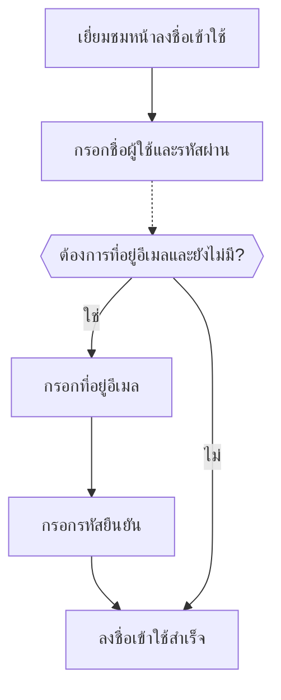

# ลงชื่อเข้าใช้ด้วยอีเมล / เบอร์โทรศัพท์ / ชื่อผู้ใช้

## กำหนดค่ากระบวนการลงชื่อเข้าใช้ด้วยตัวระบุ \{#configure-the-identifier-sign-in-flow}

ตามที่กล่าวไว้ก่อนหน้านี้ คุณสามารถเก็บข้อมูลตัวระบุประเภทต่าง ๆ จากผู้ใช้ได้ตลอด [กระบวนการสมัครสมาชิก](/end-user-flows/sign-up-and-sign-in/sign-up) หรือ [การสร้างบัญชีโดยตรงใน Logto](/user-management/manage-users#add-users) นอกจากนี้ ผู้ใช้อาจกรอกและยืนยันข้อมูลเพิ่มเติมเมื่อใช้งานผลิตภัณฑ์ ตัวระบุเหล่านี้สามารถใช้ระบุผู้ใช้แต่ละรายในระบบของ Logto ได้อย่างชัดเจน และอนุญาตให้พวกเขายืนยันตัวตนและลงชื่อเข้าใช้แอปพลิเคชันที่เชื่อมต่อกับ Logto

ไม่ว่าคุณจะเลือกใช้หน้าลงชื่อเข้าใช้สำเร็จรูปที่โฮสต์โดย Logto หรือวางแผน [สร้าง UI ลงชื่อเข้าใช้ของคุณเอง](/customization#custom-ui) คุณจะต้องกำหนดวิธีการลงชื่อเข้าใช้และการตั้งค่าการยืนยันตัวตนที่พร้อมใช้งานสำหรับผู้ใช้ปลายทาง

## ตั้งค่าตัวระบุและการยืนยันตัวตน \{#set-up-the-identifier-and-authentication-settings}

### 1. กำหนดตัวระบุที่รองรับสำหรับการลงชื่อเข้าใช้ \{#1-set-the-supported-sign-in-identifiers}

คุณสามารถเพิ่มตัวระบุที่รองรับหลายรายการจากรายการดรอปดาวน์ เพื่อเปิดใช้งานเป็นวิธีการลงชื่อเข้าใช้สำหรับผู้ใช้ปลายทาง ตัวเลือกที่มีให้ ได้แก่:

- **ชื่อผู้ใช้**
- **ที่อยู่อีเมล**
- **หมายเลขโทรศัพท์**

การจัดลำดับตัวระบุใหม่จะเปลี่ยนลำดับการแสดงผลบนหน้าลงชื่อเข้าใช้ ตัวระบุแรกจะเป็นวิธีการลงชื่อเข้าใช้หลักสำหรับผู้ใช้

### 2. ตั้งค่าการยืนยันตัวตน \{#2-set-the-authentication-settings}

สำหรับแต่ละตัวระบุที่ใช้ลงชื่อเข้าใช้ คุณต้องกำหนดปัจจัยการยืนยันตัวตนอย่างน้อยหนึ่งรายการเพื่อยืนยันตัวตนของผู้ใช้ มีปัจจัยให้เลือกสองแบบ:

- **รหัสผ่าน**: ใช้ได้กับตัวระบุทุกประเภท เมื่อเปิดใช้งาน ผู้ใช้ต้องกรอกรหัสผ่านเพื่อดำเนินการลงชื่อเข้าใช้ให้เสร็จสมบูรณ์
- **รหัสยืนยัน**: ใช้ได้กับตัวระบุ **ที่อยู่อีเมล** และ **หมายเลขโทรศัพท์** เท่านั้น เมื่อเปิดใช้งาน ผู้ใช้ต้องกรอกรหัสยืนยันที่ส่งไปยังอีเมลหรือเบอร์โทรศัพท์เพื่อดำเนินการลงชื่อเข้าใช้ให้เสร็จสมบูรณ์

หากเปิดใช้งานทั้งสองปัจจัย ผู้ใช้สามารถเลือกวิธีใดวิธีหนึ่งเพื่อดำเนินการลงชื่อเข้าใช้ คุณยังสามารถจัดลำดับปัจจัยใหม่เพื่อเปลี่ยนลำดับการแสดงผลบนหน้าลงชื่อเข้าใช้ ปัจจัยแรกจะถูกใช้เป็นวิธีการยืนยันหลัก และปัจจัยที่สองจะแสดงเป็นลิงก์ทางเลือก

## ประสบการณ์ผู้ใช้ในกระบวนการลงชื่อเข้าใช้ด้วยตัวระบุ \{#identifier-sign-in-flow-user-experience}

ประสบการณ์การลงชื่อเข้าใช้จะปรับเปลี่ยนตามตัวระบุที่เลือกและปัจจัยการยืนยันตัวตนที่เปิดใช้งาน

- **อินพุตอัจฉริยะสำหรับหลายตัวระบุ:**
  หากเปิดใช้งานวิธีการลงชื่อเข้าใช้ด้วยตัวระบรมากกว่าหนึ่งแบบ หน้าลงชื่อเข้าใช้ของ Logto จะตรวจจับประเภทของตัวระบุที่ผู้ใช้กรอกโดยอัตโนมัติและแสดงตัวเลือกการยืนยันที่เกี่ยวข้อง ตัวอย่างเช่น หากเปิดใช้งานทั้ง **ที่อยู่อีเมล** และ **หมายเลขโทรศัพท์** หน้าลงชื่อเข้าใช้จะตรวจจับประเภทของตัวระบุที่ผู้ใช้กรอกโดยอัตโนมัติและแสดงตัวเลือกการยืนยันที่เกี่ยวข้อง หากกรอกตัวเลขต่อเนื่องจะเปลี่ยนเป็นรูปแบบเบอร์โทรศัพท์พร้อมรหัสประเทศ หรือหากมีสัญลักษณ์ “@” จะเปลี่ยนเป็นรูปแบบอีเมล
- **ปัจจัยการยืนยันที่เปิดใช้งาน:**
  - **เฉพาะรหัสผ่าน:** จะแสดงช่องกรอกตัวระบุและรหัสผ่านในหน้าจอแรก
  - **เฉพาะรหัสยืนยัน:** จะแสดงช่องกรอกตัวระบุในหน้าจอแรก ตามด้วยช่องกรอกรหัสยืนยันในหน้าจอที่สอง
  - **รหัสผ่านและรหัสยืนยัน:** กรอกตัวระบุในหน้าจอแรก ตามด้วยขั้นตอนกรอกรหัสผ่านหรือรหัสยืนยันในหน้าจอที่สองตามลำดับปัจจัยการยืนยัน โดยมีลิงก์สลับวิธีให้ผู้ใช้เปลี่ยนระหว่างสองวิธีได้

### ตัวอย่าง \{#examples}

  

### ตัวอย่างที่ 1: ที่อยู่อีเมลพร้อมการยืนยันด้วยรหัสผ่าน \{#example-1-email-address-with-password-verification}

เพิ่ม **ที่อยู่อีเมล** เป็นตัวระบุสำหรับลงชื่อเข้าใช้และเปิดใช้งานปัจจัย **รหัสผ่าน** สำหรับการยืนยัน

  

### ตัวอย่างที่ 2: อีเมล/โทรศัพท์ พร้อมการยืนยันด้วยรหัสผ่าน (หลัก) และรหัสยืนยัน (ทางเลือก) \{#example-2-emailphone-with-passwordprimary-and-verification-code-alternative-verification-enabled}

เพิ่มทั้ง **ที่อยู่อีเมล** และ **หมายเลขโทรศัพท์** เป็นตัวระบุสำหรับลงชื่อเข้าใช้
เปิดใช้งานทั้งปัจจัย **รหัสผ่าน** และ **รหัสยืนยัน** สำหรับตัวระบุทั้งสอง

## เก็บข้อมูลโปรไฟล์ผู้ใช้เพิ่มเติมขณะลงชื่อเข้าใช้ \{#collect-additional-user-profile-on-sign-in}

ในกระบวนการลงชื่อเข้าใช้ของ Logto อาจมีการเรียกใช้ขั้นตอนการกรอกโปรไฟล์หากมีการอัปเดตการตั้งค่าตัวระบุสำหรับสมัครสมาชิก เพื่อให้แน่ใจว่าผู้ใช้ทุกคน (รวมถึงผู้ใช้เดิม) จะต้องกรอกตัวระบุที่จำเป็นใหม่

เมื่อผู้พัฒนาระบบเพิ่มตัวระบุใหม่ (เช่น ที่อยู่อีเมล) จะกลายเป็นข้อมูลบังคับสำหรับผู้ใช้ทุกคน หากผู้ใช้เดิมลงชื่อเข้าใช้ด้วยตัวระบุเดิม (เช่น ชื่อผู้ใช้) ระบบจะขอให้กรอกและยืนยันตัวระบุใหม่หากยังไม่มีในโปรไฟล์ เมื่อดำเนินการเสร็จสิ้นจึงจะสามารถเข้าใช้งานแอปพลิเคชันได้ เพื่อให้การเปลี่ยนผ่านไปสู่ข้อกำหนดใหม่เป็นไปอย่างราบรื่นและสม่ำเสมอ

ขั้นตอนโดยสังเขป:

1. **ชื่อผู้ใช้** ถูกตั้งเป็นตัวระบุสำหรับสมัครสมาชิก พร้อมเปิดใช้งาน **สร้างรหัสผ่านของคุณ**
2. **ที่อยู่อีเมล** ถูกตั้งเป็นตัวระบุสำหรับสมัครสมาชิกในภายหลัง ตัวระบุ **ที่อยู่อีเมล** จะถูกเพิ่มเป็นตัวเลือกสำหรับลงชื่อเข้าใช้โดยอัตโนมัติ
3. ผู้ใช้เดิมลงชื่อเข้าใช้ด้วยชื่อผู้ใช้และรหัสผ่าน
4. หลังจากลงชื่อเข้าใช้ขั้นแรก ผู้ใช้จะถูกขอให้กรอกและยืนยันที่อยู่อีเมล

กระบวนการเดียวกันนี้ใช้กับการตั้งค่า **สร้างรหัสผ่านของคุณ** ด้วย หากเปิดใช้งานการตั้งค่า **สร้างรหัสผ่านของคุณ** ในกระบวนการสมัครสมาชิก ปัจจัย **รหัสผ่าน** จะถูกเปิดใช้งานโดยอัตโนมัติสำหรับตัวระบุที่คุณเลือก ผู้ใช้เดิมที่ยังไม่มีรหัสผ่านจะถูกขอให้สร้างรหัสผ่านระหว่างกระบวนการลงชื่อเข้าใช้

:::note
หมายเหตุ: สำหรับกระบวนการลงชื่อเข้าใช้แบบกำหนดเอง โปรดดูฟีเจอร์ [Bring your UI](/customization/bring-your-ui/)
:::

## คำถามที่พบบ่อย \{#faqs}

  

### ประสบการณ์ลงชื่อเข้าใช้แบบฝังตัว (Self-hosted sign-in experience) \{#self-hosted-sign-in-experience-embedded-sign-in}

ขณะนี้ Logto ยังไม่รองรับ API แบบ headless สำหรับการลงชื่อเข้าใช้และสมัครสมาชิก อย่างไรก็ตาม คุณสามารถใช้ฟีเจอร์ [Bring your UI](/customization/bring-your-ui/) เพื่ออัปโหลดฟอร์มลงชื่อเข้าใช้ที่คุณออกแบบเองมายัง Logto ได้ เรายังรองรับพารามิเตอร์การลงชื่อเข้าใช้หลายแบบที่คุณสามารถใช้กรอกข้อมูลตัวระบุผู้ใช้ล่วงหน้าจากแอปของคุณ หรือเข้าสู่ระบบโดยตรงกับผู้ให้บริการโซเชียลหรือ SSO สำหรับองค์กรจากภายนอก ดูรายละเอียดเพิ่มเติมที่ [Authentication parameters](/end-user-flows/authentication-parameters/)

## แหล่งข้อมูลที่เกี่ยวข้อง \{#related-resources}

<Url href="https://www.youtube.com/watch?v=64rBXpWbScc">
  ประสบการณ์สมัครสมาชิกและลงชื่อเข้าใช้ด้วยอีเมล
</Url>

<Url href="https://www.youtube.com/watch?v=chQxCJX6e6w">
  ประสบการณ์สมัครสมาชิกและลงชื่อเข้าใช้ด้วยชื่อผู้ใช้
</Url>
