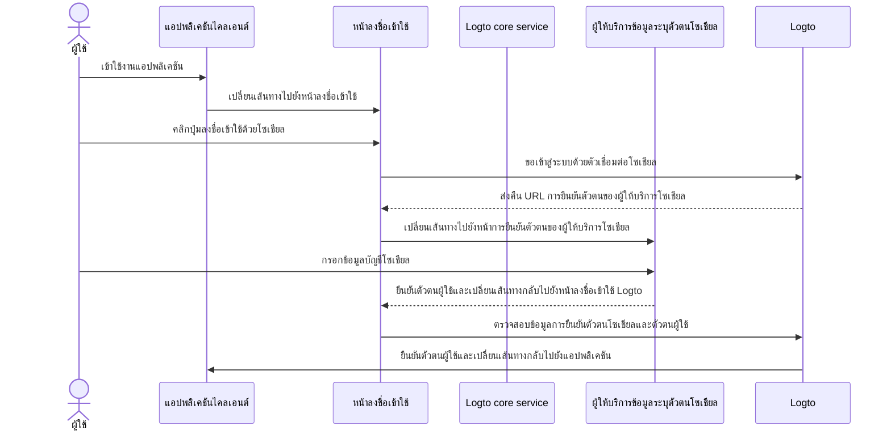
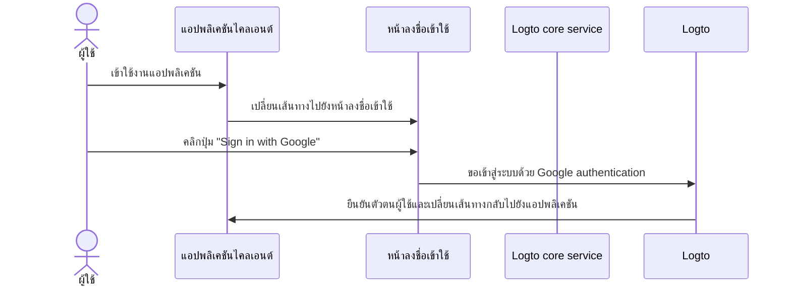

# การลงชื่อเข้าใช้ด้วยโซเชียล (Social sign-in)

การลงชื่อเข้าใช้ด้วยโซเชียลเป็นวิธีการยืนยันตัวตน (Authentication) ที่ได้รับความนิยมอย่างแพร่หลาย ช่วยให้ผู้ใช้สามารถลงชื่อเข้าใช้และสมัครสมาชิกโดยใช้บัญชีโซเชียลมีเดียที่มีอยู่ เช่น Google, Facebook, Twitter และ LinkedIn

ประโยชน์ของการลงชื่อเข้าใช้ด้วยโซเชียล:

- **กระบวนการเริ่มต้นใช้งานที่ง่ายขึ้น**: การลงชื่อเข้าใช้ด้วยโซเชียลช่วยให้ผู้ใช้สมัครหรือเข้าสู่ระบบได้ด้วยคลิกเดียว โดยไม่ต้องสร้างบัญชีใหม่หรือจำรหัสผ่านเพิ่มเติม ลดอุปสรรคและเพิ่มการมีส่วนร่วมของผู้ใช้
- **เพิ่มความเชื่อมั่นและความปลอดภัย**: ด้วยการใช้แพลตฟอร์มที่เชื่อถือได้ เช่น Google หรือ Facebook ผู้ใช้จะรู้สึกมั่นใจในแอปพลิเคชันของคุณมากขึ้น
- **เพิ่มข้อมูลโปรไฟล์ผู้ใช้**: การลงชื่อเข้าใช้ด้วยโซเชียลช่วยให้คุณสามารถดึงข้อมูลโปรไฟล์เพิ่มเติมจากแพลตฟอร์มโซเชียล เช่น ชื่อ อีเมล รูปโปรไฟล์ และอื่น ๆ

## การตั้งค่าการลงชื่อเข้าใช้ด้วยโซเชียล \{#implement-social-sign-in}

1. **ตั้งค่าตัวเชื่อมต่อโซเชียลของคุณ**:<br/>
   ไปที่ <CloudLink to="/connectors/social">Console > Connectors > Social connectors</CloudLink> คลิกปุ่ม “Add Social Connector” และเลือกตัวเชื่อมต่อโซเชียลที่ต้องการเพิ่ม (เช่น Google หรือ Github) ดูรายละเอียดเพิ่มเติมที่ [social connector](/connectors/social-connectors/)
2. **เพิ่มปุ่มเข้าสู่ระบบโซเชียล**:<br/>
   โดยปกติ ตัวเชื่อมต่อโซเชียลที่เพิ่มใหม่จะยังไม่แสดงบนหน้าลงชื่อเข้าใช้ของผู้ใช้ปลายทาง หากต้องการเพิ่มปุ่มเข้าสู่ระบบโซเชียลในหน้าเข้าสู่ระบบ คุณต้องเปิดใช้งานตัวเชื่อมต่อโซเชียลในหน้าตั้งค่าประสบการณ์การลงชื่อเข้าใช้

   ไปที่ <CloudLink to="/sign-in-experience/sign-up-and-sign-in">Console > Sign-in experience > Sign-up and sign-in</CloudLink> คลิกปุ่ม “Add social connector” เพื่อเพิ่มปุ่มเข้าสู่ระบบโซเชียลในหน้าสมัครและเข้าสู่ระบบของคุณ สามารถลากและวางเพื่อจัดลำดับปุ่มบน UI ได้

3. **ตั้งค่าตัวเลือกการเชื่อมโยงบัญชี**:<br/>
   สำหรับผู้ใช้ใหม่ที่สมัครด้วย [โซเชียลไอดี (social identities)](/user-management/user-data#social-identities) Logto อนุญาตให้เชื่อมโยงบัญชีโซเชียลกับบัญชีอีเมลหรือเบอร์โทรศัพท์ที่มีอยู่ในระบบ Logto โดยค่าเริ่มต้นจะมีหน้าการ [เชื่อมโยงบัญชี](#account-linking) แสดงให้ผู้ใช้ในระหว่างการสมัครด้วยโซเชียล เพื่อให้ผู้ใช้เลือกเชื่อมโยงบัญชีโซเชียลกับบัญชีที่มีอยู่หรือสร้างบัญชีใหม่

   เพื่อให้กระบวนการนี้ราบรื่นขึ้น คุณสามารถเปิดใช้งานตัวเลือก **Automatic account linking** ในหน้าตั้งค่าประสบการณ์การลงชื่อเข้าใช้ ซึ่งจะเชื่อมโยงบัญชีโซเชียลกับบัญชีที่มีอยู่โดยอัตโนมัติหากอีเมลหรือเบอร์โทรศัพท์ตรงกัน

4. **บันทึกการเปลี่ยนแปลง**: <br/>
   ตรวจสอบการเปลี่ยนแปลงของคุณอย่างละเอียดและบันทึกเพื่อให้การตั้งค่ามีผล

## ประสบการณ์ผู้ใช้ของการลงชื่อเข้าใช้ด้วยโซเชียล \{#user-experience-of-social-sign-in}

ด้วยการลงชื่อเข้าใช้ด้วยโซเชียล กระบวนการสมัครและเข้าสู่ระบบใน Logto จะง่ายและรวดเร็วสำหรับผู้ใช้



1. **ลงชื่อเข้าใช้ด้วยโซเชียล**: ผู้ใช้คลิกปุ่มลงชื่อเข้าใช้ด้วยโซเชียลที่แสดงบนหน้าลงชื่อเข้าใช้
2. **เปลี่ยนเส้นทาง**: ผู้ใช้จะถูกเปลี่ยนเส้นทางไปยังหน้าการยืนยันตัวตนของผู้ให้บริการข้อมูลระบุตัวตนโซเชียล
3. **การยืนยันตัวตนโซเชียล**: ผู้ใช้กรอกข้อมูลบัญชีโซเชียลและยืนยันตัวตนกับผู้ให้บริการโซเชียล หากผู้ใช้เข้าสู่ระบบกับผู้ให้บริการโซเชียลอยู่แล้ว อาจได้รับการยืนยันตัวตนโดยอัตโนมัติ หากพบเซสชันเข้าสู่ระบบหลายบัญชี ผู้ใช้อาจถูกถามให้เลือกบัญชีที่ถูกต้อง (เช่น หลายบัญชี Google)
   :::note
   สามารถตั้งค่าพารามิเตอร์ “prompt” ของ Google ในตัวเชื่อมต่อ Google เพื่อปรับแต่งประสบการณ์การเลือกบัญชีและหน้าขอความยินยอมสำหรับการเข้าสู่ระบบ Google ได้
   :::
4. **กลับสู่ Logto**: หลังจากยืนยันตัวตนสำเร็จ ผู้ให้บริการโซเชียลจะเปลี่ยนเส้นทางผู้ใช้กลับไปยังหน้าลงชื่อเข้าใช้ Logto พร้อมข้อมูลการยืนยันตัวตน
5. **ตรวจสอบตัวตนโซเชียล**: Logto ตรวจสอบข้อมูลการยืนยันตัวตนโซเชียลและตัวตนผู้ใช้ หากไม่มีบัญชีผู้ใช้ที่เชื่อมโยงกับโซเชียลไอดี จะมีการสร้างบัญชีใหม่
6. **การยืนยันตัวตนผู้ใช้**: Logto ยืนยันตัวตนผู้ใช้และเปลี่ยนเส้นทางกลับไปยังแอปพลิเคชันไคลเอนต์เพื่อสิ้นสุดกระบวนการยืนยันตัวตน

## การเชื่อมโยงบัญชี (Account linking) \{#account-linking}

ดังที่กล่าวไว้ข้างต้น Logto อนุญาตให้ผู้ใช้เชื่อมโยงบัญชีโซเชียลกับบัญชีอีเมลหรือเบอร์โทรศัพท์ที่มีอยู่ในระบบ Logto กระบวนการนี้สำคัญสำหรับการรักษาบัญชีผู้ใช้แบบรวมศูนย์ข้ามวิธีการยืนยันตัวตนและผู้ให้บริการข้อมูลระบุตัวตน (IdP) ต่าง ๆ

- **การสร้างบัญชีใหม่**:
  เมื่อผู้ใช้ลงชื่อเข้าใช้ด้วย [โซเชียลไอดี (social identity)](/user-management/user-data#social-identities) ที่ไม่มีอยู่ในระบบ Logto และอีเมลหรือเบอร์โทรศัพท์ที่ให้มาไม่ตรงกับบัญชีผู้ใช้ที่มีอยู่ จะมีการสร้างบัญชีใหม่ใน Logto โดยตรง
- **การเชื่อมโยงบัญชีที่มีอยู่**:
  หากอีเมลหรือเบอร์โทรศัพท์ที่ได้จากโซเชียลไอดีตรงกับบัญชีที่มีอยู่ใน Logto จะมีขั้นตอนการเชื่อมโยงบัญชีที่ยืดหยุ่น

  - **การเชื่อมโยงบัญชีอัตโนมัติ:** หากเปิดใช้งาน “Automatic account linking” ใน <CloudLink to="/sign-in-experience/sign-up-and-sign-in">Sign-in experience</CloudLink> Logto จะเชื่อมโยงบัญชีโซเชียลกับบัญชีที่มีอยู่โดยอัตโนมัติหากอีเมลหรือเบอร์โทรศัพท์ตรงกัน ผู้ใช้จะไม่ถูกถามให้เชื่อมโยงบัญชีและจะเข้าสู่ระบบบัญชีที่มีอยู่ทันที บัญชีโซเชียลจะถูกเชื่อมโยง ทำให้ผู้ใช้สามารถเข้าสู่ระบบด้วยวิธีใดก็ได้ในอนาคต
  - **การเชื่อมโยงบัญชีด้วยตนเอง**: หากปิดใช้งาน “Automatic account linking” ผู้ใช้จะถูกถามให้เชื่อมโยงบัญชีโซเชียลกับบัญชีที่มีอยู่ระหว่างกระบวนการเข้าสู่ระบบ โดยสามารถเลือกเชื่อมโยงบัญชีหรือสร้างบัญชีใหม่

    

    ```mermaid
    flowchart TD
    A[ยืนยันตัวตนด้วยโซเชียลไอดี] --> B{{โซเชียลไอดีมีอยู่ใน Logto?}}
    B -- Yes --> C[เข้าสู่ระบบด้วยบัญชีที่มีอยู่]
    B -- No --> D{{อีเมล/เบอร์โทรศัพท์ตรงกับบัญชีที่มีอยู่?}}
    D -- Yes --> E{{เปิดใช้งานการเชื่อมโยงบัญชีอัตโนมัติ?}}
    E -- Yes --> G[เชื่อมโยงโซเชียลไอดีกับบัญชีที่มีอยู่]
    G --> C
    D -- No --> H[สร้างบัญชีใหม่และเข้าสู่ระบบ]
    E -- No --> I{{เชื่อมโยงบัญชีโซเชียล?}}
    I -- Yes --> G
    I -- No --> H
    ```

:::note
หากพบว่ามีบัญชีที่เกี่ยวข้องระหว่างการสมัครด้วยโซเชียลโดยใช้อีเมลหรือเบอร์โทรศัพท์ที่ตรงกับบัญชีที่มีอยู่ และผู้ใช้เลือกไม่เชื่อมโยงบัญชี อีเมลหรือเบอร์โทรศัพท์นั้นจะไม่ถูกซิงค์ไปยังบัญชีใหม่ใน Logto เพื่อให้มั่นใจว่าอีเมลและเบอร์โทรศัพท์ยังคงไม่ซ้ำกันในทุกบัญชีผู้ใช้

หากอีเมลหรือเบอร์โทรศัพท์เป็นตัวระบุที่จำเป็นสำหรับการสมัคร ผู้ใช้จะถูกถามให้ระบุอีเมลหรือเบอร์โทรศัพท์อื่นในระหว่างกระบวนการสมัคร ดูรายละเอียดที่ [เก็บข้อมูลโปรไฟล์ผู้ใช้เพิ่มเติม](#collect-additional-user-profile-data)
:::

## เก็บข้อมูลโปรไฟล์ผู้ใช้เพิ่มเติม \{#collect-additional-user-profile-data}

### เก็บตัวระบุสำหรับสมัครสมาชิก \{#collect-sign-up-identifiers}

ระหว่างกระบวนการสมัครด้วยโซเชียล ขึ้นอยู่กับการตั้งค่าตัวระบุที่จำเป็นสำหรับการสมัคร (**อีเมล**, **เบอร์โทรศัพท์** และ **ชื่อผู้ใช้**) ที่คุณกำหนด ผู้ใช้อาจถูกถามให้ระบุข้อมูลที่ได้รับการยืนยันเพิ่มเติมเพื่อให้การสมัครหรือเข้าสู่ระบบเสร็จสมบูรณ์หลังจากได้รับการยืนยันตัวตนกับผู้ให้บริการโซเชียล

ตัวอย่างเช่น กำหนดให้ **อีเมล** และ **ชื่อผู้ใช้** เป็นตัวระบุที่จำเป็นสำหรับการสมัคร:

1. **สมัครด้วยโซเชียลไอดีที่ให้ข้อมูลอีเมลที่ได้รับการยืนยัน**

   หากโซเชียลไอดีให้ข้อมูลอีเมลที่ได้รับการยืนยัน อีเมลจะถูกซิงค์ไปยังโปรไฟล์ผู้ใช้ และผู้ใช้จะถูกถามให้ระบุชื่อผู้ใช้เพื่อให้การสมัครเสร็จสมบูรณ์

   ```mermaid
   flowchart TD
      A[ยืนยันตัวตนด้วยโซเชียลไอดี] --> B{{มีอีเมลที่ได้รับการยืนยันหรือไม่?}}
      B -- Yes --> C[กรอกชื่อผู้ใช้]
      C --> D[สมัครสมาชิกสำเร็จ]
   ```

2. **สมัครด้วยโซเชียลไอดีที่ไม่มีข้อมูลอีเมลที่ได้รับการยืนยัน**

   หากโซเชียลไอดีไม่มีข้อมูลอีเมลที่ได้รับการยืนยัน ผู้ใช้จะถูกถามให้ระบุอีเมลระหว่างกระบวนการสมัคร และต้องยืนยันอีเมลโดยกรอกรหัสยืนยันที่ส่งไปยังอีเมลนั้น

   ```mermaid
   flowchart TD
      A[ยืนยันตัวตนด้วยโซเชียลไอดี] --> B{{มีอีเมลที่ได้รับการยืนยันหรือไม่?}}
      B -- No --> C[กรอกอีเมล]
      C --> D[กรอกรหัสยืนยัน]
      D --> E[กรอกชื่อผู้ใช้]
      E --> F[สมัครสมาชิกสำเร็จ]
   ```

3. **สมัครด้วยโซเชียลไอดีที่ให้อีเมลที่ลงทะเบียนแล้ว**

   หากโซเชียลไอดีให้อีเมลที่ลงทะเบียนในระบบ Logto แล้ว ผู้ใช้จะถูกถามให้เชื่อมโยงบัญชีโซเชียลกับบัญชีที่มีอยู่หรือสร้างบัญชีใหม่ หากเลือกสร้างบัญชีใหม่ จะถูกถามให้ระบุอีเมลใหม่และยืนยันอีเมลนั้น

   ```mermaid
      flowchart TD
       A[ยืนยันตัวตนด้วยโซเชียลไอดี] --> B{{อีเมลตรงกับบัญชีที่มีอยู่หรือไม่?}}
       B -- Yes --> C{{เชื่อมโยงบัญชีโซเชียล?}}
       C -- Yes --> D[เชื่อมโยงโซเชียลไอดีกับบัญชีที่มีอยู่]
       D --> E[เข้าสู่ระบบสำเร็จ]
       C -- No --> F[กรอกอีเมลใหม่]
       F --> G[กรอกรหัสยืนยัน]
       G --> H[กรอกชื่อผู้ใช้]
       H --> I[สมัครสมาชิกสำเร็จ]
       B -- No --> H
   ```

### เก็บข้อมูลโปรไฟล์อื่น ๆ ของผู้ใช้ \{#collect-other-user-profile}

นอกจากตัวระบุที่จำเป็นสำหรับการสมัครแล้ว คุณยังสามารถเก็บข้อมูลโปรไฟล์อื่น ๆ ระหว่างกระบวนการสมัครด้วยโซเชียล เช่น ชื่อ-นามสกุล วันเกิด หรือฟิลด์กำหนดเองอื่น ๆ

**ตัวเลือกที่ 1: เก็บข้อมูลโปรไฟล์ผู้ใช้**

เพิ่มขั้นตอน “Tell us about yourself” ที่ Logto เตรียมไว้ล่วงหน้าใน flow การสมัคร ผู้ใช้ต้องกรอกข้อมูลที่จำเป็นทั้งหมดก่อนการลงทะเบียนจะเสร็จสมบูรณ์ วิธีนี้ไม่ต้องเขียนโค้ดและใช้งานได้ทันที

ตั้งค่าการเก็บข้อมูลโปรไฟล์ผ่าน <CloudLink to="/sign-in-experience/collect-user-profile">Console > Sign-in experience > Collect user profile</CloudLink> เพื่อเลือกฟิลด์ข้อมูลพื้นฐานที่เตรียมไว้หรือสร้างฟิลด์กำหนดเองพร้อมการตรวจสอบที่ยืดหยุ่น ดูเพิ่มเติม: [Collect user profile](/end-user-flows/collect-user-profile)

:::note

การเก็บตัวระบุสำหรับสมัคร (อีเมล, เบอร์โทรศัพท์, ชื่อผู้ใช้) แตกต่างจากการเก็บข้อมูลโปรไฟล์อื่น ๆ ระหว่างการลงชื่อเข้าใช้ด้วยโซเชียล:

- **ตัวระบุสำหรับสมัคร**: จำเป็นสำหรับทั้งผู้ใช้ใหม่และผู้ใช้เดิม เพราะใช้สำหรับระบุตัวตนและการแจ้งเตือน
- **ข้อมูลโปรไฟล์อื่น ๆ** (เช่น ชื่อ-นามสกุล, วันเกิด): จะเก็บเฉพาะระหว่างการลงทะเบียนผู้ใช้ใหม่เท่านั้น เพราะไม่จำเป็นต่อการระบุตัวตนและสามารถเก็บภายหลังผ่าน Account API ได้

:::

**ตัวเลือกที่ 2: Onboarding flow แบบโฮสต์เอง**

เปลี่ยนเส้นทางผู้ใช้ไปยัง onboarding flow ที่คุณออกแบบเองหลังสมัครสมาชิกสำเร็จ เพื่อเก็บข้อมูลได้อย่างยืดหยุ่นและปรับแต่งประสบการณ์ผู้ใช้ได้เต็มที่ เหมาะสำหรับ flow หลายขั้นตอนหรือซับซ้อน

ใช้ [Account API](/end-user-flows/account-settings/by-account-api) เพื่อจัดการข้อมูลโปรไฟล์ผู้ใช้ด้วยโค้ด

## Google One-tap \{#google-one-tap}

Logto ยังรองรับ [Google One-tap](https://developers.google.com/identity/gsi/web/guides/features) สำหรับตัวเชื่อมต่อ Google ช่วยให้ผู้ใช้ลงชื่อเข้าใช้ด้วยคลิกเดียว ฟีเจอร์นี้ช่วยให้กระบวนการเข้าสู่ระบบง่ายขึ้นโดยไม่ต้องเปลี่ยนเส้นทางไปยังหน้าการยืนยันตัวตนของ Google

เพื่อเปิดใช้งาน Google One-tap ให้ทำตามคำแนะนำในหน้าตั้งค่าตัวเชื่อมต่อ [Google](/integrations/google) เมื่อเปิดใช้งานแล้ว ผู้ใช้จะเห็น popup “Sign in with Google” เมื่อเข้าสู่หน้าลงชื่อเข้าใช้ เมื่อคลิกจะได้รับการยืนยันตัวตนกับบัญชี Google โดยอัตโนมัติและเปลี่ยนเส้นทางกลับไปยังแอปพลิเคชัน




## เชื่อมโยงหรือยกเลิกการเชื่อมโยงบัญชีโซเชียล \{#link-or-unlink-social-accounts}

หลังจากลงชื่อเข้าใช้ด้วยโซเชียลครั้งแรก ผู้ใช้สามารถจัดการบัญชีโซเชียลที่เชื่อมโยงผ่านหน้าตั้งค่าบัญชีของตนเองได้ ช่วยให้ผู้ใช้เชื่อมโยงบัญชีโซเชียลเพิ่มเติมกับโปรไฟล์ที่มีอยู่หรือยกเลิกการเชื่อมโยงบัญชีที่ไม่ต้องการใช้

ผู้ใช้สามารถเข้าถึงฟีเจอร์เหล่านี้ผ่านศูนย์บัญชีแบบบริการตนเอง ซึ่งมีความยืดหยุ่นดังนี้:

- **เชื่อมโยงบัญชีโซเชียลใหม่**: เชื่อมต่อผู้ให้บริการโซเชียลเพิ่มเติมกับโปรไฟล์ผู้ใช้เดียวกัน
- **ยกเลิกการเชื่อมโยงบัญชีโซเชียลที่มีอยู่**: ลบบัญชีโซเชียลที่เชื่อมโยงขณะยังคงเข้าถึงผ่านวิธีอื่นได้
- **ดูบัญชีที่เชื่อมโยงอยู่**: ดูโซเชียลไอดีทั้งหมดที่เชื่อมโยงอยู่ในปัจจุบัน

ดูรายละเอียดการใช้งานฟีเจอร์จัดการบัญชีในเอกสาร [account settings](/end-user-flows/account-settings)

## เก็บโทเค็นและเรียกใช้งาน API ของบุคคลที่สาม \{#store-tokens-and-call-third-party-apis}

คุณสามารถเปิดใช้งานการเก็บโทเค็นของบุคคลที่สามสำหรับตัวเชื่อมต่อโซเชียลที่รองรับได้ เมื่อผู้ใช้ยืนยันตัวตนและให้สิทธิ์แล้ว โทเค็นการเข้าถึง (Access token) และโทเค็นรีเฟรช (Refresh token) ที่ออกโดยผู้ให้บริการจะถูกเก็บไว้อย่างปลอดภัยใน secret vault ของ Logto แอปของคุณ (ผ่าน Account API) สามารถดึงและใช้โทเค็นเหล่านี้เพื่อเรียก API ของผู้ให้บริการ (เช่น ให้แอปของคุณเพิ่มกิจกรรมใน Google Calendar) ในนามของผู้ใช้โดยไม่ต้องให้ผู้ใช้ยืนยันตัวตนกับโซเชียลซ้ำ ดูรายละเอียดการตั้งค่าที่ [third-party token storage](/secret-vault/federated-token-set)

## คำถามที่พบบ่อย \{#faqs}

<details>
  <summary>

### จะเพิ่มปุ่มเข้าสู่ระบบโซเชียลและเข้าสู่ระบบด้วยโซเชียลโดยตรงบนเว็บไซต์ของฉันได้อย่างไร? \{#how-to-add-social-login-buttons-and-directly-sign-in-with-social-on-my-website}

</summary>

Logto ช่วยให้คุณเพิ่มปุ่มเข้าสู่ระบบโซเชียลบนเว็บไซต์และเริ่มกระบวนการเข้าสู่ระบบด้วยโซเชียลโดยตรงโดยไม่ต้องแสดงฟอร์มเข้าสู่ระบบเริ่มต้น ดูคำแนะนำได้ที่ [Direct sign-in](/end-user-flows/authentication-parameters/direct-sign-in/)

</details>

<details>
  <summary>

### ทำไมอีเมลหรือเบอร์โทรศัพท์ของฉันไม่ถูกเติมข้อมูลหลังสมัครด้วยโซเชียล? \{#why-my-emails-or-phone-numbers-are-not-populated-after-signing-up-with-social}

</summary>

ใน Logto อีเมลและเบอร์โทรศัพท์สามารถใช้เป็นตัวระบุสำหรับเข้าสู่ระบบเพื่อระบุผู้ใช้แต่ละรายได้อย่างไม่ซ้ำกัน โดยจะยอมรับเฉพาะอีเมลและเบอร์โทรศัพท์ที่ได้รับการยืนยันเท่านั้น หากโซเชียลไอดีไม่ให้ `email_verified` หรือ `phone_number_verified` claim อีเมลหรือเบอร์โทรศัพท์จะไม่ถูกซิงค์ไปยังโปรไฟล์ผู้ใช้ แต่คุณยังสามารถดูข้อมูลเหล่านี้ได้ในส่วน social identities ของโปรไฟล์ผู้ใช้

การรองรับอีเมลหรือเบอร์โทรศัพท์ที่ยังไม่ได้รับการยืนยันเป็นข้อมูลโปรไฟล์ผู้ใช้จะมีในเร็ว ๆ นี้

</details>

## แหล่งข้อมูลที่เกี่ยวข้อง \{#related-resources}

<Url href="https://www.youtube.com/watch?v=sv60N9eW8Ew">ประสบการณ์การลงชื่อเข้าใช้ด้วยโซเชียล</Url>

<Url href="https://blog.logto.io/maximize-google-sign-in-conversions">
  เพิ่มอัตราการเข้าสู่ระบบ Google ด้วย 6 การตั้งค่า
</Url>
