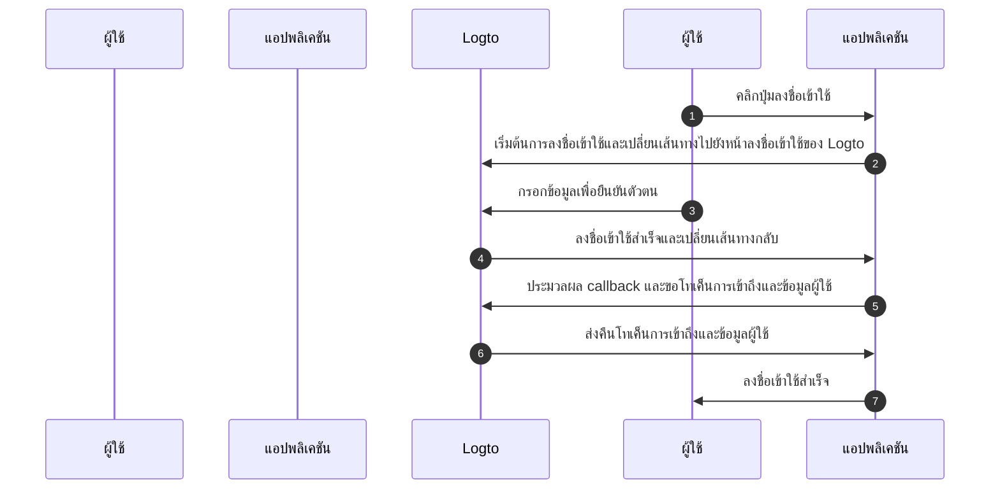
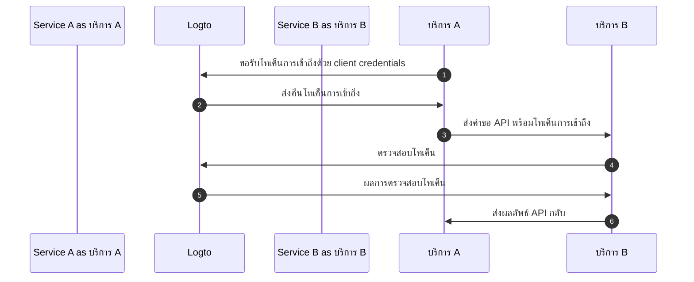
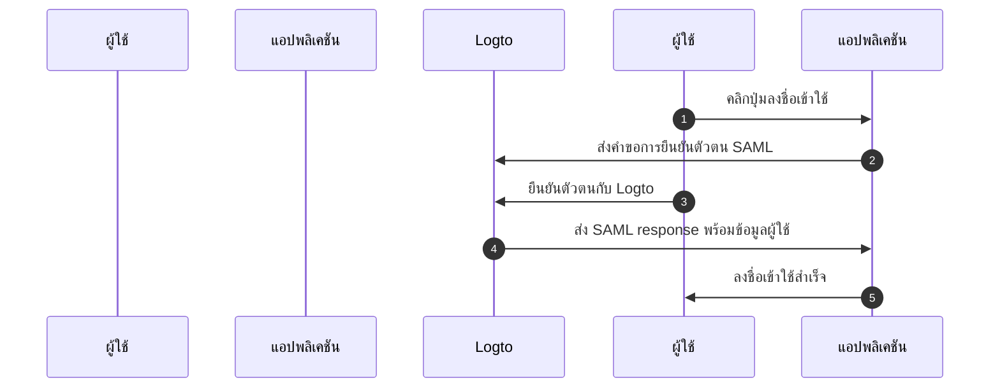

# เข้าใจ flow การยืนยันตัวตน OIDC

Logto ถูกสร้างขึ้นบนมาตรฐาน [OAuth 2.0](https://auth.wiki/oauth-2.0) และ [OpenID Connect (OIDC)](https://auth.wiki/openid-connect) การเข้าใจมาตรฐานการยืนยันตัวตนเหล่านี้จะช่วยให้กระบวนการเชื่อมต่อเป็นไปอย่างราบรื่นและตรงไปตรงมายิ่งขึ้น

### Flow การยืนยันตัวตนของผู้ใช้ \{#user-authentication-flow}

นี่คือสิ่งที่เกิดขึ้นเมื่อผู้ใช้ลงชื่อเข้าใช้ด้วย Logto:

ใน flow นี้ มีแนวคิดสำคัญหลายประการที่จำเป็นสำหรับการเชื่อมต่อ:

- `Application`: หมายถึงแอปของคุณใน Logto คุณจะต้องสร้างการตั้งค่าแอปพลิเคชันใน Logto Console เพื่อเชื่อมต่อแอปจริงของคุณกับบริการ Logto ดูข้อมูลเพิ่มเติมที่ [Application](/integrate-logto/application-data-structure/#introduction)
- `Redirect URI`: หลังจากผู้ใช้ยืนยันตัวตนบนหน้าลงชื่อเข้าใช้ของ Logto แล้ว Logto จะเปลี่ยนเส้นทางกลับไปยังแอปของคุณผ่าน URI นี้ คุณต้องกำหนดค่า Redirect URI ในการตั้งค่าแอปพลิเคชันของคุณ ดูรายละเอียดเพิ่มเติมที่ [Redirect URIs](/integrate-logto/application-data-structure/#redirect-uris)
- `Handle sign-in callback`: เมื่อ Logto เปลี่ยนเส้นทางผู้ใช้กลับมายังแอปของคุณ แอปของคุณต้องประมวลผลข้อมูลการยืนยันตัวตนและขอโทเค็นการเข้าถึงและข้อมูลผู้ใช้ ไม่ต้องกังวล - Logto SDK จะจัดการให้อัตโนมัติ

ภาพรวมนี้ครอบคลุมสิ่งจำเป็นสำหรับการเชื่อมต่ออย่างรวดเร็ว หากต้องการเข้าใจเชิงลึกเพิ่มเติม ดูคู่มือ [อธิบายประสบการณ์การลงชื่อเข้าใช้](/concepts/sign-in-experience/)

### Flow การยืนยันตัวตนระหว่างเครื่อง (M2M) \{#machine-to-machine-authentication-flow}

Logto มีประเภท [แอปพลิเคชันเครื่องต่อเครื่อง (M2M)](/quick-starts/m2m) เพื่อรองรับการยืนยันตัวตนโดยตรงระหว่างบริการ โดยอิงกับ [OAuth 2.0 Client Credentials flow](https://auth.wiki/client-credentials-flow):

flow การยืนยันตัวตนระหว่างเครื่อง (M2M) นี้ออกแบบมาสำหรับแอปพลิเคชันที่ต้องสื่อสารกับทรัพยากรโดยตรงโดยไม่ต้องมีผู้ใช้ (ไม่มี UI) เช่น บริการ API ที่อัปเดตข้อมูลผู้ใช้ใน Logto หรือบริการสถิติที่ดึงข้อมูลคำสั่งซื้อรายวัน

ใน flow นี้ บริการจะยืนยันตัวตนด้วย client credentials ซึ่งเป็นการรวมกันของ [Application ID](/integrate-logto/application-data-structure/#application-id) และ [Application Secret](/integrate-logto/application-data-structure/#application-secret) ที่ระบุและยืนยันตัวตนของบริการนั้น ๆ อย่างเฉพาะเจาะจง ข้อมูลเหล่านี้ทำหน้าที่เป็นอัตลักษณ์ของบริการเมื่อขอ [โทเค็นการเข้าถึง](https://auth.wiki/access-token) จาก Logto

### Flow การยืนยันตัวตน SAML \{#saml-authentication-flow}

นอกจาก OAuth 2.0 และ OIDC แล้ว Logto ยังรองรับการยืนยันตัวตน SAML (Security Assertion Markup Language) โดยทำหน้าที่เป็นผู้ให้บริการข้อมูลระบุตัวตน (IdP) เพื่อเชื่อมต่อกับแอปพลิเคชันองค์กร ปัจจุบัน Logto รองรับ flow การยืนยันตัวตนแบบ SP-initiated:

#### SP-initiated flow \{#saml-authentication-flow-sp-init}

ใน SP-initiated flow กระบวนการยืนยันตัวตนจะเริ่มต้นจาก Service Provider (แอปพลิเคชันของคุณ):

ใน flow นี้:

- ผู้ใช้เริ่มต้นกระบวนการยืนยันตัวตนจากแอปพลิเคชันของคุณ (Service Provider)
- แอปพลิเคชันของคุณสร้าง SAML request และเปลี่ยนเส้นทางผู้ใช้ไปยัง Logto (Identity Provider)
- หลังจากยืนยันตัวตนสำเร็จที่ Logto จะส่ง SAML response กลับไปยังแอปพลิเคชันของคุณ
- แอปพลิเคชันของคุณประมวลผล SAML response และดำเนินการยืนยันตัวตนให้เสร็จสมบูรณ์

#### IdP-initiated flow \{#saml-authentication-flow-idp-init}

Logto จะรองรับ IdP-initiated flow ในเวอร์ชันถัดไป ซึ่งจะช่วยให้ผู้ใช้เริ่มต้นกระบวนการยืนยันตัวตนได้โดยตรงจากพอร์ทัลของ Logto โปรดติดตามข่าวสารเกี่ยวกับฟีเจอร์นี้

การเชื่อมต่อ SAML นี้ช่วยให้แอปพลิเคชันองค์กรสามารถใช้ Logto เป็นผู้ให้บริการข้อมูลระบุตัวตน รองรับทั้ง Service Provider ที่ทันสมัยและแบบเดิมที่ใช้ SAML

## แหล่งข้อมูลที่เกี่ยวข้อง \{#related-resources}

<Url href="https://blog.logto.io/secure-cloud-apps-with-oauth-and-openid-connect">
  บล็อก: ปกป้องแอปพลิเคชันบนคลาวด์ด้วย OAuth 2.0 และ OpenID Connect
</Url>

<Url href="https://blog.logto.io/sso-is-better">
  ทำไม Single Sign-On (SSO) สำหรับหลายแอปพลิเคชันจึงดีกว่า
</Url>

<Url href="https://blog.logto.io/centralized-identity-system">
  ทำไมคุณต้องมีระบบข้อมูลระบุตัวตนแบบศูนย์กลางสำหรับธุรกิจที่มีหลายแอป
</Url>
