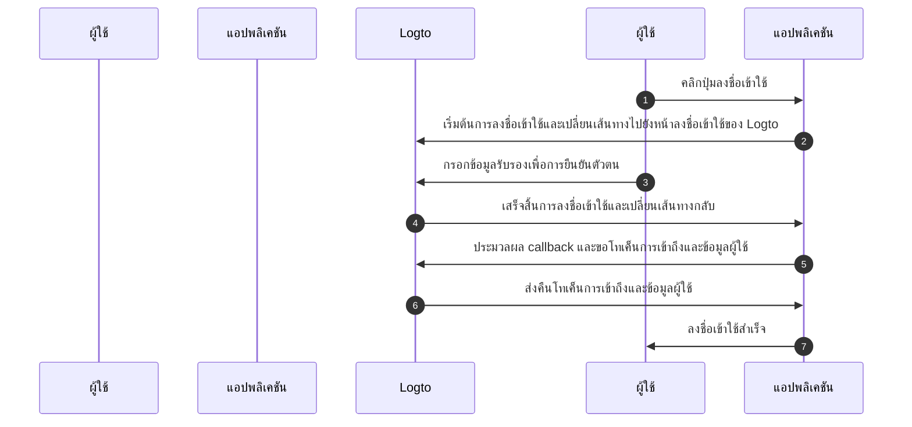
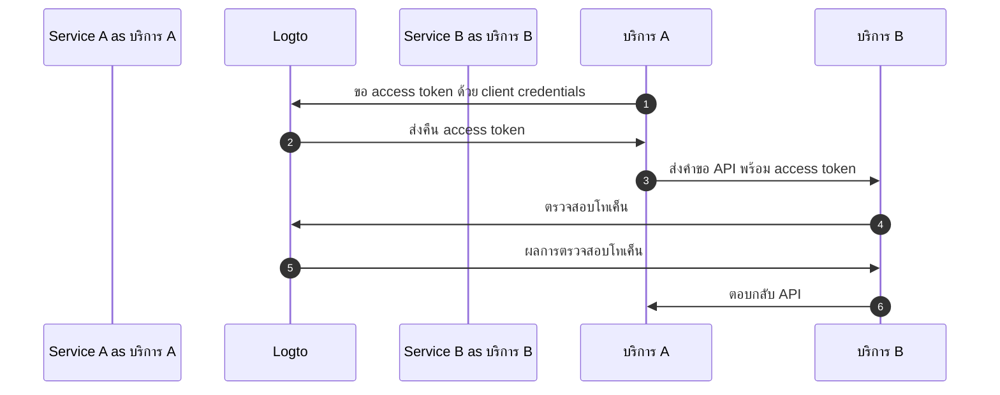
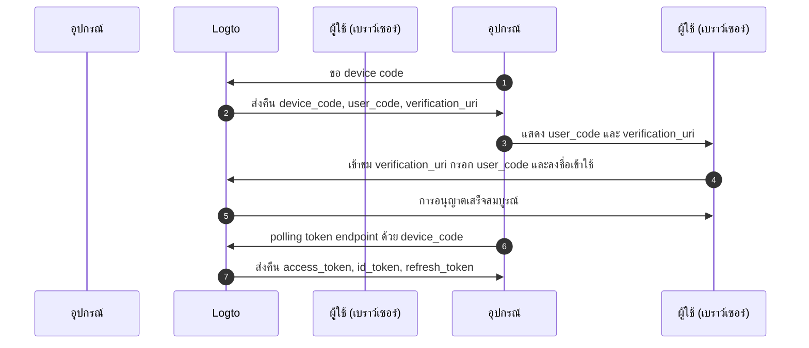
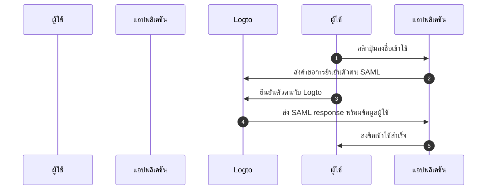

# เข้าใจ flow การยืนยันตัวตน OIDC

Logto ถูกสร้างขึ้นบนมาตรฐาน [OAuth 2.0](https://auth.wiki/oauth-2.0) และ [OpenID Connect (OIDC)](https://auth.wiki/openid-connect) การเข้าใจมาตรฐานการยืนยันตัวตนเหล่านี้จะช่วยให้กระบวนการเชื่อมต่อเป็นไปอย่างราบรื่นและตรงไปตรงมายิ่งขึ้น

### Flow การยืนยันตัวตนของผู้ใช้ \{#user-authentication-flow}

นี่คือสิ่งที่เกิดขึ้นเมื่อผู้ใช้ลงชื่อเข้าใช้ด้วย Logto:

```mermaid
sequenceDiagram
    autonumber
    participant User as ผู้ใช้
    participant Application as แอปพลิเคชัน
    participant Logto

    ผู้ใช้->>แอปพลิเคชัน: คลิกปุ่มลงชื่อเข้าใช้
    แอปพลิเคชัน->>Logto: เริ่มต้นการลงชื่อเข้าใช้และเปลี่ยนเส้นทางไปยังหน้าลงชื่อเข้าใช้ของ Logto
    ผู้ใช้->>Logto: กรอกข้อมูลรับรองเพื่อการยืนยันตัวตน
    Logto->>แอปพลิเคชัน: เสร็จสิ้นการลงชื่อเข้าใช้และเปลี่ยนเส้นทางกลับ
    แอปพลิเคชัน->>Logto: ประมวลผล callback และขอโทเค็นการเข้าถึงและข้อมูลผู้ใช้
    Logto->>แอปพลิเคชัน: ส่งคืนโทเค็นการเข้าถึงและข้อมูลผู้ใช้
    แอปพลิเคชัน->>ผู้ใช้: ลงชื่อเข้าใช้สำเร็จ
```

ใน flow นี้ มีแนวคิดสำคัญหลายประการที่จำเป็นสำหรับกระบวนการเชื่อมต่อ:

- `Application`: หมายถึงแอปของคุณใน Logto คุณจะต้องสร้างการตั้งค่าแอปพลิเคชันใน Logto Console เพื่อเชื่อมต่อระหว่างแอปจริงของคุณกับบริการ Logto ดูเพิ่มเติมเกี่ยวกับ [Application](/integrate-logto/application-data-structure/#introduction)
- `Redirect URI`: หลังจากผู้ใช้ยืนยันตัวตนบนหน้าลงชื่อเข้าใช้ของ Logto แล้ว Logto จะเปลี่ยนเส้นทางกลับไปยังแอปของคุณผ่าน URI นี้ คุณต้องกำหนดค่า Redirect URI ในการตั้งค่าแอปพลิเคชันของคุณ ดูรายละเอียดเพิ่มเติมที่ [Redirect URIs](/integrate-logto/application-data-structure/#redirect-uris)
- `Handle sign-in callback`: เมื่อ Logto เปลี่ยนเส้นทางผู้ใช้กลับไปยังแอปของคุณ แอปของคุณต้องประมวลผลข้อมูลการยืนยันตัวตนและขอโทเค็นการเข้าถึงและข้อมูลผู้ใช้ ไม่ต้องกังวล - Logto SDK จะจัดการให้อัตโนมัติ

ภาพรวมนี้ครอบคลุมสิ่งจำเป็นสำหรับการเชื่อมต่ออย่างรวดเร็ว หากต้องการเข้าใจเชิงลึกเพิ่มเติม ดูคู่มือ [อธิบายประสบการณ์การลงชื่อเข้าใช้](/concepts/sign-in-experience/)

### Flow การยืนยันตัวตนแบบเครื่องต่อเครื่อง \{#machine-to-machine-authentication-flow}

Logto มีประเภท [แอปพลิเคชันเครื่องต่อเครื่อง (M2M)](/quick-starts/m2m) เพื่อรองรับการยืนยันตัวตนโดยตรงระหว่างบริการ โดยอิงกับ [OAuth 2.0 Client Credentials flow](https://auth.wiki/client-credentials-flow):

```mermaid
sequenceDiagram
    autonumber
    participant Service A as บริการ A
    participant Logto
    participant Service B as บริการ B

    บริการ A->>Logto: ขอ access token ด้วย client credentials
    Logto->>บริการ A: ส่งคืน access token
    บริการ A->>บริการ B: ส่งคำขอ API พร้อม access token
    บริการ B->>Logto: ตรวจสอบโทเค็น
    Logto->>บริการ B: ผลการตรวจสอบโทเค็น
    บริการ B->>บริการ A: ตอบกลับ API
```

flow การยืนยันตัวตนแบบเครื่องต่อเครื่อง (M2M) นี้ออกแบบมาสำหรับแอปพลิเคชันที่ต้องสื่อสารกับทรัพยากรโดยตรงโดยไม่ต้องมีการโต้ตอบกับผู้ใช้ (จึงไม่มี UI) เช่น บริการ API ที่อัปเดตข้อมูลผู้ใช้ใน Logto หรือบริการสถิติที่ดึงข้อมูลคำสั่งซื้อรายวัน

ใน flow นี้ บริการจะยืนยันตัวตนโดยใช้ client credentials ซึ่งเป็นการรวมกันของ [Application ID](/integrate-logto/application-data-structure/#application-id) และ [Application Secret](/integrate-logto/application-data-structure/#application-secret) ที่ระบุและยืนยันตัวตนของบริการนั้น ๆ อย่างเฉพาะเจาะจง ข้อมูลรับรองเหล่านี้ทำหน้าที่เป็นตัวตนของบริการเมื่อขอ [โทเค็นการเข้าถึง (access tokens)](https://auth.wiki/access-token) จาก Logto

### Device flow (อุปกรณ์ที่ป้อนข้อมูลจำกัด) \{#device-flow}

สำหรับอุปกรณ์ที่มีความสามารถในการป้อนข้อมูลจำกัด (เช่น สมาร์ททีวี เครื่องเล่นเกม เครื่องมือ CLI อุปกรณ์ IoT) Logto รองรับ [OAuth 2.0 Device Authorization Grant](https://auth.wiki/device-flow) อุปกรณ์จะแสดงรหัสและ URL ขณะที่ผู้ใช้ดำเนินการยืนยันตัวตนบนอุปกรณ์อื่นที่มีเบราว์เซอร์:

```mermaid
sequenceDiagram
    autonumber
    participant Device as อุปกรณ์
    participant Logto
    participant User as ผู้ใช้ (เบราว์เซอร์)

    อุปกรณ์->>Logto: ขอ device code
    Logto->>อุปกรณ์: ส่งคืน device_code, user_code, verification_uri
    อุปกรณ์->>ผู้ใช้ (เบราว์เซอร์): แสดง user_code และ verification_uri
    ผู้ใช้ (เบราว์เซอร์)->>Logto: เข้าชม verification_uri กรอก user_code และลงชื่อเข้าใช้
    Logto->>ผู้ใช้ (เบราว์เซอร์): การอนุญาตเสร็จสมบูรณ์
    อุปกรณ์->>Logto: polling token endpoint ด้วย device_code
    Logto->>อุปกรณ์: ส่งคืน access_token, id_token, refresh_token
```

ใน flow นี้:

- อุปกรณ์ขอ device code จาก Logto และได้รับ `user_code` สั้น ๆ กับ `verification_uri`
- ผู้ใช้เข้าชม verification URL บนอุปกรณ์อื่น (เช่น โทรศัพท์ แล็ปท็อป) กรอกรหัส และลงชื่อเข้าใช้
- อุปกรณ์ polling ไปยัง token endpoint จนกว่าผู้ใช้จะอนุญาตสำเร็จ จากนั้นจึงได้รับโทเค็น

แตกต่างจาก flow ผู้ใช้มาตรฐาน device flow ไม่ต้องการ Redirect URI หรือความสามารถเบราว์เซอร์บนอุปกรณ์เอง ดูเพิ่มเติมใน [คู่มือเริ่มต้นอย่างรวดเร็วสำหรับ Device flow](/quick-starts/device-flow)

### Flow การยืนยันตัวตน SAML \{#saml-authentication-flow}

นอกจาก OAuth 2.0 และ OIDC แล้ว Logto ยังรองรับการยืนยันตัวตน SAML (Security Assertion Markup Language) โดยทำหน้าที่เป็นผู้ให้บริการข้อมูลระบุตัวตน (IdP) เพื่อเชื่อมต่อกับแอปพลิเคชันองค์กร ปัจจุบัน Logto รองรับ flow การยืนยันตัวตนแบบ SP-initiated:

#### SP-initiated flow \{#saml-authentication-flow-sp-init}

ใน SP-initiated flow กระบวนการยืนยันตัวตนเริ่มต้นจาก Service Provider (แอปพลิเคชันของคุณ):

```mermaid
sequenceDiagram
    autonumber
    participant User as ผู้ใช้
    participant Application as แอปพลิเคชัน
    participant Logto

    ผู้ใช้->>แอปพลิเคชัน: คลิกปุ่มลงชื่อเข้าใช้
    แอปพลิเคชัน->>Logto: ส่งคำขอการยืนยันตัวตน SAML
    ผู้ใช้->>Logto: ยืนยันตัวตนกับ Logto
    Logto->>แอปพลิเคชัน: ส่ง SAML response พร้อมข้อมูลผู้ใช้
    แอปพลิเคชัน->>ผู้ใช้: ลงชื่อเข้าใช้สำเร็จ
```

ใน flow นี้:

- ผู้ใช้เริ่มต้นกระบวนการยืนยันตัวตนจากแอปพลิเคชันของคุณ (Service Provider)
- แอปพลิเคชันของคุณสร้าง SAML request และเปลี่ยนเส้นทางผู้ใช้ไปยัง Logto (Identity Provider)
- หลังจากยืนยันตัวตนกับ Logto สำเร็จ จะมี SAML response ส่งกลับไปยังแอปของคุณ
- แอปของคุณประมวลผล SAML response และเสร็จสิ้นการยืนยันตัวตน

#### IdP-initiated flow \{#saml-authentication-flow-idp-init}

Logto จะรองรับ IdP-initiated flow ในเวอร์ชันถัดไป ซึ่งจะทำให้ผู้ใช้สามารถเริ่มต้นกระบวนการยืนยันตัวตนได้โดยตรงจากพอร์ทัลของ Logto โปรดติดตามข่าวสารเกี่ยวกับฟีเจอร์นี้

การเชื่อมต่อ SAML นี้ช่วยให้แอปพลิเคชันองค์กรสามารถใช้ Logto เป็นผู้ให้บริการข้อมูลระบุตัวตน รองรับทั้ง Service Provider ที่ใช้ SAML แบบใหม่และแบบดั้งเดิม

## แหล่งข้อมูลที่เกี่ยวข้อง \{#related-resources}

<Url href="https://blog.logto.io/secure-cloud-apps-with-oauth-and-openid-connect">
  บล็อก: ปกป้องแอปพลิเคชันบนคลาวด์ด้วย OAuth 2.0 และ OpenID Connect
</Url>

<Url href="https://blog.logto.io/sso-is-better">
  ทำไม Single Sign-On (SSO) สำหรับหลายแอปพลิเคชันจึงดีกว่า
</Url>

<Url href="https://blog.logto.io/centralized-identity-system">
  ทำไมคุณต้องมีระบบข้อมูลระบุตัวตนแบบศูนย์กลางสำหรับธุรกิจหลายแอป
</Url>
