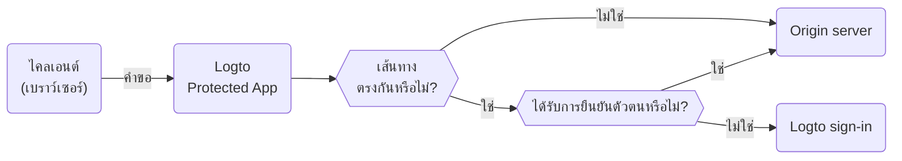

# Protected App — การผสานการยืนยันตัวตนแบบไม่ใช้ SDK

Protected App ถูกออกแบบมาเพื่อลดความซับซ้อนของ [การผสาน SDK](/quick-starts) โดยแยกชั้น [การยืนยันตัวตน (Authentication)](https://auth.wiki/authentication) ออกจากแอปพลิเคชันของคุณ เราดูแลเรื่องการยืนยันตัวตนให้ คุณจึงสามารถโฟกัสกับฟังก์ชันหลักของคุณได้ เมื่อผู้ใช้ได้รับการยืนยันตัวตนแล้ว Protected App จะให้บริการเนื้อหาจากเซิร์ฟเวอร์ของคุณ

## Protected App ทำงานอย่างไร \{#how-protected-app-works}

Protected App ที่ขับเคลื่อนโดย Cloudflare ทำงานทั่วโลกบน edge networks เพื่อให้แน่ใจว่าแอปของคุณมี latency ต่ำและพร้อมใช้งานสูง

Protected App จะดูแลสถานะเซสชันและข้อมูลผู้ใช้ หากผู้ใช้ยังไม่ได้รับการยืนยันตัวตน Protected App จะเปลี่ยนเส้นทางไปยังหน้าลงชื่อเข้าใช้ เมื่อได้รับการยืนยันตัวตนแล้ว Protected App จะห่อหุ้มคำขอของผู้ใช้ด้วยข้อมูลการยืนยันตัวตนและข้อมูลผู้ใช้ จากนั้นจึงส่งต่อไปยัง origin server

กระบวนการนี้แสดงในแผนผังลำดับขั้นต่อไปนี้:



## ปกป้อง origin server ของคุณ \{#protect-your-origin-server}

Origin server ซึ่งอาจเป็นอุปกรณ์จริงหรือเสมือนที่ไม่ได้เป็นเจ้าของโดย Protected App ของ Logto คือที่ที่เนื้อหาแอปของคุณอยู่ คล้ายกับเซิร์ฟเวอร์ Content Delivery Network (CDN) โดย Protected App จะจัดการกระบวนการยืนยันตัวตนและดึงเนื้อหาจาก origin server ของคุณ ดังนั้น หากผู้ใช้เข้าถึง origin server ได้โดยตรง พวกเขาจะสามารถข้ามการยืนยันตัวตนและแอปของคุณจะไม่ปลอดภัยอีกต่อไป

ดังนั้นจึงสำคัญมากที่จะต้องรักษาความปลอดภัยของการเชื่อมต่อกับ origin เพื่อป้องกันไม่ให้ผู้โจมตีค้นพบและเข้าถึง origin server ของคุณโดยไม่มีการยืนยันตัวตน มีหลายวิธีในการทำเช่นนี้:

1. การตรวจสอบ HTTP Header
2. การตรวจสอบ JSON Web Tokens (JWT)

### การตรวจสอบ HTTP Header \{#http-header-validation}

การรักษาความปลอดภัย origin server ของคุณสามารถทำได้โดยใช้ [HTTP Basic Authentication](https://developer.mozilla.org/en-US/docs/Web/HTTP/Authentication#basic_authentication_scheme) เพื่อปกป้อง origin server

ทุกคำขอจาก Protected App จะมี header ดังนี้:

```
Authorization: Basic base64(appId:appSecret)
```

โดยการตรวจสอบ header นี้ คุณสามารถยืนยันได้ว่าคำขอมาจาก Protected App และปฏิเสธคำขอที่ไม่มี header นี้

หากคุณใช้ Nginx หรือ Apache สามารถดูคู่มือเหล่านี้เพื่อใช้งาน HTTP Basic Authentication บน origin server ของคุณ:

1. Nginx: [การตั้งค่า HTTP Basic Authentication](https://docs.nginx.com/nginx/admin-guide/security-controls/configuring-http-basic-authentication/)
2. Apache: [Authentication and Authorization](https://httpd.apache.org/docs/2.4/howto/auth.html)

หากต้องการตรวจสอบ header ภายในแอปของคุณ ดูตัวอย่าง [HTTP Basic Authentication](https://developers.cloudflare.com/workers/examples/basic-auth/) ที่ Cloudflare ให้ไว้เพื่อเรียนรู้วิธีจำกัดการเข้าถึงด้วย HTTP Basic schema

### การตรวจสอบ JSON Web Tokens (JWT) \{#json-web-tokens-jwt-validation}

อีกวิธีหนึ่งในการรักษาความปลอดภัย origin server ของคุณคือการใช้ JSON Web Tokens (JWT)

ทุกคำขอที่ได้รับการยืนยันตัวตนจาก Protected App จะมี header ดังนี้:

```
Logto-ID-Token: <JWT>
```

JWT นี้เรียกว่า [ID Token](https://auth.wiki/id-token) ซึ่งถูกลงนามโดย Logto และมีข้อมูลผู้ใช้อยู่ โดยการตรวจสอบ JWT นี้ คุณสามารถยืนยันได้ว่าคำขอมาจาก Protected App และปฏิเสธคำขอที่ไม่มี header นี้

โทเค็นนี้ถูกเข้ารหัสและลงนามเป็นโทเค็น [JWS](https://auth.wiki/jws)

ขั้นตอนการตรวจสอบ:

1. [การตรวจสอบ JWT](https://datatracker.ietf.org/doc/html/rfc7519#section-7.2)
2. [การตรวจสอบลายเซ็น JWS](https://datatracker.ietf.org/doc/html/rfc7515#section-5.2)
3. ผู้ออกโทเค็นคือ `https://<your-logto-domain>/oidc` (ออกโดย Logto auth server ของคุณ)

```js
const express = require('express');
const jwksClient = require('jwks-rsa');
const jwt = require('jsonwebtoken');

const ISSUER = 'https://<your-logto-domain>/oidc';
const CERTS_URL = 'https://<your-logto-domain>/oidc/jwks';

const client = jwksClient({
  jwksUri: CERTS_URL,
});

const getKey = (header, callback) => {
  client.getSigningKey(header.kid, function (err, key) {
    callback(err, key?.getPublicKey());
  });
};

const verifyToken = (req, res, next) => {
  const token = req.headers['Logto-ID-Token'];

  // ตรวจสอบว่าคำขอที่เข้ามามี header โทเค็นของเราหรือไม่
  if (!token) {
    return res
      .status(403)
      .send({ status: false, message: 'missing required Logto-ID-Token header' });
  }

  jwt.verify(token, getKey, { issuer: ISSUER }, (err, decoded) => {
    if (err) {
      return res.status(403).send({ status: false, message: 'invalid id token' });
    }

    req.user = decoded;
    next();
  });
};

const app = express();

app.use(verifyToken);

app.get('/', (req, res) => {
  res.send('Hello World!');
});

app.listen(3000);
```

## รับสถานะการยืนยันตัวตนและข้อมูลผู้ใช้ \{#get-authentication-state-and-user-information}

หากคุณต้องการรับข้อมูลการยืนยันตัวตนและข้อมูลผู้ใช้สำหรับแอปของคุณ คุณสามารถใช้ header `Logto-ID-Token` ได้เช่นกัน

หากคุณต้องการเพียงแค่ถอดรหัสโทเค็น สามารถใช้โค้ดต่อไปนี้:

```js
const express = require('express');

const decodeIdToken = (req, res, next) => {
  const token = req.headers['Logto-ID-Token'];

  if (!token) {
    return res.status(403).send({
      status: false,
      message: 'missing required Logto-ID-Token header',
    });
  }

  const parts = token.split('.');
  if (parts.length !== 3) {
    throw new Error('Invalid ID token');
  }

  const payload = parts[1];
  const decodedPayload = atob(payload.replace(/-/g, '+').replace(/_/g, '/'));
  const claims = JSON.parse(decodedPayload);

  req.user = claims;
  next();
};

const app = express();

app.use(decodeIdToken);

app.get('/', (req, res) => {
  res.json(req.user);
});

app.listen(3000);
```

## รับ host ต้นทางเดิม \{#get-the-original-host}

หากคุณต้องการรับ host ต้นทางที่ไคลเอนต์ร้องขอ สามารถใช้ header `Logto-Host` หรือ `x-forwarded-host`

## ปรับแต่งกฎการยืนยันตัวตน \{#customize-authentication-rules}

โดยปกติ Protected App จะปกป้องทุกเส้นทาง หากคุณต้องการปรับแต่งกฎการยืนยันตัวตน สามารถตั้งค่าในฟิลด์ "Custom authentication rules" ใน Console

รองรับ regular expressions ตัวอย่างกรณีการใช้งาน:

1. เพื่อปกป้องเฉพาะเส้นทาง `/admin` และ `/privacy` ด้วยการยืนยันตัวตน: `^/(admin|privacy)/.*`
2. เพื่อยกเว้นภาพ JPG จากการยืนยันตัวตน: `^(?!.*\.jpg$).*$`

## การพัฒนาแบบ local \{#local-development}

Protected App ถูกออกแบบมาให้ทำงานร่วมกับ origin server ของคุณ อย่างไรก็ตาม หาก origin server ของคุณไม่สามารถเข้าถึงได้จากภายนอก คุณสามารถใช้เครื่องมืออย่าง [ngrok](https://ngrok.com/) หรือ [Cloudflare Tunnels](https://developers.cloudflare.com/pages/how-to/preview-with-cloudflare-tunnel/) เพื่อเปิดเผยเซิร์ฟเวอร์ local ของคุณสู่อินเทอร์เน็ต

## การเปลี่ยนไปใช้การผสาน SDK \{#transition-to-sdk-integration}

Protected App ถูกออกแบบมาเพื่อให้ง่ายต่อการยืนยันตัวตน อย่างไรก็ตาม หากคุณต้องการเปลี่ยนไปใช้การผสาน SDK เพื่อการควบคุมและปรับแต่งที่มากขึ้น คุณสามารถ [สร้างแอปใหม่](/integrate-logto/integrate-logto-into-your-application) ใน Logto และตั้งค่า [การผสาน SDK](/quick-starts) และเพื่อให้เปลี่ยนผ่านได้อย่างราบรื่น คุณสามารถนำ config ของแอปจาก Protected App มาใช้ซ้ำได้ โดย Protected App จริง ๆ แล้วคือ "Traditional Web App" ใน Logto คุณสามารถดู "[AppId](/integrate-logto/application-data-structure#application-id)" และ "[AppSecret](/integrate-logto/application-data-structure#application-secret)" ได้ในหน้าตั้งค่าแอป หลังจากเปลี่ยนผ่านเสร็จแล้ว คุณสามารถลบ Protected App ออกจากแอปของคุณได้

## แหล่งข้อมูลที่เกี่ยวข้อง \{#related-resources}

<Url href="https://www.youtube.com/watch?v=ZBrXW3iZyKY">
  Protected App: สร้างระบบยืนยันตัวตนให้แอปของคุณในไม่กี่คลิก ไม่ต้องเขียนโค้ด
</Url>

<Url href="https://blog.logto.io/protected-app">แรงบันดาลใจเบื้องหลัง Protected App</Url>

<Url href="https://blog.logto.io/fastest-way-to-build-auth-system">
  วิธีที่เร็วที่สุดในการสร้างระบบการยืนยันตัวตน
</Url>
