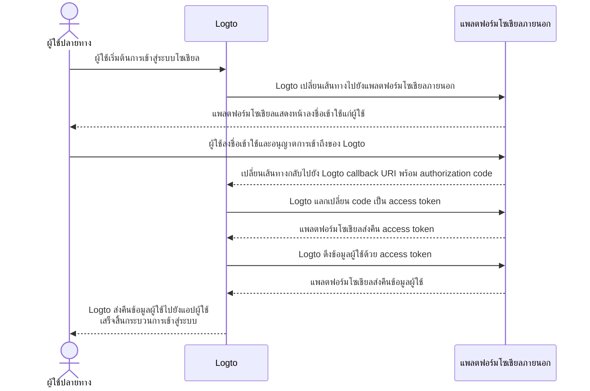

# การพัฒนาตัวเชื่อมต่อ (Implement connectors)

หลังจากดูโครงสร้างไฟล์ของตัวเชื่อมต่อแล้ว มาทำความเข้าใจแนวคิดหลักและวิธีการพัฒนาตัวเชื่อมต่อกัน

เราจะยกตัวอย่างที่เข้าใจง่ายสำหรับตัวเชื่อมต่อโซเชียลและแบบไม่ใช้รหัสผ่าน (passwordless) เพื่อให้คุณสามารถสร้างตัวเชื่อมต่อของคุณเองได้ด้วยแนวคิดเดียวกันเกือบทั้งหมด

ในส่วนนี้ เราจะไม่ลงลึกในรายละเอียดของพารามิเตอร์เฉพาะ (เช่น `config`) เนื่องจากไม่ใช่จุดประสงค์ของคู่มือนี้ นักพัฒนาที่จะสร้างตัวเชื่อมต่อใหม่ควรอ่านเอกสารจากผู้ให้บริการภายนอก ซึ่งจะอธิบายรายละเอียดของพารามิเตอร์ต่าง ๆ ไว้อย่างครบถ้วน

## สร้างตัวเชื่อมต่อโซเชียล \{#build-a-social-connector}

ขอยกตัวอย่างตัวเชื่อมต่อ GitHub

โฟลว์การอนุญาตของตัวเชื่อมต่อโซเชียลส่วนใหญ่จะเป็นไปตาม [OAuth Authorization Code Flow](https://openid.net/specs/openid-connect-basic-1_0.html)

:::note
สำหรับ _ตัวเชื่อมต่อโซเชียล_ ส่วนใหญ่ การดึงข้อมูลโปรไฟล์ผู้ใช้ด้วยการยืนยันตัวตนของผู้ใช้ปลายทางจะเป็นไปตามขั้นตอนสองขั้น (สมมติว่าทุกขั้นสำเร็จ):

1. เริ่มคำขอการยืนยันตัวตนและรับการยืนยันตัวตนของผู้ใช้
2. ดึง `accessToken` โดยใช้ `authCode` ที่ได้รับจากผู้ให้บริการตัวเชื่อมต่อ
3. ขอข้อมูลโปรไฟล์ผู้ใช้ที่เข้าถึงได้สาธารณะโดยใช้ `accessToken`
   :::



เพื่อให้โฟลว์นี้สมบูรณ์ เราต้องมีเมธอดหลัก 3 ตัวดังนี้

### getAuthorizationUri \{#getauthorizationuri}

`getAuthorizationUri` สร้าง URL สำหรับเปลี่ยนเส้นทางผู้ใช้ไปยังหน้าที่ต้องการการยืนยันตัวตน

อินเทอร์เฟซนี้ถูกกำหนดเป็น `GetAuthorizationUri` ใน [`@logto/connector-kit`](https://github.com/logto-io/logto/blob/master/packages/toolkit/connector-kit/src/types/social.ts)

คุณสามารถจัดเก็บข้อมูลสำคัญที่เกี่ยวข้องกับการเข้าสู่ระบบโดยใช้ `setSession` (พารามิเตอร์ตัวที่สองของ `GetAuthorizationUri`) เพื่อใช้ในเมธอด `getUserInfo`

พารามิเตอร์ที่จำเป็นมีดังนี้:

- `authorizationEndpoint` สามารถดูได้จากเอกสาร OAuth ของ GitHub ซึ่งเป็นหน้าที่ผู้ใช้ควรไปเพื่อยืนยันตัวตน
- `config` ซึ่งรวม `clientId` และ `clientSecret` ในกรณีของ GitHub
- `state` สตริงสุ่มเพื่อป้องกัน CSRF
- `redirectUri` หน้าปลายทางหลังจากผู้ใช้ยืนยันตัวตนสำเร็จ

```typescript
const getAuthorizationUri = async ({ state, redirectUri }) => {
  const queryParameters = new URLSearchParams({
    client_id: config.clientId, // `config` contains your GitHub application credential
    redirect_uri: redirectUri,
    state,
  });

  return `${authorizationEndpoint}?${queryParameters.toString()}`;
};
```

### getAccessToken \{#getaccesstoken}

`getAccessToken` ใช้สำหรับรับ access token ด้วย authorization code ที่ออกหลังจากผู้ใช้ยืนยันตัวตนสำเร็จ

นอกจาก `config` ที่กล่าวถึงใน `getAuthorizationUri` แล้ว เรายังต้องการ:

- authorization `code` จากพารามิเตอร์ที่ถูกส่งมายังหน้า redirect
- `accessTokenEndpoint` ซึ่งเป็น endpoint สำหรับขอ access token ด้วย authorization code

```typescript
const getAccessToken = async (config: GithubConfig, code: string) => {
  const { clientId: client_id, clientSecret: client_secret } = config;

  const httpResponse = await got.post({
    url: accessTokenEndpoint,
    json: {
      client_id,
      client_secret,
      code,
    },
    timeout: defaultTimeout,
  });

  const result = accessTokenResponseGuard.safeParse(qs.parse(httpResponse.body));

  if (!result.success) {
    throw new ConnectorError(ConnectorErrorCodes.InvalidResponse, result.error);
  }

  const { access_token: accessToken } = result.data;

  assert(accessToken, new ConnectorError(ConnectorErrorCodes.SocialAuthCodeInvalid));

  return { accessToken };
};
```

### getUserInfo \{#getuserinfo}

`getUserInfo` ใช้สำหรับดึงข้อมูลผู้ใช้ด้วย access token ที่ได้จากขั้นตอนก่อนหน้า

อินเทอร์เฟซนี้ถูกกำหนดเป็น `GetUserInfo` ใน [`@logto/connector-kit`](https://github.com/logto-io/logto/blob/master/packages/toolkit/connector-kit/src/types/social.ts)

สำหรับการเข้าสู่ระบบ คุณสามารถดึงข้อมูลที่จำเป็นโดยใช้ฟังก์ชัน `getSession`

`userInfoEndpoint` คือ endpoint ที่ใช้สำหรับดึงข้อมูลผู้ใช้

คุณควรตรวจสอบเอกสารทางการเพื่อดูว่าข้อมูลผู้ใช้ใดบ้างที่เข้าถึงได้ที่ user info endpoint และขอบเขต (scope) ที่เกี่ยวข้อง

`id` ที่ได้รับมอบหมายโดยผู้ให้บริการข้อมูลระบุตัวตน (ในกรณีนี้คือ GitHub) เป็นข้อมูลที่จำเป็น; ข้อมูลอื่นเป็นทางเลือก หากคุณสามารถดึง `email` หรือ `phone` จากโปรไฟล์ผู้ใช้ได้ โปรดตรวจสอบให้แน่ใจว่าข้อมูลเหล่านั้น “ได้รับการยืนยัน” แล้ว และควรจัดชื่อคีย์ที่ส่งกลับให้ตรงกับฟิลด์ใน [Logto user profile](/user-management/user-data/#basic-data)

```typescript
const getUserInfo = async (
  data: { code: string; config: GithubConfig },
  getSession: GetSession,
  { set: SetStorageValue, get: GetStorageValue }
) => {
  const { code, config } = data;
  const { accessToken } = await getAccessToken(config, code);

  try {
    const httpResponse = await got.get(userInfoEndpoint, {
      headers: {
        authorization: `token ${accessToken}`,
      },
      timeout: defaultTimeout,
    });

    const result = userInfoResponseGuard.safeParse(parseJson(httpResponse.body));

    if (!result.success) {
      throw new ConnectorError(ConnectorErrorCodes.InvalidResponse, result.error);
    }

    const { id, avatar_url: avatar, email, name } = result.data;

    return {
      id: String(id),
      avatar: conditional(avatar),
      email: conditional(email),
      name: conditional(name),
    };
  } catch (error: unknown) {
    if (error instanceof HTTPError) {
      const { statusCode, body: rawBody } = error.response;

      if (statusCode === 401) {
        throw new ConnectorError(ConnectorErrorCodes.SocialAccessTokenInvalid);
      }

      throw new ConnectorError(ConnectorErrorCodes.General, JSON.stringify(rawBody));
    }

    throw error;
  }
};
```

คุณสามารถดูตัวอย่างการใช้งานเต็มรูปแบบได้ที่ [ที่นี่](https://github.com/logto-io/connectors/blob/master/packages/connector-github/src/index.ts)

สำหรับรายละเอียดเพิ่มเติมเกี่ยวกับพารามิเตอร์ที่กำหนดค่าได้ ดูที่ README ของตัวเชื่อมต่อ GitHub หรือเอกสารทางการของ GitHub

:::note
ตัวอย่างที่กล่าวถึงนี้อ้างอิงจาก Authorization Code grant type ของโปรโตคอล OAuth ซึ่งใช้ในตัวเชื่อมต่อ GitHub ของ Logto อย่างไรก็ตาม ยังมี grant type อื่น เช่น Implicit grant type ที่สามารถใช้ดึงโปรไฟล์ผู้ใช้ได้เช่นกัน และจะให้ access_token โดยตรงใน response ของการยืนยันตัวตน แม้จะสะดวกกว่า แต่โดยทั่วไปแนะนำให้ใช้ Authorization Code grant type มากกว่า Implicit type เนื่องจากมีความปลอดภัยสูงกว่า

คุณยังสามารถสร้างตัวเชื่อมต่อโดยอิงกับ OIDC หรือโปรโตคอลเปิดอื่น ๆ ได้ ขึ้นอยู่กับกรณีการใช้งานและความเข้ากันได้ของผู้ให้บริการโซเชียลที่คุณต้องการเชื่อมต่อ
:::

## สร้างตัวเชื่อมต่อแบบไม่ใช้รหัสผ่าน (Passwordless) \{#build-a-passwordless-connector}

มาดูตัวอย่างการพัฒนาตัวเชื่อมต่อ Aliyun direct mail เพื่อเข้าใจกระบวนการสร้างตัวเชื่อมต่อแบบไม่ใช้รหัสผ่าน

ตัวเชื่อมต่อแบบไม่ใช้รหัสผ่านใช้สำหรับส่งรหัสสุ่มไปยังอีเมลหรือโทรศัพท์ของผู้ใช้ปลายทาง ดังนั้นจึงต้องมีเมธอด `sendMessage`

### sendMessage \{#sendmessage}

เพื่อส่งข้อความ เราต้องตั้งค่า `config` และ `endpoint` ให้ถูกต้อง

- `endpoint` คือ endpoint ที่ API ของคุณจะเชื่อมต่อไป
- `config` ประกอบด้วย `templates` (เทมเพลตเนื้อหาสำหรับส่งรหัสผ่านในแต่ละ flow), `clientId` และ `clientSecret` (สำหรับเข้าถึง API)

```typescript
const sendMessage = async (data, inputConfig) => {
  const { to, type, payload } = data;
  const config = inputConfig ?? (await getConfig(defaultMetadata.id));
  validateConfig<AliyunDmConfig>(config, aliyunDmConfigGuard);
  const { accessKeyId, accessKeySecret, accountName, fromAlias, templates } = config;
  const template = templates.find((template) => template.usageType === type);

  assert(
    template,
    new ConnectorError(
      ConnectorErrorCodes.TemplateNotFound,
      `Cannot find template for type: ${type}`
    )
  );

  const parameters = {
    AccessKeyId: accessKeyId,
    AccountName: accountName,
    ReplyToAddress: 'false',
    AddressType: '1',
    ToAddress: to,
    FromAlias: fromAlias,
    Subject: template.subject,
    HtmlBody:
      typeof payload.code === 'string'
        ? template.content.replace(/{{code}}/g, payload.code)
        : template.content,
  };

  try {
    const httpResponse = await request(
      endpoint,
      { Action: 'SingleSendMail', ...staticConfigs, ...parameters },
      accessKeySecret
    );

    const result = sendEmailResponseGuard.safeParse(parseJson(httpResponse.body));

    if (!result.success) {
      throw new ConnectorError(ConnectorErrorCodes.InvalidResponse, result.error);
    }

    return result.data;
  } catch (error: unknown) {
    if (error instanceof HTTPError) {
      const {
        response: { body: rawBody },
      } = error;

      assert(typeof rawBody === 'string', new ConnectorError(ConnectorErrorCodes.InvalidResponse));

      errorHandler(rawBody);
    }

    throw error;
  }
};

const request = async (
  url: string,
  parameters: PublicParameters & Record<string, string>,
  accessKeySecret: string
) => {
  const finalParameters: Record<string, string> = {
    ...parameters,
    SignatureNonce: String(Math.random()),
    Timestamp: new Date().toISOString(),
  };
  const signature = getSignature(finalParameters, accessKeySecret, 'POST');

  const payload = new URLSearchParams();

  for (const [key, value] of Object.entries(finalParameters)) {
    payload.append(key, value);
  }
  payload.append('Signature', signature);

  return got.post({
    url,
    headers: {
      'Content-Type': 'application/x-www-form-urlencoded',
    },
    form: payload,
  });
};
```

คุณสามารถดูตัวอย่างการใช้งานเต็มรูปแบบได้ที่ [ที่นี่](https://github.com/logto-io/connectors/blob/master/packages/connector-aliyun-dm/src/index.ts)

สำหรับรายละเอียดเพิ่มเติมเกี่ยวกับพารามิเตอร์ที่กำหนดค่าได้ ดูที่ README ของตัวเชื่อมต่อ Aliyun direct mail หรือเอกสารทางการของ Aliyun direct mail

## มีอะไรอีกบ้าง? \{#whats-more}

เพื่อดูนิยามของเมธอดตัวเชื่อมต่อและเข้าใจการออกแบบอินเทอร์เฟซของตัวเชื่อมต่อ ดูได้ที่ [`@logto/connector-kit`](https://github.com/logto-io/logto/tree/master/packages/toolkit/connector-kit) คุณยังสามารถดูข้อมูลอ้างอิง _ConnectorMetadata_ ได้ที่ "[Connectors - ConnectorMetadata](/connectors/connector-data-structure/#connectors-local-storage-connectormetadata)" และ "[โครงสร้างไฟล์ของตัวเชื่อมต่อ](/logto-oss/develop-your-connector/connector-file-structure/)" เพื่อช่วยจัดระเบียบการพัฒนาของคุณ

- สคีมา config ของตัวเชื่อมต่อ (_Zod_) เป็นสิ่งจำเป็นสำหรับตัวเชื่อมต่อทุกตัว ซึ่งสำคัญมากเพราะเราจะตรวจสอบชนิดข้อมูลก่อนบันทึก `config` ลงฐานข้อมูลและเรียก API ที่ต้องใช้ข้อมูล `config`
- ตัวเชื่อมต่อ _SMS_ และ _อีเมล_ ทุกตัวต้องมีเมธอด `sendMessage` เพื่อเรียก API ส่งข้อความของผู้ให้บริการโดยใช้ config จากฐานข้อมูล นักพัฒนายังสามารถใช้เมธอดนี้ซ้ำเพื่อส่งข้อความทดสอบด้วย config ที่ยังไม่ได้บันทึกขณะตั้งค่าตัวเชื่อมต่อใน Admin Console
- ตัวสร้าง URL สำหรับการอนุญาต `getAuthorizationUri` และตัวดึงโปรไฟล์ผู้ใช้ `getUserInfo` เป็นสิ่งจำเป็นสำหรับ _ตัวเชื่อมต่อโซเชียล_ ทุกตัว (`getAccessToken` ถือเป็นขั้นตอนเสริมใน `getUserInfo`)
- เมธอดของตัวเชื่อมต่อทุกตัวทำงานผ่านการเรียก API ดังนั้นนักพัฒนาตัวเชื่อมต่อควรตรวจสอบเอกสารและจัดการกับ response ที่อาจไม่สำเร็จจาก API

## ติดตั้งตัวเชื่อมต่อของคุณเอง \{#install-your-own-connectors}

เราถือว่าคุณได้สร้างตัวเชื่อมต่อของคุณเองเสร็จแล้ว ให้ทำตามขั้นตอนต่อไปนี้เพื่อติดตั้งด้วยตนเอง:

1. คัดลอกโฟลเดอร์ตัวเชื่อมต่อที่คุณพัฒนาไปยังไดเรกทอรี `/packages/connectors` ของ [`logto-io/logto`](https://github.com/logto-io/logto)
2. ติดตั้ง dependencies ของ repository ตัวเชื่อมต่อโดยรัน `pnpm pnpm:devPreinstall && pnpm i` ที่ root path ของโฟลเดอร์ logto
3. สร้างตัวเชื่อมต่อด้วยคำสั่ง `pnpm connectors build`
4. ลิงก์ตัวเชื่อมต่อ local โดยใช้ `pnpm cli connector link`
5. รีสตาร์ท Logto instance ด้วย `pnpm dev` ที่ root directory ของ `logto-io/logto` แล้วคุณจะพบว่าตัวเชื่อมต่อถูกติดตั้งสำเร็จ

ตอนนี้คุณสามารถทดสอบและลองใช้งานตัวเชื่อมต่อของคุณเพื่อดูว่าทำงานได้ตามที่คาดหวังหรือไม่

หากคุณต้องการเพิ่มตัวเชื่อมต่อที่เผยแพร่แล้วบน NPM หรือเป็นตัวเชื่อมต่อทางการของ Logto สามารถดูได้ที่ [การใช้ Logto CLI - จัดการตัวเชื่อมต่อ](/logto-oss/using-cli/manage-connectors/#add-connectors)
