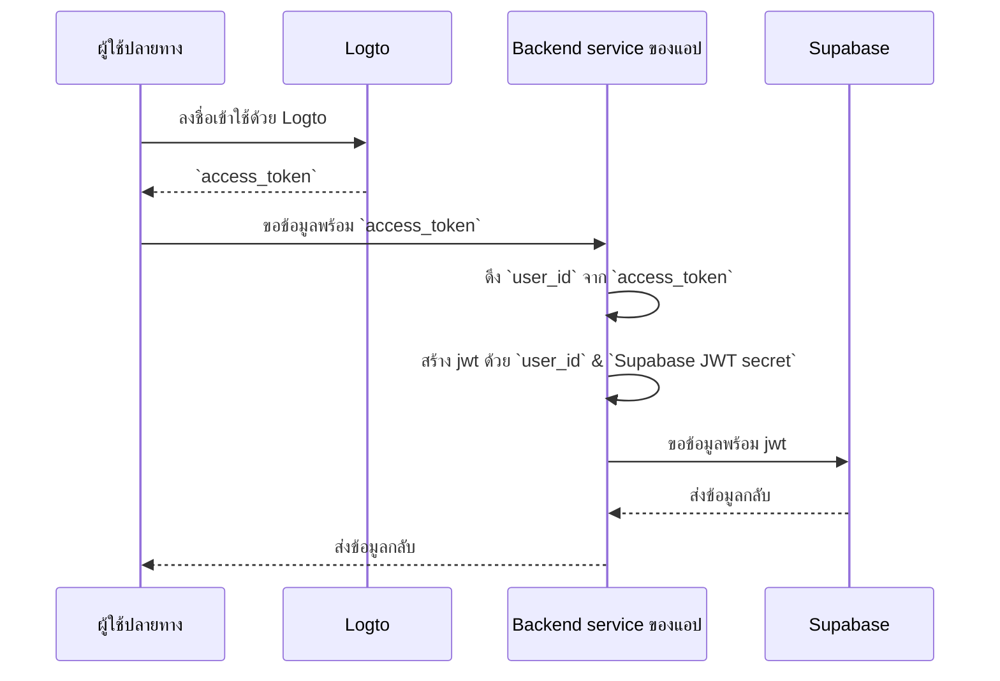

# เพิ่มการยืนยันตัวตนให้กับแอป Supabase ของคุณ (Add authentication to your Supabase application)

## พื้นฐานของ Supabase \{#supabase-basics}

Supabase ใช้ [Row-Level Security ของ Postgres](https://www.postgresql.org/docs/current/ddl-rowsecurity.html) เพื่อควบคุมสิทธิ์การเข้าถึงข้อมูล กล่าวโดยง่ายคือ โดยการสร้างนโยบาย Row Level Security ให้กับตารางในฐานข้อมูล เราสามารถจำกัดและจัดการว่าใครสามารถอ่าน เขียน และอัปเดตข้อมูลในตารางได้บ้าง

สมมติว่าคุณมีตารางชื่อ "posts" ในฐานข้อมูลของคุณ โดยมีเนื้อหาดังนี้:


ฟิลด์ `user_id` ในตารางนี้แสดงถึงผู้ใช้ที่เป็นเจ้าของข้อมูลโพสต์แต่ละรายการ คุณสามารถจำกัดให้แต่ละผู้ใช้เข้าถึงเฉพาะข้อมูลโพสต์ของตนเองโดยอิงจากฟิลด์ `user_id`

อย่างไรก็ตาม ก่อนที่จะทำเช่นนี้ได้ Supabase จำเป็นต้องสามารถระบุผู้ใช้ปัจจุบันที่กำลังเข้าถึงฐานข้อมูล

### เพิ่มข้อมูลผู้ใช้ลงในคำขอ Supabase \{#add-user-data-to-the-supabase-requests}

ด้วยการที่ Supabase รองรับ JWT เมื่อแอปของเราติดต่อกับ Supabase เราสามารถสร้าง JWT ที่มีข้อมูลผู้ใช้โดยใช้ JWT secret ที่ Supabase ให้มา จากนั้นใช้ JWT นี้เป็น Authentication header ในการส่งคำขอ เมื่อ Supabase ได้รับคำขอ จะตรวจสอบความถูกต้องของ JWT โดยอัตโนมัติและอนุญาตให้เข้าถึงข้อมูลที่อยู่ในนั้นตลอดกระบวนการถัดไป

ก่อนอื่น เราสามารถรับ JWT secret ที่ Supabase ให้มาจาก “Project Settings” ในแดชบอร์ดของ Supabase:


จากนั้น เมื่อเราใช้ Supabase SDK เพื่อส่งคำขอไปยัง Supabase เราจะใช้ secret นี้ในการสร้าง JWT ของเราและแนบเป็น Authentication header ไปกับคำขอ (โปรดทราบว่ากระบวนการนี้ควรเกิดขึ้นใน backend service ของแอปคุณ และไม่ควรเปิดเผย JWT secret ต่อบุคคลที่สามเด็ดขาด)

```jsx
import { createClient } from '@supabase/supabase-js';
import { sign } from 'jsonwebtoken';

/
 * หมายเหตุ:
 * คุณสามารถหา SUPABASE_URL, SUPABASE_ANON_KEY ได้จากที่เดียวกับ JWT Secret
 */
const SUPABASE_URL = process.env.SUPABASE_URL;
const SUPABASE_ANON_KEY = process.env.SUPABASE_ANON_KEY;

const SUPABASE_JWT_SECRET = process.env.SUPABASE_JWT_SECRET;

export const getSupabaseClient = (userId) => {
  const jwtPayload = {
    userId,
  };

  const jwt = sign(jwtPayload, SUPABASE_JWT_SECRET, {
    expiresIn: '1h', // ตัวอย่างเท่านั้น
  });

  const client = createClient(SUPABASE_URL, SUPABASE_ANON_KEY, {
    global: {
      headers: {
        Authorization: `Bearer ${jwt}`,
      },
    },
  });

  return client;
};
```

ถัดไป ไปที่ SQL Editor ในแดชบอร์ดของ Supabase และสร้างฟังก์ชันเพื่อดึง userId ที่แนบมากับคำขอ:


โค้ดที่ใช้ในภาพมีดังนี้:

```sql
create or replace function auth.user_id() returns text as $$
  select nullif(current_setting('request.jwt.claims', true)::json->>'userId', '')::text;
$$ language sql stable;
```

ตามที่เห็นในโค้ด ใน Supabase คุณสามารถดึง payload ของ JWT ที่เราสร้างขึ้นได้โดยเรียก `request.jwt.claims` ฟิลด์ `userId` ใน payload คือค่าที่เราตั้งไว้

ด้วยฟังก์ชันนี้ Supabase จะสามารถระบุผู้ใช้ที่กำลังเข้าถึงฐานข้อมูลได้

### สร้างนโยบาย Row-Level Security \{#create-row-level-security-policy}

ถัดไป เราสามารถสร้างนโยบาย Row-Level Security เพื่อจำกัดให้แต่ละผู้ใช้เข้าถึงเฉพาะข้อมูลโพสต์ของตนเองโดยอิงจากฟิลด์ `user_id` ในตาราง posts

1. ไปที่หน้า Table Editor ในแดชบอร์ดของ Supabase และเลือกตาราง posts
2. คลิก "Add RLS Policy" ที่ด้านบนของตาราง
3. ในหน้าต่างที่ปรากฏขึ้น คลิก "Create policy"
4. กรอกชื่อ Policy และเลือกคำสั่ง SELECT Policy
5. ในบล็อก `using` ของโค้ดด้านล่างนี้ ให้ใส่:

```sql
auth.user_id() = user_id
```


ด้วยการใช้นโยบายเช่นนี้ การควบคุมการเข้าถึงข้อมูลใน Supabase จะสำเร็จ

ในแอปพลิเคชันจริง คุณจะสร้างนโยบายหลายแบบเพื่อจำกัดการกระทำของผู้ใช้ เช่น การแทรกและแก้ไขข้อมูล อย่างไรก็ตาม สิ่งนี้อยู่นอกขอบเขตของบทความนี้ สำหรับข้อมูลเพิ่มเติมเกี่ยวกับ Row-Level Security (RLS) โปรดดูที่ [Secure your data using Postgres Row Level Security](https://supabase.com/docs/guides/database/postgres/row-level-security)

### กระบวนการผสานรวมพื้นฐานกับ Logto \{#basic-integration-process-with-logto}

ดังที่กล่าวไปแล้ว เนื่องจาก Supabase ใช้ RLS ในการควบคุมการเข้าถึง กุญแจสำคัญในการผสานรวมกับ Logto (หรือบริการการยืนยันตัวตนอื่น ๆ) คือการได้รับ user id ของผู้ใช้ที่ได้รับอนุญาตและส่งไปยัง Supabase กระบวนการทั้งหมดแสดงในไดอะแกรมด้านล่าง:



ถัดไป เราจะอธิบายวิธีผสานรวม Logto กับ Supabase ตามไดอะแกรมนี้

## การผสานรวม Logto \{#logto-integration}

Logto มีคู่มือการผสานรวมสำหรับเฟรมเวิร์กและภาษาโปรแกรมต่าง ๆ

โดยทั่วไป แอปที่สร้างด้วยเฟรมเวิร์กและภาษาเหล่านี้จะอยู่ในหมวด Native app, SPA (single-page app), เว็บแอปแบบดั้งเดิม และ M2M (machine-to-machine) คุณสามารถไปที่หน้า [Logto quick starts](/quick-starts) เพื่อผสานรวม Logto เข้ากับแอปของคุณตามเทคโนโลยีที่ใช้ หลังจากนั้น ให้ทำตามคำแนะนำด้านล่างเพื่อผสานรวม Logto เข้ากับโปรเจกต์ของคุณตามประเภทของแอป

### Native app หรือ SPA \{#native-app-or-spa}

ทั้ง Native app และ SPA ทำงานบนอุปกรณ์ของคุณ และข้อมูลรับรอง (access token) ที่ได้รับหลังจากเข้าสู่ระบบจะถูกเก็บไว้ในเครื่องของคุณ

ดังนั้น เมื่อผสานรวมแอปของคุณกับ Supabase คุณจำเป็นต้องติดต่อกับ Supabase ผ่าน backend service ของคุณ เพราะคุณไม่สามารถเปิดเผยข้อมูลสำคัญ (เช่น Supabase JWT secret) บนอุปกรณ์ของผู้ใช้แต่ละคนได้

สมมติว่าคุณกำลังสร้าง SPA ด้วย React และ Express คุณได้ผสานรวม Logto เข้ากับแอปของคุณสำเร็จโดยทำตาม [คู่มือ Logto React SDK](/quick-starts/react) (สามารถดูตัวอย่างโค้ดได้ที่ [react sample](https://github.com/logto-io/js/tree/master/packages/react-sample)) และคุณได้เพิ่มการตรวจสอบ access token ของ Logto ใน backend server ตามคู่มือ [validate access tokens](/authorization/validate-access-tokens)

ถัดไป คุณจะใช้ access token ที่ได้จาก Logto เพื่อขอข้อมูลผู้ใช้จาก backend server ของคุณ:

```jsx
import { useLogto } from '@logto/react';
import { useState, useEffect } from 'react';
import PostList from './PostList';

const endpoint = '<https://www.mysite.com/api/posts>';
const resource = '<https://www.mysite.com/api>';

function PostPage() {
  const { isAuthenticated, getAccessToken } = useLogto();
  const [posts, setPosts] = useState();

  useEffect(() => {
    const fetchPosts = async () => {
      const response = await fetch(endpoint, {
        headers: {
          Authorization: `Bearer ${await getAccessToken(resource)}`,
        },
      });
      setPosts(response.json());
    };

    if (isAuthenticated) {
      void fetchPosts();
    }
  }, [isAuthenticated, getAccessToken]);

  return <PostList posts={posts} />;
}

export default PostPage;
```

ใน backend server ของคุณ คุณได้ดึง id ของผู้ใช้ที่เข้าสู่ระบบจาก access token โดยใช้ middleware แล้ว:

```jsx
// auth-middleware.ts
import { createRemoteJWKSet, jwtVerify } from 'jose';

//...

export const verifyAuthFromRequest = async (ctx, next) => {
  // ดึง token
  const token = extractBearerTokenFromHeaders(ctx.request.headers);

  const { payload } = await jwtVerify(
    token, // Bearer Token ที่ดึงมาจาก request header
    createRemoteJWKSet(new URL('https://<your-logto-domain>/oidc/jwks')), // สร้าง jwks จาก jwks_uri ที่ได้จาก Logto server
    {
      // ผู้ออกที่คาดหวังของ token ควรออกโดย Logto server
      issuer: 'https://<your-logto-domain>/oidc',
      // audience ที่คาดหวัง ควรเป็น resource indicator ของ API ปัจจุบัน
      audience: '<your request listener resource indicator>',
    }
  );

  // ถ้าใช้ RBAC
  assert(payload.scope.includes('some_scope'));

  // กำหนดข้อมูล payload เอง
  ctx.auth = {
    userId: payload.sub,
  };

  return next();
};
```

ตอนนี้ คุณสามารถใช้ `getSupabaseClient` ที่อธิบายไว้ข้างต้นเพื่อแนบ `userId` ลงใน JWT ที่ใช้ในคำขอไปยัง Supabase หรือจะสร้าง middleware เพื่อสร้าง Supabase client สำหรับคำขอที่ต้องติดต่อกับ Supabase ก็ได้:

```jsx
export const withSupabaseClient = async (ctx, next) => {
  ctx.supabase = getSupabaseClient(ctx.auth.userId);

  return next();
};
```

ใน flow การประมวลผลถัดไป คุณสามารถเรียก `ctx.supabase` เพื่อใช้งานกับ Supabase ได้โดยตรง:

```jsx
const fetchPosts = async (ctx) => {
  const { data } = await ctx.supabase.from('posts').select('*');

  return data;
};
```

ในโค้ดนี้ Supabase จะคืนข้อมูลโพสต์เฉพาะของผู้ใช้ปัจจุบันตามนโยบายที่ตั้งไว้ก่อนหน้า

### เว็บแอปแบบดั้งเดิม \{#traditional-web-app}

ความแตกต่างหลักระหว่างเว็บแอปแบบดั้งเดิมกับ Native app หรือ SPA คือ เว็บแอปแบบดั้งเดิมจะเรนเดอร์และอัปเดตหน้าเว็บทั้งหมดบนเว็บเซิร์ฟเวอร์ ดังนั้น ข้อมูลรับรองของผู้ใช้จะถูกจัดการโดยตรงโดยเว็บเซิร์ฟเวอร์ ในขณะที่ Native app และ SPA จะเก็บไว้บนอุปกรณ์ของผู้ใช้

เมื่อผสานรวม Logto กับเว็บแอปแบบดั้งเดิมใน Supabase คุณสามารถดึง id ของผู้ใช้ที่เข้าสู่ระบบจาก backend ได้โดยตรง

ยกตัวอย่างโปรเจกต์ Next.js หลังจากที่คุณผสานรวม Logto กับโปรเจกต์ของคุณตาม [คู่มือ Next.js SDK](/quick-starts/next-app-router) คุณสามารถใช้ Logto SDK เพื่อดึงข้อมูลผู้ใช้และสร้าง JWT ที่ใช้ติดต่อกับ Supabase ได้

```jsx
import { getLogtoContext } from '@logto/next-server-actions';
import { logtoConfig } from '@/logto';
import { getSupabaseClient } from '@/utils';
import PostList from './PostList';

export default async function PostPage() {
  const { cliams } = await getLogtoContext(logtoConfig);

  // ค่า `sub` ใน `cliams` คือ user id
  const supabase = getSupabaseClient(cliams.sub);

  const { data: posts } = await supabase.from('posts').select('*');

  return <PostList posts={posts} />;
}
```

### Machine-to-machine app \{#machine-to-machine-app}

Machine-to-machine (M2M) มักใช้เมื่อแอปของคุณต้องติดต่อกับ resource server โดยตรง เช่น บริการที่ดึงโพสต์ประจำวัน ฯลฯ

คุณสามารถใช้คู่มือ [Machine-to-machine: Auth with Logto](/quick-starts/m2m) สำหรับการยืนยันตัวตนของแอป M2M การผสานรวมระหว่าง Supabase กับแอป M2M จะคล้ายกับ Native app และ SPA (ดูในหัวข้อ "[Native app หรือ SPA](#native-app-or-spa)") โดยจะต้องขอ access token จาก Logto แล้วตรวจสอบผ่าน backend API ที่ป้องกันไว้

อย่างไรก็ตาม สิ่งสำคัญที่ควรทราบคือ Native app และ SPA มักออกแบบมาสำหรับผู้ใช้ปลายทาง ดังนั้น user id ที่ได้จะเป็นตัวแทนของผู้ใช้เอง แต่ access token สำหรับแอป M2M จะเป็นตัวแทนของแอปพลิเคชันเอง และฟิลด์ `sub` ใน payload ของ access token จะเป็น client id ของแอป M2M ไม่ใช่ผู้ใช้เฉพาะ ดังนั้นระหว่างการพัฒนา ควรแยกแยะให้ชัดเจนว่าข้อมูลใดตั้งใจให้กับแอป M2M

นอกจากนี้ หากคุณต้องการให้แอป M2M เฉพาะเข้าถึง Supabase ในนามของบริการทั้งหมดเพื่อข้ามข้อจำกัด RLS คุณสามารถใช้ secret `service_role` ของ Supabase เพื่อสร้าง Supabase client ได้ เหมาะสำหรับงานดูแลระบบหรืออัตโนมัติที่ต้องเข้าถึงข้อมูลทั้งหมดโดยไม่ถูกจำกัดด้วยนโยบาย Row-Level Security ที่ตั้งไว้สำหรับผู้ใช้แต่ละคน

secret `service_role` สามารถพบได้ในหน้าเดียวกับ JWT secret:


เมื่อสร้าง Supabase client ให้ใช้ secret `service_role` จากนั้น client นี้จะสามารถเข้าถึงข้อมูลทั้งหมดในฐานข้อมูลได้:

```jsx
import { createClient } from '@supabase/supabase-js';

// ...
const SUPABASE_SERVICE_ROLE_SCRET = process.env.SUPABASE_SERVICE_ROLE_SCRET;

const client = createClient(SUPABASE_URL, SUPABASE_SERVICE_ROLE_SCRET, {
  // ...options
});
```
