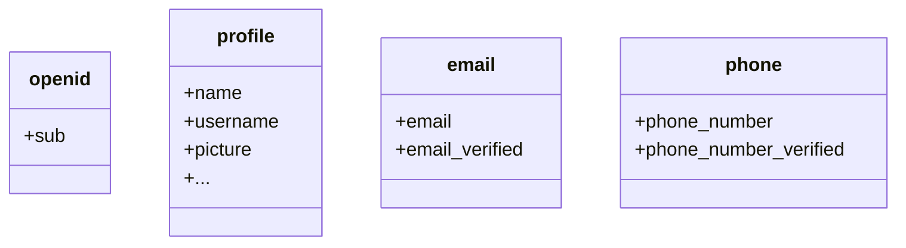

โดยปกติแล้ว จะมีการส่งคืนการอ้างสิทธิ์ (claim) แบบจำกัด หากคุณต้องการข้อมูลเพิ่มเติม คุณสามารถร้องขอขอบเขต (scope) เพิ่มเติมเพื่อเข้าถึงการอ้างสิทธิ์ (claim) ที่มากขึ้นได้

:::info
"การอ้างสิทธิ์ (Claim)" คือการยืนยันข้อมูลบางอย่างเกี่ยวกับผู้ถูกอ้างถึง (subject); "ขอบเขต (Scope)" คือกลุ่มของการอ้างสิทธิ์ (claim) ในกรณีนี้ การอ้างสิทธิ์ (claim) คือข้อมูลบางอย่างเกี่ยวกับผู้ใช้
:::

ตัวอย่างที่ไม่เป็นทางการของความสัมพันธ์ระหว่างขอบเขต (scope) กับการอ้างสิทธิ์ (claim) มีดังนี้:

:::tip
การอ้างสิทธิ์ (claim) "sub" หมายถึง "ผู้ถูกอ้างถึง (subject)" ซึ่งคือตัวระบุที่ไม่ซ้ำของผู้ใช้ (เช่น user ID)
:::

Logto SDK จะร้องขอขอบเขต (scope) สามรายการเสมอ ได้แก่ `openid`, `profile` และ `offline_access`
