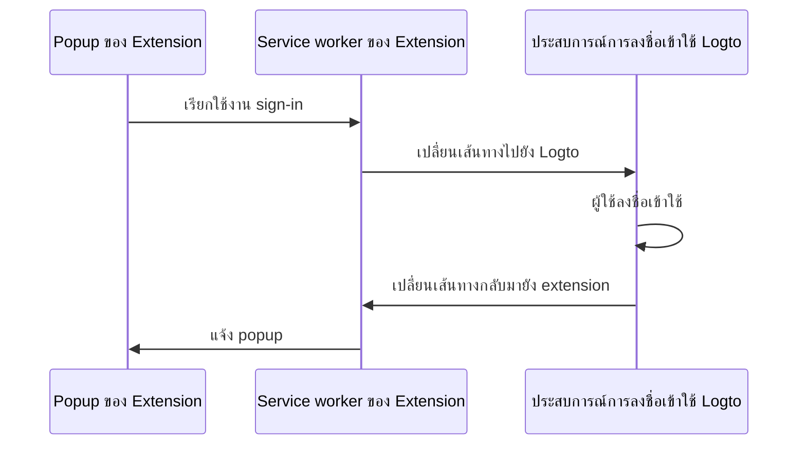

import RegardingRedirectBasedSignIn from '../../fragments/_regarding-redirect-based-sign-in.mdx';

### โฟลว์การยืนยันตัวตน (The authentication flow) \{#the-authentication-flow}

สมมติว่าคุณใส่ปุ่ม "Sign in" ใน popup ของ Chrome extension ของคุณ โฟลว์การยืนยันตัวตนจะมีลักษณะดังนี้:



สำหรับหน้า interactive อื่น ๆ ใน extension ของคุณ เพียงแค่เปลี่ยนชื่อ `Extension popup` เป็นชื่อหน้าที่ต้องการ ในคู่มือนี้เราจะเน้นที่หน้า popup

<RegardingRedirectBasedSignIn />

### อัปเดต `manifest.json` \{#update-the-manifestjson}

Logto SDK ต้องการ permission ต่อไปนี้ใน `manifest.json`:

```json title="manifest.json"
{
  "permissions": ["identity", "storage"],
  "host_permissions": ["https://*.logto.app/*"]
}
```

- `permissions.identity`: จำเป็นสำหรับ Chrome Identity API ซึ่งใช้สำหรับลงชื่อเข้าใช้และออกจากระบบ
- `permissions.storage`: จำเป็นสำหรับจัดเก็บ session ของผู้ใช้
- `host_permissions`: จำเป็นสำหรับ Logto SDK เพื่อสื่อสารกับ Logto APIs

:::note
หากคุณใช้โดเมนแบบกำหนดเองบน Logto Cloud คุณต้องอัปเดต `host_permissions` ให้ตรงกับโดเมนของคุณ
:::

### ตั้งค่า background script (service worker) \{#set-up-a-background-script-service-worker}

ใน background script ของ Chrome extension ของคุณ ให้เริ่มต้น Logto SDK ดังนี้:

```js title="service-worker.js"
import LogtoClient from '@logto/chrome-extension';

export const logtoClient = new LogtoClient({
  endpoint: '<your-logto-endpoint>'
  appId: '<your-logto-app-id>',
});
```

แทนที่ `<your-logto-endpoint>` และ `<your-logto-app-id>` ด้วยค่าจริง คุณสามารถดูค่าดังกล่าวได้ในหน้าแอปพลิเคชันที่คุณสร้างไว้ใน Logto Console

หากคุณยังไม่มี background script สามารถดู [คู่มืออย่างเป็นทางการ](https://developer.chrome.com/docs/extensions/develop/concepts/service-workers/basics) เพื่อสร้างได้

:::info
**ทำไมต้องมี background script?**

หน้า extension ปกติ เช่น popup หรือ options page ไม่สามารถทำงานเบื้องหลังได้ และอาจถูกปิดระหว่างกระบวนการยืนยันตัวตน background script จะช่วยให้กระบวนการยืนยันตัวตนทำงานได้อย่างถูกต้อง
:::

จากนั้น เราต้องฟังข้อความจากหน้า extension อื่น ๆ และจัดการกระบวนการยืนยันตัวตน:

```js title="service-worker.js"
chrome.runtime.onMessage.addListener((message, sender, sendResponse) => {
  // ในโค้ดด้านล่าง เนื่องจากเราคืนค่า `true` สำหรับแต่ละ action เราต้องเรียก `sendResponse`
  // เพื่อแจ้งผู้ส่ง คุณสามารถจัดการ error ที่นี่ หรือใช้วิธีอื่นแจ้งผู้ส่งก็ได้

  if (message.action === 'signIn') {
    const redirectUri = chrome.identity.getRedirectURL('/callback');
    logtoClient.signIn(redirectUri).finally(sendResponse);
    return true;
  }

  if (message.action === 'signOut') {
    const redirectUri = chrome.identity.getRedirectURL();
    logtoClient.signOut(redirectUri).finally(sendResponse);
    return true;
  }

  return false;
});
```

คุณจะสังเกตเห็นว่ามี redirect URI สองแบบในโค้ดข้างต้น ทั้งสองถูกสร้างโดย `chrome.identity.getRedirectURL` ซึ่งเป็น [Chrome API ในตัว](https://developer.chrome.com/docs/extensions/reference/api/identity#method-getRedirectURL) สำหรับสร้าง redirect URL สำหรับ auth flow โดยสอง URI จะเป็น:

- `https://<extension-id>.chromiumapp.org/callback` สำหรับ sign-in
- `https://<extension-id>.chromiumapp.org/` สำหรับ sign-out

โปรดทราบว่า URI เหล่านี้ไม่สามารถเข้าถึงได้ และใช้สำหรับให้ Chrome trigger การกระทำเฉพาะในกระบวนการยืนยันตัวตนเท่านั้น

### อัปเดตการตั้งค่าแอปพลิเคชัน Logto \{#update-logto-application-settings}

ตอนนี้เราต้องอัปเดตการตั้งค่าแอป Logto เพื่ออนุญาต redirect URI ที่เราสร้างไว้

1. ไปที่หน้าแอปพลิเคชันใน Logto Console
2. ในส่วน "Redirect URIs" ให้เพิ่ม URI: `https://<extension-id>.chromiumapp.org/callback`
3. ในส่วน "Post sign-out redirect URIs" ให้เพิ่ม URI: `https://<extension-id>.chromiumapp.org/`
4. ในส่วน "CORS allowed origins" ให้เพิ่ม URI: `chrome-extension://<extension-id>` โดย SDK ใน Chrome extension จะใช้ origin นี้ในการสื่อสารกับ Logto APIs
5. คลิก **Save changes**

อย่าลืมแทนที่ `<extension-id>` ด้วย extension ID จริงของคุณ สามารถดู extension ID ได้ที่หน้า `chrome://extensions`

### เพิ่มปุ่ม sign-in และ sign-out ใน popup \{#add-sign-in-and-sign-out-buttons-to-the-popup}

ใกล้เสร็จแล้ว! มาเพิ่มปุ่ม sign-in และ sign-out พร้อม logic ที่จำเป็นในหน้า popup

ในไฟล์ `popup.html`:

```html title="popup.html"
<button id="sign-in">Sign in</button> <button id="sign-out">Sign out</button>
```

ในไฟล์ `popup.js` (โดยสมมติว่า `popup.js` ถูก include ใน `popup.html`):

```js title="popup.js"
document.getElementById('sign-in').addEventListener('click', async () => {
  await chrome.runtime.sendMessage({ action: 'signIn' });
  // การลงชื่อเข้าใช้เสร็จสิ้น (หรือไม่สำเร็จ) สามารถอัปเดต UI ที่นี่
});

document.getElementById('sign-out').addEventListener('click', async () => {
  await chrome.runtime.sendMessage({ action: 'signOut' });
  // การออกจากระบบเสร็จสิ้น (หรือไม่สำเร็จ) สามารถอัปเดต UI ที่นี่
});
```

### เช็คพอยต์: ทดสอบโฟลว์การยืนยันตัวตน \{#checkpoint-test-the-authentication-flow}

ตอนนี้คุณสามารถทดสอบโฟลว์การยืนยันตัวตนใน Chrome extension ของคุณได้แล้ว:

1. เปิด popup ของ extension
2. คลิกปุ่ม "Sign in"
3. คุณจะถูกเปลี่ยนเส้นทางไปยังหน้าลงชื่อเข้าใช้ Logto
4. ลงชื่อเข้าใช้ด้วยบัญชี Logto ของคุณ
5. คุณจะถูกเปลี่ยนเส้นทางกลับมายัง Chrome

### ตรวจสอบสถานะการยืนยันตัวตน \{#check-authentication-state}

เนื่องจาก Chrome มี unified storage API นอกเหนือจากโฟลว์ sign-in และ sign-out แล้ว คุณสามารถใช้เมธอดอื่น ๆ ของ Logto SDK ในหน้า popup ได้โดยตรง

ใน `popup.js` ของคุณ สามารถใช้ instance ของ `LogtoClient` ที่สร้างใน background script หรือสร้างใหม่ด้วย config เดียวกันก็ได้:

```js title="popup.js"
import LogtoClient from '@logto/chrome-extension';

const logtoClient = new LogtoClient({
  endpoint: '<your-logto-endpoint>'
  appId: '<your-logto-app-id>',
});

// หรือใช้ instance logtoClient ที่สร้างใน background script
import { logtoClient } from './service-worker.js';
```

จากนั้นสามารถสร้างฟังก์ชันเพื่อโหลดสถานะการยืนยันตัวตนและโปรไฟล์ผู้ใช้:

```js title="popup.js"
const loadAuthenticationState = async () => {
  const isAuthenticated = await logtoClient.isAuthenticated();
  // อัปเดต UI ตามสถานะการยืนยันตัวตน

  if (isAuthenticated) {
    const user = await logtoClient.getIdTokenClaims(); // { sub: '...', email: '...', ... }
    // อัปเดต UI ด้วยโปรไฟล์ผู้ใช้
  }
};
```

คุณยังสามารถรวมฟังก์ชัน `loadAuthenticationState` เข้ากับ logic ของ sign-in และ sign-out ได้:

```js title="popup.js"
document.getElementById('sign-in').addEventListener('click', async () => {
  await chrome.runtime.sendMessage({ action: 'signIn' });
  await loadAuthenticationState();
});

document.getElementById('sign-out').addEventListener('click', async () => {
  await chrome.runtime.sendMessage({ action: 'signOut' });
  await loadAuthenticationState();
});
```

ตัวอย่างหน้า popup ที่แสดงสถานะการยืนยันตัวตน:


### ข้อควรพิจารณาอื่น ๆ \{#other-considerations}

- **Service worker bundling**: หากคุณใช้ bundler เช่น Webpack หรือ Rollup ต้องตั้งค่า target เป็น `browser` หรือคล้ายกัน เพื่อหลีกเลี่ยงการ bundle โมดูล Node.js ที่ไม่จำเป็น
- **Module resolution**: Logto Chrome extension SDK เป็นโมดูลแบบ ESM-only

ดู [โปรเจกต์ตัวอย่าง](https://github.com/logto-io/js/tree/HEAD/packages/chrome-extension-sample) ของเรา สำหรับตัวอย่างที่สมบูรณ์พร้อม TypeScript, Rollup และการตั้งค่าอื่น ๆ
