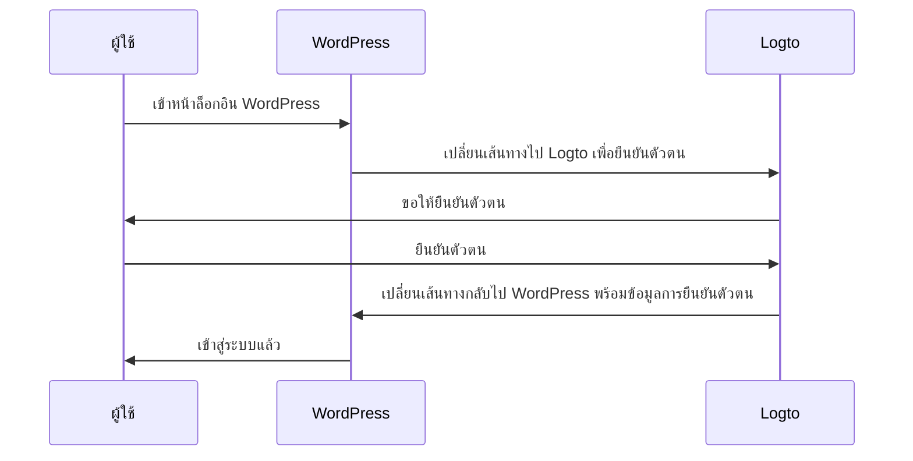
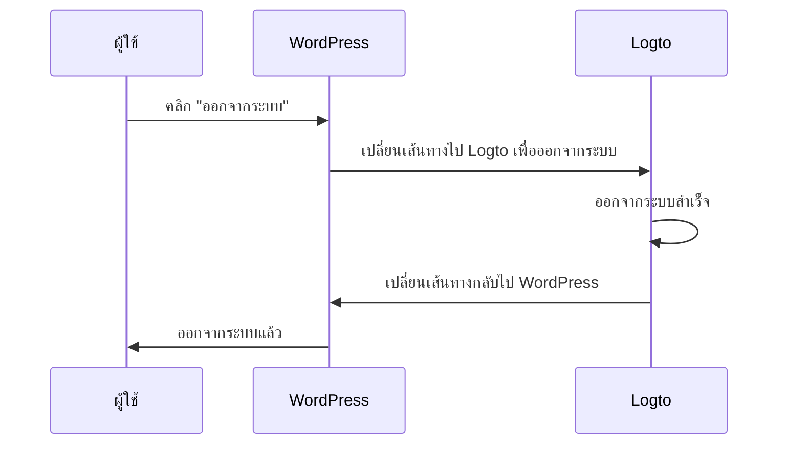

import TabItem from '@theme/TabItem';
import Tabs from '@theme/Tabs';

### ติดตั้งปลั๊กอิน \{#install-the-plugin}

<Tabs>

<TabItem value="admin-panel" label="จากแผงผู้ดูแล WordPress">

1. ไปที่ **ปลั๊กอิน (Plugins)** > **เพิ่มใหม่ (Add New)**.
2. ค้นหา "Logto" หรือกรอก https://wordpress.org/plugins/logto/ ในช่องค้นหา
3. คลิก **ติดตั้งตอนนี้ (Install Now)**
4. คลิก **เปิดใช้งาน (Activate)**

</TabItem>

<TabItem value="upload" label="จากการอัปโหลด">

1. ดาวน์โหลดปลั๊กอิน Logto WordPress จากลิงก์ใดลิงก์หนึ่งต่อไปนี้:
   - [รุ่นล่าสุด (Latest release)](https://github.com/logto-io/wordpress/releases): ดาวน์โหลดไฟล์ที่มีชื่อในรูปแบบ `logto-plugin-<version>.zip`
   - [ไดเรกทอรีปลั๊กอิน WordPress (WordPress plugin directory)](https://wordpress.org/plugins/logto/): ดาวน์โหลดไฟล์โดยคลิกปุ่ม **ดาวน์โหลด (Download)**
2. ดาวน์โหลดไฟล์ ZIP ของปลั๊กอิน
3. ไปที่ **ปลั๊กอิน (Plugins)** > **เพิ่มใหม่ (Add New)** ในแผงผู้ดูแล WordPress ของคุณ
4. คลิก **อัปโหลดปลั๊กอิน (Upload Plugin)**
5. เลือกไฟล์ ZIP ที่ดาวน์โหลดมาแล้วคลิก **ติดตั้งตอนนี้ (Install Now)**
6. คลิก **เปิดใช้งาน (Activate)**

</TabItem>

</Tabs>

### ตั้งค่าปลั๊กอิน \{#configure-the-plugin}

ตอนนี้คุณควรจะเห็นเมนู Logto ในแถบด้านข้างของแผงผู้ดูแล WordPress ของคุณ คลิก **Logto** > **Settings** เพื่อกำหนดค่าปลั๊กอิน

:::note
คุณควรสร้างแอปพลิเคชัน **เว็บแบบดั้งเดิม (traditional web)** ใน Logto Console ก่อนตั้งค่าปลั๊กอิน หากคุณยังไม่ได้สร้าง โปรดดู <MainSiteUrl href="/integrate-logto/integrate-logto-into-your-application">การผสาน Logto เข้ากับแอปพลิเคชันของคุณ</MainSiteUrl> สำหรับข้อมูลเพิ่มเติม
:::

การตั้งค่าขั้นต่ำที่จำเป็นสำหรับเริ่มต้นใช้งานปลั๊กอินคือ:

- Logto endpoint: จุดปลายทางของ Logto tenant ของคุณ
- App ID: รหัสแอปของแอปพลิเคชัน Logto ของคุณ
- App secret: หนึ่งในรหัสลับแอปที่ถูกต้องของแอปพลิเคชัน Logto ของคุณ

ค่าทั้งหมดนี้สามารถดูได้ที่หน้ารายละเอียดแอปพลิเคชันใน Logto Console

หลังจากกรอกค่าแล้ว คลิก **บันทึกการเปลี่ยนแปลง (Save Changes)** (เลื่อนลงไปด้านล่างของหน้า หากไม่พบปุ่ม)

### ตั้งค่า redirect URI \{#configure-redirect-uri}

Redirect URI คือ URL ที่ Logto จะเปลี่ยนเส้นทางผู้ใช้ไปหลังจากยืนยันตัวตนเสร็จ; และ post sign-out redirect URI คือ URL ที่ Logto จะเปลี่ยนเส้นทางผู้ใช้ไปหลังจากออกจากระบบ

นี่คือไดอะแกรมลำดับ (sequence diagram) แบบไม่เป็นทางการเพื่อแสดงขั้นตอนการลงชื่อเข้าใช้:

นี่คือขั้นตอนการออกจากระบบในไดอะแกรมลำดับแบบไม่เป็นทางการ:

หากต้องการเรียนรู้เพิ่มเติมว่าทำไมต้องมีการเปลี่ยนเส้นทาง ดู <MainSiteUrl href="/concepts/sign-in-experience">อธิบายประสบการณ์การลงชื่อเข้าใช้</MainSiteUrl>

ในกรณีนี้ คุณต้องตั้งค่าทั้งสอง redirect URI ใน Logto Console ของคุณ วิธีค้นหา redirect URI ให้ไปที่หน้า **Logto** > **Settings** ในแผงผู้ดูแล WordPress ของคุณ คุณจะเห็นฟิลด์ **Redirect URI** และ **Post sign-out redirect URI**

1. คัดลอกค่า **Redirect URI** และ **Post sign-out redirect URI** แล้ววางลงในฟิลด์ **Redirect URIs** และ **Post sign-out redirect URIs** ใน Logto Console ของคุณ
2. คลิก **บันทึกการเปลี่ยนแปลง (Save changes)** ใน Logto Console

### จุดตรวจสอบ: ทดสอบเว็บไซต์ WordPress ของคุณ \{#checkpoint-test-your-website}

ตอนนี้คุณสามารถทดสอบการผสาน Logto ในเว็บไซต์ WordPress ของคุณได้แล้ว:

1. เปิดหน้าต่างเบราว์เซอร์แบบไม่ระบุตัวตนหากจำเป็น
2. เข้าเว็บไซต์ WordPress ของคุณแล้วคลิก **เข้าสู่ระบบ (Log in)** หากมี; หรือเข้าหน้าล็อกอินโดยตรง (เช่น `https://example.com/wp-login.php`)
3. หน้าจะเปลี่ยนเส้นทางไปยังหน้าลงชื่อเข้าใช้ของ Logto
4. ดำเนินการลงชื่อเข้าใช้หรือสมัครสมาชิกให้เสร็จสิ้น
5. หลังจากยืนยันตัวตนสำเร็จ คุณจะถูกเปลี่ยนเส้นทางกลับไปยังเว็บไซต์ WordPress ของคุณและเข้าสู่ระบบโดยอัตโนมัติ
6. คลิก **ออกจากระบบ (Log out)** เพื่อออกจากระบบเว็บไซต์ WordPress ของคุณ
7. คุณจะถูกเปลี่ยนเส้นทางไปยังหน้าออกจากระบบของ Logto แล้วกลับไปยังเว็บไซต์ WordPress ของคุณ
8. คุณจะถูกออกจากระบบเว็บไซต์ WordPress ของคุณ
