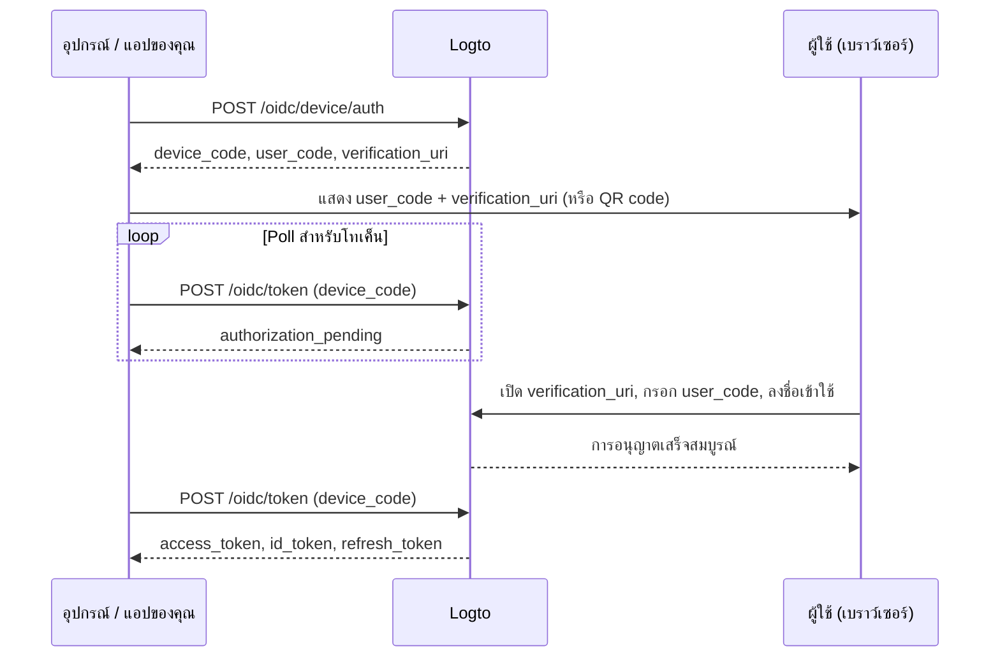

import ApiResourcesDescription from '../../fragments/_api-resources-description.md';
import FurtherReadings from '../../fragments/_further-readings.md';
import ScopeClaimList from '../../fragments/_scope-claim-list.md';
import ScopesAndClaimsIntroduction from '../../fragments/_scopes-claims-introduction.md';

# Device flow: Auth กับ Logto

:::note
คู่มือนี้สมมติว่าคุณได้สร้างแอปพลิเคชันประเภท "Native" ที่ใช้ device flow เป็น authorization flow ใน Logto Console แล้ว
:::

## บทนำ \{#introduction}

[OAuth 2.0 device authorization grant](https://auth.wiki/device-flow) (device flow) ถูกออกแบบมาสำหรับอุปกรณ์ที่มีข้อจำกัดด้านการป้อนข้อมูล เช่น สมาร์ททีวี, เครื่องเกม, เครื่องมือ CLI, และอุปกรณ์ IoT โดยช่วยให้ผู้ใช้เริ่มกระบวนการลงชื่อเข้าใช้บนอุปกรณ์นั้น แต่ดำเนินการยืนยันตัวตนให้เสร็จสมบูรณ์บนอุปกรณ์อื่นที่มีเบราว์เซอร์ เช่น โทรศัพท์หรือแล็ปท็อป

เนื่องจากตัวอุปกรณ์ไม่สามารถจัดการ flow การลงชื่อเข้าใช้ผ่านเบราว์เซอร์ได้ อุปกรณ์จะแสดงรหัสสั้น ๆ และ URL ให้ผู้ใช้ ผู้ใช้จะไปที่ URL นั้นบนอุปกรณ์อื่น กรอกรหัส และลงชื่อเข้าใช้ ในขณะเดียวกัน อุปกรณ์ต้นทางจะ poll ไปที่ Logto จนกว่าการอนุญาตจะเสร็จสมบูรณ์



## รับข้อมูลประจำตัวแอปพลิเคชัน \{#get-application-credentials}

ใน Logto Console ของคุณ ไปที่หน้ารายละเอียดแอปพลิเคชันเพื่อรับข้อมูลประจำตัวดังต่อไปนี้:

- **App ID**: ตัวระบุเฉพาะของแอปพลิเคชันของคุณ (หรือที่รู้จักในชื่อ `client_id`)
- **Logto endpoint**: จุดเชื่อมต่อเซิร์ฟเวอร์ authorization ของ Logto คุณสามารถดูได้ใน Logto Console ที่ "Application details"

สำหรับ Logto Cloud, endpoint คือ `https://{your-tenant-id}.logto.app`

:::note
แอป device flow เป็น public client จึงไม่ต้องใช้ App Secret
:::

## ขอ device code \{#request-a-device-code}

เริ่ม device flow โดยส่งคำขอ `POST` ไปยัง device authorization endpoint:

```bash
curl --request POST 'https://your.logto.endpoint/oidc/device/auth' \
  --header 'Content-Type: application/x-www-form-urlencoded' \
  --data-urlencode 'client_id=your-application-id' \
  --data-urlencode 'scope=openid offline_access profile'
```

ผลลัพธ์ที่ได้รับประกอบด้วย:

| Field                       | Description                                                                                                                                                |
| --------------------------- | ---------------------------------------------------------------------------------------------------------------------------------------------------------- |
| `device_code`               | โค้ดเฉพาะสำหรับแอปของคุณใช้ในการ poll ไปที่ token endpoint                                                                                                 |
| `user_code`                 | โค้ดสั้น ๆ สำหรับแสดงให้ผู้ใช้กรอกในเบราว์เซอร์                                                                                                            |
| `verification_uri`          | URL ที่ผู้ใช้จะกรอก `user_code`                                                                                                                            |
| `verification_uri_complete` | URL ที่มี `user_code` เติมไว้ล่วงหน้าแล้ว ผู้ใช้สามารถไปที่ URL นี้โดยตรงเพื่อข้ามการกรอกรหัสเอง — คุณสามารถนำเสนอเป็น QR code, ลิงก์ หรือวิธีอื่น ๆ ก็ได้ |
| `expires_in`                | อายุการใช้งาน (วินาที) ของ `device_code` และ `user_code` ให้หยุด polling เมื่อหมดอายุ                                                                      |

## แสดง URL สำหรับยืนยันตัวตนให้ผู้ใช้ \{#display-verification-url}

แสดง `user_code` และ `verification_uri` บนหน้าจออุปกรณ์ของคุณ

หรือจะใช้ `verification_uri_complete` ที่มีโค้ดเติมไว้ล่วงหน้าแล้วก็ได้ — ผู้ใช้เพียงแค่ยืนยัน วิธีนำเสนอขึ้นอยู่กับคุณ: QR code, ลิงก์ ฯลฯ

## Poll สำหรับโทเค็น \{#poll-for-tokens}

ขณะที่ผู้ใช้ดำเนินการยืนยันตัวตนในเบราว์เซอร์ อุปกรณ์ของคุณควร poll ไปที่ token endpoint โดยแอปของคุณควรรออย่างน้อย **5 วินาที** ระหว่างแต่ละ polling:

```bash
curl --request POST 'https://your.logto.endpoint/oidc/token' \
  --header 'Content-Type: application/x-www-form-urlencoded' \
  --data-urlencode 'client_id=your-application-id' \
  --data-urlencode 'grant_type=urn:ietf:params:oauth:grant-type:device_code' \
  --data-urlencode 'device_code=DEVICE_CODE'
```

แทนที่ `DEVICE_CODE` ด้วยค่าจาก device authorization response

**หยุด polling** เมื่อ:

- คุณได้รับ token response ที่สำเร็จ
- เวลาจาก `expires_in` ใน device code response หมดอายุ
- คุณได้รับ error ที่ไม่ควร retry เช่น `expired_token` หรือ `access_denied`

### การตอบกลับโทเค็น \{#token-response}

หลังจากผู้ใช้อนุมัติแล้ว ผลลัพธ์จะมี:

| Field           | Description                                                                                                                  |
| --------------- | ---------------------------------------------------------------------------------------------------------------------------- |
| `access_token`  | โทเค็นการเข้าถึง (Access token) โดยปกติเป็นสตริงทึบ; หากมีการร้องขอ `resource` จะเป็น JWT ที่ `aud` ถูกตั้งเป็น resource URI |
| `id_token`      | โทเค็น ID (ID token) ที่มีการอ้างสิทธิ์ของผู้ใช้ มีเฉพาะเมื่อร้องขอ scope `openid`                                           |
| `refresh_token` | ใช้เพื่อขอโทเค็นใหม่โดยไม่ต้องยืนยันตัวตนซ้ำ มีเฉพาะเมื่อร้องขอ scope `offline_access`                                       |
| `token_type`    | เป็น `Bearer` เสมอ                                                                                                           |
| `expires_in`    | อายุการใช้งานของโทเค็น (วินาที)                                                                                              |
| `scope`         | ขอบเขต (scopes) ที่ authorization server อนุมัติ                                                                             |

## Checkpoint: ทดสอบ device flow ของคุณ \{#checkpoint}

ตอนนี้ ทดสอบการเชื่อมต่อ device flow ของคุณ:

1. รันแอปของคุณและเรียก device flow เพื่อรับ `device_code` และ `user_code`
2. เปิด `verification_uri` ในเบราว์เซอร์และกรอก `user_code` หรือใช้ `verification_uri_complete` เพื่อข้ามการกรอกรหัส
3. ดำเนินการลงชื่อเข้าใช้ในเบราว์เซอร์ให้เสร็จสมบูรณ์
4. ตรวจสอบว่าแอปของคุณได้รับโทเค็นหลังจาก polling

## รับข้อมูลผู้ใช้ \{#get-user-information}

### ถอดรหัสการอ้างสิทธิ์ใน ID token \{#decode-id-token-claims}

`id_token` ที่ได้จาก token response เป็น [JSON Web Token (JWT)](https://auth.wiki/jwt) มาตรฐาน คุณสามารถถอดรหัส payload ที่ถูกเข้ารหัสแบบ Base64URL (ส่วนที่สองของ JWT คั่นด้วย `.`) เพื่อเข้าถึงการอ้างสิทธิ์พื้นฐานของผู้ใช้โดยไม่ต้องร้องขอเครือข่ายเพิ่มเติม

payload ที่ถอดรหัสจะมีการอ้างสิทธิ์ เช่น `sub` (user ID), `name`, `email` ฯลฯ ขึ้นอยู่กับ scopes ที่ร้องขอ

:::tip
สำหรับการใช้งานจริง ควรตรวจสอบลายเซ็นของ JWT ก่อนเชื่อถือการอ้างสิทธิ์ ใช้ JWKS จาก Logto endpoint ของคุณ (`https://your.logto.endpoint/oidc/jwks`) เพื่อตรวจสอบโทเค็น
:::

### ดึงข้อมูลจาก userinfo endpoint \{#fetch-from-userinfo-endpoint}

ID token จะมีการอ้างสิทธิ์พื้นฐานตาม scopes ที่ร้องขอ การอ้างสิทธิ์เพิ่มเติมบางอย่าง (เช่น `custom_data`, `identities`) จะมีเฉพาะผ่าน [OIDC UserInfo endpoint](https://openid.net/specs/openid-connect-core-1_0.html#UserInfo):

```bash
curl --request GET 'https://your.logto.endpoint/oidc/me' \
  --header 'Authorization: Bearer ACCESS_TOKEN'
```

แทนที่ `ACCESS_TOKEN` ด้วย access token ทึบ (ไม่ใช่ JWT resource token) ที่ได้จาก token response ผลลัพธ์จะเป็น JSON object ที่มีการอ้างสิทธิ์ของผู้ใช้ตาม scopes ที่ได้รับอนุมัติ

### ขอการอ้างสิทธิ์เพิ่มเติม \{#request-additional-claims}

คุณอาจพบว่าข้อมูลผู้ใช้บางอย่างไม่มีใน ID token นี่เป็นเพราะ OAuth 2.0 และ OpenID Connect (OIDC) ถูกออกแบบให้ยึดหลัก least privilege (PoLP) และ Logto ก็สร้างบนมาตรฐานเหล่านี้

<ScopesAndClaimsIntroduction />

หากต้องการขอ scopes เพิ่มเติม ให้ใส่ไว้ในพารามิเตอร์ `scope` ของ device authorization request เช่น หากต้องการขออีเมลและเบอร์โทรศัพท์ของผู้ใช้:

```bash
curl --request POST 'https://your.logto.endpoint/oidc/device/auth' \
  --header 'Content-Type: application/x-www-form-urlencoded' \
  --data-urlencode 'client_id=your-application-id' \
  --data-urlencode 'scope=openid offline_access profile email phone'
```

### Scopes และ claims \{#scopes-and-claims}

<ScopeClaimList />

## ทรัพยากร API และองค์กร \{#api-resources-and-organizations}

<ApiResourcesDescription />

### ขอสิทธิ์เข้าถึงทรัพยากร API \{#request-access-for-api-resources}

หากต้องการเข้าถึง API resource เฉพาะ ให้ใส่พารามิเตอร์ `resource` ใน device authorization request:

```bash
curl --request POST 'https://your.logto.endpoint/oidc/device/auth' \
  --header 'Content-Type: application/x-www-form-urlencoded' \
  --data-urlencode 'client_id=your-application-id' \
  --data-urlencode 'scope=openid offline_access' \
  --data-urlencode 'resource=https://your-api-resource-indicator'
```

เมื่อผู้ใช้อนุญาตเสร็จและคุณได้รับ refresh token แล้ว คุณสามารถขอโทเค็นการเข้าถึงแบบ JWT สำหรับ API resource ได้:

```bash
curl --request POST 'https://your.logto.endpoint/oidc/token' \
  --header 'Content-Type: application/x-www-form-urlencoded' \
  --data-urlencode 'client_id=your-application-id' \
  --data-urlencode 'grant_type=refresh_token' \
  --data-urlencode 'refresh_token=REFRESH_TOKEN' \
  --data-urlencode 'resource=https://your-api-resource-indicator'
```

ผลลัพธ์จะมี JWT `access_token` ที่ `aud` ถูกตั้งเป็น API resource indicator ของคุณ

:::note
`refresh_token` จะมีเฉพาะเมื่อมี scope `offline_access` ใน device authorization request แรกเสมอ เก็บและใช้ `refresh_token` ล่าสุดเสมอ เพราะ Logto ใช้ token rotation
:::

### ดึงโทเค็นองค์กร \{#fetch-organization-tokens}

หาก [องค์กร](/organizations) เป็นเรื่องใหม่สำหรับคุณ โปรดอ่าน [🏢 องค์กร (Multi-tenancy)](/organizations) เพื่อเริ่มต้น

หากต้องการขอข้อมูลที่เกี่ยวข้องกับองค์กร ให้เพิ่ม scope `urn:logto:scope:organizations` ใน device authorization request:

```bash
curl --request POST 'https://your.logto.endpoint/oidc/device/auth' \
  --header 'Content-Type: application/x-www-form-urlencoded' \
  --data-urlencode 'client_id=your-application-id' \
  --data-urlencode 'scope=openid offline_access urn:logto:scope:organizations' \
  --data-urlencode 'resource=urn:logto:resource:organizations'
```

เมื่อผู้ใช้ลงชื่อเข้าใช้แล้ว คุณสามารถดึงโทเค็นองค์กรโดยใช้ refresh token ได้:

```bash
curl --request POST 'https://your.logto.endpoint/oidc/token' \
  --header 'Content-Type: application/x-www-form-urlencoded' \
  --data-urlencode 'client_id=your-application-id' \
  --data-urlencode 'grant_type=refresh_token' \
  --data-urlencode 'refresh_token=REFRESH_TOKEN' \
  --data-urlencode 'organization_id=your-organization-id'
```

ผลลัพธ์จะมี access token ที่ถูกจำกัดขอบเขตสำหรับองค์กรที่ระบุ

#### ทรัพยากร API ขององค์กร \{#organization-api-resources}

หากต้องการขอโทเค็นการเข้าถึงสำหรับ API resource ภายในองค์กร ให้ใส่ทั้งพารามิเตอร์ `resource` และ `organization_id`:

```bash
curl --request POST 'https://your.logto.endpoint/oidc/token' \
  --header 'Content-Type: application/x-www-form-urlencoded' \
  --data-urlencode 'client_id=your-application-id' \
  --data-urlencode 'grant_type=refresh_token' \
  --data-urlencode 'refresh_token=REFRESH_TOKEN' \
  --data-urlencode 'organization_id=your-organization-id' \
  --data-urlencode 'resource=https://your-api-resource-indicator'
```

## อ่านเพิ่มเติม \{#further-readings}

<FurtherReadings />
