import Availability from '@components/Availability';

<Availability cloud oss={{ major: 1, minor: 31 }} />

ชุดโทเค็นของบุคคลที่สาม (หรือที่เรียกว่า federated token set) คือประเภทของความลับที่จัดเก็บไว้ใน [secret vault](/secret-vault) ของ Logto ใช้สำหรับจัดการโทเค็นการเข้าถึง (Access token) และโทเค็นรีเฟรช (Refresh token) ที่ออกโดยผู้ให้บริการข้อมูลระบุตัวตน (IdP) บุคคลที่สามอย่างปลอดภัย เมื่อผู้ใช้ทำการยืนยันตัวตนผ่านตัวเชื่อมต่อโซเชียลหรือ SSO สำหรับองค์กร Logto จะจัดเก็บโทเค็นที่ได้รับไว้ใน vault โทเค็นเหล่านี้สามารถเรียกใช้ภายหลังเพื่อเข้าถึง API ของบุคคลที่สามในนามของผู้ใช้ โดยไม่ต้องยืนยันตัวตนซ้ำ

## กรณีการใช้งานทั่วไป \{#common-use-cases}

ความสามารถนี้จำเป็นสำหรับแอปพลิเคชันสมัยใหม่ เช่น เอเจนต์ AI แพลตฟอร์ม SaaS เครื่องมือเพิ่มประสิทธิภาพ และแอปพลิเคชันลูกค้าที่ต้องโต้ตอบกับบริการบุคคลที่สามในนามของผู้ใช้ ตัวอย่างเช่น:

**📅 แอปจัดการปฏิทิน**: หลังจากผู้ใช้ลงชื่อเข้าใช้ด้วย Google แอป productivity ของคุณสามารถซิงค์กิจกรรมในปฏิทิน สร้างการประชุมใหม่ และส่งคำเชิญโดยอัตโนมัติ โดยไม่ต้องขอให้ผู้ใช้ยืนยันตัวตนซ้ำ

**🤖 ผู้ช่วย AI**: เอเจนต์ AI สามารถเข้าถึง repository ของผู้ใช้ใน GitHub เพื่อวิเคราะห์โค้ด สร้าง pull request หรือจัดการ issue ทั้งหมดนี้ด้วยความยินยอมเพียงครั้งเดียวของผู้ใช้ระหว่างการลงชื่อเข้าใช้หรือเชื่อมโยงบัญชี

**📊 แดชบอร์ดวิเคราะห์ข้อมูล**: แพลตฟอร์ม SaaS สามารถดึงข้อมูลจากบัญชีโซเชียลมีเดียที่ผู้ใช้เชื่อมต่อ (Facebook, LinkedIn) เพื่อสร้าง insight และรายงาน โดยไม่รบกวนการทำงานของผู้ใช้ด้วยการขอเข้าสู่ระบบซ้ำ

## เปิดใช้งานการจัดเก็บโทเค็นของบุคคลที่สาม \{#enable-third-party-token-storage}

### ตัวเชื่อมต่อโซเชียล \{#social-connectors}

ฟีเจอร์นี้มีให้สำหรับ [ตัวเชื่อมต่อโซเชียล](/connectors/social-connectors) ที่รองรับการจัดเก็บโทเค็น โทเค็นของบุคคลที่สามจะถูกจัดเก็บระหว่าง [การลงชื่อเข้าใช้โซเชียล](/end-user-flows/sign-up-and-sign-in/social-sign-in), [การเชื่อมโยงบัญชีโซเชียล](/end-user-flows/account-settings/by-account-api#link-a-new-social-connection) และ [เมื่อมีการต่ออายุโทเค็นเพื่อเข้าถึง API ของบุคคลที่สาม](/secret-vault/federated-token-set#reauthentication-and-token-renewal) ตัวเชื่อมต่อที่รองรับในปัจจุบัน ได้แก่: [GitHub](/integrations/github), [Google](/integrations/google), [Facebook](/integrations/facebook), [Standard OAuth 2.0](/integrations/oauth2), และ [Standard OIDC](/integrations/oidc) โดยจะมีการเพิ่มการรองรับตัวเชื่อมต่ออื่น ๆ ในอนาคต

1. ไปที่ <CloudLink to="/connectors/social">Console > Connectors > Social Connectors</CloudLink>
2. เลือกตัวเชื่อมต่อโซเชียลที่คุณต้องการเปิดใช้งานการจัดเก็บโทเค็นของบุคคลที่สาม
3. ทำตามคู่มือการตั้งค่าเพื่อกำหนดค่าตัวเชื่อมต่อ รวมถึงการเพิ่มขอบเขต (scope) ที่จำเป็นเพื่อเข้าถึง API ของบุคคลที่สาม
4. ในหน้า "Setting" ให้เปิดใช้งานตัวเลือก **Store tokens for persistent API access**

### ตัวเชื่อมต่อ SSO สำหรับองค์กร \{#enterprise-sso-connectors}

การจัดเก็บโทเค็นสามารถใช้ได้กับ [ตัวเชื่อมต่อองค์กร OIDC](/connectors/enterprise-connectors) ทุกตัว โทเค็นการเข้าถึงและโทเค็นรีเฟรชจะถูกจัดเก็บระหว่าง [การลงชื่อเข้าใช้ SSO สำหรับองค์กร](/end-user-flows/enterprise-sso) ตัวเชื่อมต่อที่รองรับในปัจจุบัน ได้แก่: [Google Workspace](/integrations/google-workspace), [Microsoft Entra ID (OIDC)](/integrations/entra-id-oidc), [Okta](/integrations/okta), และ [OIDC (Enterprise)](/integrations/oidc-sso)

1. ไปที่ <CloudLink to="/enterprise-sso">Console > Enterprise SSO</CloudLink>
2. เลือกตัวเชื่อมต่อ SSO สำหรับองค์กรที่คุณต้องการเปิดใช้งานการจัดเก็บโทเค็นของบุคคลที่สาม
3. ทำตามคู่มือการตั้งค่าเพื่อกำหนดค่าตัวเชื่อมต่อ รวมถึงการเพิ่มขอบเขต (scope) ที่จำเป็นเพื่อเข้าถึง API ของบุคคลที่สาม
4. ในแท็บ "SSO Experience" ให้เปิดใช้งานตัวเลือก **Store tokens for persistent API access**

อย่าลืมบันทึกการเปลี่ยนแปลงของคุณ

## การจัดเก็บโทเค็น \{#token-storage}

เมื่อเปิดใช้งานการจัดเก็บโทเค็นของบุคคลที่สาม Logto จะจัดเก็บโทเค็นการเข้าถึง (Access token) และโทเค็นรีเฟรช (Refresh token) ที่ออกโดยผู้ให้บริการข้อมูลระบุตัวตน (IdP) บุคคลที่สามโดยอัตโนมัติทุกครั้งที่ผู้ใช้ยืนยันตัวตนผ่านตัวเชื่อมต่อโซเชียลหรือ SSO สำหรับองค์กร ซึ่งรวมถึง:

- [การลงชื่อเข้าใช้และสมัครสมาชิกด้วยโซเชียล](/end-user-flows/sign-up-and-sign-in/social-sign-in)
- [การลงชื่อเข้าใช้และสมัครสมาชิกด้วย SSO สำหรับองค์กร](/end-user-flows/enterprise-sso)
- [การเชื่อมโยงบัญชีโซเชียลผ่าน Account API](/end-user-flows/account-settings/by-account-api#link-a-new-social-connection)

โทเค็นที่จัดเก็บจะผูกกับตัวตนโซเชียลหรือ SSO สำหรับองค์กรของผู้ใช้ ทำให้สามารถเรียกใช้โทเค็นเหล่านี้ในภายหลังเพื่อเข้าถึง API ได้โดยไม่ต้องยืนยันตัวตนซ้ำ

### ตรวจสอบสถานะการจัดเก็บโทเค็น \{#checking-token-storage-status}

คุณสามารถตรวจสอบสถานะการจัดเก็บโทเค็นของบุคคลที่สามของผู้ใช้ใน Logto Console ได้ดังนี้:

1. ไปที่ <CloudLink to="/users">Console > Users</CloudLink>
2. คลิกที่ผู้ใช้ที่ต้องการตรวจสอบ จะเข้าสู่หน้ารายละเอียดของผู้ใช้
3. เลื่อนลงไปที่ส่วน **Connections** ซึ่งจะแสดงการเชื่อมต่อโซเชียลและ SSO สำหรับองค์กรทั้งหมดที่เกี่ยวข้องกับผู้ใช้
4. แต่ละรายการจะแสดงป้ายสถานะโทเค็นว่ามีการจัดเก็บโทเค็นสำหรับการเชื่อมต่อนั้นหรือไม่
5. คลิกรายการการเชื่อมต่อเพื่อดูรายละเอียดเพิ่มเติม รวมถึง metadata ของโทเค็นการเข้าถึงที่จัดเก็บไว้และสถานะโทเค็นรีเฟรช (ถ้ามี)

คุณยังสามารถตรวจสอบตัวตนของผู้ใช้และสถานะการจัดเก็บโทเค็นผ่าน Management API ได้ด้วย:

- `GET /api/users/{userId}/identities/{target}?includeTokenSecret=true`: ดึงข้อมูลตัวตนโซเชียลและสถานะการจัดเก็บโทเค็นของผู้ใช้ที่เชื่อมโยงกับตัวเชื่อมต่อที่ระบุ (เช่น `github`, `google` ฯลฯ)
- `GET /api/users/{userId}/sso-identities/{ssoConnectorId}?includeTokenSecret=true`: ดึงข้อมูลตัวตน SSO สำหรับองค์กรและสถานะการจัดเก็บโทเค็นของผู้ใช้ที่เชื่อมโยงกับ SSO connector ID ที่ระบุ

### สถานะการจัดเก็บโทเค็น \{#token-storage-status}

- **Active**: มีการจัดเก็บโทเค็นการเข้าถึงและยังใช้งานได้
- **Expired**: มีการจัดเก็บโทเค็นการเข้าถึงแต่หมดอายุแล้ว หากมีโทเค็นรีเฟรช สามารถใช้เพื่อขอโทเค็นการเข้าถึงใหม่ได้
- **Inactive**: ไม่มีการจัดเก็บโทเค็นการเข้าถึงสำหรับการเชื่อมต่อนี้ อาจเกิดจากผู้ใช้ยังไม่เคยยืนยันตัวตนผ่านการเชื่อมต่อนี้ หรือมีการลบการจัดเก็บโทเค็นแล้ว
- **Not applicable**: ตัวเชื่อมต่อนี้ไม่รองรับการจัดเก็บโทเค็น

### ข้อมูลเมตาของโทเค็น \{#token-metadata}

เพื่อความถูกต้องและความปลอดภัยของข้อมูล โทเค็นทั้งหมดจะถูกเข้ารหัสก่อนจัดเก็บใน secret vault ค่าจริงของโทเค็นจะเข้าถึงได้เฉพาะผู้ใช้ปลายทางที่ได้รับอนุญาตเท่านั้น ฝั่งนักพัฒนาจะสามารถดึงเฉพาะ metadata ของชุดโทเค็นเพื่อดูสถานะโดยไม่เปิดเผยข้อมูลสำคัญ

- `createdAt`: เวลาที่มีการเชื่อมต่อครั้งแรกและจัดเก็บชุดโทเค็นใน secret vault
- `updatedAt`: เวลาที่มีการอัปเดตชุดโทเค็นล่าสุด
  - หากไม่มีโทเค็นรีเฟรช ค่านี้จะเท่ากับ **createdAt**
  - หากมีโทเค็นรีเฟรช ค่านี้จะแสดงเวลาที่มีการรีเฟรชโทเค็นการเข้าถึงล่าสุด
- `hasRefreshToken`: ระบุว่ามีโทเค็นรีเฟรชหรือไม่
  หากตัวเชื่อมต่อรองรับ offline access และมีการกำหนดค่า authorization request อย่างถูกต้อง Logto จะจัดเก็บโทเค็นรีเฟรชเมื่อได้รับจาก IdP พร้อมกับโทเค็นการเข้าถึง
  เมื่อโทเค็นการเข้าถึงหมดอายุและมีโทเค็นรีเฟรชที่ถูกต้อง Logto จะพยายามขอโทเค็นการเข้าถึงใหม่โดยอัตโนมัติเมื่อผู้ใช้ร้องขอเข้าถึงผู้ให้บริการที่เชื่อมต่อ
- `expiresAt`: เวลาหมดอายุโดยประมาณของโทเค็นการเข้าถึง (หน่วยเป็น **วินาที**)
  ค่านี้คำนวณจาก `expires_in` ที่ IdP ส่งกลับมา (มีเฉพาะเมื่อผู้ให้บริการส่ง `expires_in` ใน response)
- `scope`: ขอบเขตของโทเค็นการเข้าถึง แสดงสิทธิ์ที่ได้รับจาก IdP
  ใช้เพื่อดูว่าทำอะไรได้บ้างกับโทเค็นที่จัดเก็บ (มีเฉพาะเมื่อผู้ให้บริการส่ง `scope` ใน response)
- `tokenType`: ประเภทของโทเค็นการเข้าถึง โดยทั่วไปคือ "Bearer"
  (มีเฉพาะเมื่อผู้ให้บริการส่ง `token_type` ใน response)

## การเรียกใช้โทเค็น \{#token-retrieval}

เมื่อเปิดใช้งานการจัดเก็บโทเค็นและโทเค็นถูกจัดเก็บอย่างปลอดภัยใน secret vault ของ Logto แล้ว ผู้ใช้ปลายทางสามารถเรียกใช้โทเค็นการเข้าถึงของบุคคลที่สามจากแอปของคุณได้โดยเชื่อมต่อกับ [Account API](/end-user-flows/account-settings/by-account-api) ของ Logto

- `GET /my-account/identities/:target/access-token`: ดึงโทเค็นการเข้าถึงสำหรับตัวตนโซเชียลโดยระบุตัวเชื่อมต่อ (เช่น github, google)

- `GET /my-account/sso-identities/:connectorId/access-token`: ดึงโทเค็นการเข้าถึงสำหรับตัวตน SSO สำหรับองค์กรโดยระบุ connector ID

:::info
หากต้องการเรียกใช้โทเค็นการเข้าถึงของบุคคลที่สาม คุณต้องเปิดใช้งาน Account API สำหรับผู้ใช้ปลายทางที่ <CloudLink to="/sign-in-experience/account-center">Console > Sign-in & Account > Account center</CloudLink> ดูวิธี [เปิดใช้งาน Account API](/end-user-flows/account-settings/by-account-api#how-to-enable-account-api) และ [เข้าถึงด้วยโทเค็นการเข้าถึงที่ออกโดย Logto](/end-user-flows/account-settings/by-account-api#access-account-api-using-access-token)
:::

### การหมุนเวียนโทเค็น \{#token-rotation}

Endpoint สำหรับเรียกโทเค็นจะส่งกลับ:

- `200` OK: หากดึงโทเค็นการเข้าถึงได้สำเร็จและยังไม่หมดอายุ
- `404` Not Found: หากผู้ใช้ไม่มีตัวตนโซเชียลหรือ SSO สำหรับองค์กรที่ตรงกับ target หรือ connector ID ที่ระบุ หรือไม่มีการจัดเก็บโทเค็นการเข้าถึง
- `401` Unauthorized: หากโทเค็นการเข้าถึงหมดอายุ

หากโทเค็นการเข้าถึงหมดอายุและมีโทเค็นรีเฟรช Logto จะพยายามรีเฟรชโทเค็นการเข้าถึงโดยอัตโนมัติและส่งโทเค็นใหม่กลับมาใน response พร้อมอัปเดตการจัดเก็บใน secret vault ด้วยโทเค็นใหม่และ metadata

## การลบการจัดเก็บโทเค็น \{#token-storage-deletion}

การจัดเก็บโทเค็นของบุคคลที่สามจะผูกกับการเชื่อมต่อโซเชียลหรือ SSO สำหรับองค์กรของผู้ใช้แต่ละรายโดยตรง ซึ่งหมายความว่าชุดโทเค็นที่จัดเก็บจะถูกลบโดยอัตโนมัติในกรณีต่อไปนี้:

- ตัวตนโซเชียลหรือ SSO สำหรับองค์กรที่เกี่ยวข้องถูกลบออกจากบัญชีผู้ใช้
- บัญชีผู้ใช้ถูกลบออกจาก tenant ของคุณ
- ตัวเชื่อมต่อโซเชียลหรือ SSO สำหรับองค์กรถูกลบออกจาก tenant ของคุณ

### การเพิกถอนโทเค็น \{#revoking-tokens}

คุณสามารถลบชุดโทเค็นของบุคคลที่สามของผู้ใช้ออกด้วยตนเองเพื่อเพิกถอนการเข้าถึงได้เช่นกัน:

- จาก Console:
  ไปที่หน้ารายละเอียดตัวตนของผู้ใช้ เลื่อนลงไปที่ส่วน **Access token** (หากมีการจัดเก็บโทเค็น) แล้วคลิกปุ่ม **Delete tokens** ที่ท้ายส่วน
- ผ่าน Management API:
  - `DELETE /api/secret/:id`: ลบ secret เฉพาะโดยใช้ ID ซึ่งสามารถดูได้จากหน้ารายละเอียดตัวตนผู้ใช้

การเพิกถอนชุดโทเค็นจะบังคับให้ผู้ใช้ต้องยืนยันตัวตนกับผู้ให้บริการบุคคลที่สามใหม่ก่อนจึงจะเข้าถึง API ได้อีกครั้ง

## การยืนยันตัวตนใหม่และการต่ออายุโทเค็น \{#reauthentication-and-token-renewal}

ในกรณีที่โทเค็นการเข้าถึงที่จัดเก็บไว้หมดอายุ หรือแอปพลิเคชันต้องการขอขอบเขต API เพิ่มเติม ผู้ใช้ปลายทางสามารถยืนยันตัวตนกับผู้ให้บริการบุคคลที่สามใหม่เพื่อรับโทเค็นการเข้าถึงชุดใหม่—โดยไม่ต้องลงชื่อเข้าใช้ Logto ซ้ำ
สามารถทำได้ผ่าน [Social Verification API](https://openapi.logto.io/operation/operation-createverificationbysocial) ของ Logto ซึ่งช่วยให้ผู้ใช้เริ่มต้น federated social authorization flow ใหม่และอัปเดตชุดโทเค็นที่จัดเก็บไว้

:::note
การเริ่มต้น federated authorization ใหม่ในขณะนี้จำกัดเฉพาะตัวเชื่อมต่อโซเชียลเท่านั้น
สำหรับตัวเชื่อมต่อ SSO สำหรับองค์กร การยืนยันตัวตนใหม่และการต่ออายุโทเค็นจำเป็นต้องให้ผู้ใช้เริ่มต้น flow การยืนยันตัวตนของ Logto ใหม่ทั้งหมด เนื่องจากยังไม่รองรับการ reauthorize กับผู้ให้บริการ SSO สำหรับองค์กรหลังลงชื่อเข้าใช้
:::



```mermaid
sequenceDiagram
    autonumber

    participant User as ผู้ใช้
    participant Logto as Logto
    participant Provider as ผู้ให้บริการบุคคลที่สาม

    User->>Logto: post /api/verification/social
    Logto->>User: เปลี่ยนเส้นทางไปยังผู้ให้บริการบุคคลที่สาม
    User->>Provider: ยืนยันตัวตนและอนุญาต
    Provider->>User: เปลี่ยนเส้นทางกลับพร้อม authorization code
    User->>Logto: post /api/verification/social/verify พร้อม authorization code
    Logto->>User: ส่งคืน social verification ID
    User->>Logto: patch /my-account/identities/:target/access-token
```

1. ผู้ใช้เริ่มต้นคำขอ social verification โดยเรียก endpoint `POST /api/verification/social` ผู้ใช้อาจระบุ custom scope เพื่อขอสิทธิ์เพิ่มเติมจากผู้ให้บริการบุคคลที่สาม

   ```sh
   curl -X POST https://<your-logto-domain>/api/verification/social \
     -H "Authorization: Bearer <access_token>" \
     -H "Content-Type: application/json" \
     -d '{
       "state": "<state>",
       "connectorId": "<logto_connectorId>",
       "redirectUri": "<redirect_uri>",
       "scope": "<custom_scope>"
     }'
   ```

   - **authorization header**: โทเค็นการเข้าถึงของผู้ใช้ที่ออกโดย Logto
   - **connectorId**: รหัสตัวเชื่อมต่อโซเชียลใน Logto
   - **redirectUri**: URI ที่จะเปลี่ยนเส้นทางผู้ใช้กลับไปยังแอปของคุณหลังยืนยันตัวตน ต้องลงทะเบียน URI นี้ในแอปของผู้ให้บริการ
   - **scope**: (ไม่บังคับ) ขอบเขตเพิ่มเติมที่ต้องการขอสิทธิ์จากผู้ให้บริการบุคคลที่สาม หากไม่ระบุจะใช้ขอบเขตเริ่มต้นที่กำหนดไว้ในตัวเชื่อมต่อ

2. Logto สร้าง social verification record ใหม่และส่งคืน social verification ID พร้อม authorization URL เพื่อเปลี่ยนเส้นทางผู้ใช้ไปยังผู้ให้บริการบุคคลที่สามเพื่อยืนยันตัวตน

   ตัวอย่าง response:

   ```json
   {
     "verificationRecordId": "<social_verification_id>",
     "authorizationUri": "<authorization_url>",
     "expiresAt": "<expiration_time>"
   }
   ```

3. เปลี่ยนเส้นทางผู้ใช้ไปยัง authorization URL ผู้ใช้ยืนยันตัวตนกับผู้ให้บริการบุคคลที่สามและให้สิทธิ์

4. ผู้ให้บริการบุคคลที่สามเปลี่ยนเส้นทางผู้ใช้กลับไปยังแอปของคุณพร้อม authorization code

5. จัดการ callback โดยส่ง authorization code ไปยัง endpoint verification ของ Logto:

   ```sh
   curl -X POST https://<your-logto-domain>/api/verification/social/verify \
     -H "Authorization: Bearer <access_token>" \
     -d '{
       "verificationRecordId": "<social_verification_id>",
       "connectorData": {
         "code": "<authorization_code>",
         "state": "<state>",
         "redirectUri": "<redirect_uri>"
       }
     }'
   ```

   - **authorization header**: โทเค็นการเข้าถึงของผู้ใช้ที่ออกโดย Logto
   - **verificationRecordId**: social verification ID ที่ได้จากขั้นตอนก่อนหน้า
   - **connectorData**: authorization code และข้อมูลอื่น ๆ ที่ผู้ให้บริการบุคคลที่สามส่งกลับมาใน callback

   :::note
   อย่าลืมตรวจสอบ parameter `state` เพื่อป้องกัน CSRF
   :::

6. Logto ตรวจสอบ authorization code และแลกเปลี่ยนเป็นโทเค็นการเข้าถึงและโทเค็นรีเฟรชใหม่จากผู้ให้บริการบุคคลที่สาม จากนั้นส่งคืน social verification ID ใน response

7. สุดท้าย อัปเดตการจัดเก็บโทเค็นของผู้ใช้โดยเรียก endpoint `PATCH /my-account/identities/:target/access-token` พร้อม social verification ID:

   ```sh
   curl -X PATCH https://<your-logto-domain>/my-account/identities/<target>/access-token \
     -H "Authorization: Bearer <access_token>" \
     -H "Content-Type: application/json" \
     -d '{
       "socialVerificationId": "<social_verification_id>"
     }'
   ```

   - **authorization header**: โทเค็นการเข้าถึงของผู้ใช้ที่ออกโดย Logto
   - **socialVerificationId**: social verification record ID ที่ตรวจสอบแล้วจากขั้นตอนก่อนหน้า

   การดำเนินการนี้จะอัปเดตชุดโทเค็นของผู้ใช้ใน secret vault ของ Logto ด้วยโทเค็นการเข้าถึงและโทเค็นรีเฟรชใหม่ ทำให้ผู้ใช้เข้าถึง API ของบุคคลที่สามได้โดยไม่ต้องลงชื่อเข้าใช้ Logto ซ้ำ

   โทเค็นการเข้าถึงที่อัปเดตจะถูกส่งกลับมา
