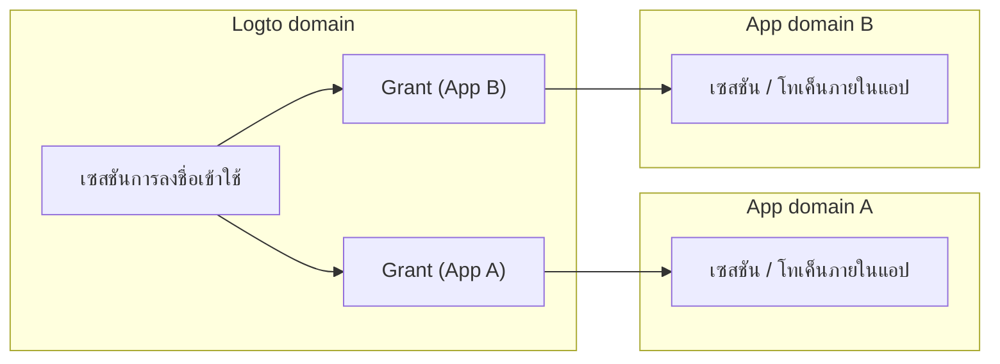
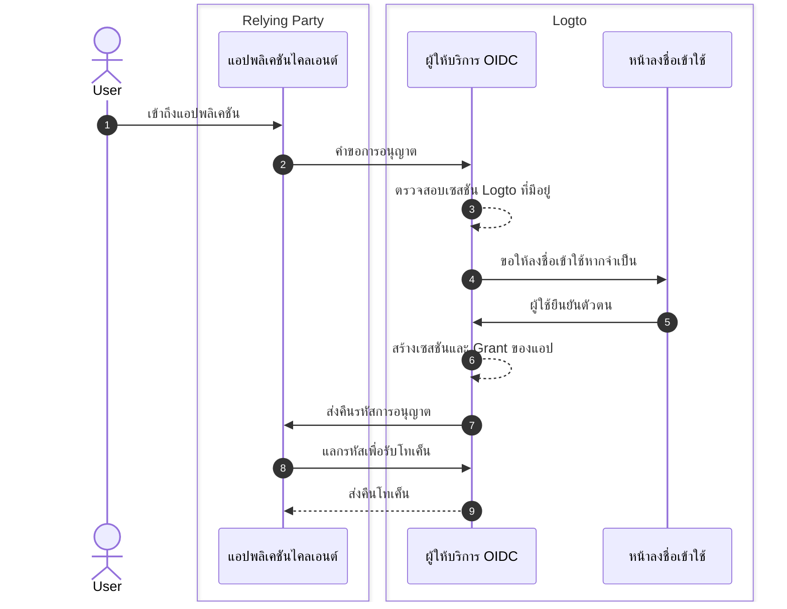
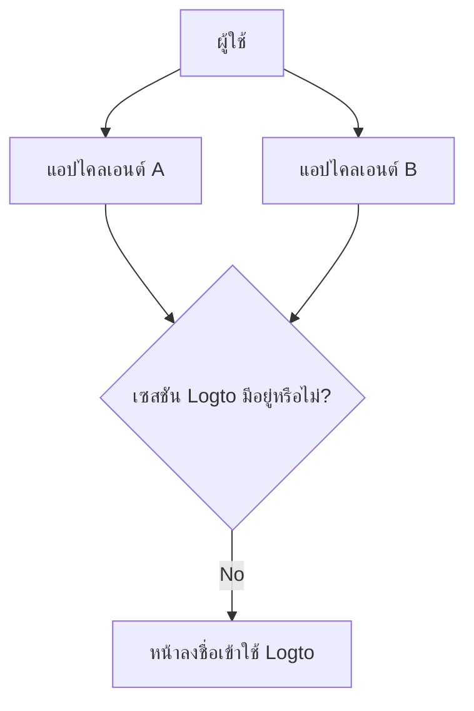

# เซสชัน

เซสชันใน Logto กำหนดวิธีการสร้าง แบ่งปัน รีเฟรช และเพิกถอนสถานะการยืนยันตัวตนระหว่างแอป เบราว์เซอร์ และอุปกรณ์ต่าง ๆ

ในทางปฏิบัติ ผู้ใช้จะรู้สึกว่า "ลงชื่อเข้าใช้" เป็นสถานะเดียว แต่สถานะของระบบถูกแบ่งออกเป็นหลายชั้น การเข้าใจชั้นเหล่านี้เป็นกุญแจสำคัญในการออกแบบพฤติกรรม SSO การต่ออายุโทเค็น และการลงชื่อออกที่สามารถคาดการณ์ได้

## โมเดลเซสชันใน Logto \{#session-model-in-logto}

- **เซสชันการลงชื่อเข้าใช้ของ Logto**: สถานะการลงชื่อเข้าใช้ที่ถูกเก็บไว้ในรูปแบบคุกกี้ของโดเมน Logto ซึ่งควบคุมความพร้อมใช้งานของ SSO ในบริบทของเบราว์เซอร์ปัจจุบัน
- **Grant**: สถานะการอนุญาตเฉพาะแอปสำหรับ `user + client app` Grants เป็นสะพานเชื่อมระหว่างการลงชื่อเข้าใช้แบบรวมศูนย์และการออกโทเค็นของแอป
- **เซสชัน / โทเค็นภายในแอป**: สถานะการยืนยันตัวตนภายในแอปแต่ละแอป (โทเค็น ID / การเข้าถึง / รีเฟรช, คุกกี้เซสชันแอป ฯลฯ)

## แนวคิดหลัก \{#core-concepts}

### เซสชัน Logto คืออะไร? \{#what-is-a-logto-session}

เซสชัน Logto คือสถานะการยืนยันตัวตนแบบรวมศูนย์ที่ถูกสร้างขึ้นหลังจากการลงชื่อเข้าใช้สำเร็จ หากยังคงมีผล Logto สามารถยืนยันตัวตนผู้ใช้ได้อย่างเงียบ ๆ สำหรับแอปอื่นในผู้เช่าเดียวกัน หากไม่มีอยู่ ผู้ใช้ต้องลงชื่อเข้าใช้อีกครั้ง

### Grant คืออะไร? \{#what-are-grants}

Grant คือสถานะการอนุญาตระดับแอปที่ผูกกับผู้ใช้และแอปไคลเอนต์เฉพาะ

- เซสชัน Logto หนึ่งสามารถมี Grant สำหรับหลายแอป
- โทเค็นสำหรับแอปจะออกภายใต้ Grant ของแอปนั้น
- การเพิกถอน Grant จะส่งผลต่อความสามารถของแอปนั้นในการเข้าถึงแบบใช้โทเค็นต่อไป

### ความสัมพันธ์ระหว่างเซสชัน, Grant, และสถานะการยืนยันตัวตนของแอป \{#how-session-grants-and-app-auth-state-relate}

- **เซสชัน** ตอบคำถาม: "เบราว์เซอร์นี้สามารถทำ SSO กับ Logto ได้ตอนนี้หรือไม่?"
- **Grant** ตอบคำถาม: "ผู้ใช้นี้ได้รับอนุญาตสำหรับแอปไคลเอนต์นี้หรือไม่?"
- **เซสชันภายในแอป** ตอบคำถาม: "แอปนี้ปัจจุบันถือว่าผู้ใช้ลงชื่อเข้าใช้หรือไม่?"

## การลงชื่อเข้าใช้และการสร้างเซสชัน \{#sign-in-and-session-creation}

## โทโพโลยีเซสชันระหว่างแอปและอุปกรณ์ \{#session-topology-across-apps-and-devices}

### เบราว์เซอร์เดียวกัน: เซสชัน Logto ที่แชร์ \{#same-browser-shared-logto-session}

แอปในเบราว์เซอร์เดียวกันสามารถแชร์สถานะเซสชัน Logto แบบรวมศูนย์ได้ ดังนั้น SSO สามารถเกิดขึ้นได้โดยไม่ต้องป้อนข้อมูลรับรองซ้ำ

### เบราว์เซอร์หรืออุปกรณ์ต่างกัน: เซสชัน Logto ที่แยกกัน \{#different-browsers-or-devices-isolated-logto-sessions}

แต่ละเบราว์เซอร์ / อุปกรณ์มีการเก็บคุกกี้แยกกัน เซสชันที่ถูกต้องบนอุปกรณ์ A ไม่ได้หมายความว่าเซสชันที่ถูกต้องบนอุปกรณ์ B

## วงจรชีวิตเซสชัน \{#session-lifecycle}

### 1. สร้าง \{#1-create}

หลังจากการยืนยันตัวตนของผู้ใช้ Logto จะสร้างเซสชันแบบรวมศูนย์และ Grant เฉพาะแอป

### 2. ใช้ซ้ำ (SSO) \{#2-reuse-sso}

ตราบใดที่คุกกี้เซสชันยังคงมีผลในเบราว์เซอร์เดียวกัน คำขอการอนุญาตใหม่สามารถเสร็จสิ้นได้อย่างเงียบ ๆ

### 3. ต่ออายุโทเค็น \{#3-renew-tokens}

การเข้าถึงแอปมักจะดำเนินต่อไปผ่านกระบวนการรีเฟรชโทเค็น (เมื่อเปิดใช้งาน) นี่คือความต่อเนื่องระดับแอป แยกจากการที่เซสชัน Logto แบบรวมศูนย์ยังคงมีอยู่หรือไม่

### 4. เพิกถอน / หมดอายุ \{#4-revokeexpire}

การเพิกถอนสามารถเกิดขึ้นได้ในหลายชั้น:

- การลงชื่อออกจากแอปภายในจะลบโทเค็น / เซสชันภายในแอป
- การสิ้นสุดเซสชันจะลบเซสชัน Logto แบบรวมศูนย์
- การเพิกถอน Grant จะลบความต่อเนื่องของการอนุญาตระดับแอป

## คำแนะนำในการออกแบบ \{#design-recommendations}

- จัดการเซสชันภายในแอปอย่างชัดเจนในโค้ดแอปของคุณ
- ถือว่าเซสชัน Logto, Grant, และเซสชันภายในแอปเป็นชั้นแยกกัน
- เลือกว่าการลงชื่อออกควรเป็นเฉพาะแอปหรือทั่วโลก
- ใช้ [back-channel logout](/end-user-flows/sign-out#federated-sign-out-back-channel-logout) เมื่อจำเป็นต้องมีความสอดคล้องกันหลายแอป
- สำหรับพฤติกรรมการลงชื่อออกและรายละเอียดการใช้งาน ดู [Sign-out](/end-user-flows/sign-out)

## แนวทางปฏิบัติที่ดีที่สุดสำหรับการเพิกถอนการเข้าถึง \{#best-practices-for-revoking-access}

ใช้กลยุทธ์การเพิกถอนที่แตกต่างกันตามเป้าหมายของคุณ:

- **เพิกถอนการเข้าถึงจากแอปของคุณเอง**:
  เพิกถอนเซสชันเป้าหมายด้วย `revokeGrantsTarget=firstParty`.
  สิ่งนี้จะลงชื่อผู้ใช้ออกจากแอปของคุณเองที่เกี่ยวข้องกับเซสชันนั้น ซึ่งสร้างประสบการณ์การลงชื่อออกที่สอดคล้องกัน
  ในขณะเดียวกัน Grant สำหรับแอปของบุคคลที่สามที่มีการให้ `offline_access` สามารถยังคงใช้ได้สำหรับการผสานรวมที่ต่อเนื่อง
  ดู [จัดการเซสชันผู้ใช้](/sessions/manage-user-sessions) สำหรับรายละเอียดการเพิกถอนเซสชัน

- **เพิกถอนการเข้าถึงแอปของบุคคลที่สาม**:
  เลือกหนึ่งในตัวเลือกต่อไปนี้:

  - เพิกถอนเซสชันด้วย `revokeGrantsTarget=all` เพื่อเพิกถอน Grant ทั้งหมดที่เกี่ยวข้องกับเซสชันนั้น
  - เพิกถอน Grant เฉพาะโดยตรงผ่าน API การจัดการ Grant เพื่อเอาการอนุญาตแอปของบุคคลที่สามออกโดยไม่ต้องบังคับให้ลงชื่อออกจากเซสชันทั้งหมด
    ดู [จัดการแอปที่ผู้ใช้อนุญาต (Grant)](/sessions/grants-management) สำหรับกลยุทธ์การเพิกถอนเฉพาะ Grant

- **เมื่อใช้ Logto Console**:
  ในหน้ารายละเอียดผู้ใช้ Logto มีการจัดการเซสชันและการจัดการแอปของบุคคลที่สามที่ได้รับอนุญาตในตัว
  - การเพิกถอนเซสชันจะเพิกถอน Grant ของแอปของคุณเองด้วย เพื่อให้พฤติกรรมการลงชื่อออกของแอปของคุณเองสอดคล้องกัน
  - การเพิกถอนการอนุญาตแอปของบุคคลที่สามจะเพิกถอน Grant สำหรับแอปของบุคคลที่สามนั้นในขณะที่ยังคงสถานะเซสชันเดิมไม่เปลี่ยนแปลง

## แหล่งข้อมูลที่เกี่ยวข้อง \{#related-resources}

<Url href="/sessions/manage-user-sessions">จัดการเซสชันผู้ใช้</Url>
<Url href="/sessions/grants-management">จัดการแอปที่ผู้ใช้อนุญาต (Grant)</Url>
<Url href="/sessions/session-configs">การกำหนดค่าเซสชัน</Url>
<Url href="/end-user-flows/sign-out">การลงชื่อออก</Url>
<Url href="/end-user-flows/sign-up-and-sign-in">การลงชื่อสมัครใช้และลงชื่อเข้าใช้</Url>
<Url href="/integrate-logto/integrate-logto-into-your-application/understand-authentication-flow">
  เข้าใจกระบวนการยืนยันตัวตน
</Url>
