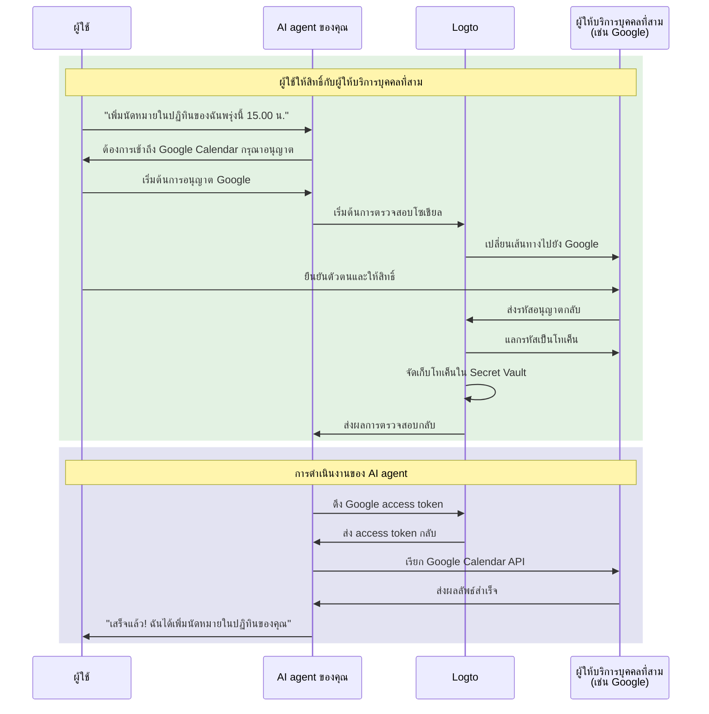

# เชื่อมต่อ AI agent ของคุณกับ API ของบุคคลที่สาม

คู่มือนี้จะแนะนำวิธีเปิดให้ AI agent ของคุณเข้าถึง API ของบุคคลที่สาม (เช่น Google Calendar, GitHub ฯลฯ) ในนามของผู้ใช้ โดยใช้ตัวเชื่อมต่อโซเชียลของ Logto และ Secret Vault คุณสามารถจัดเก็บและจัดการโทเค็นการเข้าถึงได้อย่างปลอดภัย ทำให้ agent ของคุณสามารถดำเนินงานอัตโนมัติโดยไม่ต้องขอให้ผู้ใช้ยืนยันตัวตนซ้ำ ๆ

คุณจะได้เรียนรู้วิธี:

- กำหนดค่าตัวเชื่อมต่อโซเชียลพร้อมการจัดเก็บโทเค็นของบุคคลที่สาม
- ขอสิทธิ์ขั้นต่ำในระหว่างการลงชื่อเข้าใช้ครั้งแรก
- ขอสิทธิ์เพิ่มเติมแบบค่อยเป็นค่อยไปตามความจำเป็น
- ดึงและใช้โทเค็นที่จัดเก็บไว้เพื่อเข้าถึง API ของบุคคลที่สาม

## เหตุผลที่ AI agent ของคุณต้องเข้าถึง API ของบุคคลที่สาม \{#why-your-ai-agent-needs-third-party-api-access}

AI agent ถูกนำมาใช้มากขึ้นในการทำงานอัตโนมัติที่ต้องโต้ตอบกับบริการภายนอก ตัวอย่างเช่น:

- **📅 การจัดการปฏิทิน**: AI agent ของคุณสามารถนัดหมาย เพิ่มกิจกรรม หรือปรับนัดหมายใน Google Calendar ได้โดยอัตโนมัติ
- **📧 การทำงานอัตโนมัติของอีเมล**: ส่งอีเมลติดตาม จัดระเบียบกล่องจดหมาย หรือร่างตอบกลับโดยใช้ Gmail API
- **💻 การจัดการโค้ด**: สร้าง issue ใน GitHub, ตรวจสอบ pull request หรือจัดการ repository
- **📁 การจัดการไฟล์**: อัปโหลด จัดระเบียบ หรือแชร์ไฟล์บน Google Drive หรือ Dropbox

เพื่อดำเนินการเหล่านี้ AI agent ของคุณต้องเข้าถึง API ของบุคคลที่สามที่ผู้ใช้อนุญาตอย่างปลอดภัย ซึ่งหมายถึงการจัดการ OAuth token อย่างถูกต้องและปลอดภัย

## วิธีการทำงาน \{#how-it-works}

นี่คือภาพรวมของขั้นตอนการทำงาน:



1. **ผู้ใช้ร้องขอให้ทำงาน**: ผู้ใช้ขอให้ AI agent ทำงานที่ต้องเข้าถึง API ของบุคคลที่สาม (เช่น เพิ่มกิจกรรมในปฏิทิน)
2. **แจ้งขออนุญาต**: agent ตรวจพบว่าต้องเข้าถึงบุคคลที่สามและแจ้งให้ผู้ใช้อนุญาต
3. **จัดเก็บโทเค็น**: หลังจากผู้ใช้อนุญาต Logto จะจัดเก็บ access token และ refresh token ไว้ใน Secret Vault อย่างปลอดภัย
4. **ดำเนินงาน**: agent ดึงโทเค็นที่จัดเก็บไว้และเรียก API ของบุคคลที่สามเพื่อทำงานให้เสร็จ

เมื่อได้รับอนุญาตแล้ว ผู้ใช้สามารถดำเนินงานหลายอย่างได้โดยไม่ต้องอนุญาตซ้ำ Logto จะจัดเก็บโทเค็นอย่างปลอดภัยและรีเฟรชโทเค็นโดยอัตโนมัติเมื่อจำเป็น เพื่อประสบการณ์ที่ราบรื่นสำหรับการโต้ตอบกับ AI agent อย่างต่อเนื่อง

## ข้อกำหนดเบื้องต้น \{#prerequisites}

ก่อนเริ่มต้น โปรดตรวจสอบว่าคุณมี:

- [Logto Cloud](https://cloud.logto.io) (หรือ Logto แบบ self-hosted v1.31+)
- บัญชีผู้ให้บริการบุคคลที่สามที่มีสิทธิ์เข้าถึง API (เช่น [Google Cloud Console](https://console.cloud.google.com))
- แอปพลิเคชัน AI agent ที่เชื่อมต่อกับ Logto SDK (ผู้ใช้สามารถลงชื่อเข้าใช้ AI agent ของคุณได้)

## ตั้งค่าตัวเชื่อมต่อโซเชียลพร้อมการจัดเก็บโทเค็น \{#set-up-social-connector-with-token-storage}

เพื่อให้ AI agent ของคุณเข้าถึง API ของบุคคลที่สามได้ คุณต้องกำหนดค่าตัวเชื่อมต่อโซเชียลพร้อมเปิดใช้งานการจัดเก็บโทเค็น ซึ่งจะทำให้ Logto สามารถจัดเก็บและจัดการ access token เมื่อผู้ใช้อนุญาตบริการบุคคลที่สามระหว่างการใช้งาน AI agent ของคุณ

ขอยกตัวอย่าง Google:

1. ไปที่ <CloudLink to="/connectors/social">Console > Connectors > Social connectors</CloudLink>
2. คลิก **Add social connector** และเลือก **Google**
3. ทำตาม [คู่มือการตั้งค่าตัวเชื่อมต่อ Google](/integrations/google) เพื่อกำหนดค่า OAuth client credentials ของคุณ
4. ในการตั้งค่าตัวเชื่อมต่อ:
   - เปิด **Store tokens for persistent API access** เพื่อจัดเก็บโทเค็นใน Secret Vault
   - ตั้งค่า **Prompts** ให้มี `consent` เพื่อให้ผู้ใช้เห็นคำขอสิทธิ์
   - เปิด **Offline access** เพื่อรับ refresh token สำหรับการเข้าถึง API ระยะยาว
5. บันทึกการเปลี่ยนแปลง

:::info
คุณไม่จำเป็นต้องเพิ่มตัวเชื่อมต่อนี้ในประสบการณ์การลงชื่อเข้าใช้ ตัวเชื่อมต่อนี้จะถูกใช้สำหรับการอนุญาตแบบ on-demand เมื่อ AI agent ของคุณต้องเข้าถึง API ของบุคคลที่สาม ไม่ใช่สำหรับการลงชื่อเข้าใช้ของผู้ใช้
:::

## ขออนุญาตและเข้าถึง API ของบุคคลที่สาม \{#request-authorization-and-access-third-party-apis}

เมื่อ AI agent ของคุณต้องเข้าถึง API ของบุคคลที่สาม (เช่น Google Calendar) ควรตรวจสอบก่อนว่าผู้ใช้ได้อนุญาตไว้แล้วหรือยัง หากยัง ให้แจ้งผู้ใช้อนุญาต

:::info เปิดใช้งาน Account API
ก่อนดำเนินการต่อ โปรดเปิดใช้งาน Account API ที่ <CloudLink to="/sign-in-experience/account-center">Console > Sign-in experience > Account center</CloudLink> ดูเพิ่มเติมเกี่ยวกับ [การเปิดใช้งาน Account API](/end-user-flows/account-settings/by-account-api#how-to-enable-account-api)
:::

### ขั้นตอนที่ 1: ตรวจสอบการอนุญาตที่มีอยู่ \{#step-1-check-for-existing-authorization}

เริ่มต้นด้วยการพยายามดึง access token ที่จัดเก็บไว้เพื่อตรวจสอบว่าผู้ใช้ได้อนุญาตไว้แล้วหรือไม่:

```tsx
async function getGoogleAccessToken(userAccessToken: string) {
  const response = await fetch(
    'https://[tenant-id].logto.app/my-account/identities/google/access-token',
    {
      headers: {
        Authorization: `Bearer ${userAccessToken}`,
      },
    }
  );

  return response.json();
}
```

### ขั้นตอนที่ 2: ขออนุญาตหากจำเป็น \{#step-2-request-authorization-if-needed}

หากไม่มีโทเค็น โทเค็นหมดอายุ หรือคุณต้องการขยายขอบเขตของ access token ให้ใช้ [Social Verification API](/secret-vault/federated-token-set#reauthentication-and-token-renewal) ของ Logto เพื่อเริ่มต้นกระบวนการอนุญาต:

```tsx
async function requestGoogleAuthorization(userAccessToken: string, scopes: string) {
  // สร้าง state แบบสุ่มเพื่อป้องกัน CSRF
  const state = crypto.randomUUID();
  sessionStorage.setItem('oauth_state', state);

  // เริ่มต้นการตรวจสอบโซเชียล
  const response = await fetch('https://[tenant-id].logto.app/api/verification/social', {
    method: 'POST',
    headers: {
      Authorization: `Bearer ${userAccessToken}`,
      'Content-Type': 'application/json',
    },
    body: JSON.stringify({
      connectorId: '<google_connector_id>',
      state,
      redirectUri: 'https://your-ai-agent.com/callback',
      scope: scopes,
    }),
  });

  const { verificationRecordId, authorizationUri } = await response.json();

  // เก็บ verificationRecordId ไว้ใช้ภายหลัง
  sessionStorage.setItem('verificationRecordId', verificationRecordId);

  // เปลี่ยนเส้นทางผู้ใช้ไปยัง Google เพื่ออนุญาต
  window.location.href = authorizationUri;
}
```

### ขั้นตอนที่ 3: จัดการ callback การอนุญาต \{#step-3-handle-the-authorization-callback}

หลังจากผู้ใช้ให้สิทธิ์ Google จะเปลี่ยนเส้นทางกลับมายังแอปของคุณ ดำเนินการตรวจสอบและจัดเก็บโทเค็น:

```tsx
async function handleAuthorizationCallback(
  userAccessToken: string,
  callbackParams: URLSearchParams
) {
  const verificationRecordId = sessionStorage.getItem('verificationRecordId');
  const storedState = sessionStorage.getItem('oauth_state');
  const code = callbackParams.get('code');
  const state = callbackParams.get('state');

  // ตรวจสอบ state เพื่อป้องกัน CSRF
  if (state !== storedState) {
    throw new Error('Invalid state parameter');
  }

  // ตรวจสอบการอนุญาต
  await fetch('https://[tenant-id].logto.app/api/verification/social/verify', {
    method: 'POST',
    headers: {
      Authorization: `Bearer ${userAccessToken}`,
      'Content-Type': 'application/json',
    },
    body: JSON.stringify({
      verificationRecordId,
      connectorData: {
        code,
        state,
        redirectUri: 'https://your-ai-agent.com/callback',
      },
    }),
  });

  // จัดเก็บโทเค็นใน Secret Vault ของ Logto
  await fetch('https://[tenant-id].logto.app/my-account/identities/google/access-token', {
    method: 'PUT',
    headers: {
      Authorization: `Bearer ${userAccessToken}`,
      'Content-Type': 'application/json',
    },
    body: JSON.stringify({
      verificationRecordId,
    }),
  });

  // ล้างข้อมูลชั่วคราว
  sessionStorage.removeItem('verificationRecordId');
  sessionStorage.removeItem('oauth_state');
}
```

### ขั้นตอนที่ 4: เรียก API ของบุคคลที่สาม \{#step-4-call-the-third-party-api}

ตอนนี้ AI agent ของคุณสามารถดึงโทเค็นและเรียก API ได้แล้ว:

```tsx
async function addCalendarEvent(userAccessToken: string, eventDetails: EventDetails) {
  // ดึง Google access token ที่จัดเก็บไว้
  const tokenData = await getGoogleAccessToken(userAccessToken);

  if (!tokenData) {
    // ผู้ใช้ยังไม่ได้อนุญาต ขอสิทธิ์ calendar scope
    await requestGoogleAuthorization(
      userAccessToken,
      'https://www.googleapis.com/auth/calendar.events'
    );
    return; // จะดำเนินการต่อหลัง redirect
  }

  // เรียก Google Calendar API
  const response = await fetch('https://www.googleapis.com/calendar/v3/calendars/primary/events', {
    method: 'POST',
    headers: {
      Authorization: `Bearer ${tokenData.accessToken}`,
      'Content-Type': 'application/json',
    },
    body: JSON.stringify(eventDetails),
  });

  return response.json();
}
```

Logto จะจัดการรีเฟรชโทเค็นโดยอัตโนมัติ หาก access token หมดอายุแต่มี refresh token อยู่ Logto จะขอโทเค็นใหม่ให้โดยอัตโนมัติเมื่อคุณเรียก endpoint ดึงโทเค็น

## ขอสิทธิ์เพิ่มเติม \{#request-additional-permissions}

เมื่อ AI agent ของคุณรับงานมากขึ้น คุณอาจต้องขอสิทธิ์เพิ่มเติม เช่น หากผู้ใช้อนุญาตเฉพาะการอ่านปฏิทินในตอนแรก แต่ตอนนี้ต้องการสร้างกิจกรรม คุณจะต้องขอสิทธิ์การเขียน

### ทำไมต้องอนุญาตแบบเพิ่มทีละน้อย (Incremental authorization)? \{#why-incremental-authorization}

- **ประสบการณ์ผู้ใช้ที่ดีกว่า**: ผู้ใช้มีแนวโน้มจะให้สิทธิ์เมื่อเข้าใจเหตุผลในบริบท
- **อัตราการอนุมัติสูงขึ้น**: ขอสิทธิ์น้อย upfront ลดแรงเสียดทาน
- **สร้างความไว้วางใจ**: ผู้ใช้เชื่อถือแอปที่ขอเฉพาะสิ่งที่จำเป็น

### ตัวอย่าง: อัปเกรดจากสิทธิ์อ่านเป็นเขียน \{#example-upgrading-from-read-to-write-access}

```tsx
async function createCalendarEvent(userAccessToken: string, eventDetails: EventDetails) {
  const tokenData = await getGoogleAccessToken(userAccessToken);

  if (!tokenData) {
    // ยังไม่ได้อนุญาต ขอสิทธิ์เขียนปฏิทินโดยตรง
    await requestGoogleAuthorization(userAccessToken, 'https://www.googleapis.com/auth/calendar');
    return;
  }

  // พยายามสร้างกิจกรรม
  const response = await fetch('https://www.googleapis.com/calendar/v3/calendars/primary/events', {
    method: 'POST',
    headers: {
      Authorization: `Bearer ${tokenData.accessToken}`,
      'Content-Type': 'application/json',
    },
    body: JSON.stringify(eventDetails),
  });

  if (response.status === 403) {
    // สิทธิ์ไม่เพียงพอ ขอขอบเขตเพิ่มเติม
    await requestGoogleAuthorization(
      userAccessToken,
      'https://www.googleapis.com/auth/calendar' // สิทธิ์ปฏิทินเต็มรูปแบบ
    );
    return;
  }

  return response.json();
}
```

:::tip
เมื่อขอขอบเขตเพิ่มเติม ผู้ใช้จะเห็นหน้าขอความยินยอม (consent screen) ที่แสดงเฉพาะสิทธิ์ใหม่ที่ร้องขอ สิทธิ์เดิมจะยังคงอยู่
:::

## จัดการสถานะโทเค็น \{#manage-token-status}

Logto Console ให้คุณตรวจสอบสถานะโทเค็นของแต่ละผู้ใช้ได้:

1. ไปที่ <CloudLink to="/users">Console > User management</CloudLink>
2. คลิกที่ผู้ใช้เพื่อดูรายละเอียด
3. เลื่อนลงไปที่ส่วน **Connections** เพื่อดูบัญชีโซเชียลที่เชื่อมโยงทั้งหมด
4. แต่ละการเชื่อมต่อจะแสดงสถานะโทเค็น:
   - **Active**: access token ใช้งานได้และพร้อมใช้
   - **Expired**: access token หมดอายุ หากมี refresh token จะรีเฟรชโดยอัตโนมัติเมื่อดึงครั้งถัดไป
   - **Inactive**: ไม่มีโทเค็นจัดเก็บสำหรับการเชื่อมต่อนี้

## แนวปฏิบัติด้านความปลอดภัยที่แนะนำ \{#security-best-practices}

เมื่อสร้าง AI agent ที่เข้าถึง API ของบุคคลที่สาม โปรดคำนึงถึงแนวปฏิบัติเหล่านี้:

- **ขอขอบเขตเท่าที่จำเป็น**: ขอเฉพาะสิทธิ์ที่ agent ของคุณต้องใช้จริง
- **ใช้ incremental authorization**: ขอสิทธิ์เพิ่มเติมตามบริบท ไม่ขอทั้งหมดในครั้งเดียว
- **จัดการโทเค็นหมดอายุอย่างเหมาะสม**: รองรับกรณีโทเค็นหมดอายุหรือถูกเพิกถอนเสมอ
- **ปกป้อง user access token**: Logto access token ของผู้ใช้คือกุญแจในการดึงโทเค็นบุคคลที่สาม ต้องปกป้องอย่างเหมาะสม
- **ตรวจสอบการเข้าถึง API**: บันทึกเมื่อ AI agent ของคุณเข้าถึง API ของบุคคลที่สามเพื่อการแก้ไขปัญหาและการปฏิบัติตามข้อกำหนด

## แหล่งข้อมูลที่เกี่ยวข้อง \{#related-resources}

<Url href="/secret-vault/federated-token-set">การจัดเก็บโทเค็นของบุคคลที่สาม</Url>
<Url href="/connectors/social-connectors">ตัวเชื่อมต่อโซเชียล</Url>
<Url href="/end-user-flows/sign-up-and-sign-in/social-sign-in">Social sign-in</Url>
<Url href="/end-user-flows/account-settings/by-account-api">Account API</Url>
