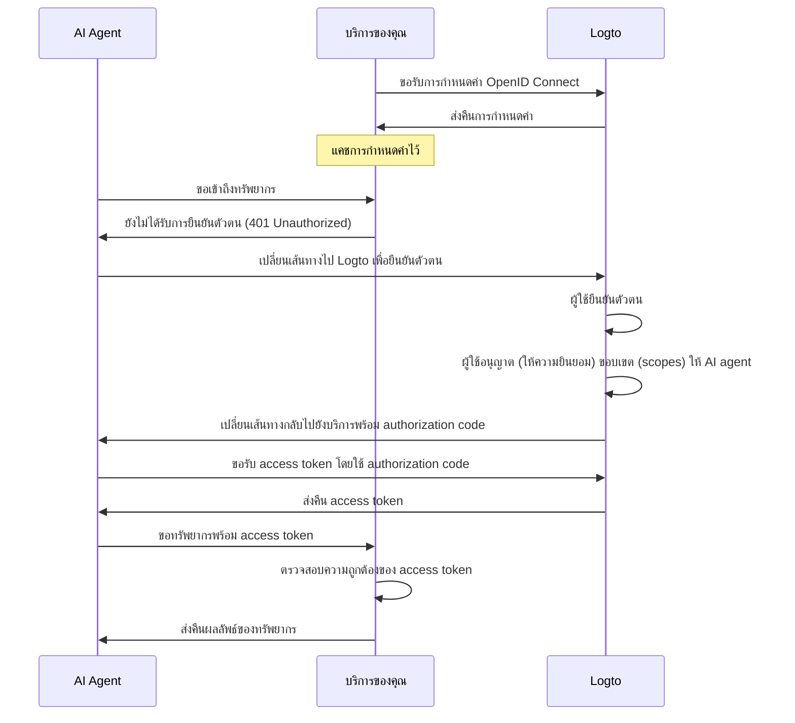

import ConfigureThirdPartyAiAgent from './fragments/_configure-third-party-ai-agent.mdx';

# เปิดใช้งานการเข้าถึงแอปของคุณโดย AI agent บุคคลที่สาม

คู่มือนี้จะแนะนำวิธีการผสาน Logto เข้ากับบริการของคุณและเปิดให้ AI agent เข้าถึงบริการนั้น

คุณจะได้เรียนรู้วิธี:

- กำหนดค่า Logto เป็นเซิร์ฟเวอร์การอนุญาต (Authorization server) สำหรับบริการของคุณ
- รับโทเค็นการเข้าถึง (Access token) สำหรับ AI agent เพื่อเข้าถึงบริการของคุณ
- ทดสอบขั้นตอนการทำงานกับ AI agent

## ความแตกต่างระหว่าง AI agent บุคคลที่สามกับ AI agent (หรือแอป) ของคุณเอง \{#difference-between-third-party-ai-agent-and-your-own-ai-agent-or-app}

ลองดูตัวอย่าง สมมติว่าคุณเป็นนักพัฒนาที่ให้บริการข้อมูลสภาพอากาศ

**แอปสภาพอากาศอย่างเป็นทางการ (AI agent / แอปของคุณเอง)**

- คุณมีแอปสภาพอากาศอย่างเป็นทางการให้ผู้ใช้ตรวจสอบสภาพอากาศ
- วิธีการทำงาน: แอปสภาพอากาศอย่างเป็นทางการเชื่อมต่อกับบริการของคุณโดยใช้ Logto เพื่อยืนยันตัวตนผู้ใช้ เมื่อ Alice ลงชื่อเข้าใช้ เธอจะเข้าถึงข้อมูลสภาพอากาศได้ทันทีโดยไม่ต้องมีหน้าขออนุญาตเพิ่มเติม เพราะเป็นแอปที่คุณไว้วางใจ

**AI agent บุคคลที่สาม**

- คุณสร้าง ecosystem รอบบริการของคุณ นักพัฒนาคนอื่นจึงสร้าง "WeatherBot" (ผู้ช่วย AI ที่ให้ข้อมูลและพยากรณ์อากาศ) โดยผสานเป็น AI agent บุคคลที่สาม
- วิธีการทำงาน: WeatherBot (AI agent บุคคลที่สาม) ต้องการเข้าถึงข้อมูลสภาพอากาศของผู้ใช้ผ่านบริการของคุณ เมื่อ Alice ลงชื่อเข้าใช้ WeatherBot ด้วยบัญชีของเธอ:
  - เธอจะเห็นหน้าขอความยินยอม (Consent screen) เพื่อขออนุญาตให้ WeatherBot เข้าถึงข้อมูลสภาพอากาศของเธอ
  - Alice สามารถอนุญาตหรือปฏิเสธการเข้าถึงนี้ได้
  - เฉพาะข้อมูลที่ Alice ยินยอมเท่านั้นที่จะถูกแชร์กับ WeatherBot และ WeatherBot จะไม่สามารถเข้าถึงข้อมูลเพิ่มเติมได้หากไม่ได้รับความยินยอมใหม่อย่างชัดเจน

การควบคุมการเข้าถึง (Permission) นี้ช่วยให้ข้อมูลผู้ใช้ปลอดภัย แม้ว่าบริการของคุณจะจัดการข้อมูลทั้งหมด แต่ AI agent บุคคลที่สามอย่าง WeatherBot จะเข้าถึงได้เฉพาะสิ่งที่ผู้ใช้อนุญาตอย่างชัดเจนเท่านั้น พวกเขาไม่สามารถข้ามขั้นตอนนี้ได้ เพราะระบบควบคุมการเข้าถึงของคุณบังคับใช้ไว้อย่างเข้มงวด

**สรุป**

| ประเภทไคลเอนต์              | ตัวอย่าง              | ต้องขอความยินยอม? | ใครควบคุม?     |
| --------------------------- | --------------------- | ----------------- | -------------- |
| แอปสภาพอากาศอย่างเป็นทางการ | แอปสภาพอากาศของคุณเอง | ไม่               | คุณ (นักพัฒนา) |
| AI agent บุคคลที่สาม        | ผู้ช่วย WeatherBot    | ใช่               | นักพัฒนาคนอื่น |

:::note
หากคุณต้องการผสานบริการของคุณกับ AI agent หรือแอปของคุณเอง โปรดดู [คู่มือเริ่มต้นอย่างรวดเร็ว](/quick-starts) ของเรา
:::

## ข้อกำหนดเบื้องต้น \{#prerequisites}

- มี [Logto Cloud](https://cloud.logto.io) (หรือแบบ self-hosted) tenant
- มีบริการที่เปิด API endpoint ให้ AI agent เข้าถึง

### ทำความเข้าใจขั้นตอนการทำงาน \{#understanding-the-flow}

- **Service**: บริการที่คุณต้องการเปิดให้ AI agent เข้าถึง
- **AI agent**: AI agent ที่จะเข้าถึงบริการของคุณ
- **Logto**: ทำหน้าที่เป็น OpenID Connect provider (เซิร์ฟเวอร์การอนุญาต) และจัดการข้อมูลระบุตัวตนผู้ใช้

ไดอะแกรมลำดับ (sequence diagram) ด้านล่างแสดงภาพรวมของขั้นตอนการทำงาน:

## ตั้งค่า AI agent บุคคลที่สาม \{#set-up-third-party-ai-agent}

ในการตั้งค่า AI agent บุคคลที่สามเพื่อเข้าถึงบริการของคุณ ให้ดำเนินการตามขั้นตอนเหล่านี้:

1. **ลงทะเบียน AI agent ใน Logto**: สร้างแอปพลิเคชันใน Logto เพื่อแทน AI agent
2. **กำหนดค่า AI agent**: ให้แน่ใจว่า AI agent สามารถส่งคำขอไปยังบริการของคุณและจัดการกับการตอบกลับ 401 Unauthorized ได้
3. **ติดตั้งขั้นตอนการอนุญาต (Authorization flow)**: AI agent ควรสามารถจัดการ OAuth 2.0 authorization flow เพื่อขอรับ access token จาก Logto
4. **ทดสอบการผสาน**: ใช้ AI agent เข้าถึงบริการของคุณและตรวจสอบว่าสามารถยืนยันตัวตนและอนุญาตคำขอได้สำเร็จ

<ConfigureThirdPartyAiAgent />

## ตั้งค่าการอนุญาตในบริการของคุณ \{#set-up-authorization-in-your-service}

เพื่อเปิดใช้งานการควบคุมการเข้าถึงในบริการของคุณ คุณต้องดำเนินการดังนี้:

1. **กำหนดทรัพยากร API ใน Logto**: สร้างทรัพยากร API ใน Logto เพื่อแทน endpoint ที่ AI agent ของคุณจะเข้าถึง
2. **ติดตั้งตรรกะควบคุมการเข้าถึง**: ในบริการของคุณ ให้ตรวจสอบ access token ที่ได้รับจาก AI agent และตรวจสอบว่าผู้ใช้มีสิทธิ์เข้าถึงทรัพยากรที่ร้องขอหรือไม่
3. **ตอบกลับ AI agent**: หาก access token ถูกต้องและผู้ใช้มีสิทธิ์ ให้ส่งคืนทรัพยากรที่ร้องขอ หากไม่ ให้ส่งกลับ 401 Unauthorized

หากต้องการเรียนรู้เพิ่มเติมเกี่ยวกับการติดตั้งการควบคุมการเข้าถึงในบริการของคุณ โปรดดู [คู่มือการอนุญาต](/authorization) ของเรา

## ทดสอบการผสาน \{#test-the-integration}

1. เริ่มต้นบริการของคุณ
2. เริ่มต้น AI agent
3. ใน AI agent ให้เรียก API endpoint เพื่อเข้าถึงบริการของคุณ
4. AI agent ควรจัดการกับการตอบกลับ 401 Unauthorized และเปลี่ยนเส้นทางผู้ใช้ไปยัง Logto เพื่อยืนยันตัวตน
5. หลังจากยืนยันตัวตนสำเร็จ AI agent ควรได้รับ access token และใช้มันในการส่งคำขอไปยังบริการของคุณ
6. AI agent ควรสามารถดึงทรัพยากรจากบริการของคุณโดยใช้ access token ได้
