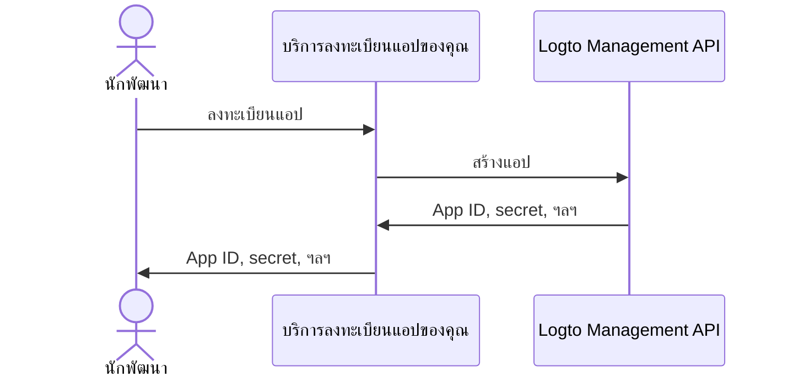

import QuickStartsReference from '../../../quick-starts/third-party/oidc/_quick-starts-reference.md';

## ตั้งค่าตัวแทน AI ของบุคคลที่สามใน Logto \{#configure-third-party-ai-agent-in-logto}

เพื่อให้ตัวแทน AI ของบุคคลที่สามสามารถเข้าถึง {props.serviceName ?? 'บริการของคุณ'} ได้ คุณต้องตั้งค่า **แอปของบุคคลที่สาม** ใน Logto แอปนี้จะใช้แทนตัวแทน AI และรับข้อมูลประจำตัวที่จำเป็นสำหรับการยืนยันตัวตน (Authentication) และการอนุญาต (Authorization)

### อนุญาตให้นักพัฒนาสร้างแอปของบุคคลที่สามใน Logto \{#allow-developers-to-create-third-party-apps-in-logto}

หากคุณกำลังสร้าง marketplace หรืออยากให้นักพัฒนาสามารถสร้างแอปของบุคคลที่สามใน Logto ได้ คุณสามารถใช้ [Logto Management API](/integrate-logto/interact-with-management-api) เพื่อสร้างแอปของบุคคลที่สามแบบโปรแกรมมิ่ง วิธีนี้จะช่วยให้นักพัฒนาสามารถลงทะเบียนแอปพลิเคชันของตนเองและรับข้อมูลประจำตัวที่จำเป็นสำหรับการยืนยันตัวตน

คุณจะต้องโฮสต์บริการของคุณเองเพื่อจัดการกระบวนการลงทะเบียน client บริการนี้จะติดต่อกับ Logto Management API เพื่อสร้างแอปของบุคคลที่สามแทนนักพัฒนา

หรือคุณสามารถสร้างแอปของบุคคลที่สามใน Logto Console ด้วยตนเองเพื่อทำความคุ้นเคยกับกระบวนการนี้

### สร้างแอปของบุคคลที่สามใน Logto ด้วยตนเอง \{#manually-create-a-third-party-app-in-logto}

คุณสามารถสร้างแอปของบุคคลที่สามใน Logto Console ด้วยตนเองเพื่อทดสอบหรือเชื่อมต่อแบบ ad-hoc วิธีนี้เหมาะสำหรับการทดสอบการเชื่อมต่ออย่างรวดเร็วโดยไม่ต้องพัฒนากระบวนการลงทะเบียน client แบบเต็มรูปแบบ

1. ลงชื่อเข้าใช้ Logto Console ของคุณ
2. ไปที่ <CloudLink to="/applications">**แอปพลิเคชัน**</CloudLink> → **สร้างแอปพลิเคชัน** → **แอปของบุคคลที่สาม** -> **OIDC**
3. กรอกชื่อแอปและข้อมูลที่จำเป็นอื่น ๆ จากนั้นคลิก **สร้างแอปพลิเคชัน**
4. คลิกแท็บ **สิทธิ์ (Permissions)** ในส่วน **ผู้ใช้ (User)** คลิก "เพิ่ม"
5. ในกล่องโต้ตอบที่เปิดขึ้น -> **ข้อมูลผู้ใช้ (User data)** -> เลือกสิทธิ์ **`profile`**, **`email`** จากนั้นคลิก **บันทึก**
6. ในแอปของบุคคลที่สาม ให้กำหนดค่า scopes เพื่อขอสิทธิ์ `openid profile email` (scopes)

   **หมายเหตุ**: `openid` จำเป็นสำหรับ OIDC และ `profile` กับ `email` คือสิทธิ์ที่คุณเพิ่มในขั้นตอนก่อนหน้า

7. กำหนดค่า **redirect URI** ของแอปของบุคคลที่สามของคุณให้ถูกต้อง และอย่าลืมอัปเดต redirect URI ใน Logto ด้วย

---

<QuickStartsReference />
