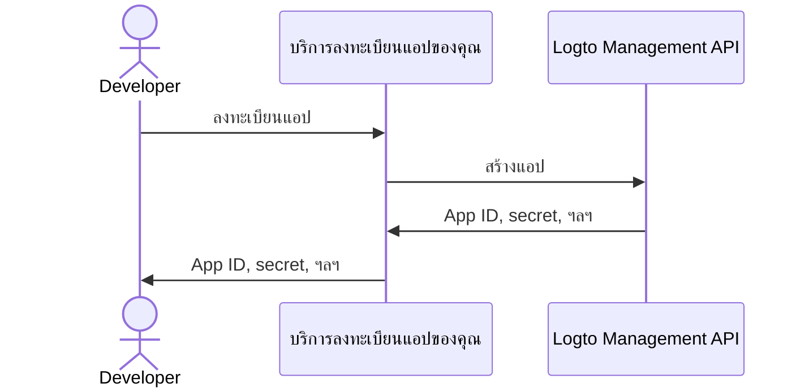
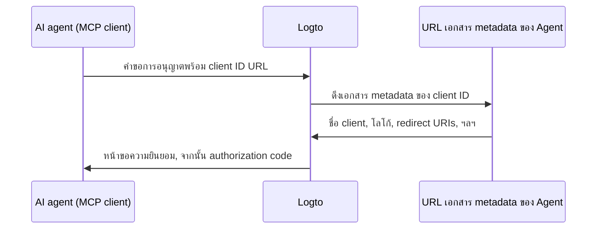

import QuickStartsReference from '../../../quick-starts/third-party/oidc/_quick-starts-reference.md';

## ตั้งค่าตัวแทน AI ของบุคคลที่สามใน Logto \{#configure-third-party-ai-agent-in-logto}

เพื่อให้ตัวแทน AI ของบุคคลที่สามสามารถเข้าถึง {props.serviceName ?? 'บริการของคุณ'} ได้ คุณต้องตั้งค่า **แอปของบุคคลที่สาม** ใน Logto แอปนี้จะใช้แทนตัวแทน AI และรับข้อมูลประจำตัวที่จำเป็นสำหรับการยืนยันตัวตน (การยืนยันตัวตน (Authentication)) และการอนุญาต (การอนุญาต (Authorization))

:::info[แอปของบุคคลที่สามคืออะไร?]
**แอปของบุคคลที่สาม** คือแอปพลิเคชันที่สร้างโดยนักพัฒนาภายนอก (ไม่ใช่เจ้าของทรัพยากร) ซึ่งต้องได้รับความยินยอมจากผู้ใช้เพื่อเข้าถึงทรัพยากรที่ได้รับการปกป้อง แตกต่างจากแอปของบุคคลแรก (แอปของคุณเอง) แอปของบุคคลที่สามจะแสดงหน้าขอความยินยอม (consent screen) เพื่อขออนุมัติสิทธิ์เฉพาะก่อนเข้าถึงข้อมูลของผู้ใช้ เพื่อให้แน่ใจว่าผู้ใช้สามารถควบคุมข้อมูลที่จะแชร์กับบริการภายนอกได้

ดูเพิ่มเติมที่ [แอปพลิเคชันของบุคคลที่สาม](/integrate-logto/third-party-applications)
:::

มี 3 วิธีในการเชื่อมต่อ AI agent:

- [สร้างแอปใน Console ด้วยตนเอง](#manually-create-a-third-party-app-in-logto) เหมาะสำหรับการทดสอบหรือกรณีที่มี agent ไม่กี่ตัวที่รู้จักล่วงหน้า
- [สร้างบริการลงทะเบียนผ่าน Management API](#allow-developers-to-create-third-party-apps-in-logto) หากคุณต้องการควบคุมว่าใครจะได้รับข้อมูลประจำตัว
- [เปิดใช้งาน dynamic app](#let-any-ai-agent-connect-without-pre-registration) หากต้องการให้ agent ใด ๆ เชื่อมต่อได้โดยไม่ต้องลงทะเบียนล่วงหน้า

### อนุญาตให้นักพัฒนาสร้างแอปของบุคคลที่สามใน Logto \{#allow-developers-to-create-third-party-apps-in-logto}

หากคุณกำลังสร้าง marketplace หรืออยากให้นักพัฒนาสามารถสร้างแอปของบุคคลที่สามใน Logto ได้ คุณสามารถใช้ [Logto Management API](/integrate-logto/interact-with-management-api) เพื่อสร้างแอปของบุคคลที่สามแบบโปรแกรมมิ่ง วิธีนี้จะช่วยให้นักพัฒนาสามารถลงทะเบียนแอปพลิเคชันของตนเองและรับข้อมูลประจำตัวที่จำเป็นสำหรับการยืนยันตัวตน (การยืนยันตัวตน (Authentication))

คุณจะต้องโฮสต์บริการของคุณเองเพื่อจัดการกระบวนการลงทะเบียน client โดยบริการนี้จะติดต่อกับ Logto Management API เพื่อสร้างแอปของบุคคลที่สามแทนนักพัฒนา

```mermaid
sequenceDiagram
  actor Developer
  participant Server as บริการลงทะเบียนแอปของคุณ
  participant Logto as Logto Management API
  Developer->>Server: ลงทะเบียนแอป
  Server->>Logto: สร้างแอป
  Logto->>Server: App ID, secret, ฯลฯ
  Server->>Developer: App ID, secret, ฯลฯ
```

หรือ คุณสามารถสร้างแอปของบุคคลที่สามใน Logto Console ด้วยตนเองเพื่อทำความคุ้นเคยกับกระบวนการนี้

### อนุญาตให้ AI agent ใด ๆ เชื่อมต่อได้โดยไม่ต้องลงทะเบียนล่วงหน้า \{#let-any-ai-agent-connect-without-pre-registration}

ในระบบนิเวศ MCP แบบเปิด คุณมักจะไม่รู้จัก agent ล่วงหน้า [Dynamic app](/integrate-logto/third-party-applications/dynamic-apps) จะตัดขั้นตอนการลงทะเบียนออก: agent จะใช้ URL HTTPS สาธารณะซึ่งให้บริการ client metadata document ของตนเองเป็น `client_id` และ Logto จะ resolve เมื่อมี authorization request เข้ามา

```mermaid
sequenceDiagram
  participant Agent as AI agent (MCP client)
  participant Logto
  participant Metadata as URL เอกสาร metadata ของ Agent
  Agent->>Logto: คำขอการอนุญาตพร้อม client ID URL
  Logto->>Metadata: ดึงเอกสาร metadata ของ client ID
  Metadata->>Logto: ชื่อ client, โลโก้, redirect URIs, ฯลฯ
  Logto->>Agent: หน้าขอความยินยอม, จากนั้น authorization code
```

คุณยังคงควบคุมได้ว่า agent ใดสามารถขอสิทธิ์อะไรผ่านสิทธิ์ที่กำหนดให้ dynamic app และทุกการอนุญาตจะต้องผ่านหน้าขอความยินยอมของผู้ใช้เสมอ

### สร้างแอปของบุคคลที่สามใน Logto ด้วยตนเอง \{#manually-create-a-third-party-app-in-logto}

คุณสามารถสร้างแอปของบุคคลที่สามใน Logto Console ด้วยตนเองเพื่อทดสอบหรือเชื่อมต่อแบบ ad-hoc วิธีนี้เหมาะสำหรับการทดสอบการเชื่อมต่ออย่างรวดเร็วโดยไม่ต้องพัฒนากระบวนการลงทะเบียน client แบบเต็มรูปแบบ

1. ลงชื่อเข้าใช้ Logto Console ของคุณ
2. ไปที่ <CloudLink to="/applications">**Applications**</CloudLink> → **Create application** → **Third-party app** -> **OIDC**
3. กรอกชื่อแอปและข้อมูลที่จำเป็นอื่น ๆ จากนั้นคลิก **Create application**
4. คลิกแท็บ **Permissions** เพื่อกำหนด [สิทธิ์ (permissions)](/integrate-logto/third-party-applications/permission-management) ให้กับแอป:

   - **ส่วน User**: สิทธิ์ข้อมูลผู้ใช้ เช่น **`profile`** และ **`email`** สำหรับการอ้างสิทธิ์ (claims) ข้อมูลตัวตนพื้นฐาน
   - **ส่วน API resource**: สิทธิ์ (ขอบเขต; scopes) ของ [ทรัพยากร API (API resources)](/authorization/global-api-resources) ที่คุณกำหนดใน Logto เช่น ทรัพยากร API ที่แทน {props.serviceName ?? 'บริการของคุณ'}
   - **ส่วน Organization**: สิทธิ์ขององค์กร หากคุณใช้ฟีเจอร์องค์กรของ Logto

5. ในแอปของบุคคลที่สาม ให้กำหนด scopes เพื่อขอสิทธิ์ที่คุณอนุญาตไว้ เช่น `openid profile email` พร้อมกับ scopes ของ API resource

   **หมายเหตุ**: `openid` จำเป็นสำหรับ OIDC หากต้องการรับโทเค็นการเข้าถึง (access token) ที่ผูกกับ API resource แอปต้องใส่พารามิเตอร์ `resource` ใน authorization request ด้วย MCP client ที่ปฏิบัติตามสเปค MCP ล่าสุดจะทำสิ่งนี้โดยอัตโนมัติตาม metadata ของทรัพยากรที่ได้รับการปกป้อง

6. กำหนด **redirect URI** ของแอปของบุคคลที่สามให้ถูกต้อง และอย่าลืมอัปเดต redirect URI ใน Logto ด้วย

---

<QuickStartsReference />
