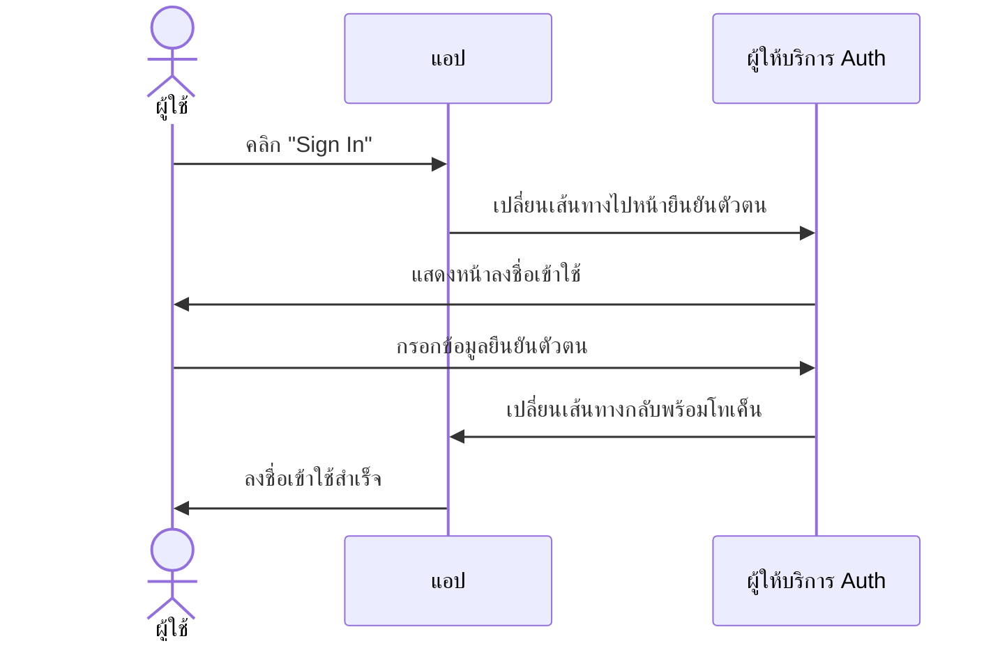
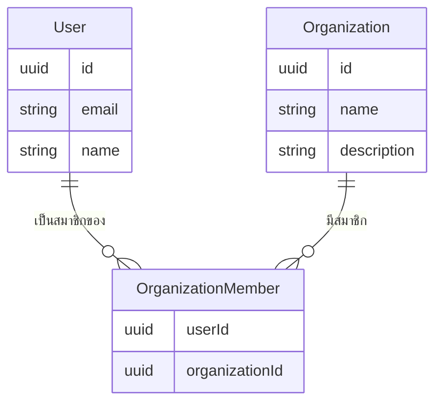
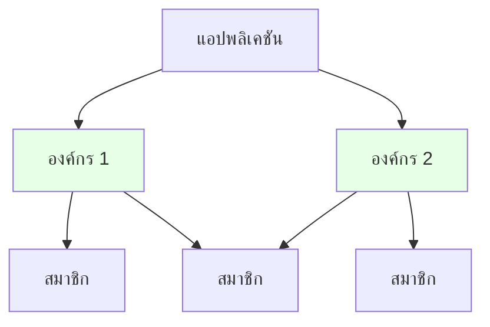
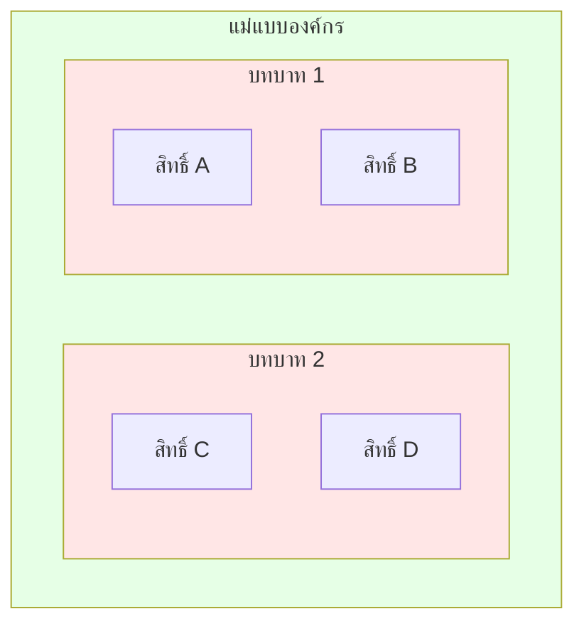
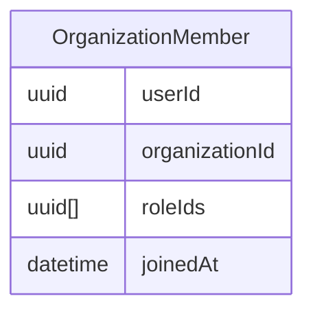
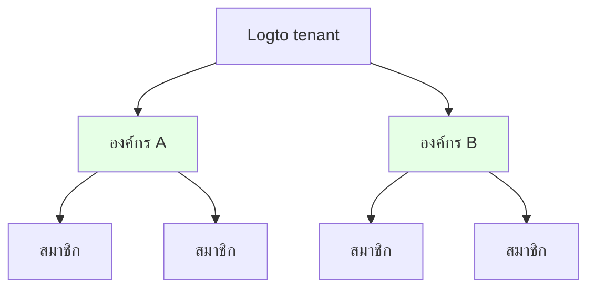
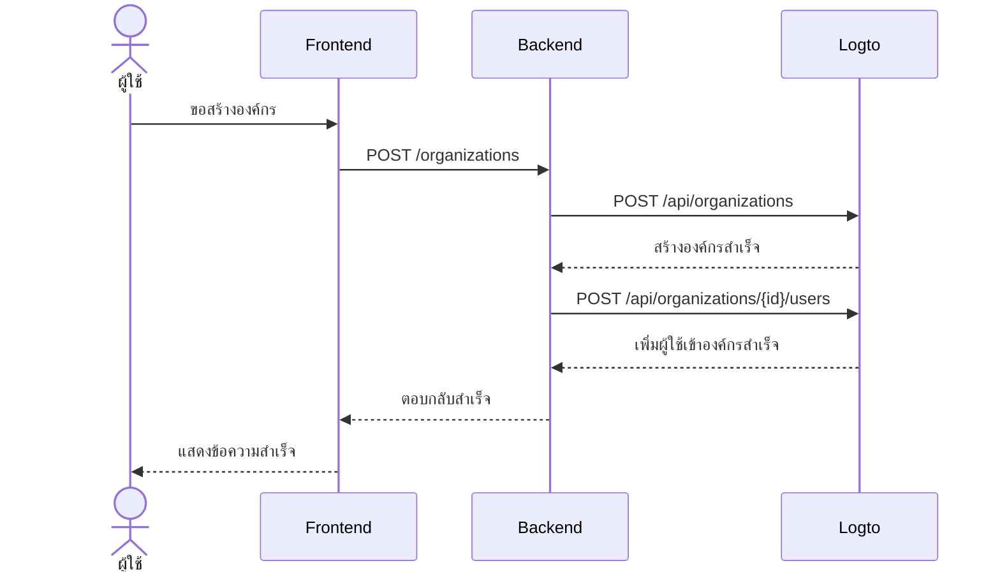

<head>
  <link rel="canonical" href="https://blog.logto.io/build-multi-tenant-saas-application" />
</head>

<style>
  {`
    .twoColumn {
      display: grid;
      grid-template-columns: 1fr 1fr;
      gap: 24px;
    }
    .twoColumn + .twoColumn {
      margin-top: 24px;
    }
  `}
</style>

# สร้างแอป SaaS หลายผู้เช่า (multi-tenant): คู่มือฉบับสมบูรณ์ตั้งแต่การออกแบบจนถึงการใช้งานจริง

แอปอย่าง Notion, Slack หรือ Figma ถูกสร้างขึ้นมาอย่างไร? แอป SaaS หลายผู้เช่าเหล่านี้ดูเหมือนใช้งานง่าย แต่ถ้าคุณต้องสร้างเองล่ะ? นั่นคืออีกเรื่องหนึ่งเลย

ตอนที่ผมคิดจะสร้างระบบที่ซับซ้อนแบบนี้ สมองแทบระเบิด:

- ผู้ใช้ต้องมีตัวเลือกการลงชื่อเข้าใช้หลายแบบ (อีเมล, Google, GitHub)
- ผู้ใช้แต่ละคนสามารถสร้างและอยู่ในหลายองค์กรได้
- แต่ละองค์กรมีระดับสิทธิ์ที่แตกต่างกัน
- องค์กรขนาดใหญ่ต้องการการเข้าร่วมอัตโนมัติสำหรับอีเมลโดเมนเฉพาะ
- ต้องมี MFA สำหรับการดำเนินการที่สำคัญ
- และอื่น ๆ อีกมาก...

"บอสครับ ขอคุยเรื่องออกแบบผลิตภัณฑ์อีกสองอาทิตย์นะ ตอนนี้ติดโคลนอยู่เลย"

แต่พอได้ลงมือทำจริง **ผมพบว่ามันไม่ได้ยากอย่างที่คิด!**

ผมเพิ่ง **สร้างระบบที่มีฟีเจอร์เหล่านี้ทั้งหมดได้อย่างง่ายดาย!**


<div className="twoColumn">
  
  
</div>

ผมจะพาคุณดูวิธีออกแบบและสร้างระบบแบบนี้ตั้งแต่ศูนย์ — แล้วคุณจะทึ่งว่ามันง่ายแค่ไหนในปี 2025 ด้วยเครื่องมือสมัยใหม่และแนวทางสถาปัตยกรรมที่ถูกต้อง

> **ซอร์สโค้ดทั้งหมดอยู่ใน [Github Repo นี้](https://github.com/logto-io/multi-tenant-saas-sample) ไปดูกันเลย!**

เราจะเริ่มจากผลิตภัณฑ์ SaaS ด้านเอกสาร AI ที่ชื่อ DocuMind

DocuMind คือผลิตภัณฑ์ SaaS ด้านเอกสาร AI ที่ออกแบบด้วยโมเดลหลายผู้เช่า (multi-tenant) เพื่อรองรับทั้งผู้ใช้รายบุคคล ธุรกิจขนาดเล็ก และองค์กรขนาดใหญ่

แพลตฟอร์มนี้ให้ความสามารถ AI อันทรงพลังสำหรับการจัดการเอกสาร เช่น การสรุปอัตโนมัติ การดึงประเด็นสำคัญ และการแนะนำเนื้อหาอัจฉริยะภายในองค์กร

## ฟีเจอร์ที่จำเป็นสำหรับการยืนยันตัวตน (Authentication) และการอนุญาต (Authorization) ของ SaaS มีอะไรบ้าง? \{#what-features-are-required-for-saas-authentication-and-authorization}

ก่อนอื่น มาทบทวนความต้องการที่จำเป็นกัน ฟีเจอร์อะไรที่คุณต้องมีบ้าง?

### สถาปัตยกรรมหลายผู้เช่า (Multi-tenant architecture) \{#multi-tenant-architecture}

เพื่อรองรับสถาปัตยกรรมหลายผู้เช่า คุณต้องมีเลเยอร์เอนทิตีที่เรียกว่า **องค์กร (Organization)** ลองนึกภาพว่าคุณมีผู้ใช้กลุ่มเดียวที่สามารถเข้าถึงหลาย workspace ได้ แต่ละองค์กรคือ workspace และผู้ใช้จะมีอัตลักษณ์เดียวขณะเข้าถึง workspace (องค์กร) ต่าง ๆ ตามบทบาทที่ได้รับ


นี่เป็นฟีเจอร์ที่ผู้ให้บริการยืนยันตัวตนส่วนใหญ่มี องค์กรในระบบจัดการอัตลักษณ์จะตรงกับ workspace, project หรือ tenant ในแอป SaaS ของคุณ


### สมาชิกภาพ (Membership) \{#membership}

สมาชิก (Member) คือแนวคิดชั่วคราวที่ใช้ระบุสถานะสมาชิกของอัตลักษณ์ในองค์กร

ตัวอย่างเช่น Sarah สมัครแอปของคุณด้วยอีเมล **sarah@gmail.com** เธอสามารถอยู่ใน workspace ต่าง ๆ ได้ หาก Sarah อยู่ใน **Workspace A** แต่ไม่อยู่ใน **Workspace B** เธอถือเป็นสมาชิกของ **Workspace A** แต่ไม่ใช่ของ **Workspace B**

### การออกแบบบทบาทและสิทธิ์ (Role and permission design) \{#role-and-permission-design}

ในสถาปัตยกรรมหลายผู้เช่า ผู้ใช้ต้องมี **บทบาท (Role)** พร้อม **สิทธิ์ (Permission)** เฉพาะเพื่อเข้าถึงทรัพยากรของ tenant
สิทธิ์คือการควบคุมการเข้าถึงแบบละเอียด เช่น `read: order` หรือ `write: order` เพื่อกำหนดว่าทำอะไรกับทรัพยากรใดได้บ้าง

บทบาทคือชุดของสิทธิ์ที่กำหนดให้กับสมาชิกในสภาพแวดล้อมหลายผู้เช่า

คุณต้องกำหนดบทบาทและสิทธิ์เหล่านี้ แล้วมอบบทบาทให้ผู้ใช้ และบางครั้งอาจมีการกำหนดอัตโนมัติ เช่น

1. ผู้ใช้ที่เข้าร่วมองค์กรจะได้รับบทบาท **member** อัตโนมัติ
2. ผู้ใช้คนแรกที่สร้าง workspace จะได้รับบทบาท **admin** อัตโนมัติ

### กระบวนการสมัครและเข้าสู่ระบบ (Sign-up and login flow) \{#sign-up-and-login-flow}

ต้องแน่ใจว่ากระบวนการสมัครและยืนยันตัวตนใช้งานง่ายและปลอดภัย รวมถึงตัวเลือกพื้นฐานดังนี้:

1. **ลงชื่อเข้าใช้ด้วยอีเมลและรหัสผ่าน**: วิธีดั้งเดิม
2. **เข้าสู่ระบบแบบไม่ใช้รหัสผ่าน**: ใช้รหัสยืนยันทางอีเมลเพื่อความสะดวกและปลอดภัย
3. **การจัดการบัญชี**: ศูนย์บัญชีที่ผู้ใช้สามารถอัปเดตอีเมล รหัสผ่าน และข้อมูลอื่น ๆ
4. **เข้าสู่ระบบโซเชียล**: เช่น Google และ GitHub เพื่อความรวดเร็ว
5. **การยืนยันตัวตนหลายปัจจัย (MFA)**: เพิ่มความปลอดภัยด้วยแอปยืนยันตัวตน เช่น Duo

### การสร้าง tenant และการเชิญสมาชิก (Tenant creation and invitation) \{#tenant-creation-and-invitation}

ในแอป SaaS หลายผู้เช่า ความแตกต่างสำคัญใน flow ของผู้ใช้คือ ต้องรองรับการสร้าง tenant และการเชิญสมาชิก ซึ่งต้องวางแผนและดำเนินการอย่างรอบคอบ เพราะมีผลต่อการเปิดใช้งานและการเติบโตของผลิตภัณฑ์

นี่คือตัวอย่าง flow ที่พบบ่อย:

| ประเภทผู้ใช้                    | จุดเริ่มต้นการเข้าใช้งาน                               |
| ------------------------------- | ------------------------------------------------------ |
| บัญชีใหม่                       | เข้าจากหน้าลงชื่อเข้าใช้ / สมัครเพื่อสร้าง tenant ใหม่ |
| บัญชีเดิม                       | สร้าง tenant ใหม่ในตัวผลิตภัณฑ์                        |
| บัญชีเดิมได้รับเชิญ tenant ใหม่ | เข้าจากหน้าลงชื่อเข้าใช้ / สมัคร                       |
| บัญชีเดิมได้รับเชิญ tenant ใหม่ | เข้าจากอีเมลเชิญ                                       |
| บัญชีใหม่ได้รับเชิญ tenant ใหม่ | เข้าจากหน้าลงชื่อเข้าใช้ / สมัคร                       |
| บัญชีใหม่ได้รับเชิญ tenant ใหม่ | เข้าจากอีเมลเชิญ                                       |

นี่คือตัวอย่างสถานการณ์ที่พบในแอป SaaS เกือบทุกตัว ใช้เป็นแนวทางให้ทีมผลิตภัณฑ์และออกแบบของคุณ และสามารถสร้าง flow ของคุณเองได้ตามต้องการ

<div className="twoColumn">
  
  
</div>

<div className="twoColumn">
  
  
</div>

<div className="twoColumn">
  
  
</div>

## สถาปัตยกรรมเทคนิคและการออกแบบระบบ \{#technical-architecture-and-system-design}

เมื่อเข้าใจความต้องการของผลิตภัณฑ์ทั้งหมดแล้ว มาดูวิธีการใช้งานจริงกัน

### กำหนดกลยุทธ์การยืนยันตัวตน (Define authentication strategy) \{#define-authentication-strategy}

การยืนยันตัวตนดูน่ากลัว ผู้ใช้ต้องการ:

- สมัคร / เข้าสู่ระบบด้วยอีเมลและรหัสผ่าน
- ลงชื่อเข้าใช้ด้วย Google / Github เพียงคลิกเดียว
- รีเซ็ตรหัสผ่านเมื่อจำไม่ได้
- การเข้าสู่ระบบทั้งทีมสำหรับลูกค้าองค์กร
- ...

แค่ฟีเจอร์พื้นฐานเหล่านี้ก็อาจใช้เวลาพัฒนาหลายสัปดาห์

แต่ตอนนี้ **เราไม่ต้องสร้างเองเลย!**

ผู้ให้บริการ auth สมัยใหม่ (ผมเลือก [Logto](https://logto.io/) ในตัวอย่างนี้) รวมฟีเจอร์เหล่านี้ไว้ให้แล้ว Flow การยืนยันตัวตนก็ตรงไปตรงมา:



**จากงานพัฒนาหลายสัปดาห์เหลือแค่ 15 นาที** Logto จัดการ flow ที่ซับซ้อนทั้งหมดให้เรา! เราจะพูดถึงขั้นตอนการเชื่อมต่อในส่วน implementation ต่อไป ตอนนี้โฟกัสที่การสร้างฟีเจอร์หลักของ DocuMind กัน!

### สร้างสถาปัตยกรรมหลายผู้เช่า (Establish multi-tenant architecture) \{#establish-multi-tenant-architecture}

ระบบองค์กรช่วยให้ผู้ใช้สร้างและเข้าร่วมองค์กรได้หลายแห่ง มาดูความสัมพันธ์หลัก ๆ กัน



ในระบบนี้ ผู้ใช้แต่ละคนสามารถอยู่ในหลายองค์กร และแต่ละองค์กรมีสมาชิกได้หลายคน



### เปิดใช้งานการควบคุมการเข้าถึงในแอปหลายผู้เช่า (Enable access control in multi-tenant app) \{#enable-access-control-in-multi-tenant-app}

การควบคุมการเข้าถึงตามบทบาท (RBAC) สำคัญมากสำหรับความปลอดภัยและการขยายตัวในแอป SaaS หลายผู้เช่า

ในแอปหลายผู้เช่า การออกแบบสิทธิ์และบทบาทมักจะเหมือนกัน เพราะมาจากการออกแบบผลิตภัณฑ์ เช่น ใน workspace หลายแห่ง มักมีบทบาท admin และ member Logto ในฐานะ auth provider มีการออกแบบ RBAC ระดับองค์กรดังนี้:

1. **นิยามสิทธิ์แบบรวมศูนย์**: กำหนดสิทธิ์ในระดับระบบและใช้กับทุกองค์กร เพื่อให้จัดการสิทธิ์ได้ง่ายและสม่ำเสมอ
2. **แม่แบบองค์กร (Organization templates)**: กำหนดบทบาทและสิทธิ์ล่วงหน้าผ่านแม่แบบองค์กร ช่วยให้องค์กรใหม่ตั้งค่าได้ง่าย

ความสัมพันธ์ของสิทธิ์จะเป็นแบบนี้:



เนื่องจากผู้ใช้แต่ละคนต้องมีบทบาทของตัวเองในแต่ละองค์กร ความสัมพันธ์ระหว่างบทบาทกับองค์กรจึงต้องสะท้อนบทบาทที่กำหนดให้ผู้ใช้แต่ละคน:



เราได้ออกแบบระบบองค์กรและระบบควบคุมการเข้าถึงแล้ว ตอนนี้เริ่มสร้างผลิตภัณฑ์ของเราได้เลย!

## Tech stack \{#tech-stack}

ผมเลือก stack ที่เหมาะกับมือใหม่และพกพาง่าย:

1. **Frontend**: React (สามารถเปลี่ยนเป็น Vue / Angular / Svelte ได้ง่าย)
2. **Backend**: Express (API เข้าใจง่าย)

ทำไมต้องแยก frontend กับ backend? เพราะสถาปัตยกรรมชัดเจน เรียนรู้ง่าย และเปลี่ยน stack ได้สะดวก และสำหรับ auth provider ผมใช้ Logto เป็นตัวอย่าง

และสำหรับคู่มือนี้ **รูปแบบเหล่านี้ใช้ได้กับ: frontend ใด ๆ, backend ใด ๆ และระบบ auth ใด ๆ**

## เพิ่ม flow การยืนยันตัวตนพื้นฐานให้แอปของคุณ \{#add-basic-authentication-flow-to-your-app}

ขั้นตอนนี้ง่ายที่สุด แค่เชื่อมต่อ Logto เข้ากับโปรเจกต์ของเรา จากนั้นตั้งค่าการลงชื่อเข้าใช้ / สมัครสมาชิกใน Logto Console ตามต้องการ

### ติดตั้ง Logto ในแอปของคุณ \{#install-logto-to-your-app}

ก่อนอื่น เข้าสู่ระบบ [Logto Cloud](https://cloud.logto.io/) สมัครฟรีถ้ายังไม่มีบัญชี สร้าง Development Tenant สำหรับทดสอบ

ใน Tenant Console คลิกปุ่ม "Application" ทางซ้าย แล้วเลือก React เพื่อเริ่มสร้างแอปของเรา

ทำตามคู่มือในหน้านั้น คุณจะเชื่อมต่อ Logto ได้ในประมาณ 5 นาที!

นี่คือตัวอย่างโค้ดการเชื่อมต่อ:

```jsx
const config: LogtoConfig = {
  endpoint: "<YOUR_LOGTO_ENDPOINT>",
  appId: "<YOUR_LOGTO_APP_ID>",
};

function App() {
  return (
    <LogtoProvider config={config}>
      <div className="min-h-screen bg-gradient-to-b from-gray-50 to-gray-100">
        <Routes>
          {/* Callback นี้จัดการ redirect กลับจาก Logto หลังผู้ใช้ login */}
          <Route path="/callback" element={<Callback />} />
          <Route path="/*" element={<AppContent />} />
        </Routes>
      </div>
    </LogtoProvider>
  );
}

function AppContent() {
  const { isAuthenticated } = useLogto();

  if (!isAuthenticated) {
    // แสดง landing page สำหรับผู้ใช้ที่ยังไม่ยืนยันตัวตน
    return <Landing />;
  }

  // แสดงแอปหลักสำหรับผู้ใช้ที่ยืนยันตัวตนแล้ว
  return (
    <Routes>
      {/* Dashboard แสดงองค์กรทั้งหมดที่มี */}
      <Route path="/" element={<Dashboard />} />

      {/* หน้าองค์กรหลังคลิกองค์กรใน Dashboard */}
      <Route path="/:orgId" element={<Organization />} />
    </Routes>
  );
}
```


ทริคที่มีประโยชน์: หน้า login ของเรามีทั้งปุ่ม Sign in และ Register ปุ่ม Register จะนำไปยังหน้าสมัครสมาชิกของ Logto โดยตรง ใช้ฟีเจอร์ [first screen](/end-user-flows/authentication-parameters/first-screen) ของ Logto เพื่อกำหนดว่าผู้ใช้จะเห็นขั้นตอนไหนก่อนใน flow

คุณสามารถตั้งให้ไปที่หน้าสมัครสมาชิกเป็นค่าเริ่มต้นได้หากผลิตภัณฑ์ของคุณเน้นผู้ใช้ใหม่จำนวนมาก

```jsx
function LandingPage() {
  const { signIn } = useLogto();

  return (
    <div className="landing-container">
      <div className="auth-buttons">
        <button
          className="sign-in-button"
          onClick={() => {
            signIn({
              redirectUri: '<YOUR_APP_CALLBACK_URL>',
            });
          }}
        >
          Sign In
        </button>

        <button
          className="register-button"
          onClick={() => {
            signIn({
              redirectUri: '<YOUR_APP_CALLBACK_URL>',
              firstScreen: 'register',
            });
          }}
        >
          Register
        </button>
      </div>
    </div>
  );
}
```

หลังคลิก login คุณจะไปที่หน้า login ของ Logto เมื่อ login (หรือสมัครสมาชิก) สำเร็จ ยินดีด้วย! แอปของคุณมีผู้ใช้คนแรกแล้ว (ก็คือคุณ!)

และเรียกฟังก์ชัน `signOut` จาก hook `useLogto` เพื่อออกจากระบบเมื่อคุณต้องการ

```jsx
function SignOutButton() {
  const { signOut } = useLogto();

  return <button onClick={() => signOut('<YOUR_POST_LOGOUT_REDIRECT_URL>')}>Sign Out</button>;
}
```

### ปรับแต่งวิธีลงชื่อเข้าใช้และสมัครสมาชิก \{#customize-sign-in-and-sign-up-methods}

ใน Logto Console คลิก "Sign-in Experience" ทางเมนูซ้าย แล้วคลิกแท็บ "Sign-up and sign-in"
ในหน้านี้ ทำตามคำแนะนำเพื่อกำหนดวิธี login / สมัครสมาชิกของ Logto


flow การลงชื่อเข้าใช้จะเป็นแบบนี้:


### เปิดใช้งานการยืนยันตัวตนหลายปัจจัย (MFA) \{#enable-multi-factor-authentication}

กับ Logto การเปิด MFA ทำได้ง่าย ๆ แค่คลิกปุ่ม "Multi-factor auth" ใน Logto Console แล้วเปิดใช้งานในหน้า Multi-factor authentication


flow MFA จะเป็นแบบนี้:

<div className="twoColumn">
  
  
</div>

ทุกอย่างง่ายมาก! เราตั้งค่าระบบยืนยันตัวตนผู้ใช้ที่ซับซ้อนได้ในไม่กี่นาที!

## เพิ่มประสบการณ์องค์กรหลายผู้เช่า \{#adding-multi-tenant-organization-experience}

ตอนนี้เรามีผู้ใช้คนแรกแล้ว! แต่ผู้ใช้นี้ยังไม่ได้อยู่ในองค์กรใด และยังไม่ได้สร้างองค์กรเลย

Logto มีระบบรองรับ multi-tenancy ในตัว คุณสามารถสร้างองค์กรได้ไม่จำกัดใน Logto แต่ละองค์กรมีสมาชิกได้หลายคน



ผู้ใช้แต่ละคนสามารถดึงข้อมูลองค์กรของตัวเองจาก Logto ได้ ช่วยให้รองรับ multi-tenancy

### ดึงข้อมูลองค์กรของผู้ใช้ \{#get-a-user-s-organization-information}

เพื่อดึงข้อมูลองค์กรของผู้ใช้จาก Logto ทำ 2 ขั้นตอนนี้:

ประกาศการเข้าถึงข้อมูลองค์กรใน Logto Config โดยตั้งค่า `scopes` และ `resources` ที่เหมาะสม

```jsx
import { UserScope, ReservedResource } from "@logto/react";
const config: LogtoConfig = {
  endpoint: "<YOUR_LOGTO_ENDPOINT>",
  appId: "<YOUR_LOGTO_APP_ID>",
  scopes: [UserScope.Organizations], // ค่า: "urn:logto:scope:organizations"
  resources: [ReservedResource.Organization], // ค่า: "urn:logto:resource:organizations"
};

```

ใช้เมธอด `fetchUserInfo` ของ Logto เพื่อดึงข้อมูลผู้ใช้ รวมถึงข้อมูลองค์กร

```jsx
function Dashboard() {
  // ดึงข้อมูลผู้ใช้
  const { fetchUserInfo } = useLogto();
  const [organizations, setOrganizations] = useState<OrganizationData[]>([]);
  const [loading, setLoading] = useState(false);

  useEffect(() => {
    const loadOrganizations = async () => {
      try {
        setLoading(true);
        // ดึงข้อมูลผู้ใช้
        const userInfo = await fetchUserInfo();
        // ดึงข้อมูลองค์กรของผู้ใช้
        const organizationData = userInfo?.organization_data || [];
        setOrganizations(organizationData);
      } catch (error) {
        console.error('Failed to fetch organizations:', error);
      } finally {
        setLoading(false);
      }
    };

    loadOrganizations();
  }, [fetchUserInfo]);

  if (loading) {
    return <div>Loading...</div>;
  }

  if (organizations.length === 0) {
    return <div>คุณยังไม่ได้เป็นสมาชิกขององค์กรใดเลย</div>;
  }

  return <div>องค์กร: {organizations.map(org => org.name).join(', ')}</div>;
}

```

หลังทำขั้นตอนนี้แล้ว คุณต้องออกจากระบบและเข้าสู่ระบบใหม่ เพราะเราเปลี่ยน scope และ resource ที่ร้องขอ

ตอนนี้คุณยังไม่ได้สร้างองค์กรใด ๆ ผู้ใช้ก็ยังไม่ได้เข้าร่วมองค์กร Dashboard จะแสดงว่า "คุณยังไม่มีองค์กร"


ต่อไปเราจะสร้างองค์กรให้ผู้ใช้และเพิ่มผู้ใช้เข้าไป

ขอบคุณ Logto ที่ทำให้เราไม่ต้องสร้างความสัมพันธ์องค์กรที่ซับซ้อนเอง แค่สร้างองค์กรใน Logto แล้วเพิ่มผู้ใช้เข้าไป Logto จะจัดการความซับซ้อนทั้งหมดให้ มี 2 วิธีในการสร้างองค์กร:

1. สร้างองค์กรผ่าน Logto Console ด้วยตนเอง
2. ใช้ Logto Management API เพื่อสร้างองค์กร โดยเฉพาะเมื่อออกแบบ flow SaaS ที่ให้ผู้ใช้สร้างองค์กร (workspace) เอง

### สร้างองค์กรใน Logto console \{#create-organization-in-logto-console}

คลิกปุ่ม "Organizations" ทางเมนูซ้ายใน Logto Console แล้วสร้างองค์กร

ตอนนี้คุณมีองค์กรแรกแล้ว


ต่อไป เพิ่มผู้ใช้เข้าองค์กรนี้

ไปที่หน้ารายละเอียดองค์กร สลับไปแท็บ Members คลิกปุ่ม "+ Add member" เลือกผู้ใช้ที่ login จากลิสต์ซ้าย คลิกปุ่ม "Add members" ด้านขวาล่าง ตอนนี้คุณเพิ่มผู้ใช้เข้าองค์กรนี้สำเร็จแล้ว


รีเฟรชหน้าแอปของคุณ จะเห็นว่าผู้ใช้เป็นสมาชิกขององค์กรแล้ว!


## สร้างประสบการณ์สร้างองค์กรแบบ self-serve \{#implement-self-serve-organization-creation-experience}

การสร้างองค์กรใน console ยังไม่พอ แอป SaaS ของคุณต้องมี flow ให้ผู้ใช้ปลายทางสร้างและจัดการ workspace ของตัวเองได้ง่าย ๆ ใช้ Logto Management API เพื่อสร้างฟีเจอร์นี้

ดูคู่มือ [Interact with Management API](/integrate-logto/interact-with-management-api) เพื่อเชื่อมต่อ API กับ Logto

### เข้าใจ flow การโต้ตอบ auth ขององค์กร \{#understand-organization-auth-interaction-flow}

ขอยกตัวอย่าง flow การสร้างองค์กร กระบวนการจะเป็นแบบนี้:



flow นี้มีข้อกำหนดด้านการยืนยันตัวตน 2 ข้อ:

1. **ปกป้อง API ของ backend service**:
   - Frontend ที่เข้าถึง Backend Service API ต้องยืนยันตัวตน
   - endpoint ของ API ถูกปกป้องด้วยการตรวจสอบ Logto Access Token ของผู้ใช้
   - รับประกันว่ามีแต่ผู้ใช้ที่ยืนยันตัวตนแล้วเท่านั้นที่เข้าถึงบริการได้
2. **เข้าถึง Logto Management API**:
   - Backend Service ต้องเรียก Logto Management API อย่างปลอดภัย
   - ทำตามคู่มือ [Interact with Management API](/integrate-logto/interact-with-management-api)
   - ใช้ Machine-to-Machine authentication เพื่อขอสิทธิ์เข้าถึง

### ปกป้อง backend API ของคุณ \{#protect-your-backend-api}

ก่อนอื่น สร้าง endpoint API ใน backend service สำหรับสร้างองค์กร

```jsx
app.post('/organizations', async (req, res) => {
  // ใช้ Logto Management API
  // ...
});
```

API backend service ของเราจะอนุญาตเฉพาะผู้ใช้ที่ยืนยันตัวตนแล้ว ต้องใช้ Logto เพื่อปกป้อง API และต้องรู้ข้อมูลผู้ใช้ปัจจุบัน (เช่น user ID)

ในแนวคิดของ Logto (และ OAuth 2.0) backend service ของเราทำหน้าที่เป็น resource server ผู้ใช้เข้าถึง DocuMind resource server ด้วย Access token จาก frontend resource server จะตรวจสอบ token ถ้าถูกต้องจะคืน resource ที่ร้องขอ

สร้าง API Resource เพื่อแทน backend service ของเรา

ไปที่ Logto Console

1. คลิกปุ่ม "API resources" ทางขวา
2. คลิก "Create API resource" เลือก Express ใน popup
3. ใส่ชื่อ API ว่า "DocuMind API" ใช้ "[https://api.documind.com](https://api.documind.com/)" เป็น API identifier
4. คลิก create

ไม่ต้องกังวลกับ URL API identifier นี้ มันเป็นแค่ตัวระบุเฉพาะของ API ใน Logto ไม่เกี่ยวกับ URL backend service จริงของคุณ

คุณจะเห็นคู่มือการใช้ API resource สามารถทำตามนั้นหรือทำตามขั้นตอนด้านล่างนี้

สร้าง middleware requireAuth เพื่อปกป้อง endpoint POST /organizations

```jsx
const { createRemoteJWKSet, jwtVerify } = require('jose');

const getTokenFromHeader = (headers) => {
  const { authorization } = headers;
  const bearerTokenIdentifier = 'Bearer';

  if (!authorization) {
    throw new Error('Authorization header missing');
  }

  if (!authorization.startsWith(bearerTokenIdentifier)) {
    throw new Error('Authorization token type not supported');
  }

  return authorization.slice(bearerTokenIdentifier.length + 1);
};

const requireAuth = (resource) => {
  if (!resource) {
    throw new Error('Resource parameter is required for authentication');
  }

  return async (req, res, next) => {
    try {
      // ดึง token
      const token = getTokenFromHeader(req.headers);

      const { payload } = await jwtVerify(
        token,
        createRemoteJWKSet(new URL(process.env.LOGTO_JWKS_URL)),
        {
          issuer: process.env.LOGTO_ISSUER,
          audience: resource,
        }
      );

      // เพิ่มข้อมูลผู้ใช้ใน request
      req.user = {
        id: payload.sub,
      };

      next();
    } catch (error) {
      console.error('Auth error:', error);
      res.status(401).json({ error: 'Unauthorized' });
    }
  };
};

module.exports = {
  requireAuth,
};
```

เพื่อใช้ middleware นี้ ต้องตั้ง environment variables เหล่านี้:

- LOGTO_JWKS_URL
- LOGTO_ISSUER

ดึงค่าจาก OpenID Configuration endpoint ของ Logto tenant ของคุณ ไปที่ `https://<your-tenant-id>.logto.app/oidc/.well-known/openid-configuration` จะได้ JSON ที่มีข้อมูลที่ต้องใช้:

```json
{
  "jwks_uri": "<https://tenant-id.logto.app/oidc/jwks>",
  "issuer": "<https://tenant-id.logto.app/oidc>"
}
```

ใช้ middleware requireAuth ใน endpoint POST /organizations

```jsx
app.post('/organizations', requireAuth('<https://api.documind.com>'), async (req, res) => {
  // จัดการ logic การสร้างองค์กร
  // ...
});
```

วิธีนี้จะปกป้อง endpoint POST /organizations เฉพาะผู้ใช้ที่มี Logto access token ที่ถูกต้องเท่านั้นที่เข้าถึงได้

ตอนนี้เราสามารถดึง token จาก Logto ใน frontend ได้ ผู้ใช้สามารถสร้างองค์กรผ่าน backend service ของเราด้วย token นี้ middleware ยังให้ user ID มาด้วย ช่วยตอนเพิ่มผู้ใช้เข้าองค์กร

ในโค้ด frontend ให้ประกาศ API resource นี้ใน Logto config โดยเพิ่ม identifier ลงใน resources array

```jsx
const config: LogtoConfig = {
  endpoint: "<YOUR_LOGTO_ENDPOINT>",
  appId: "<YOUR_LOGTO_APP_ID>",
  scopes: [UserScope.Organizations],
  resources: [ReservedResource.Organization, "<https://api.documind.com>"], // identifier ของ API resource ที่สร้างใหม่
};

```

เช่นเคย ผู้ใช้ต้อง login ใหม่หลังอัปเดต Logto config

ใน Dashboard ดึง Logto Access Token ตอนสร้างองค์กร ใช้ token นี้เข้าถึง API backend service ของเรา

```jsx
// ดึง access token สำหรับ "DocuMind API"
const token = await getAccessToken('<https://api.documind.com>');

// เข้าถึง API backend service ของเราด้วย token นี้
const response = await fetch('<http://localhost:3000/organizations>', {
  method: 'POST',
  headers: {
    'Content-Type': 'application/json',
    Authorization: `Bearer ${token}`,
  },
  body: JSON.stringify({
    name: 'Organization A',
    description: 'Organization A description',
  }),
});
```

ตอนนี้เราสามารถเข้าถึง API backend service ของ DocuMind ได้อย่างถูกต้อง

### เรียกใช้ Logto Management API \{#calling-logto-management-api}

มาสร้างฟีเจอร์สร้างองค์กรด้วย Logto Management API

เหมือนกับ frontend ที่เรียก backend service backend service ก็ต้องใช้ Access token ในการเรียก Logto

ใน Logto เราใช้ Machine-to-Machine authentication เพื่อขอ access token ดู [Interact with Management API](/integrate-logto/interact-with-management-api)

ไปที่หน้า applications ใน Logto Console สร้าง Machine-to-Machine application กำหนด role "Logto Management API access" คัดลอก Token endpoint, App ID และ App Secret ไว้ใช้ขอ access token


ตอนนี้เราสามารถขอ access token สำหรับ Logto Management API ผ่าน M2M application นี้

```jsx
async function fetchLogtoManagementApiAccessToken() {
  const response = await fetch(process.env.LOGTO_MANAGEMENT_API_TOKEN_ENDPOINT, {
    method: 'POST',
    headers: {
      'Content-Type': 'application/x-www-form-urlencoded',
      Authorization: `Basic ${Buffer.from(
        `${process.env.LOGTO_MANAGEMENT_API_APPLICATION_ID}:${process.env.LOGTO_MANAGEMENT_API_APPLICATION_SECRET}`
      ).toString('base64')}`,
    },
    body: new URLSearchParams({
      grant_type: 'client_credentials',
      resource: process.env.LOGTO_MANAGEMENT_API_RESOURCE,
      scope: 'all',
    }).toString(),
  });
  const data = await response.json();
  return data.access_token;
}
```

ใช้ access token นี้เรียก Logto Management API

เราจะใช้ Management API เหล่านี้:

- `POST /api/organizations`: สร้างองค์กร (ดู: [Create organization API reference](https://openapi.logto.io/operation/operation-createorganization))
- `POST /api/organizations/{id}/users`: เพิ่มผู้ใช้เข้าองค์กร (ดู: [Add users to organization API reference](https://openapi.logto.io/operation/operation-addusers))

```jsx
app.post('/organizations', requireAuth('<https://api.documind.com>'), async (req, res) => {
  const accessToken = await fetchLogtoManagementApiAccessToken();
  // สร้างองค์กรใน Logto และเพิ่มผู้ใช้เข้าไป
  const response = await fetch(`${process.env.LOGTO_ENDPOINT}/api/organizations`, {
    method: 'POST',
    headers: {
      'Content-Type': 'application/json',
      Authorization: `Bearer ${accessToken}`,
    },
    body: JSON.stringify({
      name: req.body.name,
      description: req.body.description,
    }),
  });

  const createdOrganization = await response.json();

  await fetch(`${process.env.LOGTO_ENDPOINT}/api/organizations/${createdOrganization.id}/users`, {
    method: 'POST',
    headers: {
      'Content-Type': 'application/json',
      Authorization: `Bearer ${accessToken}`,
    },
    body: JSON.stringify({
      userIds: [req.user.id],
    }),
  });

  res.json({ data: createdOrganization });
});
```

ตอนนี้เราสร้างองค์กรผ่าน Logto Management API ได้แล้ว และเพิ่มผู้ใช้เข้าองค์กรได้ด้วย

มาทดสอบฟีเจอร์นี้ใน Dashboard


แล้วคลิก “Create Organization”


สร้างสำเร็จ!

ขั้นตอนถัดไปคือเชิญผู้ใช้เข้าองค์กร เราจะยังไม่ทำฟีเจอร์นี้ในคู่มือนี้ คุณรู้วิธีใช้ Management API แล้ว สามารถดู [**Tenant creation and invitation**](#tenant-creation-and-invitation) เป็นแนวทางออกแบบผลิตภัณฑ์ และทำตามบล็อกนี้เพื่อสร้างฟีเจอร์นี้: [How we implement user collaboration within a multi-tenant app](https://blog.logto.io/implement-user-collaboration-in-your-app)

## สร้างระบบควบคุมการเข้าถึงในแอปหลายผู้เช่า \{#implement-access-control-to-your-multi-tenant-app}

ต่อไปมาดูระบบควบคุมการเข้าถึงขององค์กร

เป้าหมายคือ:

- ผู้ใช้เข้าถึงได้เฉพาะทรัพยากรขององค์กรตัวเอง: ใช้ `organization token` ของ Logto
- ผู้ใช้มีบทบาทเฉพาะในแต่ละองค์กร (พร้อมสิทธิ์ต่างกัน) เพื่อดำเนินการที่ได้รับอนุญาต: ใช้ฟีเจอร์ organization template ของ Logto

มาดูวิธีใช้งานกัน

### ใช้ Logto organization token \{#using-logto-organization-token}

คล้ายกับ access token ของ Logto ที่กล่าวไปก่อนหน้า Logto จะออก access token สำหรับ resource เฉพาะ และผู้ใช้ใช้ token นี้เข้าถึง resource ที่ปกป้องใน backend service ในทำนองเดียวกัน Logto จะออก organization token สำหรับองค์กรเฉพาะ และผู้ใช้ใช้ token นี้เข้าถึง resource ขององค์กรใน backend service

ใน frontend ใช้เมธอด `getOrganizationToken` ของ Logto เพื่อขอโทเค็นสำหรับองค์กรที่ต้องการ

```jsx
const { getOrganizationToken } = useLogto();
const organizationToken = await getOrganizationToken(organizationId);
```

`organizationId` คือ id ขององค์กรที่ผู้ใช้เป็นสมาชิก

ก่อนใช้ `getOrganization` หรือฟีเจอร์องค์กรใด ๆ ต้องแน่ใจว่า scope `urn:logto:scope:organizations` และ resource `urn:logto:resource:organization` ถูกประกาศใน Logto config ซึ่งเราทำไปแล้วก่อนหน้านี้

ในหน้าองค์กร เราใช้ organization token เพื่อดึงเอกสารในองค์กร

```jsx
function OrganizationPage() {
  const { organizationId } = useParams();
  const navigate = useNavigate();
  const { signOut, getOrganizationToken } = useLogto();
  const [error, setError] = useState<Error | null>(null);
  const [documents, setDocuments] = useState([]);

  const fetchDocuments = useCallback(async () => {
    if (!organizationId) return;

    try {
      const organizationToken = await getOrganizationToken(organizationId);
      const response = await fetch(`http://localhost:3000/documents`, {
          headers: {
          'Content-Type': 'application/json',
          Authorization: `Bearer ${organizationToken}`,
        },
      });
      const documents = await response.json();
      setDocuments(documents);
    } catch (error: unknown) {
      if (error instanceof Error) {
        setError(error);
      } else {
        setError(new Error(String(error)));
      }
    }
  },[getOrganizationToken, organizationId]);

  useEffect(() => {
    void fetchDocuments();
  }, [fetchDocuments]);

  if (error) {
    return <div>เกิดข้อผิดพลาด: {error.message}</div>;
  }

  return <div>
    <h1>เอกสารขององค์กร</h1>
    <ul>
      {documents.map((document) => (
        <li key={document.id}>{document.name}</li>
      ))}
    </ul>
  </div>
}

```

มี 2 ประเด็นสำคัญใน implementation นี้:

1. ถ้า `organizationId` ที่ส่งไปยัง `getOrganizationToken` ไม่ใช่ id ขององค์กรที่ผู้ใช้เป็นสมาชิก เมธอดนี้จะไม่สามารถขอโทเค็นได้ จึงมั่นใจว่าผู้ใช้เข้าถึงได้เฉพาะองค์กรตัวเอง
2. เวลาขอ resource ขององค์กร เราใช้ organization token แทน access token เพราะ resource ที่เป็นขององค์กรต้องใช้การควบคุมสิทธิ์ระดับองค์กร ไม่ใช่ระดับผู้ใช้ (จะเข้าใจชัดขึ้นเมื่อ implement API `GET /documents`)

ต่อไป สร้าง API `GET /documents` ใน backend service เหมือนกับที่ใช้ API resource ปกป้อง API `POST /organizations` เราจะใช้ resource indicator เฉพาะองค์กรปกป้อง API `GET /documents`

สร้าง middleware `requireOrganizationAccess` เพื่อปกป้อง resource ขององค์กร

```jsx
const getTokenFromHeader = (headers) => {
  const { authorization } = headers;
  const bearerTokenIdentifier = 'Bearer';

  if (!authorization) {
    throw new Error('Authorization header missing');
  }

  if (!authorization.startsWith(bearerTokenIdentifier)) {
    throw new Error('Authorization token type not supported');
  }

  return authorization.slice(bearerTokenIdentifier.length + 1);
};

const extractOrganizationId = (aud) => {
  if (!aud || typeof aud !== 'string' || !aud.startsWith('urn:logto:organization:')) {
    throw new Error('Invalid organization token');
  }
  return aud.replace('urn:logto:organization:', '');
};

const decodeJwtPayload = (token) => {
  try {
    const [, payloadBase64] = token.split('.');
    if (!payloadBase64) {
      throw new Error('Invalid token format');
    }
    const payloadJson = Buffer.from(payloadBase64, 'base64').toString('utf-8');
    return JSON.parse(payloadJson);
  } catch (error) {
    throw new Error('Failed to decode token payload');
  }
};

const requireOrganizationAccess = () => {
  return async (req, res, next) => {
    try {
      // ดึง token
      const token = getTokenFromHeader(req.headers);

      // ดึง audience จาก token แบบไดนามิก
      const { aud } = decodeJwtPayload(token);
      if (!aud) {
        throw new Error('Missing audience in token');
      }

      // ตรวจสอบ token กับ audience
      const { payload } = await jwtVerify(
        token,
        createRemoteJWKSet(new URL(process.env.LOGTO_JWKS_URL)),
        {
          issuer: process.env.LOGTO_ISSUER,
          audience: aud,
        }
      );

      // ดึง organization ID จาก audience claim
      const organizationId = extractOrganizationId(payload.aud);

      // เพิ่มข้อมูลองค์กรใน request
      req.user = {
        id: payload.sub,
        organizationId,
      };

      next();
    } catch (error) {
      console.error('Organization auth error:', error);
      res.status(401).json({ error: 'Unauthorized - Invalid organization access' });
    }
  };
};
```

ใช้ middleware `requireOrganizationAccess` ปกป้อง API `GET /documents`

```jsx
app.get('/documents', requireOrganizationAccess(), async (req, res) => {
  // ดึง user id และ organizationId จาก req.user
  console.log('userId', req.user.id);
  console.log('organizationId', req.user.organizationId);

  // ดึงเอกสารจากฐานข้อมูลด้วย organizationId
  // ....
  const documents = await getDocumentsByOrganizationId(req.user.organizationId);

  res.json(documents);
});
```

วิธีนี้ เราใช้ organization token เข้าถึง resource ขององค์กร ใน backend service สามารถดึง resource ที่เกี่ยวข้องจากฐานข้อมูลด้วย organization id

ซอฟต์แวร์บางตัวต้องการแยกข้อมูลระหว่างองค์กร ดูรายละเอียดและตัวอย่าง implementation เพิ่มเติมได้ที่: [Multi-tenancy implementation with PostgreSQL: Learn through a simple real-world example](https://blog.logto.io/implement-multi-tenancy)

### สร้าง RBAC ระดับองค์กร (Implement organization-level role-based access control design) \{#implement-organization-level-role-based-access-control-design}

เราใช้ organization token เข้าถึง resource ขององค์กรแล้ว ต่อไปจะควบคุมสิทธิ์ผู้ใช้ในองค์กรด้วย RBAC

สมมติว่า DocuMind มี 2 บทบาท: Admin และ Collaborator

Admin สร้างและเข้าถึงเอกสารได้ ส่วน Collaborator เข้าถึงเอกสารได้อย่างเดียว

ดังนั้น องค์กรของเราต้องมี 2 บทบาทนี้: Admin และ Collaborator

Admin มีสิทธิ์ `read:documents` และ `create:documents` ส่วน Collaborator มีแค่ `read:documents`

- Admin
  - `read:documents`
  - `create:documents`
- Collaborator
  - `read:documents`

ตรงนี้ใช้ฟีเจอร์ organization template ของ Logto

organization template คือแม่แบบโมเดลควบคุมการเข้าถึงของแต่ละองค์กร: กำหนดบทบาทและสิทธิ์ที่ใช้กับทุกองค์กร

> ทำไมต้องมี organization template?
>
> เพราะความสามารถในการขยาย (scalability) คือหัวใจของ SaaS สิ่งที่ใช้ได้กับลูกค้าหนึ่งต้องใช้ได้กับทุกคน

ไปที่ Logto Console > Organization Templates > Organization permissions สร้าง permission 2 ตัว: `read:documents` และ `create:documents`


จากนั้นไปที่แท็บ organization roles สร้างบทบาท Admin และ Collaborator แล้วกำหนดสิทธิ์ให้แต่ละบทบาท


ตอนนี้เราได้โมเดล RBAC สำหรับแต่ละองค์กรแล้ว

ต่อไป ไปที่หน้า Organization details เพื่อกำหนดบทบาทให้สมาชิก


ตอนนี้ผู้ใช้ในองค์กรของเรามีบทบาทแล้ว!
คุณสามารถทำขั้นตอนเหล่านี้ผ่าน Logto Management API ได้เช่นกัน:

```jsx
// กำหนดบทบาท 'Admin' ให้ผู้สร้างองค์กร
app.post('/organizations', requireAuth('https://api.documind.com'), async (req, res) => {
  const accessToken = await fetchLogtoManagementApiAccessToken();
  // สร้างองค์กรใน Logto
  // โค้ดเดิม...

  // เพิ่มผู้ใช้เข้าองค์กรใน Logto
  await fetch(`${process.env.LOGTO_ENDPOINT}/api/organizations/${createdOrganization.id}/users`, {
    method: 'POST',
    headers: {
      'Content-Type': 'application/json',
      Authorization: `Bearer ${accessToken}`,
    },
    body: JSON.stringify({
      userIds: [req.user.id],
    }),
  });

  // กำหนดบทบาท `Admin` ให้ผู้ใช้คนแรก
  const rolesResponse = await fetch(`${process.env.LOGTO_ENDPOINT}/api/organization-roles`, {
    method: 'GET',
    headers: {
      'Content-Type': 'application/json',
      Authorization: `Bearer ${accessToken}`,
    },
  });

  const roles = await rolesResponse.json();

  // หา role `Admin`
  const adminRole = roles.find((role) => role.name === 'Admin');

  // กำหนดบทบาท `Admin` ให้ผู้ใช้คนแรก
  await fetch(
    `${process.env.LOGTO_ENDPOINT}/api/organizations/${createdOrganization.id}/users/${req.user.id}/roles`,
    {
      method: 'POST',
      headers: {
        'Content-Type': 'application/json',
        Authorization: `Bearer ${accessToken}`,
      },
      body: JSON.stringify({
        organizationRoleIds: [adminRole.id],
      }),
    }
  );

  // โค้ดเดิม...
});
```

ตอนนี้เราควบคุมสิทธิ์ผู้ใช้ได้โดยตรวจสอบ permission ของเขา

ในโค้ด เราต้องให้ organization token ของผู้ใช้มีข้อมูล permission แล้วตรวจสอบ permission นี้ใน backend

ใน Logto config ของ frontend ให้ประกาศ permission ที่ผู้ใช้ต้องขอในองค์กร เช่น เพิ่ม `read:documents` และ `create:documents` ลงใน `scopes`

```jsx
const config: LogtoConfig = {
  endpoint: "<YOUR_LOGTO_ENDPOINT>",
  appId: "<YOUR_LOGTO_APP_ID>",
  scopes: [UserScope.Organizations, "read:documents", "create:documents"],
  resources: [ReservedResource.Organization, "<https://api.documind.com>"], // identifier ของ API resource ที่สร้างใหม่
};

```

เช่นเคย login ใหม่เพื่อให้ config นี้มีผล

จากนั้นใน middleware `requireOrganizationAccess` ของ backend เพิ่มการตรวจสอบ permission ของผู้ใช้

```jsx
const hasRequiredScopes = (tokenScopes, requiredScopes) => {
  if (!requiredScopes || requiredScopes.length === 0) {
    return true;
  }
  const scopeSet = new Set(tokenScopes);
  return requiredScopes.every((scope) => scopeSet.has(scope));
};

const requireOrganizationAccess = ({ requiredScopes = [] } = {}) => {
  return async (req, res, next) => {
    try {
      //...

      // ตรวจสอบ token กับ audience
      const { payload } = await jwtVerify(
        token,
        createRemoteJWKSet(new URL(process.env.LOGTO_JWKS_URL)),
        {
          issuer: process.env.LOGTO_ISSUER,
          audience: aud,
        }
      );

      //...

      // ดึง scopes จาก token
      const scopes = payload.scope?.split(' ') || [];

      // ตรวจสอบ required scopes
      if (!hasRequiredScopes(scopes, requiredScopes)) {
        throw new Error('Insufficient permissions');
      }

      //...

      next();
    } catch (error) {
      //...
    }
  };
};
```

สร้าง API POST /documents แล้วใช้ middleware `requireOrganizationAccess` พร้อม requiredScopes ปกป้อง API นี้และ API `GET /documents` ก่อนหน้า

```jsx
// API สำหรับสร้างเอกสาร
app.post(
  '/documents',
  requireOrganizationAccess({ requiredScopes: ['create:documents'] }),
  async (req, res) => {
    //...
  }
);

// API สำหรับดึงเอกสาร
app.get(
  '/documents',
  requireOrganizationAccess({ requiredScopes: ['read:documents'] }),
  async (req, res) => {
    //...
  }
);
```

วิธีนี้ เราควบคุมสิทธิ์ผู้ใช้โดยตรวจสอบ permission

ใน frontend สามารถดึงข้อมูล permission ของผู้ใช้ได้โดยถอดรหัส organization token หรือเรียกเมธอด `getOrganizationTokenClaims` ของ Logto

```jsx
const [scopes, setScopes] = useState([]);
const { getOrganizationTokenClaims } = useLogto();

const loadScopes = async () => {
  const claims = await getOrganizationTokenClaims(organizationId);
  setScopes(claims.scope.split(' '));
};

// ...
```

ควบคุม element ในหน้าเว็บตาม permission ของผู้ใช้โดยตรวจสอบ scopes ใน claims

## เพิ่มฟีเจอร์แอปหลายผู้เช่าเพิ่มเติม \{#add-more-multi-tenant-app-features}

จนถึงตอนนี้ เราสร้างฟีเจอร์พื้นฐานของผู้ใช้และองค์กรในระบบ SaaS หลายผู้เช่าแล้ว! แต่ยังมีฟีเจอร์อื่น ๆ ที่ยังไม่ได้พูดถึง เช่น การปรับแต่งแบรนด์หน้า login สำหรับแต่ละองค์กร การเพิ่มผู้ใช้ที่มีอีเมลโดเมนเฉพาะเข้าองค์กรอัตโนมัติ และการเชื่อมต่อ SSO ระดับองค์กร

ฟีเจอร์เหล่านี้ Logto มีให้พร้อมใช้งาน ดูรายละเอียดเพิ่มเติมได้ที่เอกสาร Logto:

- [การเชื่อมต่อ Enterprise SSO](/end-user-flows/enterprise-sso)
- [Just-in-Time (JIT) Provisioning](/organizations/just-in-time-provisioning)
- [การปรับแต่งแบรนด์ระดับองค์กร](/customization/match-your-brand#organization-specific-branding)
- [MFA ระดับองค์กร](/organizations/organization-management#require-mfa-for-organization-members)
- [การจัดการระดับองค์กร](/end-user-flows/organization-experience/organization-management)

## สรุป \{#summary}

จำได้ไหมว่าตอนแรกมันดูน่ากลัวแค่ไหน? ผู้ใช้ องค์กร สิทธิ์ ฟีเจอร์องค์กร... เหมือนภูเขาที่ไม่มีวันปีนถึงยอด

แต่มาดูสิ่งที่เราทำได้:

- ระบบยืนยันตัวตนสมบูรณ์พร้อมตัวเลือกลงชื่อเข้าใช้หลายแบบและรองรับ MFA
- ระบบองค์กรที่ยืดหยุ่น รองรับสมาชิกหลายองค์กร
- การควบคุมการเข้าถึงตามบทบาท (RBAC) ในองค์กร

และที่ดีที่สุด? เราไม่ต้องสร้างวงล้อใหม่เองเลย แค่ใช้เครื่องมือสมัยใหม่อย่าง Logto ก็เปลี่ยนงานที่ควรใช้เวลาหลายเดือนให้เหลือแค่ไม่กี่นาที

ซอร์สโค้ดทั้งหมดของคู่มือนี้ดูได้ที่: [Multi-tenant SaaS Sample](https://github.com/logto-io/multi-tenant-saas-sample)

นี่คือพลังของการพัฒนาแบบสมัยใหม่ในปี 2025 — เราสามารถโฟกัสกับฟีเจอร์เฉพาะของผลิตภัณฑ์ แทนที่จะเสียเวลากับโครงสร้างพื้นฐาน ถึงเวลาคุณสร้างสิ่งที่น่าทึ่งแล้ว!

สำรวจฟีเจอร์ทั้งหมดของ Logto ทั้ง Logto Cloud และ Logto OSS ได้ที่ [เว็บไซต์ Logto](https://logto.io/) หรือสมัครใช้งาน [Logto cloud](https://cloud.logto.io/?sign_up) ได้เลยวันนี้
