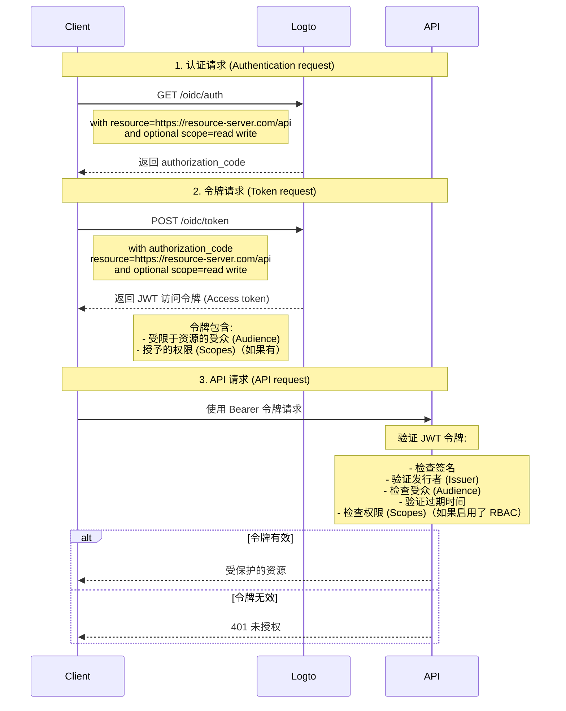

# 保护你的 API

如果你不需要灵活、细粒度的访问控制策略，你可以直接保护你的 API。我们将通过一个序列图和必要的步骤向你展示如何将访问控制集成到你的应用中。



在本教程中

- Logto 端点：`https://tenant-id.logto.app`
- 客户端应用：`https://client.example.org`
- API 资源服务器：`https://resource-server.com/api`

在实现时，你应该用你的实际端点替换这些。

## 认证请求 (Authentication request)

在 [认证请求](https://openid.net/specs/openid-connect-core-1_0.html#AuthRequest) 中提供资源指示器参数的列表。它将指示用户可能请求的所有受保护资源。

```bash
GET https://tenant-id.logto.app/oidc/auth?response_type=code
    &client_id=s6BhdRkqt3
    &state=tNwzQ87pC6llebpmac_IDeeq-mCR2wLDYljHUZUAWuI
    &redirect_uri=https%3A%2F%2Fclient.example.org%2Fcb
    &resource=https%3A%2F%2Fresource-server.com%2Fapi
    &scope=read%20write
```

Logto 将验证并存储这些资源指示器。一个 `authorization_code` 将被授予并返回，权限 (Scopes) 将限制在这些指定的资源上。

Logto SDK 的示例配置：

```tsx
const config: LogtoConfig = {
  // ...other configs
  resources: ['https://resource-server.com/api'],
  scopes: ['read', 'write'],
};
```

## 令牌请求 (Token request)

当资源参数与上面授予的 `authorization_code` 一起出现在 [令牌请求](https://openid.net/specs/openid-connect-core-1_0.html#TokenRequest) 中时，它将指定请求的访问令牌的目标 API 资源受众 (Audience)。

```bash
POST https://tenant-id.logto.app/oidc/token HTTP/1.1
Content-Type: application/x-www-form-urlencoded

grant_type=authorization_code&redirect_uri=https%3A%2F%2Fclient.example.org%2Fcb&code=10esc29BWC2qZB0acc9v8zAv9ltc2pko105tQauZ&resource=https%3A%2F%2Fresource-server.com%2Fapi
```

Logto 将授予一个受众 (Audience) 限制在此请求资源的加密访问令牌。令牌携带所有你需要的数据来表示请求的授权状态。例如，请求用户的身份和角色 (Role)，令牌的受众 (Audience) 和过期时间。

Logto SDK 的示例代码：

```tsx
const accessToken = await logtoClient.getAccessToken('https://resource-server.com/api');
```

accessToken 的负载将包含：

```tsx
{
  iss: '<your-logto-endpoint>/oidc',
  aud: 'https://resource-server.com/api',
  scope: 'read write'
}
```

## 向 API 资源发送请求

客户端用户通过在授权头中提供给定的 `access_token` 向 API 资源发送请求。

```bash
GET https://resource-server.com/api/users
Authorization: Bearer eyJhbGciOiJIUz...
```

Logto 遵循标准的基于令牌的授权协议来保护你的 API 资源。要了解有关 OAuth 2.0 的更多信息，请参考 OAuth 2.0 的 [官方文档](https://datatracker.ietf.org/doc/html/rfc6749#section-1.3.1)。

## 验证 API 请求的授权令牌

Logto 为每个授权的 API 请求颁发标准 [JWT](https://datatracker.ietf.org/doc/html/rfc7519) 格式的授权令牌。令牌被加密并签名为 [JWS](https://datatracker.ietf.org/doc/html/rfc7515) 令牌。

#### 理解 JWS 令牌

一个编码的 [JWS](https://datatracker.ietf.org/doc/html/rfc7515) 令牌由三部分构成：

- JOSE 头：声明代码类型和编码算法
- JWS 负载：包含所有令牌的声明 (Claims)
- JWS 签名：使用 [JWK](https://datatracker.ietf.org/doc/html/rfc7517) 签名的签名

Logto 颁发的 JWS 负载的标准模式：（声明可能会有所不同，基于你的自定义 OIDC 配置）

| key       | description                   |
| --------- | ----------------------------- |
| jti       | 唯一的 JWT ID                 |
| sub       | 主体 (Subject)，通常是用户 ID |
| iat       | 令牌签发的时间戳              |
| exp       | 令牌过期的时间戳              |
| client_id | 应用 ID                       |
| iss       | 令牌发行者 (Issuer) 身份      |
| aud       | 令牌的受众 (Audience)         |
| scope     | 令牌的权限 (Scopes)           |

:::note

对于开发，想要直观地检查 JWT 令牌，你可以访问 [jwt.io](https://jwt.io/) 来解码和检查你收到的令牌。请小心或永远不要使用来自生产环境的令牌。由于这是第三方提供的公共在线服务，你的令牌可能会被暴露。

:::

#### 验证授权令牌

1. [验证 JWT](https://datatracker.ietf.org/doc/html/rfc7519#section-7.2)
2. [验证 JWS 签名](https://datatracker.ietf.org/doc/html/rfc7515#section-5.2)
3. 令牌的发行者 (Issuer) 是 `https://<your-logto-domain>/oidc`（由你的 Logto 认证服务器颁发）
4. 令牌的受众 (Audience) 等于 Logto 管理控制台中注册的当前接收者的资源指示器
5. 令牌在其过期时间内
6. （仅限 [RBAC](/authorization/role-based-access-control/protect-api-resources-with-rbac)）令牌具有所需的 `scope`

有各种开源库和包可以帮助你轻松验证和解码 JWT 令牌。你可以根据你使用的语言和框架选择一个并集成到你的后端应用中。请查看我们的一些示例：

- [Node (Express)](/authorization/api-resources/node-express)
- [Spring Boot](/authorization/api-resources/spring-boot)
- [Python](/authorization/api-resources/python)

## 参考

Logto 使用基于代码的 OAuth 2.0 授权协议来确保你的 API 请求安全。如果你对其背后的策略感兴趣，请参考 OAuth 2.0 的 [规范](https://datatracker.ietf.org/doc/html/rfc6749#section-1.3.1) 了解更多详细信息。
