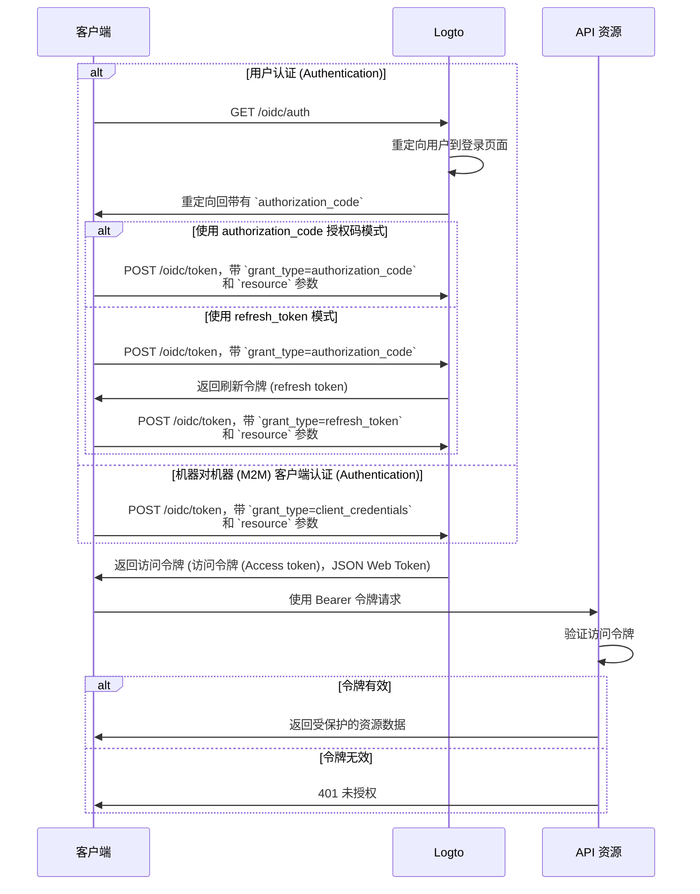

import illustration from '@site/docs/authorization/assets/rbac-global-api-resources.png';
import AuthorizationRequestExample from '@site/docs/authorization/fragments/AuthorizationRequestExample';
import ClientCredentialsRequestExample from '@site/docs/authorization/fragments/ClientCredentialsRequestExample';
import TokenRequestExample from '@site/docs/authorization/fragments/TokenRequestExample';
import TabItem from '@theme/TabItem';
import Tabs from '@theme/Tabs';

# 保护全局 API 资源

export const resource = 'https://api.your-app.com';

使用 Logto 的基于角色的访问控制 (RBAC) 保护产品范围内的 API。分配全局角色和权限，以控制你应用中所有用户和客户端的访问。

## 什么是全局 API 资源？\{#what-are-global-api-resources}

全局 API 资源是你应用中所有用户都可以访问的端点或服务，无论属于哪个组织或租户。这些通常是面向公众的 API、核心产品服务，或任何不限定于特定组织的端点。

**使用场景包括**

- 在你的用户群体中共享的公共 API 或端点。
- 不绑定多租户的微服务。
- 所有客户都使用的核心应用 API（如 `/api/users`、`/api/products`）。

Logto 允许你结合 OAuth 2.1 和灵活的基于角色的访问控制来保护这些 API。

## 在 Logto 中如何工作 \{#how-it-works-in-logto}

- **API 资源和权限是全局注册的**：你想要保护的每个 API 都用唯一的资源指示器（URI）和一组控制访问的权限（scopes）进行定义。
- **访问由全局角色控制**：你可以将权限分配给角色，然后将角色分配给用户或客户端。
- **与组织级权限分离**：全局 API 资源没有组织上下文。但如有需要，可以与组织角色结合使用，提供额外的上下文层。要保护组织级 API，请参见 [保护组织级 API 资源](/authorization/organization-level-api-resources)。


### 实现概览 \{#implementation-overview}

1. **注册你的 API 资源** 并在 Logto 中定义其权限。
2. **定义角色**，为访问 API 分配所需权限。
3. **分配角色** 给用户或客户端。
4. **使用 OAuth 2.0 授权流程** 获取 API 的访问令牌（resource 参数必须与注册的 API 标识符一致）。
5. **在你的 API 中验证访问令牌**，以强制执行权限。

### 理解资源指示器 \{#understanding-resource-indicators}

Logto 按照 [RFC 8707: OAuth 2.0 的资源指示器](https://www.rfc-editor.org/rfc/rfc8707.html) 建模 API 资源。**资源指示器** 是唯一标识所请求目标 API 或服务的 URI。

**要点**

- 资源指示器必须是绝对 URI（如 `https://api.example.com`）
- 不包含片段部分；尽量避免使用查询字符串。
- 资源指示器支持受众限制令牌和多 API 架构。

**示例**

- Management API: `https://my-tenant.logto.app/api`
- 自定义全局 API: `https://api.yourapp.com`

### 授权流程：认证 (Authentication) 并保护你的 API \{#authorization-flow-authenticating-and-securing-your-api}

以下流程适用于交互式用户认证 (Authentication)（浏览器 / 应用）和后端机器对机器 (M2M) 场景。

请注意，该流程未包含所有必需参数或头信息的详细说明，重点展示关键步骤。继续阅读以了解实际流程。



_用户认证 (Authentication) = 浏览器 / 应用。M2M = 使用客户端凭证的后端服务或脚本。_

:::note
`resource` 参数必须与 Logto 中注册的 API 标识符（资源指示器）完全一致。
:::

## 实现步骤 \{#implementation-steps}

### 注册你的 API 资源 \{#register-your-api-resources}

1. 前往 <CloudLink to="/api-resources">控制台 → API 资源</CloudLink>。
2. 创建新的 API 资源（如 `https://api.yourapp.com/org`），并定义其权限（scopes）。

完整配置步骤见 [定义带权限的 API 资源](/authorization/role-based-access-control#define-api-resources-with-permissions)。

### 设置全局角色 \{#set-up-global-roles}

1. 前往 <CloudLink to="/roles">控制台 → 角色</CloudLink>。
2. 创建与你 API 权限对应的角色（如 `read:products`、`write:products`）。
3. 将这些角色分配给需要访问 API 的用户或客户端。

完整配置步骤见 [使用全局角色](/authorization/role-based-access-control#configure-global-roles)。

### 获取全局 API 资源的访问令牌 \{#obtain-access-tokens-for-global-api-resources}

在访问全局 API 资源前，你的客户端必须获取访问令牌。Logto 会为全局 API 资源签发 [JSON Web Token (JWT)](https://auth.wiki/jwt) 作为访问令牌。通常使用 [OAuth 2.0 授权码流程](https://auth.wiki/authorization-code-flow)、[刷新令牌流程](https://auth.wiki/refresh-token) 或 [客户端凭证流程](https://auth.wiki/client-credentials-flow) 完成。

#### 授权码或刷新令牌流程 \{#authorization-code-or-refresh-token-flow}

所有 Logto 官方 SDK 都原生支持使用刷新令牌流程获取全局 API 资源的访问令牌。你也可以用标准 OAuth 2.0 / OIDC 客户端库实现该流程。

<Tabs groupId="user-client">
<TabItem value="logto-sdk" label="Logto SDK">

初始化 Logto 客户端时，将资源指示器添加到 `resources` 参数（数组），然后将所需权限（scopes）添加到 `scopes` 参数。

用户认证 (Authentication) 后，请在请求访问令牌时（如调用 `getAccessToken()`）传递资源指示器到 `resource` 参数或类似参数中。

各 SDK 详情见 [快速开始](/quick-starts)。

</TabItem>
<TabItem value="oauth-client" label="OAuth 2.0 / OIDC client library">

配置 OAuth 2.0 客户端或初始化授权码流程时，确保在授权请求中包含 `resource` 参数和所需 scopes。

部分库可能不原生支持 `resource` 参数，但通常允许你在授权请求中传递额外参数。具体请查阅你的库文档。

以下是带 `resource` 和 `scope` 参数的授权请求非规范示例：

<AuthorizationRequestExample resource={resource} scope="read:products write:products" />

用户认证 (Authentication) 后，你将收到授权码。通过向 Logto 的 `/oidc/token` 端点发起 POST 请求，并在请求体中包含 `resource` 参数，将该授权码兑换为访问令牌。

以下是使用授权码模式的令牌请求非规范示例：

<TokenRequestExample grantType="authorization_code" resource={resource} />

你也可以使用 `refresh_token` 模式，在请求中包含 `resource` 参数，无需用户交互即可获取新访问令牌。

以下是使用刷新令牌模式的令牌请求非规范示例：

<TokenRequestExample grantType="refresh_token" resource={resource} />

</TabItem>
</Tabs>

#### 客户端凭证流程 \{#client-credentials-flow}

对于机器对机器 (M2M) 场景，你可以使用客户端凭证流程获取全局 API 资源的访问令牌。通过向 Logto 的 `/oidc/token` 端点发起 POST 请求，使用你的客户端 ID 和密钥请求访问令牌。

请求中需包含两个关键参数：

- `resource`：你要访问的 API 的资源指示器 URI（如 `https://api.yourapp.com`）。
- `scope`：你要请求的 API 权限（如 `read:products write:products`）。

以下是使用客户端凭证模式的令牌请求非规范示例：

<ClientCredentialsRequestExample
  resource="https://api.yourapp.com"
  scope="read:products write:products"
/>

### 在你的 API 中验证 JWT 访问令牌 \{#validating-jwt-access-tokens-in-your-api}

Logto 签发的 JWT 包含你的 API 可用于强制授权 (Authorization) 的声明 (Claims)。

当你的 API 收到带有 Logto 签发的访问令牌的请求时，你应：

- 验证令牌签名（使用 Logto 的 JWKs）。
- 确认令牌未过期（`exp` 声明 (Claim)）。
- 检查 `iss`（发行者 (Issuer)）是否与你的 Logto 端点一致。
- 确保 `aud`（受众 (Audience)）与你注册的 API 资源标识符一致（如 `https://api.yourapp.com`）。
- 拆分 `scope` 声明 (Claim)（以空格分隔），检查所需权限。

分步和特定语言指南见 [如何验证访问令牌](/authorization/validate-access-tokens)。

### 可选：处理用户权限变更 \{#optional-handle-user-permission-change}

:::info
👷 功能开发中。🚧
:::

## 最佳实践与安全建议 \{#best-practices-and-security-tips}

- **权限应以业务为驱动**：使用能映射到实际操作的清晰名称。
- **令牌过期时间应短**：如果令牌泄露可降低风险。
- **限制授予的权限 (Scopes)**：只给令牌实际需要的权限。
- **使用受众限制**：始终验证 `aud` 声明 (Claim)，防止滥用。

## 常见问题 \{#faqs}

<details>
<summary>

### 如果我的客户端不支持 resource 参数怎么办？\{what-if-my-client-doesn-t-support-the-resource-parameter} \{#what-if-my-client-doesn-t-support-the-resource-parameter}

</summary>

在 Logto 控制台设置默认 API 资源。当令牌请求中未指定 resource 参数时，令牌将默认使用该受众 (Audience)。

</details>

<details>
<summary>

### 为什么我的 API 返回 401 未授权？\{why-do-i-get-401-unauthorized-from-my-api} \{#why-do-i-get-401-unauthorized-from-my-api}

</summary>

请检查以下常见问题：

- **令牌签名**：确认你的后端从 Logto 获取了正确的 JWKs
- **令牌过期**：确保令牌未过期（`exp` 声明 (Claim)）
- **受众 (Audience)**：确认 `aud` 声明 (Claim) 与你注册的 API 资源指示器一致
- **所需权限 (Scopes)**：确认令牌的 `scope` 声明 (Claim) 包含所需权限

</details>

<details>
<summary>

### 如何在没有完整客户端的情况下测试？\{how-do-i-test-without-a-full-client} \{#how-do-i-test-without-a-full-client}

</summary>

使用 [个人访问令牌](/user-management/personal-access-token) 模拟认证 (Authentication) 调用。这样你可以在不实现完整 OAuth 流程的情况下测试 API 端点。

</details>

<details>
<summary>

### 请求权限时可以使用 scope 前缀或简写吗？\{can-i-use-scope-prefixes-or-shortened-versions} \{#can-i-use-scope-prefixes-or-shortened-versions}

</summary>

不可以。Scope 名称必须**完全匹配**你在 API 资源中定义的权限名称。前缀和简写不能作为通配符使用。

**示例：**

如果你的 API 资源定义了：

- `read:elections`
- `write:elections`

你必须请求：

```swift
scopes: ["read:elections", "write:elections"]
```

这样**不会生效**：

```swift
scopes: ["read", "write"]  // ❌ 不匹配权限名称
```

</details>

## 延伸阅读 \{#further-reading}

<Url href="/authorization/validate-access-tokens">如何验证访问令牌</Url>
<Url href="/use-cases/authorization/rbac-in-practice">
  RBAC 实践：为你的应用实现安全授权 (Authorization)
</Url>
<Url href="/developers/custom-token-claims">自定义令牌声明 (Claims)</Url>
<Url href="https://www.rfc-editor.org/rfc/rfc8707.html">RFC 8707: 资源指示器</Url>
