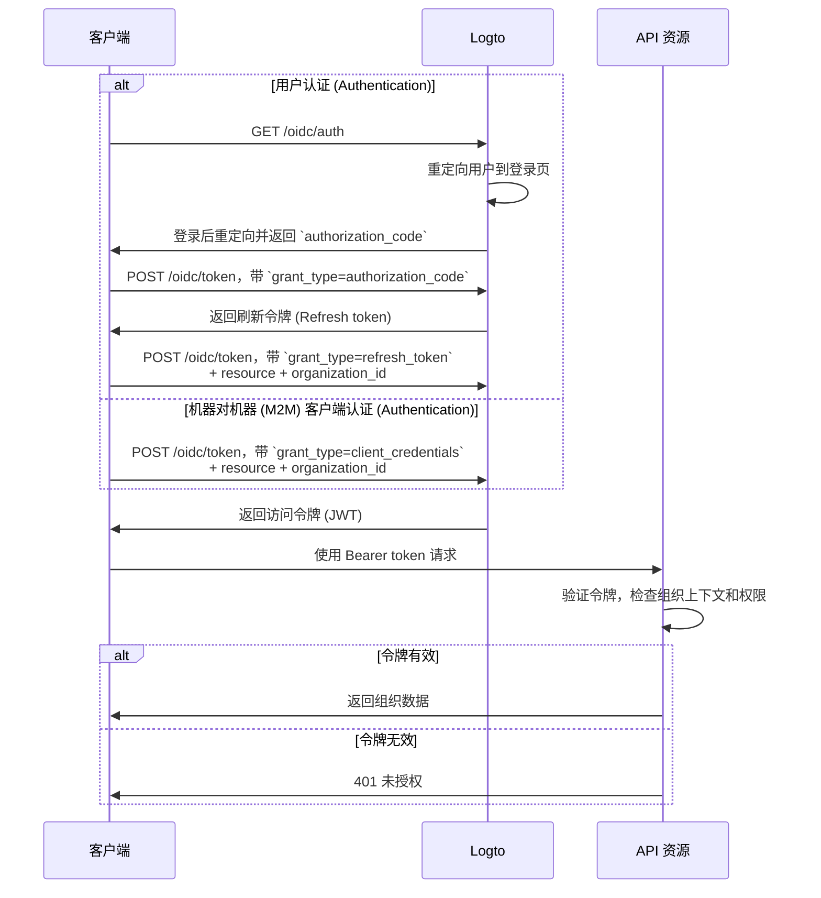

import illustration from '@site/docs/authorization/assets/rbac-organization-level-api-resources.png';
import AuthorizationRequestExample from '@site/docs/authorization/fragments/AuthorizationRequestExample';
import ClientCredentialsRequestExample from '@site/docs/authorization/fragments/ClientCredentialsRequestExample';
import TokenRequestExample from '@site/docs/authorization/fragments/TokenRequestExample';
import HandleUserPermissionChange from '@site/docs/authorization/fragments/_handle-user-permission-change.mdx';
import TabItem from '@theme/TabItem';
import Tabs from '@theme/Tabs';

import InspectOrganizationClaim from './fragments/_inspect-organization-claim.md';
import OrganizationTokenWarning from './fragments/_organization-token-warning.md';

# 保护组织级 API 资源

export const resource = 'https://api.your-app.com/organizations';

结合 API 资源与组织模板，可以限制每个组织内的 API 和数据访问，确保你的 SaaS 实现租户级隔离。

## 什么是组织级 API 资源？\{#what-are-organization-level-api-resources}

组织级 API 资源是你应用中**限定于特定组织范围**的端点或服务。这些 API 会根据组织上下文强制执行授权 (Authorization) 和访问控制，确保用户或客户端只能访问与其组织相关的数据和操作。

**使用场景包括**

- 管理组织成员、角色或设置的 API（如 `/organizations/{organizationId}/members`）
- 组织范围的仪表盘、分析或报表
- 与组织绑定的计费、订阅或审计端点
- 任何按租户隔离操作和数据的 API

Logto 允许你使用 OAuth 2.1 和基于角色的访问控制 (RBAC) 保护这些组织 API，同时支持多租户 SaaS 架构。

这些权限通过在 [组织模板](/authorization/organization-template) 中定义的**组织角色**进行管理。每个组织都使用相同的模板，确保所有组织拥有一致的权限模型。

## Logto 中的工作原理 \{#how-it-works-in-logto}

- **API 资源和权限全局注册：** 每个 API 资源在 Logto 中都用唯一的资源指示器（URI）和一组权限（Scopes）定义。
- **组织级角色：** 组织角色在组织模板中定义。API 资源权限（Scopes）分配给组织角色，然后再分配给每个组织内的用户或客户端。
- **上下文感知授权 (Authorization)：** 当客户端请求同时包含 API 资源和 `organization_id` 的访问令牌时，Logto 会签发包含组织上下文和 API 受众的令牌。令牌的权限（Scopes）由用户在指定组织中的组织角色决定。
- **与全局资源分离：** API 资源可以带或不带组织上下文访问。只有在请求中包含 `organization_id` 时，才会应用组织 RBAC。对于所有用户共享的 API，请参见 [保护全局 API 资源](/authorization/global-api-resources)。

### 实现概览 \{#implementation-overview}

1. **注册你的 API 资源**，并在 Logto 中定义其权限（Scopes）。
2. **在组织模板中定义组织角色**，并分配相关 API 权限。
3. **为每个组织内的用户或客户端分配角色。**
4. **为 API 请求访问令牌时带上 `organization_id`，以包含组织上下文。**
5. **在你的 API 中验证访问令牌，强制执行组织上下文和权限。**

### Logto 如何应用组织 RBAC \{#how-logto-applies-organization-rbac}

- 如果你请求访问令牌**不带** `organization_id`，只会考虑全局角色 / 权限。
- 如果你请求访问令牌**带有** `organization_id`，Logto 会评估用户在该组织中的组织角色及其关联权限。
- 最终生成的 JWT 会同时包含 API 受众（`aud` 声明）和组织上下文（`organization_id` 声明），Scopes 会过滤为用户在该组织角色授予的权限。

### 授权 (Authorization) 流程：带组织上下文的 API 认证 (Authentication) 与保护 \{#authorization-flow-authenticating-and-securing-apis-with-organization-context}

下方流程展示了客户端（Web、移动端或后端）如何获取并使用组织令牌 (Organization token) 访问组织级 API 资源。

请注意，该流程未包含所有必需参数或请求头的细节，重点展示关键步骤。继续阅读可了解实际流程。

_用户认证 (Authentication) = 浏览器 / 应用。M2M = 使用客户端凭据 + 组织上下文的后端服务或脚本。_

## 实现步骤 \{#implementation-steps}

### 注册你的 API 资源 \{#register-your-api-resource}

1. 前往 <CloudLink to="/api-resources">控制台 → API 资源</CloudLink>。
2. 创建新的 API 资源（如 `https://api.yourapp.com/org`），并定义其权限（Scopes）。

完整配置步骤见 [定义带权限的 API 资源](/authorization/role-based-access-control#define-api-resources-with-permissions)。

### 配置组织角色 \{#set-up-organization-roles}

1. 前往 <CloudLink to="/organization-template/organization-roles">控制台 → 组织模板 → 组织角色</CloudLink>。
2. 创建组织角色（如 `admin`、`member`），并为每个角色分配 API 权限
3. 在每个组织内为用户或客户端分配角色。如果他们还不是成员，先邀请或添加。

完整配置步骤见 [使用组织角色](/authorization/role-based-access-control#configure-organization-roles)。

### 获取 API 资源的组织令牌 (Organization tokens) \{#obtain-organization-tokens-for-api-resources}

你的客户端 / 应用应同时带上 `resource` 和 `organization_id` 请求令牌，以访问组织级 API。Logto 会以 [JSON Web Token (JWT)](https://auth.wiki/jwt) 形式签发组织令牌。你可以通过 [刷新令牌流程](https://auth.wiki/refresh-token) 或 [客户端凭据流程](https://auth.wiki/client-credentials-flow) 获取。

#### 刷新令牌流程 \{#refresh-token-flow}

几乎所有 Logto 官方 SDK 都原生支持通过刷新令牌流程获取组织令牌。标准 OAuth 2.0 / OIDC 客户端库也可实现该流程。

<Tabs groupId="user-client">
<TabItem value="logto-sdk" label="Logto SDK">

初始化 Logto SDK 时，将 `urn:logto:scope:organizations` 及所需组织权限（Scopes）加入 `scopes` 参数。

部分 Logto SDK 已预定义组织 Scope，如 JavaScript SDK 的 `UserScope.Organizations`。

<InspectOrganizationClaim />

调用 `getAccessToken()` 时，需同时指定 API 资源（`resource`）和组织 ID（`organizationId`），以获取组织令牌。

各 SDK 详情见 [快速开始](/quick-starts)。

</TabItem>
<TabItem value="oauth-client" label="OAuth 2.0 / OIDC client library">

配置 OAuth 2.0 客户端或初始化授权码流程时，确保包含以下参数：

- `resource`：设置为在 Logto 注册的 API 资源标识符（如 `https://api.your-app.com/organizations`）。
- `scope`：包含预定义的组织 Scope（`urn:logto:scope:organizations`）、`offline_access`（获取刷新令牌），以及你需要的具体 API 权限（如 `manage:members view:analytics`）。

部分库可能不原生支持 `resource` 参数，但通常允许在授权请求中传递额外参数。请查阅你的库文档。

以下为授权请求的非规范示例：

<AuthorizationRequestExample
  resource={resource}
  scope="urn:logto:scope:organizations invite:member manage:billing"
/>

用户认证 (Authentication) 后，你将收到授权码。使用该授权码向 Logto 的 `/oidc/token` 端点发起 POST 请求。

以下为令牌请求的非规范示例：

<TokenRequestExample grantType="authorization_code" />

<OrganizationTokenWarning />

你将获得一个刷新令牌，可用于获取组织令牌。

<InspectOrganizationClaim />

最后，使用刷新令牌向 Logto 的 `/oidc/token` 端点发起 POST 请求以获取组织令牌。请务必包含：

- `resource` 参数，设置为 API 资源标识符（如 `https://api.yourapp.com/org`）。
- `organization_id` 参数，设置为目标组织 ID。
- （可选）`scope` 参数，进一步收窄所需权限（如 `manage:members view:reports`）。

以下为令牌请求的非规范示例：

<TokenRequestExample
  grantType="refresh_token"
  resource={resource}
  organizationId="your-organization-id"
/>

</TabItem>
</Tabs>

#### 客户端凭据流程 \{#client-credentials-flow}

对于机器对机器 (M2M) 场景，你可以使用客户端凭据流程获取组织级 API 资源权限的访问令牌。通过向 Logto 的 `/oidc/token` 端点发起带组织参数的 POST 请求，可使用客户端 ID 和密钥请求组织令牌。

请求中需包含的关键参数：

- `resource`：API 资源标识符（如 `https://api.yourapp.com/org`）。
- `organization_id`：你希望获取令牌的组织 ID。
- `scope`：你要请求的组织级 API 资源权限（如 `invite:member`、`manage:billing`）。

以下为使用客户端凭据授权类型的令牌请求非规范示例：

<ClientCredentialsRequestExample
  resource="https://api.yourapp.com/org"
  organizationId="your-organization-id"
  scope="invite:member manage:billing"
/>

### 验证组织令牌 (Organization tokens) \{#validate-organization-tokens}

Logto 签发的组织令牌（JWT）包含你的 API 可用于强制组织级访问控制的声明 (Claims)。

你的应用收到组织令牌后，应：

- 验证令牌签名（使用 Logto 的 JWKs）。
- 确认令牌未过期（`exp` 声明）。
- 检查 `iss`（发行者）是否与你的 Logto 端点匹配。
- 确认 `aud`（受众）是否与你注册的 API 资源标识符一致（如 `https://api.yourapp.com/org`）。
- 校验 `organization_id` 声明，确保令牌限定于正确的组织。
- 拆分 `scope` 声明（以空格分隔），检查所需权限。
- 如果你的 API 路径包含组织 ID（如 `/organizations/{organizationId}/members`），确保 `organization_id` 声明与路径参数一致。

分步和多语言指南见 [如何验证访问令牌](/authorization/validate-access-tokens)。

<HandleUserPermissionChange type="organization" />

## 最佳实践与安全建议 \{#best-practices-and-security-tips}

- **始终校验组织上下文：** 不要只信任令牌本身，每次组织范围 API 调用都要检查 `organization_id` 声明。
- **使用受众限制：** 始终检查 `aud` 声明，确保令牌用于目标组织。
- **权限保持业务驱动：** 使用清晰的名称映射实际操作，每个组织角色只授予所需权限。
- **尽量区分 API 与非 API 权限**（但两者可在同一角色中）。
- **保持令牌生命周期短：** 若令牌泄露可降低风险。
- **定期审查你的组织模板：** 随产品演进更新角色和权限。

## 常见问题 \{#faqs}

### 如果我在令牌请求中不包含 `organization_id` 会怎样？\{what-if-i-don-t-include-organization-id-in-my-token-request} \{#what-if-i-don-t-include-organization-id-in-my-token-request}

只会评估全局角色 / 权限。不会强制执行组织 RBAC。

### 我可以在一个角色中混合组织和非组织权限吗？\{can-i-mix-organization-and-non-organization-permissions-in-a-single-role} \{#can-i-mix-organization-and-non-organization-permissions-in-a-single-role}

不可以，组织权限（包括组织级 API 权限）由组织模板定义，不能与全局 API 权限混合。但你可以创建同时包含组织权限和组织级 API 权限的角色。

## 延伸阅读 \{#further-reading}

<Url href="/authorization/validate-access-tokens">如何验证访问令牌 (Access token)</Url>
<Url href="/developers/custom-token-claims">自定义令牌声明 (Claim)</Url>
<Url href="/use-cases/multi-tenancy/build-multi-tenant-saas-application">
  用例：构建多租户 SaaS 应用
</Url>
<Url href="https://www.rfc-editor.org/rfc/rfc8707.html">
  RFC 8707：资源指示器 (Resource indicator)
</Url>
