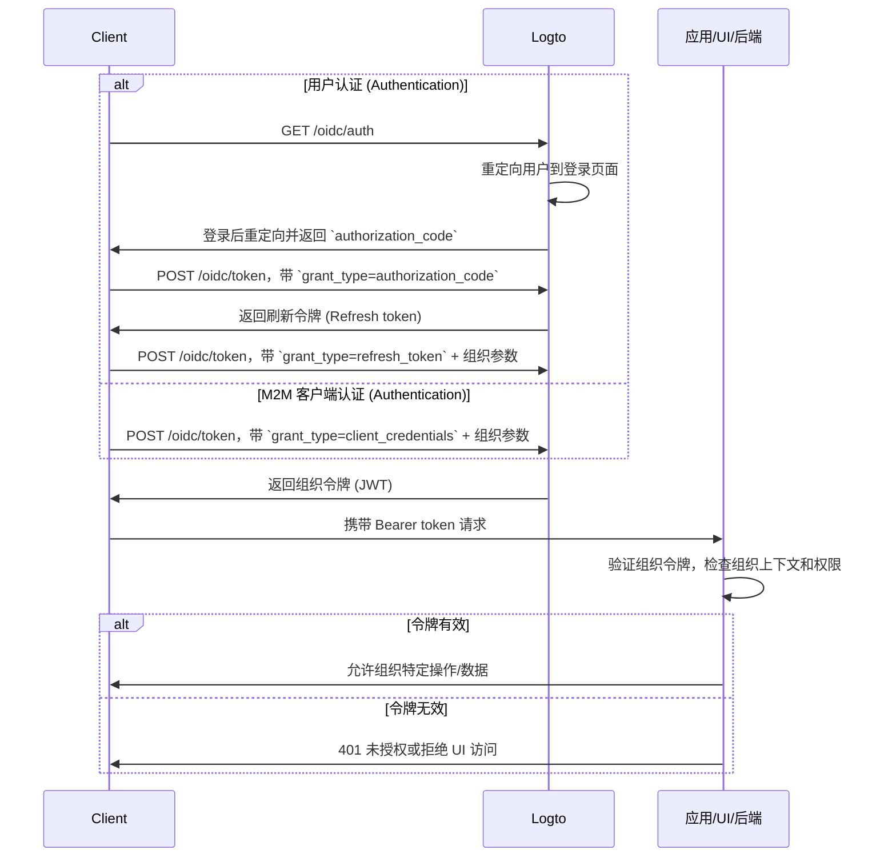

import illustration from '@site/docs/authorization/assets/rbac-organization-permissions.png';
import AuthorizationRequestExample from '@site/docs/authorization/fragments/AuthorizationRequestExample';
import ClientCredentialsRequestExample from '@site/docs/authorization/fragments/ClientCredentialsRequestExample';
import TokenRequestExample from '@site/docs/authorization/fragments/TokenRequestExample';
import TabItem from '@theme/TabItem';
import Tabs from '@theme/Tabs';

import InspectOrganizationClaim from './fragments/_inspect-organization-claim.md';
import OrganizationTokenWarning from './fragments/_organization-token-warning.md';

# 保护组织（非 API）权限

使用组织模板在 Logto 中管理和强制执行组织级别的角色和权限，控制在组织上下文内对应用内功能和工作流的访问。

## 什么是组织（非 API）权限？ \{#what-are-organization-non-api-permissions}

组织权限（非 API）控制用户在**组织上下文内**可以做什么，但**不会在 API 层面强制执行**。它们用于管理对应用功能、UI 元素、工作流或业务操作的访问，而不是后端 API。

**使用场景包括**

- 在组织内邀请或管理成员
- 分配或更改组织角色
- 管理组织的账单、设置或管理功能
- 访问没有 API 端点的仪表盘、分析或内部工具

Logto 允许你使用 OAuth 2.1 和基于角色的访问控制 (RBAC) 保护这些组织权限，同时支持多租户 SaaS 架构。

这些权限通过在 [组织模板](/authorization/organization-template) 中定义的**组织角色**进行管理。每个组织都使用相同的模板，确保所有组织拥有一致的权限模型。

## 在 Logto 中的工作原理 \{#how-it-works-in-logto}

- **组织级别 RBAC**：角色和权限在组织模板中定义。当用户加入组织时，会被分配一个或多个角色，从而获得特定权限。
- **非 API 强制执行**：权限在你的应用 UI、工作流或后端逻辑中检查和强制执行，不一定由 API 网关处理。
- **与 API 保护分离**：组织（非 API）权限与 API 资源权限不同。你可以将两者结合用于高级场景。

  

### 实现概览 \{#implementation-overview}

1. 在 Logto 的组织模板下**定义组织权限**。
2. **创建组织角色**，将所需权限打包用于组织特定操作。
3. **为每个组织内的用户或客户端分配角色**。
4. 使用刷新令牌 (Refresh token) 或客户端凭据流获取当前组织的**组织令牌 (JWT)**。
5. 在应用 UI 或后端**验证访问令牌**以强制执行组织权限。

### 授权 (Authorization) 流程：认证 (Authentication) 并保护组织权限 \{#authorization-flow-authenticating-and-securing-organization-permissions}

以下流程展示了客户端（Web、移动端或后端）如何获取并使用组织令牌来实现非 API 权限的强制执行。

请注意，该流程未包含所有必需参数或请求头的详细信息，重点展示关键步骤。继续阅读以了解实际流程。

_用户认证 (Authentication) = 浏览器/应用。M2M = 使用客户端凭据 + 组织上下文的后端服务或脚本。_

## 实现步骤 \{#implementation-steps}

### 注册组织权限 \{#register-organization-permissions}

1. 前往 <CloudLink to="/organization-template/organization-permissions">控制台 → 组织模板 → 组织权限</CloudLink>。
2. 定义你需要的组织权限（如 `invite:member`、`manage:billing`、`view:analytics`）。

完整配置步骤见 [定义组织权限](/authorization/role-based-access-control#define-organization-permissions)。

### 设置组织角色 \{#set-up-organization-roles}

1. 前往 <CloudLink to="/organization-template/organization-roles">控制台 → 组织模板 → 组织角色</CloudLink>。
2. 创建包含你之前定义的组织权限的角色（如 `admin`、`member`、`billing`）。
3. 将这些角色分配给每个组织内的用户或客户端。

完整配置步骤见 [使用组织角色](/authorization/role-based-access-control#configure-organization-roles)。

### 获取组织令牌（非 API） \{#obtain-organization-tokens-non-api}

你的客户端/应用应获取组织令牌（非 API）以访问组织权限。Logto 以 [JSON Web Token (JWT)](https://auth.wiki/jwt) 形式颁发组织令牌。你可以通过 [刷新令牌流](https://auth.wiki/refresh-token) 或 [客户端凭据流](https://auth.wiki/client-credentials-flow) 获取。

#### 刷新令牌流 \{#refresh-token-flow}

几乎所有 Logto 官方 SDK 都原生支持通过刷新令牌流获取组织令牌。标准 OAuth 2.0 / OIDC 客户端库也可实现该流程。

<Tabs groupId="user-client">
<TabItem value="logto-sdk" label="Logto SDK">

初始化 Logto SDK 时，将 `urn:logto:scope:organizations` 及所需组织权限（scopes）添加到 `scopes` 参数中。

部分 Logto SDK 预定义了组织相关 scope，如 JavaScript SDK 中的 `UserScope.Organizations`。

<InspectOrganizationClaim />

使用 `getOrganizationToken` 或类似方法（如带组织 ID 的 `getAccessToken`）为指定组织请求组织令牌。

各 SDK 详情见 [快速开始](/quick-starts)。

</TabItem>
<TabItem value="oauth-client" label="OAuth 2.0 / OIDC client library">

配置 OAuth 2.0 客户端或初始化授权码流程时，确保包含以下参数：

- `resource`：设置为 `urn:logto:resource:organizations`，表示你需要组织令牌。
- `scope`：包含预定义的组织 scope（`urn:logto:scope:organizations`）、`offline_access`（获取刷新令牌）及你需要的具体组织权限（如 `invite:member`、`manage:billing`）。

部分库可能不原生支持 `resource` 参数，但通常允许你在授权请求中传递额外参数。请查阅你的库文档。

以下为授权请求的非规范示例：

<AuthorizationRequestExample
  scope="urn:logto:scope:organizations invite:member manage:billing"
  resource="urn:logto:resource:organizations"
/>

用户认证 (Authentication) 后，你将收到授权码。使用该授权码向 Logto 的 `/oidc/token` 端点发起 POST 请求。

以下为令牌请求的非规范示例：

<TokenRequestExample grantType="authorization_code" />

<OrganizationTokenWarning />

你将获得一个刷新令牌 (Refresh token)，可用于获取组织令牌。

<InspectOrganizationClaim />

最后，使用刷新令牌 (Refresh token) 向 Logto 的 `/oidc/token` 端点发起 POST 请求以获取组织令牌。记得包含：

- `organization_id` 参数，设置为目标组织 ID。
- （可选）`scope` 参数，进一步缩小所需权限范围（如 `manage:members view:reports`）。

以下为令牌请求的非规范示例：

<TokenRequestExample grantType="refresh_token" organizationId="your-organization-id" />

</TabItem>
</Tabs>

#### 客户端凭据流 \{#client-credentials-flow}

对于机器对机器 (M2M) 场景，你可以使用客户端凭据流获取组织权限的访问令牌。通过向 Logto 的 `/oidc/token` 端点发起带有组织参数的 POST 请求，可使用客户端 ID 和密钥请求组织令牌。

请求中需包含的关键参数：

- `organization_id`：你想获取令牌的组织 ID。
- `scope`：你想请求的组织权限（如 `invite:member`、`manage:billing`）。

以下为使用客户端凭据授权类型的令牌请求非规范示例：

<ClientCredentialsRequestExample
  organizationId="your-organization-id"
  scope="invite:member manage:billing"
/>

### 验证组织令牌 \{#validate-organization-tokens}

Logto 颁发的组织令牌 (JWT) 包含你的应用/UI/后端可用于强制执行组织级访问控制的声明 (Claims)。

当你的应用收到组织令牌时，你应：

- 验证令牌签名（使用 Logto 的 JWKs）。
- 确认令牌未过期（`exp` 声明）。
- 检查 `iss`（发行者 (Issuer)）是否与你的 Logto 端点一致。
- 确保 `aud`（受众 (Audience)）与格式化的组织标识符一致（如 `urn:logto:organization:{organization_id}`）。
- 拆分 `scope` 声明（以空格分隔），检查所需权限。

分步和特定语言指南见 [如何验证访问令牌](/authorization/validate-access-tokens)。

## 最佳实践与安全提示 \{#best-practices-and-security-tips}

- **切勿仅依赖 UI 强制执行**：关键操作务必在后端验证权限。
- **使用受众 (Audience) 限制**：始终检查 `aud` 声明，确保令牌用于目标组织。
- **保持权限业务驱动**：使用清晰的名称映射到实际操作；仅为每个组织角色授予所需权限。
- **尽量区分 API 与非 API 权限**（但两者可在同一角色中）。
- **定期审查组织模板**，以适应产品演进。

## 常见问题 \{#faqs}

### 我可以在一个角色中混合组织和非组织权限吗？ \{#can-i-mix-organization-and-non-organization-permissions-in-a-single-role}

不可以，组织权限（包括组织级 API 权限）由组织模板定义，不能与全局 API 权限混合。但你可以创建同时包含组织权限和组织级 API 权限的角色。

### 我应该在哪里强制执行非 API 权限？ \{#where-should-i-enforce-non-api-permissions}

在 UI（用于功能开关）和服务器端逻辑（用于敏感操作）都要检查非 API 权限。

## 延伸阅读 \{#further-reading}

<Url href="/authorization/validate-access-tokens">如何验证访问令牌</Url>
<Url href="/developers/custom-token-claims">自定义令牌声明 (Claims)</Url>
<Url href="/use-cases/multi-tenancy/build-multi-tenant-saas-application">
  使用场景：构建多租户 SaaS 应用
</Url>
