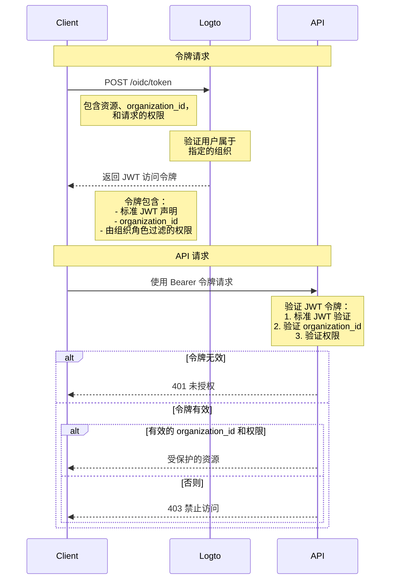

# 使用组织模板保护 API 资源

除了通过确保存在有效的 JWT 来保护资源的 [保护你的 API](/authorization/api-resources/protect-your-api) 之外，还可以应用组织角色来过滤权限 (Scopes)。在本文中，我们将重点介绍组织角色如何影响你的认证流程中的权限委托和验证。



## 额外的 `organization_id` 参数

除了正常的访问令牌授权请求外，在图中我们添加了一个额外的 `organization_id` 参数，这告诉 Logto 将权限缩小到特定组织的角色。

## 客户端设置

如果你使用 Logto 的 SDK，你可以在 `getAccessToken` 方法的第二个参数中添加 `organization_id`。

```tsx
const accessToken = await logto.getAccessToken('https://my-resource.com/api', 'org_1');

// 或直接获取声明
const accessTokenClaims = await logto.getAccessTokenClaims('https://my-resource.com/api', 'org_1');
console.log(accessTokenClaims.organization_id); // 'org_1'
console.log(accessTokenClaims.aud); // 'https://my-resource.com/api'
```

然后，只有从该组织的角色继承的权限将包含在访问令牌中，以及一个额外的声明 `organization_id`。

## API 服务器验证

除了正常的 JWT 访问令牌验证之外，你还需要添加额外的级别来检查 `organization_id` 是否存在且有效。
