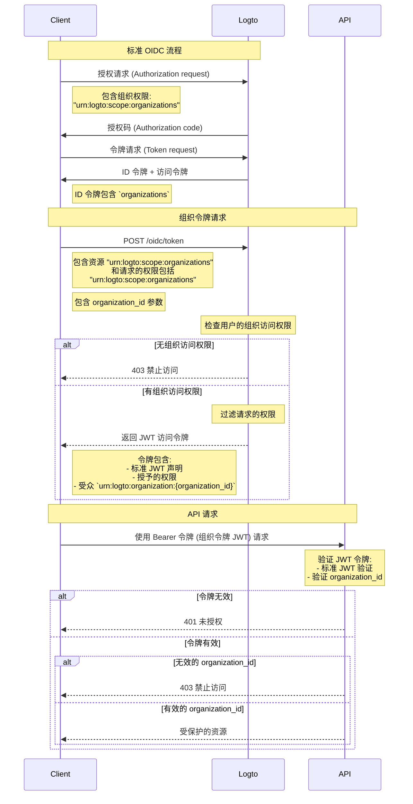

import TabItem from '@theme/TabItem';
import Tabs from '@theme/Tabs';

# 保护组织资源

除了将 API 作为资源的 [保护你的 API](/authorization/api-resources/protect-your-api) 外，组织也可以作为资源，并以相同的方式保护你的组织资源。在本文中，我们将重点介绍如何以类似的方式保护你的组织资源。



## 步骤 1：从 OIDC 流程获取组织 ID \{#step-1-get-organization-ids-from-oidc-flow}

Logto 扩展了标准的 [OpenID Connect](https://openid.net/specs/openid-connect-core-1_0.html) 协议，允许你的应用从用户那里获取组织信息。有两种方法可以做到这一点：

- 如果你使用支持组织的 Logto SDK，可以将 `urn:logto:scope:organizations` 权限添加到配置对象的 `scopes` 参数中。通常，SDK 会为此权限提供一个枚举，例如 [Logto JS SDKs](https://github.com/logto-io/js) 中的 `UserScope.Organizations`。

<Tabs groupId="sdk">

  <TabItem value="js" label="JavaScript">

```ts
import { LogtoClient, UserScope } from '@logto/browser'; // 或 @logto/node, @logto/client

const logto = new LogtoClient({
  // ...
  scopes: [UserScope.Organizations],
});
```

  </TabItem>
  <TabItem value="react" label="React">

```tsx
import { LogtoProvider, UserScope } from '@logto/react';

const App = () => (
  <LogtoProvider
    config={{
      // ...
      scopes: [UserScope.Organizations],
    }}
  >
    {/* ... */}
  </LogtoProvider>
);
```

  </TabItem>
  <TabItem value="python" label="Python">

```python
from logto import UserInfoScope

client = LogtoClient(
    LogtoConfig(
        # ...
        scopes=[UserInfoScope.organizations],
    )
)
```

  </TabItem>
  <TabItem value="php" label="PHP">

```php
use Logto\Sdk\Constants\UserScope;

$client = new LogtoClient(
  new LogtoConfig(
    // ...
    scopes: [UserScope::organizations],
  )
);
```

  </TabItem>
  <TabItem value="swift" label="Swift">

```swift
import Logto
import LogtoClient

let config = try? LogtoConfig(
    // ...
    scopes: [
        UserScope.organizations.rawValue,
    ],
    // ...
)
let client = LogtoClient(useConfig: config)
```

  </TabItem>
  <TabItem value="others" label="Others">

```ts
const config = {
  // ...
  scope: 'openid offline_access urn:logto:scope:organizations',
};
```

  </TabItem>

</Tabs>
    
- 对于其他情况，你需要将 `urn:logto:scope:organizations` 权限添加到 SDK 配置（或认证请求）的 `scope` 参数中。

一旦用户完成认证流程，你可以从 `idToken` 中获取组织信息：

```tsx
// 以 JavaScript 为例
const idToken = await logto.getIdTokenClaims();

console.log(idToken.organizations); // 一个包含组织 ID 的字符串数组
```

`organizations` 字段（声明）也会包含在 [UserInfo 端点](https://openid.net/specs/openid-connect-core-1_0.html#UserInfo) 的响应中。

### 可选：获取组织角色 \{#optional-get-organization-roles}

如果你还没有设置组织角色，请参考 [此部分](/authorization/organization-template/configure-organization-template/#create-organization-role)。

要获取当前用户的所有组织角色：

- 如果你使用支持组织的 Logto SDK，可以将 `urn:logto:scope:organization_roles` 权限添加到配置对象的 `scopes` 参数中。通常，SDK 会为此权限提供一个枚举，例如 [Logto JS SDKs](https://github.com/logto-io/js) 中的 `UserScope.OrganizationRoles`。
- 对于其他情况，你需要将 `urn:logto:scope:organization_roles` 权限添加到 SDK 配置（或认证请求）的 `scope` 参数中。

然后你可以从 `idToken` 中获取组织角色：

```tsx
// 以 JavaScript 为例
const idToken = await logto.getIdTokenClaims();

console.log(idToken.organization_roles); // 一个包含组织角色的字符串数组
```

数组中的每个字符串格式为 `organization_id:role_id`，例如 `org_123:admin` 表示用户在 ID 为 `org_123` 的组织中具有 `admin` 角色。

`organization_roles` 字段（声明）也会包含在 [UserInfo 端点](https://openid.net/specs/openid-connect-core-1_0.html#UserInfo) 的响应中。

## 步骤 2：获取组织令牌 \{#step-2-fetch-organization-token}

要在组织的上下文中执行操作，用户需要为该组织授予访问令牌（组织令牌）。组织令牌是一个 JWT 令牌，包含组织 ID 和用户在组织中的权限（权限）。

### 向认证请求添加参数 \{#add-parameters-to-the-authentication-request}

- 如果你使用支持组织的 Logto SDK，可以将 `urn:logto:scope:organizations` 权限添加到配置对象的 `scopes` 参数中，与 [获取当前用户的组织 ID](/authorization/organization-template/protect-organization-resources/#step-1-get-organization-ids-from-oidc-flow) 相同。
  - 支持组织的 Logto SDK 将自动处理其余的配置。
- 对于其他情况，你需要将 `offline_access` 和 `urn:logto:scope:organizations` 权限添加到 `scope` 参数中，并将 `urn:logto:resource:organizations` 资源添加到 SDK 配置（或认证请求）的 `resource` 参数中。
  - 注意：`offline_access` 是获取可用于获取组织令牌的 `refresh_token` 所必需的。

```tsx
// 仅适用于其他情况。对于 Logto SDK，请参见上文。
const config = {
  // ...
  scope: 'openid offline_access urn:logto:scope:organizations',
  resource: 'urn:logto:resource:organizations',
};
```

:::note

`urn:logto:resource:organizations` 资源是一个特殊资源，代表组织模板。

:::

### 获取组织令牌 \{#fetch-the-organization-token}

Logto 扩展了标准的 `refresh_token` 授权类型，允许你的应用获取组织令牌。

- 如果你使用支持组织的 Logto SDK，可以调用 SDK 的 `getOrganizationToken()` 方法（或 `getOrganizationTokenClaims()` 方法）。
- 对于其他情况，你需要使用以下参数调用令牌端点：
  - `grant_type`: `refresh_token`。
  - `client_id`: 用户用于认证的应用 ID。
  - `refresh_token`: 你从认证流程中获得的 `refresh_token`。
  - `organization_id`: 你想要获取令牌的组织 ID。
  - `scope`（可选）：你想要授予用户在组织中的权限。如果未指定，授权服务器将尝试授予与认证流程相同的权限。

<Tabs groupId="sdk">

  <TabItem value="js" label="JavaScript">

```ts
const token = await logto.getOrganizationToken('<organization-id>');
```

  </TabItem>
  <TabItem value="react" label="React">

```tsx
const App = () => {
  const { getOrganizationToken } = useLogto();

  const getToken = async () => {
    const token = await getOrganizationToken('<organization-id>');
  };

  return <button onClick={getToken}>Get organization token</button>;
};
```

  </TabItem>
  <TabItem value="python" label="Python">

```python
token = await client.getOrganizationToken("<organization-id>")
# 或
claims = await client.getOrganizationTokenClaims("<organization-id>")
```

  </TabItem>
  <TabItem value="php" label="PHP">

```php
$token = $client->getOrganizationToken('<organization-id>');
// 或
$claims = $client->getOrganizationTokenClaims('<organization-id>');
```

  </TabItem>
  <TabItem value="swift" label="Swift">

```swift
let token = try await client.getOrganizationToken(forId: "<organization-id>")
```

  </TabItem>
  <TabItem value="others" label="Others">

```ts
// 以 JavaScript 为例

const params = new URLSearchParams();

params.append('grant_type', 'refresh_token');
params.append('client_id', 'YOUR_CLIENT_ID');
params.append('refresh_token', 'REFRESH_TOKEN');
params.append('organization_id', 'org_123');

const response = await fetch('https://YOUR_LOGTO_ENDPOINT/oidc/token', {
  method: 'POST',
  headers: {
    'Content-Type': 'application/x-www-form-urlencoded',
  },
  body: params,
});
```

  </TabItem>

</Tabs>

响应将与 [标准令牌端点](https://openid.net/specs/openid-connect-core-1_0.html#TokenEndpoint) 的格式相同，`access_token` 是 JWT 格式的组织令牌。

除了访问令牌的常规声明外，组织令牌还包含以下声明：

- `aud`: 组织令牌的受众是 `urn:logto:organization:{organization_id}`。
- `scope`: 授予用户在组织中的权限，以空格为分隔符。

### 示例 \{#example}

一个好的示例胜过千言万语。假设我们的组织模板有以下设置：

- 权限：`read:logs`，`write:logs`，`read:users`，`write:users`。
- 角色：`admin`，`member`。
  - `admin` 角色拥有所有权限。
  - `member` 角色拥有 `read:logs` 和 `read:users` 权限。

用户有以下设置：

- 组织 ID：`org_1`，`org_2`。
- 组织角色：`org_1:admin`，`org_2:member`。

在 Logto SDK 配置（或认证请求）中，我们正确设置了其他内容，并添加了以下权限：

- `urn:logto:scope:organizations`
- `openid`
- `offline_access`
- `read:logs`
- `write:logs`

现在，当用户完成认证流程时，我们可以从 `idToken` 中获取组织 ID：

```tsx
// 以 JavaScript 为例
const idToken = await logto.getIdTokenClaims();

console.log(idToken.organizations); // ['org_1', 'org_2']
```

如果我们想获取组织令牌：

```tsx
// 以 JavaScript 为例
const org1Token = await logto.getOrganizationTokenClaims('org_1');
const org2Token = await logto.getOrganizationTokenClaims('org_2');

console.log(org1Token.aud); // 'urn:logto:organization:org_1'
console.log(org1Token.scope); // 'read:logs write:logs'
console.log(org2Token.aud); // 'urn:logto:organization:org_2'
console.log(org2Token.scope); // 'read:logs'

const org3Token = await logto.getOrganizationTokenClaims('org_3'); // 错误：用户不是该组织的成员
```

解释：

- 对于 `org_1`，用户具有 `admin` 角色，因此组织令牌应具有所有可用权限（权限）。
- 对于 `org_2`，用户具有 `member` 角色，因此组织令牌应具有 `read:logs` 和 `read:users` 权限（权限）。

由于我们在认证流程中仅请求了 `read:logs` 和 `write:logs` 权限，因此组织令牌已相应地“降级”，导致请求权限和可用权限的交集。

### 为机器对机器应用获取组织令牌 \{#fetch-organization-token-for-a-machine-to-machine-application}

与为用户获取组织令牌类似，你也可以为机器对机器应用获取组织令牌。唯一的区别是你需要使用 `client_credentials` 授权类型，而不是 `refresh_token` 授权类型。

要了解有关机器对机器应用的更多信息，请参阅 [机器对机器：使用 Logto 进行认证](/quick-starts/m2m/)。

## 步骤 3：验证组织令牌 \{#step-3-verify-organization-tokens}

一旦应用获得组织令牌，它可以像常规访问令牌一样使用该令牌，例如在 `Authorization` 头中以 `Bearer {token}` 格式调用 API。

在你的 API 中，验证组织令牌的方式与 [保护你的 API](/authorization/api-resources/protect-your-api/#validate-authorization-tokens-for-api-requests) 非常相似。主要区别：

- 与 API 资源的访问令牌不同，如果用户不是组织的成员，则无法获得组织令牌。
- 组织令牌的受众是 `urn:logto:organization:{organization_id}`。
- 对于某些权限（权限），你需要通过以空格为分隔符拆分字符串来检查组织令牌的 `scope` 声明。
